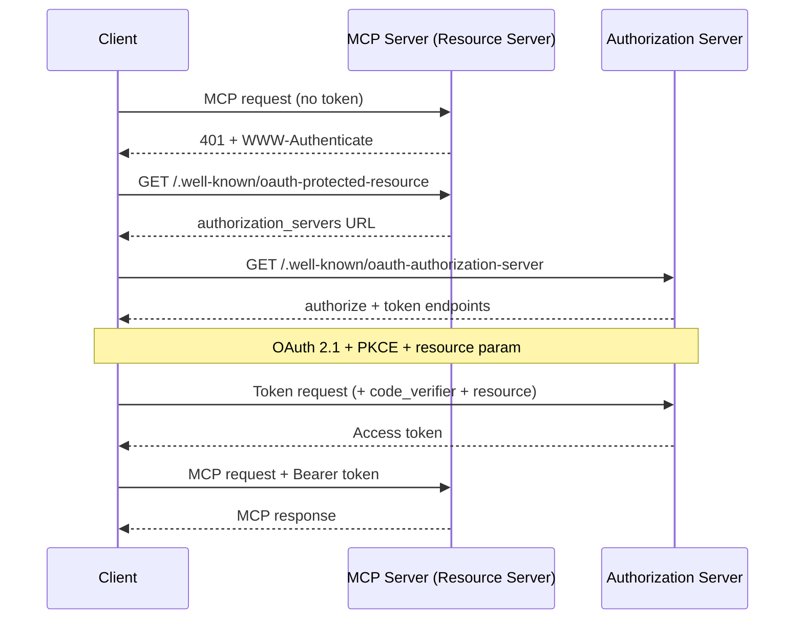
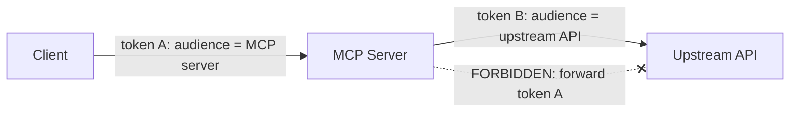

<LevelBadge level="advanced" />

<Callout type="objectives" items={["افهم لماذا يُعد خادم MCP البعيد (HTTP) خادم موارد OAuth 2.1، وليس مجرد نقطة نهاية بمفتاح API", "تتبع مصافحة الاكتشاف: 401 ← Protected Resource Metadata ← Authorization Server Metadata ← الرمز", "اشرح ربط جمهور الرمز (RFC 8707) ولماذا يمنع رمز خدمة ما من العمل في خدمة أخرى", "سمِّ فخ النائب المرتبك والقاعدة الوحيدة التي تغلقه: لا تمرر أبدًا رمز العميل إلى واجهة برمجة تطبيقات أعلى في السلسلة", "طبّق قائمة تحقق قصيرة للتحصين قبل أن تعرّض خادم MCP للإنترنت"]} />

[MCP](/docs/claude-code/mcp) تحوّل من طرافة إلى الطريقة الافتراضية التي تصل بها الوكلاء إلى الأدوات — وهذا يعني أن خوادم MCP باتت الآن تقف أمام بيانات حقيقية وإجراءات حقيقية. الخادم المحلي الذي تشغّله عبر **STDIO** يثق ببيئته: يقرأ بيانات الاعتماد من متغيرات البيئة ولا توجد حدود شبكية للدفاع عنها. في اللحظة التي تجعل فيها هذا الخادم نفسه **بعيدًا** (HTTP)، يمكن لأي شخص يستطيع الوصول إلى عنوان URL أن يحاول استدعاءه. هذا يحوّله إلى مشكلة تفويض، وتجيب مواصفة MCP على ذلك بـ **OAuth 2.1** — لا بمخطط مفتاح API مخصص.

هذه الصفحة تتناول الحالة البعيدة. إذا كان خادمك يعمل عبر STDIO فقط، فإن المواصفة تقول صراحةً *لا* تتبع تدفق OAuth — اسحب بيانات الاعتماد من البيئة وتابع عملك.

<VerifyNote lastVerified="2026-07-07" source="https://modelcontextprotocol.io/specification/2025-06-18/basic/authorization" />

## الأدوار الثلاثة

يقسّم OAuth المشكلة إلى ثلاثة أطراف. وتنطبق MCP عليها بوضوح:

<Flashcards title="من هو من في تدفق OAuth الخاص بـ MCP" cards={[{front: "خادم MCP = خادم الموارد (Resource Server)", back: "الشيء المحمي. يقبل الطلبات التي تحمل رمز وصول، ويتحقق من الرمز، ويعيد البيانات — أو 401 إذا كان الرمز مفقودًا أو خاطئًا. إنه لا يسجّل دخول المستخدم."}, {front: "عميل MCP = عميل OAuth", back: "مضيف وكيلك (Claude Code، تطبيق سطح المكتب، أو كودك الخاص). يحصل على رمز نيابةً عن المستخدم ويرفقه بكل طلب كترويسة Bearer."}, {front: "خادم التفويض (AS)", back: "الطرف الذي يتحدث فعليًا إلى المستخدم، ويحصل على الموافقة، ويصدر الرموز. قد يُستضاف مع الخادم أو يكون مزوّد هوية منفصلًا. آلياته الداخلية خارج نطاق MCP."}]} />

النقلة الذهنية الأساسية: **خادم MCP لا يتولى تسجيل الدخول بنفسه أبدًا.** إنه يتحقق فقط من الرموز التي أصدرها طرف آخر. هذا الفصل هو ما يتيح لك وضع مزوّد هوية جاهز أمام خادم كتبته بنفسك.

## مصافحة الاكتشاف

لا ينبغي أن يحتاج العميل إلى تهيئة مسبقة بمكان المصادقة. تجعل MCP الاكتشاف تلقائيًا، مدفوعًا بـ `401`:

<Steps items={[
  {title: "العميل يستدعي الخادم دون رمز", body: "الطلب الأول يخرج عاريًا. يرفضه الخادم بـ HTTP 401 Unauthorized وترويسة WWW-Authenticate تشير إلى عنوان URL لبيانات موارده الوصفية."},
  {title: "العميل يجلب Protected Resource Metadata (RFC 9728)", body: "يرسل GET إلى /.well-known/oauth-protected-resource على الخادم. يسمّي حقل authorization_servers في الوثيقة خادم تفويض واحدًا على الأقل يمكن للعميل استخدامه."},
  {title: "العميل يجلب Authorization Server Metadata (RFC 8414)", body: "يرسل GET إلى /.well-known/oauth-authorization-server الخاص بخادم التفويض لمعرفة نقطتي نهاية authorize وtoken والقدرات المدعومة."},
  {title: "اختياري: التسجيل الديناميكي للعميل (RFC 7591)", body: "إذا لم يكن لدى العميل معرّف عميل لهذا الـ AS، يمكنه إرسال POST إلى /register للحصول على واحد دون تدخل بشري — وهذا حاسم لأن العميل لا يمكنه معرفة كل خادم MCP مسبقًا."},
  {title: "تفويض OAuth 2.1 مع PKCE + resource", body: "يولّد العميل مُتحقق/تحدي PKCE، ويفتح المتصفح على عنوان authorize متضمنًا معامل resource، فيوافق المستخدم، ويستبدل العميل الرمز المُعاد (مع المُتحقق) برمز وصول."},
  {title: "العميل يعيد المحاولة بالرمز", body: "الآن يحمل كل طلب Authorization: Bearer <token>. يتحقق منه الخادم ويستجيب."}
]} />

لاحظ أنه **لا يوجد أي تهيئة مصادقة مبرمجة مسبقًا** على جانب العميل — الـ `401` يمهّد كل شيء. هذا هو جوهر الأمر: يستطيع الوكيل الاتصال بخادم لم يره من قبل وأن يكتشف كيفية المصادقة.

## ربط الجمهور: القاعدة الحاملة

إليك وضع الفشل الذي يوجد ربط الجمهور لمنعه. لنقل إن لدى مستخدم رمزًا صادرًا لـ `calendar.example.com`. يخدع خادم MCP خبيث (أو مجرد مهمِل) على `evil.example.com` العميلَ ليرسل *ذلك* الرمز إليه. إذا قبله `evil`، فيمكنه الآن أن يستدير ويستدعي واجهة برمجة تطبيقات التقويم باسم المستخدم. رمز خدمة واحدة عمل في خدمة أخرى. لتنهار حدود أمان OAuth للتو.

الحل هو **مؤشرات الموارد (RFC 8707)**:

<Steps items={[
  {title: "العميل يعلن عن الهدف", body: "في كلٍ من طلب التفويض وطلب الرمز، يجب على العميل (MUST) تضمين معامل resource مضبوطًا على الـ URI القانوني لخادم MCP الذي ينوي استدعاءه — مثل resource=https://mcp.example.com. يرسله حتى لو لم يكن متأكدًا من دعم الـ AS له."},
  {title: "الـ AS يربط الرمز بذلك الجمهور", body: "عند الدعم، يختم الـ AS الرمز بحيث يصبح صالحًا فقط لخادم الموارد المحدد ذاك."},
  {title: "الخادم يتحقق من الجمهور", body: "قبل القيام بأي عمل، يجب على خادم MCP (MUST) التحقق من أن الرمز صادر له هو — بفحص مطالبة الجمهور (RFC 9068). أي رمز مسكوك لأي جهة أخرى يحصل على 401، وانتهى الأمر."}
]} />

<PromptCard title="معامل resource في طلب التفويض (مُرمّز URL)">{`&resource=https%3A%2F%2Fmcp.example.com`}</PromptCard>

الـ URIs القانونية صارمة: `https://mcp.example.com` و`https://mcp.example.com:8443/mcp` صالحة؛ أما `mcp.example.com` (بدون مخطط) و`https://mcp.example.com#frag` (مع جزء تجزئة) فليست كذلك. فضّل الصيغة دون شرطة مائلة لاحقة من أجل قابلية التشغيل البيني.

## النائب المرتبك: لا تمرر الرمز أبدًا

هذا هو الخطأ الذي يحوّل خادم MCP حسن النية إلى وكيل للمهاجم. إنها نفس [مشكلة النائب المرتبك](/docs/security/securing-agents#the-confused-deputy-problem) من أمان الوكلاء، مشحوذةً إلى قاعدة واحدة ملموسة.

كثيرًا ما يحتاج خادم MCP إلى استدعاء **واجهة برمجة تطبيقات أعلى في السلسلة** (GitHub، خدمة قاعدة بيانات، خدمة SaaS أخرى). والإغراء هو أن تأخذ الرمز الذي سلّمك إياه العميل وتمرره إلى الأعلى. **لا تفعل.** المواصفة صريحة: يجب ألا (MUST NOT) يمرر خادم MCP الرمز الذي تلقاه من العميل.

لماذا هذا خطير: رمز العميل صدر لخادمك *أنت* كجمهور له. إذا مررته، فقد تثق به واجهة البرمجة الأعلى وكأنه أتى منك، أو تفترض أنك تحققت منه بالفعل — والآن رمز محدد النطاق لقفزة واحدة يقوم بعمل على بُعد قفزتين، خارج نموذج موافقة أي أحد.

<Callout type="warning" items={["إذا استدعى خادم MCP واجهة برمجة تطبيقات أعلى في السلسلة، فإنه يتصرف كعميل OAuth منفصل تجاه تلك الواجهة ويحصل على رمزه الخاص من خادم التفويض الأعلى. رمزان مستقلان، جمهوران مستقلان. رمز العميل يتوقف عند بابك."]} />

## قائمة تحقق للتحصين قبل الإقلاع

قبل أن يلامس خادم MCP بعيد الإنترنت العام:

<Steps items={[
  {title: "قدّم كل شيء عبر HTTPS", body: "يجب أن تكون كل نقاط نهاية الـ AS بـ HTTPS. ويجب أن تكون عناوين URIs لإعادة التوجيه HTTPS أو localhost — لا شيء غير ذلك."},
  {title: "تحقق من الجمهور في كل طلب", body: "ارفض أي رمز لم يصدر خصيصًا لهذا الخادم. هذا هو الفحص الوحيد الذي يوقف إعادة استخدام الرمز عبر الخدمات."},
  {title: "اشترط PKCE", body: "يجب على العملاء (MUST) استخدام PKCE حتى يكون رمز التفويض المُعترَض عديم الفائدة دون المُتحقق المطابق."},
  {title: "ثبّت عناوين URIs الدقيقة لإعادة التوجيه", body: "يجب على الـ AS (MUST) مطابقة عناوين URIs لإعادة التوجيه تمامًا مع القيم المسجلة مسبقًا، وينبغي على العملاء (SHOULD) استخدام معامل state والتحقق منه — كلاهما يدافع ضد التصيد بإعادة التوجيه المفتوح."},
  {title: "رموز قصيرة العمر + تدوير التحديث", body: "أصدر رموز وصول قصيرة العمر للحد من ضرر أي تسرب؛ وبالنسبة للعملاء العامّين، دوّر رموز التحديث. خزّن الرموز بأمان ولا تسجّلها أبدًا في السجلات."},
  {title: "لا تضع الرموز في عنوان URL أبدًا", body: "الرموز تذهب في ترويسة Authorization، لا في سلسلة الاستعلام، حيث تنتهي في السجلات وترويسات المُحيل."},
  {title: "أضف طبقة من أساسيات أمان الوكلاء", body: "ربط الجمهور هو بوابة النقل؛ ومع ذلك طبّق أقل امتياز، والعزل في صندوق رمل، وإبقاء الإنسان في الحلقة من /docs/security/securing-agents. المصادقة تقول مَن — لا تقول إن الطلب آمن."}
]} />

## اختبر نفسك

<Quiz title="اختبر نفسك" questions={[
  {
    q: "يتلقى خادم MCP بعيد طلبًا دون رمز وصول. ما الذي تطلب منه المواصفة فعله أولًا؟",
    options: [
      "مطالبة المستخدم باسم مستخدم وكلمة مرور",
      "إعادة HTTP 401 مع ترويسة WWW-Authenticate تشير إلى عنوان URL لبيانات موارده الوصفية",
      "تمرير الطلب بصمت إلى واجهة البرمجة الأعلى في السلسلة",
      "أن يصدر للعميل رمزًا بنفسه"
    ],
    answer: 1,
    explain: "الخادم هو خادم موارد، لا صفحة تسجيل دخول. إنه يجيب على طلب بلا رمز بـ 401 + WWW-Authenticate، مما يمهّد لاكتشاف العميل لخادم التفويض."
  },
  {
    q: "مِمَّ يحمي ربط جمهور الرمز (RFC 8707)؟",
    options: [
      "بطء التحقق من الرمز",
      "قبول رمز صادر لخدمة واحدة وإعادة استخدامه في خدمة مختلفة",
      "نسيان المستخدمين لكلمات المرور",
      "نوافذ السياق الكبيرة"
    ],
    answer: 1,
    explain: "معامل resource يربط الرمز بالخادم المحدد الذي سُكّ له. ثم يتحقق الخادم من مطالبة الجمهور ويرفض أي رمز صادر لجهة أخرى — مما يغلق ثغرة إعادة الاستخدام عبر الخدمات."
  },
  {
    q: "يحتاج خادم MCP الخاص بك إلى استدعاء واجهة برمجة تطبيقات GitHub أعلى في السلسلة. ماذا ينبغي أن يفعل برمز الوصول الذي أرسله العميل إليه؟",
    options: [
      "تمرير الرمز نفسه إلى GitHub لتوفير جولة ذهاب وإياب",
      "لا شيء تجاه GitHub — الحصول على رمزه المنفصل الخاص كعميل OAuth تجاه GitHub، وعدم تمرير رمز العميل أبدًا",
      "تسجيل الرمز حتى يمكن إعادة تشغيله لاحقًا",
      "وضع الرمز في عنوان URL لطلب GitHub"
    ],
    answer: 1,
    explain: "تمرير رمز العميل إلى الأعلى هو فخ النائب المرتبك وهو محظور صراحةً. يتصرف الخادم كعميل OAuth خاص به تجاه واجهة البرمجة الأعلى برمز منفصل مربوط بجمهور تلك الواجهة."
  },
  {
    q: "بالنسبة لخادم MCP يعمل عبر STDIO (محلي)، كيف تقول المواصفة إنه ينبغي التعامل مع بيانات الاعتماد؟",
    options: [
      "تشغيل تدفق متصفح OAuth 2.1 الكامل عند كل إقلاع",
      "استرجاعها من البيئة — تدفق تفويض OAuth مخصص لنقل HTTP، لا لـ STDIO",
      "تضمينها مبرمجةً في العميل",
      "تخطي المصادقة كليًا لكل وسائل النقل"
    ],
    answer: 1,
    explain: "تقول المواصفة إنه لا ينبغي (SHOULD NOT) لوسائل نقل STDIO اتباع تدفق تفويض HTTP، وبدلًا من ذلك تقرأ بيانات الاعتماد من البيئة. OAuth هنا مخصص تحديدًا للخوادم البعيدة القائمة على HTTP."
  }
]} />

## المصادر وقراءات إضافية

- [مواصفة تفويض MCP (2025-06-18)](https://modelcontextprotocol.io/specification/2025-06-18/basic/authorization) — التدفق المعياري والأدوار ومتطلبات MUST/SHOULD التي تلخصها هذه الصفحة.
- [أفضل ممارسات أمان MCP](https://modelcontextprotocol.io/specification/2025-06-18/basic/security_best_practices) — تمرير الرمز، والنائب المرتبك، ولماذا يُحظران.
- [RFC 8707 — Resource Indicators for OAuth 2.0](https://www.rfc-editor.org/rfc/rfc8707.html) — معامل `resource` وربط الجمهور.
- [RFC 9728 — OAuth 2.0 Protected Resource Metadata](https://datatracker.ietf.org/doc/html/rfc9728) — كيف يعلن خادم الموارد عن خوادم تفويضه.
- [RFC 8414 — OAuth 2.0 Authorization Server Metadata](https://datatracker.ietf.org/doc/html/rfc8414) و[RFC 7591 — Dynamic Client Registration](https://datatracker.ietf.org/doc/html/rfc7591).
- [مسودة OAuth 2.1](https://datatracker.ietf.org/doc/html/draft-ietf-oauth-v2-1-13) — PKCE، وأمان الاتصال، ومتطلبات التعامل مع الرموز.
- ذو صلة على AILmanac: [تأمين الوكلاء والأدوات](/docs/security/securing-agents) · [حقن التعليمات](/docs/security/prompt-injection) · [MCP في Claude Code](/docs/claude-code/mcp).
