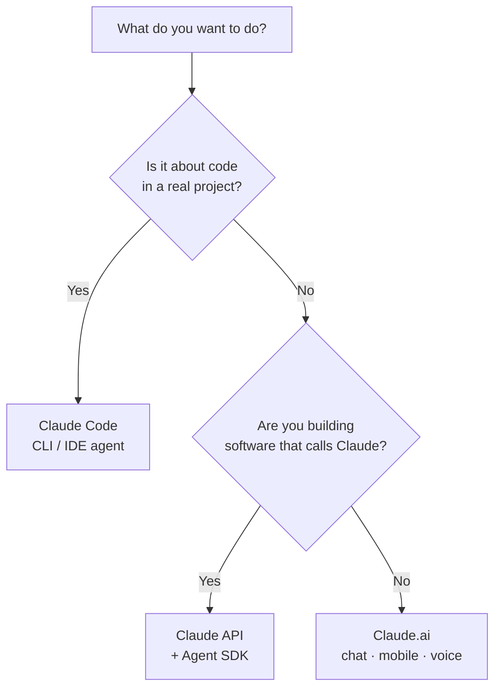

<LevelBadge level="beginner" />

يأتي "Claude" بعدة نكهات. اختر بناءً على **ما تحاول فعله**، وليس بناءً على ما سمعت عنه.

## القرار في 30 ثانية

## Claude.ai — تطبيقات الدردشة

**لِـ:** الكتابة، والبحث، والتحليل، والتعلّم، والتخطيط، والأسئلة اليومية. **لِمَن:** الجميع، بلا أي إعداد.

تحصل عليه أيضًا على **الهاتف** ([iOS/Android](/docs/claude-app/mobile)) وعبر **[الصوت](/docs/claude-app/voice-mode)** — رائع لالتقاط الأفكار أثناء التنقل. عزّز قدراته بـ[المشاريع (Projects)](/docs/claude-app/projects)، و[التعليمات المخصصة](/docs/claude-app/custom-instructions)، و[الأدوات (Artifacts)](/docs/claude-app/artifacts). ← ابدأ من [البدء مع Claude.ai](/docs/claude-app/getting-started).

## Claude Code — أداة البرمجة الوكيلة (agentic)

**لِـ:** العمل *داخل قاعدة شيفرة* — القراءة، والتحرير، وتشغيل الأوامر، وإصلاح الاختبارات. **لِمَن:** المطورون (والفضوليون تقنيًا). إنه يتصرف على ملفاتك بإذنك. ← [ما هو Claude Code](/docs/claude-code/what-is-claude-code).

## واجهة API وAgent SDK — ابنِ Claude داخل برمجياتك الخاصة

**لِـ:** التطبيقات، والأتمتة، والوكلاء الذين يستدعون Claude برمجيًا. **لِمَن:** المطورون الذين يطلقون منتجًا أو خط معالجة (pipeline). ← [أول استدعاء لك لواجهة API](/docs/api/first-call).

## إنها تعمل معًا

هذه ليست منتجات متنافسة — معظم الناس يتدرجون عبرها:

| تريد أن… | استخدم |
|---|---|
| تصوغ بريدًا إلكترونيًا، تلخّص ملف PDF، تعصف ذهنيًا | Claude.ai (أو الصوت/الهاتف) |
| تعيد هيكلة وحدة برمجية، تضيف اختبارات، تصلح خللًا | Claude Code |
| تضيف ميزة ذكاء اصطناعي إلى تطبيقك *أنت* | واجهة API / Agent SDK |

:::tip لست متأكدًا؟ ابدأ بالدردشة
[Claude.ai](/docs/claude-app/getting-started) لا يحتاج أي إعداد ويعلّمك كيف "يفكّر" Claude. تنتقل هذه المهارات إلى كل مكان آخر.
:::

## التالي

- [أول 5 دقائق لك](/docs/start-here/your-first-5-minutes)
- [مسارات التعلّم](/docs/start-here/learning-paths)
- [اختيار نموذج Claude](/docs/api/choosing-a-model) (بمجرد أن تبدأ في البناء)
