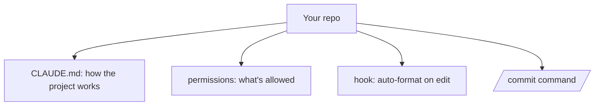

<LevelBadge level="intermediate" />

لنحوّل نسخة جديدة من المستودع إلى إعداد Claude Code *يعرف مشروعك ويحترم قواعدك* — في حوالي 20 دقيقة. سنجمع بين الميزات الأساسية مع شرح المبرر وراء كلٍ منها.

## الحالة النهائية



## الخطوة 1 — توليد CLAUDE.md وتشذيبه

شغّل `/init` لإنشاء مسودة [CLAUDE.md](/docs/claude-code/claude-md)، ثم **اختصره** إلى ما هو صحيح فعلاً: حزمة التقنيات، وكيفية التشغيل/الاختبار/الفحص، والأعراف الحقيقية، وحواجز الأمان ("شغّل الاختبارات قبل الانتهاء"، "لا تلمس `/generated`"). *لماذا:* إنه أعلى التخصيصات تأثيراً — يقرؤه Claude في كل جلسة.

احصل على نقطة بداية من [قوالب CLAUDE.md](/docs/templates/claude-md).

## الخطوة 2 — ضبط الأذونات

أضف ملف `.claude/settings.json` ([المرجع](/docs/claude-code/settings)) يسمح مسبقاً بالأوامر الآمنة المتكررة ويمنع الخطيرة:

```json
{
  "permissions": {
    "allow": ["Read", "Bash(npm run test:*)", "Bash(npm run lint)", "Bash(git diff:*)"],
    "ask": ["Write", "Bash(npm install:*)"],
    "deny": ["Read(./.env)", "Bash(git push --force:*)"]
  }
}
```

*لماذا:* مقاطعات أقل عند الإجراءات الآمنة، وإيقاف صارم عند الإجراءات الخطرة. راجع [الأذونات](/docs/claude-code/permissions).

## الخطوة 3 — إضافة خطّاف للتنسيق

نسّق تلقائياً بعد كل تعديل ([الخطّافات](/docs/claude-code/hooks)):

```json
{ "hooks": { "PostToolUse": [ { "matcher": "Edit|Write",
  "hooks": [ { "type": "command", "command": "npx prettier --write \"$CLAUDE_FILE_PATH\" 2>/dev/null || true" } ] } ] } }
```

*لماذا:* تنسيق متّسق ومضمون — وليس "من فضلك تذكّر".

## الخطوة 4 — إضافة أمر `/commit`

أضف وصفة `/commit` من [مكتبة الأوامر المائلة](/docs/templates/slash-commands) إلى `.claude/commands/`. *لماذا:* كلمة واحدة لسير عمل قابل للتكرار.

## الخطوة 5 — استخدم وضع التخطيط لأول مهمة حقيقية

حدّد هدفاً حقيقياً في [وضع التخطيط](/docs/claude-code/plan-mode)، راجع الخطة، ثم دعه ينفّذها. *لماذا:* تبني الثقة عبر الفصل بين التفكير والتنفيذ.

## تحقّق من نجاح الإعداد

- جلسة جديدة ← يشير Claude إلى أعرافك دون مطالبة (CLAUDE.md يعمل).
- تعديل ملف ← يتم تنسيقه (الخطّاف يعمل).
- أمر خطر ← يسأل أو يرفض (الأذونات تعمل).
- `/commit` ← رسالة Conventional Commit نظيفة (الأمر يعمل).

## التالي

- [اكتب أول مهارة لك](/docs/walkthroughs/first-skill)
- [وصفات الخطّافات وملف settings.json](/docs/templates/hooks-settings)
- [البرمجة وتطوير البرمجيات](/docs/playbooks/coding)
