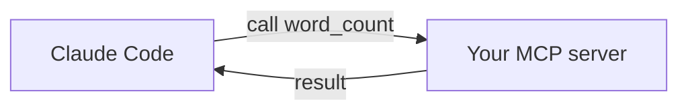

<LevelBadge level="advanced" />

<VerifyNote lastVerified="2026-06-20" source="https://modelcontextprotocol.io">
تتطوّر واجهات MCP SDK وإعداداتها — تحقّق من ذلك مقابل وثائق MCP الرسمية ووثائق Claude Code MCP.
</VerifyNote>

لنكشف أداة مخصّصة لـ Claude عبر بناء خادم [MCP](/docs/claude-code/mcp) صغير وربطه. سنبقيه بسيطاً قدر الإمكان حتى يكون *الربط* واضحاً — ثم تستبدل منطقك الفعلي مكانه.

## ما الذي نبنيه

خادم stdio بأداة واحدة، `word_count`، يستطيع Claude استدعاؤها. النمط نفسه يتوسّع إلى "استعلِم من قاعدة بياناتي"، "افتح تذكرة"، وما إلى ذلك.



## الخطوة 1 — الخادم

`server.py` (Python؛ تتوفّر نسخة TypeScript في [هياكل MCP](/docs/templates/mcp-config)):

```python
from mcp.server.fastmcp import FastMCP

mcp = FastMCP("text-tools")

@mcp.tool()
def word_count(text: str) -> int:
    """Count the words in a piece of text."""
    return len(text.split())

if __name__ == "__main__":
    mcp.run()  # stdio transport
```

## الخطوة 2 — الإعلان عنه

أضف إلى `.mcp.json` في جذر مستودعك:

```json
{ "mcpServers": {
  "text-tools": { "command": "python", "args": ["server.py"] }
} }
```

## الخطوة 3 — الربط والاختبار

شغّل Claude Code داخل المستودع. اسأل: *"استخدم خادم text-tools لعدّ الكلمات في: 'the quick brown fox'."* يُفترض أن يستدعي Claude الأداة `word_count` ويُبلّغ بالنتيجة `4`. إن لم يستطع رؤية الأداة، تأكّد من أن الخادم يبدأ بنظافة بمفرده وأن مسار `.mcp.json` صحيح.

## الخطوة 4 — اجعله حقيقياً

استبدل `word_count` بقدرتك الفعلية — استعلام قاعدة بيانات، أو استدعاء واجهة برمجية داخلية، أو عملية على ملف. أضف التحقق من المدخلات وأعِد الأخطاء كنتائج.

## قائمة التحقق الأمني

:::warning الخادم هو شيفرة + وصول
- **الحد الأدنى من الامتيازات** — فقط البيانات/الإجراءات التي يحتاجها ([تأمين الوكلاء](/docs/security/securing-agents)).
- **تحقّق من المدخلات** التي يرسلها النموذج.
- البيانات غير الموثوقة التي يعيدها قد تحمل [حقن التعليمات](/docs/security/prompt-injection).
- **راجع** أي خادم طرف ثالث قبل ربطه.
:::

## التالي

- [خوادم MCP في Claude Code](/docs/claude-code/mcp)
- [إعداد MCP وهياكل الخوادم](/docs/templates/mcp-config)
- [استخدام الأدوات / استدعاء الدوال](/docs/api/tool-use)
