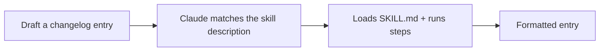

<LevelBadge level="intermediate" />

<VerifyNote lastVerified="2026-06-20" source="https://code.claude.com/docs/en/skills">
قد يتغيّر تخطيط المهارات واكتشافها — تحقّق من ذلك مقابل وثائق Skills الرسمية.
</VerifyNote>

لنبنِ [مهارة](/docs/claude-code/skills) عاملة من الصفر ونُثبت أنها تنشط. سنصنع مهارة صغيرة لـ "إدخال سجل التغييرات" — عامة وقابلة لإعادة الاستخدام.

## الخطوة 1 — إنشاء المجلد

```bash
mkdir -p .claude/skills/changelog-entry
```

(استخدم `~/.claude/skills/…` لمهارة شخصية عبر جميع المشاريع.)

## الخطوة 2 — كتابة SKILL.md

`.claude/skills/changelog-entry/SKILL.md`:

```markdown
---
name: changelog-entry
description: Use when the user wants to turn recent git commits into a Keep a Changelog entry.
---

# Changelog Entry

When asked for a changelog entry:
1. Run `git log --oneline -20` to see recent commits.
2. Group them into Added / Changed / Fixed / Removed (Keep a Changelog style).
3. Write concise, user-facing bullets (not raw commit messages).
4. Output only the formatted entry.
```

**حقل `description` هو المُحفّز** — اكتبه بصيغة "Use when…" حتى يُحمّله Claude في الوقت المناسب.

## الخطوة 3 — (اختياري) إضافة سكربت مساعد

يمكن للمهارات أن تتضمّن سكربتات. أضف `scripts/recent.sh` وأشِر إليه من SKILL.md إن أردت جمع بيانات حتمياً:

```bash
#!/usr/bin/env bash
git log --oneline -20
```

## الخطوة 4 — أثبت أنها تنشط

ابدأ جلسة وقل: *"صُغ إدخال سجل تغييرات للعمل الأخير."* يُفترض أن يتعرّف Claude على النية، ويُحمّل المهارة، ويتّبع خطواتها. إن لم تنشط، فالأرجح أن `description` ليس محدّداً بما يكفي بشأن *متى* تُستخدم — اضبطه بدقة.



## الخطوة 5 — شاركها

اجمعها (مع غيرها) في [مكوّن إضافي](/docs/claude-code/plugins-marketplaces) ليُثبّتها فريقك بخطوة واحدة — أو ساهم بها في [حِزَم المهارات](/docs/templates/skills) الخاصة بـ AILmanac.

## المزالق

- **وصف غامض** ← لا ينشط أبداً (أو ينشط دائماً). كن محدّداً.
- **الكثير في مهارة واحدة** ← أبقِها مهمة واحدة واضحة.
- **أسرار في مهارة مشتركة** ← لا تفعل أبداً؛ راجع [مراجعة شيفرة الطرف الثالث](/docs/security/reviewing-third-party-code).

## التالي

- [المهارات: خبرة عند الطلب](/docs/claude-code/skills)
- [قوالب SKILL.md](/docs/templates/skills)
- [بناء أول خادم MCP لك وربطه](/docs/walkthroughs/first-mcp-server)
