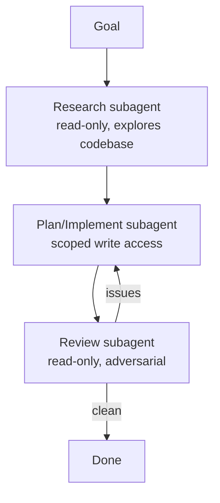

<LevelBadge level="advanced" />

تسير المهام الكبيرة على نحو أفضل عندما تقسّمها على [وكلاء فرعيين](/docs/claude-code/subagents) مركّزين بدلاً من حشر كل شيء في سياق واحد. لنصمّم خطّ سير: بحث ← تنفيذ ← مراجعة.

## الشكل العام

لكل وكيل فرعي **سياقه الخاص** و**مجموعة أدوات مخصّصة** — ولا يعود إلى الجلسة الرئيسية سوى *النتيجة*، مما يبقيها نظيفة.

## الخطوة 1 — تعريف الوكلاء

عبر واجهة `/agents`، عرّف ثلاثة وكلاء، لكلٍّ منهم `description` محكم (حتى يفوّض الوكيل الرئيسي بشكل صحيح) وأدوات محدّدة النطاق:

- **researcher** — قراءة/بحث فقط. يرسم الشيفرة ذات الصلة ويعيد النتائج.
- **implementer** — يمكنه تحرير الملفات وتشغيل الاختبارات؛ يتلقّى نتائج الباحث كمدخل.
- **reviewer** — قراءة فقط، خصومي: يبحث عن الأخطاء والحالات الناقصة ومخالفات الأعراف.

## الخطوة 2 — التنسيق عبر عمليات التسليم

تمرّر الجلسة الرئيسية مخرجات كل مرحلة إلى التالية: بحث ← تنفيذ (باستخدام البحث) ← مراجعة (للتنفيذ). أضف **بوّابة مراجعة**: إن وجد المراجِع مشكلات، عُد إلى المنفّذ قبل الانتهاء.

## الخطوة 3 — اعرف متى لا تفعل ذلك

:::warning العمل المتوازي/متعدّد الوكلاء ليس مجانياً
- **التبعيات التسلسلية** (التنفيذ يحتاج البحث) تبقى تسلسلية — لا توزّعها حيث يكون الترتيب مهماً.
- **الكتابات المشتركة على الملفات** قد تتعارض — اعزلها باستخدام [أشجار عمل git](/docs/claude-code/worktrees) أو نفّذها تسلسلياً.
- للمهام الصغيرة، تتجاوز نفقات التنسيق الفائدة. استخدم هذا للعمل **الكبير القابل للتجزئة**.
:::

## الخطوة 4 — تحقّق

تُظهِر التشغيلة الجيدة متعدّدة الوكلاء: سياقاً رئيسياً مركّزاً (جرى القراءة المكثّفة داخل الباحث)، وتنفيذاً يعكس البحث، ومراجعةً اكتشفت شيئاً فعلاً (أو وافقت بمصداقية). إذا كان المراجِع مجرّد ختم مطّاطي، فاجعل مطالبته **خصومية** ("حاول أن تجد ما هو خاطئ").

## التوسّع أكثر

النمط نفسه، برمجياً، هو [بناء الوكلاء على الواجهة البرمجية](/docs/api/building-agents) وواجهات المنتج مثل [Cowork وفِرَق الوكلاء](/docs/api/cowork-and-agent-teams).

## التالي

- [الوكلاء الفرعيون والوكلاء المتوازيون](/docs/claude-code/subagents)
- [أشجار عمل Git](/docs/claude-code/worktrees)
- [بناء الوكلاء على الواجهة البرمجية](/docs/api/building-agents)
