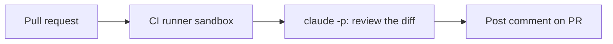

<LevelBadge level="advanced" />

<VerifyNote lastVerified="2026-06-20" source="https://docs.anthropic.com/en/docs/claude-code/sdk">
تتطوّر أعلام الوضع بلا واجهة وتفاصيل تكامل التكامل المستمر — تحقّق من ذلك مقابل وثائق Claude Code / Agent SDK الرسمية.
</VerifyNote>

أتمتة كلاسيكية عالية القيمة: اجعل Claude **يراجع كل طلب سحب** وينشر نتائجه كتعليق — مع التشغيل [بلا واجهة](/docs/claude-code/headless-and-agent-sdk) في التكامل المستمر. إليك الشكل العام مع حواجز الأمان التي تبقيه آمناً.

## ما الذي يفعله

عند كل طلب سحب: اسحب الفروقات، واطلب من Claude مراجعتها بحثاً عن الأخطاء والحالات الحدّية ومخالفات الأعراف، ثم انشر تعليقاً. يبقى القرار للبشر؛ Claude يقدّم فقط تمريرة أولى سريعة.



## سير العمل (مخطط مبدئي)

```yaml
name: Claude PR review
on: pull_request
permissions:
  contents: read
  pull-requests: write   # to comment — NOT write to code
jobs:
  review:
    runs-on: ubuntu-latest
    steps:
      - uses: actions/checkout@v4
        with: { fetch-depth: 0 }
      - name: Review the diff
        env:
          ANTHROPIC_API_KEY: ${{ secrets.ANTHROPIC_API_KEY }}
        run: |
          git diff origin/${{ github.base_ref }}...HEAD > /tmp/diff.patch
          claude -p "Review this diff for correctness bugs, missing edge cases, and
          security issues. Report ONLY high-confidence findings as a Markdown
          checklist with file:line. Diff:" < /tmp/diff.patch > /tmp/review.md
      # then post /tmp/review.md as a PR comment (e.g. with the gh CLI or an action)
```

(قد يختلف الاستدعاء الدقيق للوضع بلا واجهة — راجع الوثائق. المبدأ هو: مرّر الفروقات، والتقط Markdown، وانشره.)

## حواجز الأمان (اقرأ [تحصين التشغيلات الذاتية](/docs/security/hardening-autonomous-runs))

:::warning الحد الأدنى من الامتيازات في التكامل المستمر
- **التعليق فقط.** امنح `pull-requests: write`، **وليس** `contents: write` — يجب ألا يدفع الروبوت الشيفرة.
- **حدّد نطاق الرمز المميز**؛ لا تكشف أبداً وصول النشر/الأسرار لمهمة تقرأ محتوى طلب سحب غير موثوق.
- **عامل محتوى طلب السحب على أنه غير موثوق** — فقد يحمل [حقن التعليمات](/docs/security/prompt-injection)؛ لا تدع المهمة تتّخذ إجراءات ذات تبعات.
- **حدّ من التكلفة** — الفروقات الكبيرة تكلّف [رموزاً](/docs/api/tokens-and-pricing)؛ فكّر في مراجعة الملفات المتغيّرة فقط.
:::

## اجعله مفيداً، لا مزعجاً

- اطلب **النتائج عالية الثقة فقط** — جدار من الملاحظات الصغيرة يُتجاهَل.
- أبقِه **تمريرة أولى**، مع ترك قرار الدمج للبشر.

## التالي

- [الوضع بلا واجهة وAgentSDK](/docs/claude-code/headless-and-agent-sdk)
- [تحصين التشغيلات الذاتية](/docs/security/hardening-autonomous-runs)
- [البرمجة وتطوير البرمجيات](/docs/playbooks/coding)
