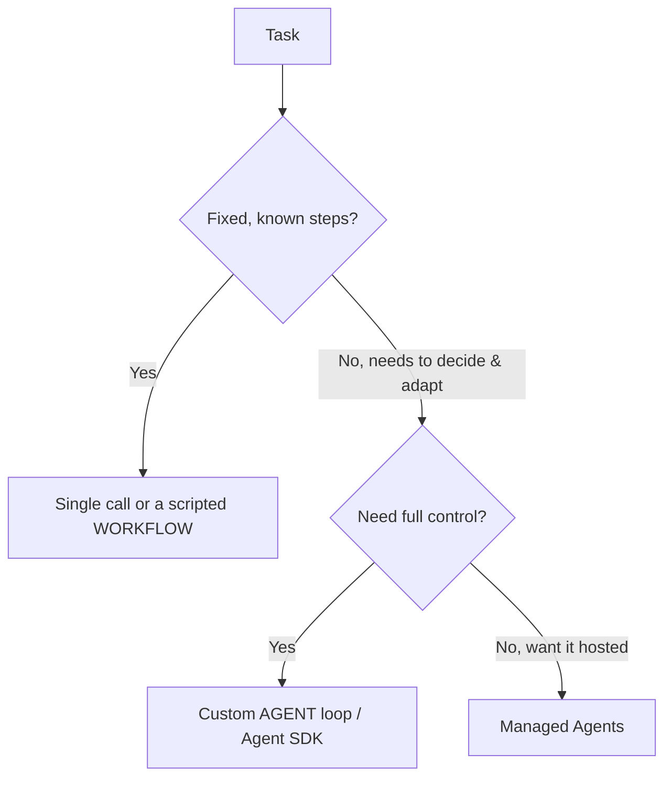

<LevelBadge level="advanced" />

<VerifyNote lastVerified="2026-07-21" source="https://platform.claude.com/docs/en/agents-and-tools/tool-use/overview">
Agenten-Tooling (das Agent SDK, verwaltete Optionen) entwickelt sich schnell weiter — prüfe die aktuellen Optionen in der offiziellen Dokumentation.
</VerifyNote>

<Callout type="objectives" items={["Definieren, was ein Agent eigentlich ist: ein Modell, das in einer Schleife läuft", "Den Entscheidungstest anwenden, um zwischen Einzelaufruf, Workflow und Agent zu wählen", "Eine minimale Agentenschleife mit den richtigen Schutzmechanismen entwerfen", "Wissen, wann man zum Claude Agent SDK greift, statt selbst zu basteln", "Einen Agenten robust machen: begrenzen, Fehler behandeln, Rechte einschränken, evaluieren"]} />

Ein **Agent** ist ein Modell, das in einer Schleife läuft: Er verfolgt ein Ziel, indem er [Tools](/docs/api/tool-use) aufruft, Ergebnisse beobachtet und über den nächsten Schritt entscheidet, bis er fertig ist. Bevor du einen baust, wähle das *Einfachste, das funktioniert*.

## Der Entscheidungstest (nicht überbauen)

Nicht jede Aufgabe braucht einen Agenten. Geh zuerst diesen Baum durch — die meisten Aufgaben hören ganz oben auf.

Drei Optionen, die einfachste zuerst:

- **Einzelaufruf** — ein Prompt beantwortet die Frage. Die meisten Aufgaben. Am günstigsten, am zuverlässigsten.
- **Workflow** — du orchestrierst eine feste Abfolge von Aufrufen im Code (deterministischer Kontrollfluss). Verwende dies, wenn die Schritte bekannt sind.
- **Agent** — das Modell entscheidet die Schritte dynamisch. Verwende dies nur, wenn der Weg sich wirklich nicht fest verdrahten lässt.

<Callout type="warning">
Greif zu einem Agenten, wenn Anpassungsfähigkeit der eigentliche Punkt ist — nicht weil es beeindruckend klingt. Ein Workflow, den du kontrollierst, ist leichter zu testen und zu debuggen.
</Callout>

## Die Schleife entwerfen

Ein minimaler eigener Agent besteht aus nur vier beweglichen Teilen. Baue sie in dieser Reihenfolge:

<Steps items={[
  {title: "System-Prompt", body: "Nenne das Ziel, die Einschränkungen und die verfügbaren Tools. Dagegen denkt das Modell in jedem Durchgang."},
  {title: "Die Schleife", body: "Nachrichten senden → wenn die Antwort ein tool_use ist, führe das Tool aus, hänge ein tool_result an und wiederhole → bis zu einer finalen Antwort oder einer Abbruchbedingung."},
  {title: "Schutzmechanismen", body: "Füge eine Obergrenze für die Iterationen, ein Token-/Kostenbudget und eine Validierung der Tool-Eingaben hinzu, bevor irgendetwas ausgeführt wird."},
  {title: "Kontextverwaltung", body: "Fasse zusammen oder kürze, während der Verlauf wächst — dieselbe Idee, die in Kontextverwaltung (/docs/claude-code/context-management) behandelt wird."}
]} />

Das **[Claude Agent SDK](/docs/claude-code/headless-and-agent-sdk)** liefert dir diese Schleife — Tools, Berechtigungen, Kontextverwaltung — alles inklusive, sodass du sie nicht selbst von Hand bauen musst.

<Callout type="tip">
Bevor du deine eigene Schleife schreibst, frage dich, ob das Agent SDK sie bereits abdeckt. Es bringt die Schleife, die Berechtigungen und die Kontextverwaltung mit, sodass du dich auf die Tools und das Ziel konzentrieren kannst.
</Callout>

## Mach ihn robust

Eine Schleife, die Tools aufrufen kann, kann sich auch danebenbenehmen. Vier Gewohnheiten halten einen Agenten vertrauenswürdig:

- **Begrenze alles**: Iterationen, Zeit, Kosten. Agenten können in Schleifen geraten.
- **Behandle Tool-Fehler** elegant (gib den Fehler als Ergebnis zurück).
- **Least Privilege + Human-in-the-Loop** für riskante Aktionen — siehe [Agenten absichern](/docs/security/securing-agents).
- **Evaluiere** ihn anhand realer Fälle, bevor du ihm vertraust — siehe [Evals](/docs/foundations/evals).

<Callout type="takeaways" items={["Ein Agent ist ein Modell in einer Schleife, das Tools auf ein Ziel hin aufruft — verwende einen nur, wenn sich der Weg nicht fest verdrahten lässt", "Entscheidungsreihenfolge: Einzelaufruf → Workflow → Agent → verwaltete Agenten; bevorzuge das Einfachste, das funktioniert", "Eine minimale Schleife = System-Prompt + tool_use/tool_result-Schleife + Schutzmechanismen + Kontextverwaltung", "Das Claude Agent SDK liefert dir die Schleife, Tools, Berechtigungen und Kontextverwaltung", "Robustheit = Iterationen/Zeit/Kosten begrenzen, Tool-Fehler behandeln, Least Privilege + Human-in-the-Loop, und evaluieren, bevor man vertraut"]} />

## Überprüfe dich selbst

<Quiz title="Überprüfe dich selbst" questions={[
  {
    q: "Was beschreibt einen Agenten in diesem Kontext am besten?",
    options: [
      "Ein einzelner Prompt, der eine vollständige Antwort liefert",
      "Ein Modell, das in einer Schleife läuft, Tools aufruft und über den nächsten Schritt entscheidet, bis es fertig ist",
      "Eine feste Abfolge von API-Aufrufen, die du im Code orchestrierst",
      "Ein gehosteter Dienst, der keine Konfiguration erfordert"
    ],
    answer: 1,
    explain: "Ein Agent ist ein Modell, das in einer Schleife läuft: Er verfolgt ein Ziel, indem er Tools aufruft, Ergebnisse beobachtet und über den nächsten Schritt entscheidet, bis er fertig ist."
  },
  {
    q: "Die Aufgabe hat feste, bekannte Schritte. Wozu solltest du greifen?",
    options: [
      "Eine eigene Agentenschleife, für maximale Kontrolle",
      "Verwaltete Agenten, damit es gehostet ist",
      "Ein Einzelaufruf oder ein skriptgesteuerter Workflow",
      "Ein Multi-Agenten-Team"
    ],
    answer: 2,
    explain: "Wenn die Schritte fest und bekannt sind, ist ein Einzelaufruf oder ein skriptgesteuerter Workflow (deterministischer Kontrollfluss) die richtige, einfachste Wahl."
  },
  {
    q: "Wann ist ein eigener Agent tatsächlich gerechtfertigt?",
    options: [
      "Immer wenn er beeindruckender klingt als ein Workflow",
      "Wenn Anpassungsfähigkeit der eigentliche Punkt ist und sich der Weg wirklich nicht fest verdrahten lässt",
      "Für jede Aufgabe, die mehr als ein Tool aufruft",
      "Nur wenn du das Agent SDK nicht verwenden kannst"
    ],
    answer: 1,
    explain: "Greif zu einem Agenten, wenn Anpassungsfähigkeit der eigentliche Punkt ist — nicht weil es beeindruckend klingt. Ein Workflow, den du kontrollierst, ist leichter zu testen und zu debuggen."
  },
  {
    q: "Was passiert in der Schleife, wenn das Modell mit einem tool_use antwortet?",
    options: [
      "Du stoppst die Schleife und gibst die unvollständige Antwort zurück",
      "Du führst das Tool aus, hängst ein tool_result an und wiederholst",
      "Du verwirfst die Nachricht und sendest den System-Prompt erneut",
      "Du fasst den Verlauf sofort zusammen"
    ],
    answer: 1,
    explain: "Die Schleife: Nachrichten senden → bei tool_use das Tool ausführen, tool_result anhängen, wiederholen → bis zu einer finalen Antwort oder einer Abbruchbedingung."
  },
  {
    q: "Was gehört NICHT zu den Schutzmechanismen, um einen Agenten robust zu machen?",
    options: [
      "Eine Obergrenze für die Iterationen und ein Token-/Kostenbudget",
      "Tool-Fehler behandeln, indem man den Fehler als Ergebnis zurückgibt",
      "Dem Agenten volle Rechte geben, damit er nie blockiert wird",
      "Least Privilege plus Human-in-the-Loop für riskante Aktionen"
    ],
    answer: 2,
    explain: "Robuste Agenten setzen auf Least Privilege plus Human-in-the-Loop für riskante Aktionen — das Gegenteil davon, volle Rechte zu vergeben. Außerdem begrenzt man Iterationen/Zeit/Kosten, behandelt Tool-Fehler elegant und evaluiert, bevor man vertraut."
  }
]} />

## Weiter

- [Tool-Nutzung](/docs/api/tool-use) · [Headless & Agent SDK](/docs/claude-code/headless-and-agent-sdk)
- [Verwaltete Agenten](/docs/api/managed-agents) · [Cowork & Agententeams](/docs/api/cowork-and-agent-teams)
- [Agenten & Tools absichern](/docs/security/securing-agents)
