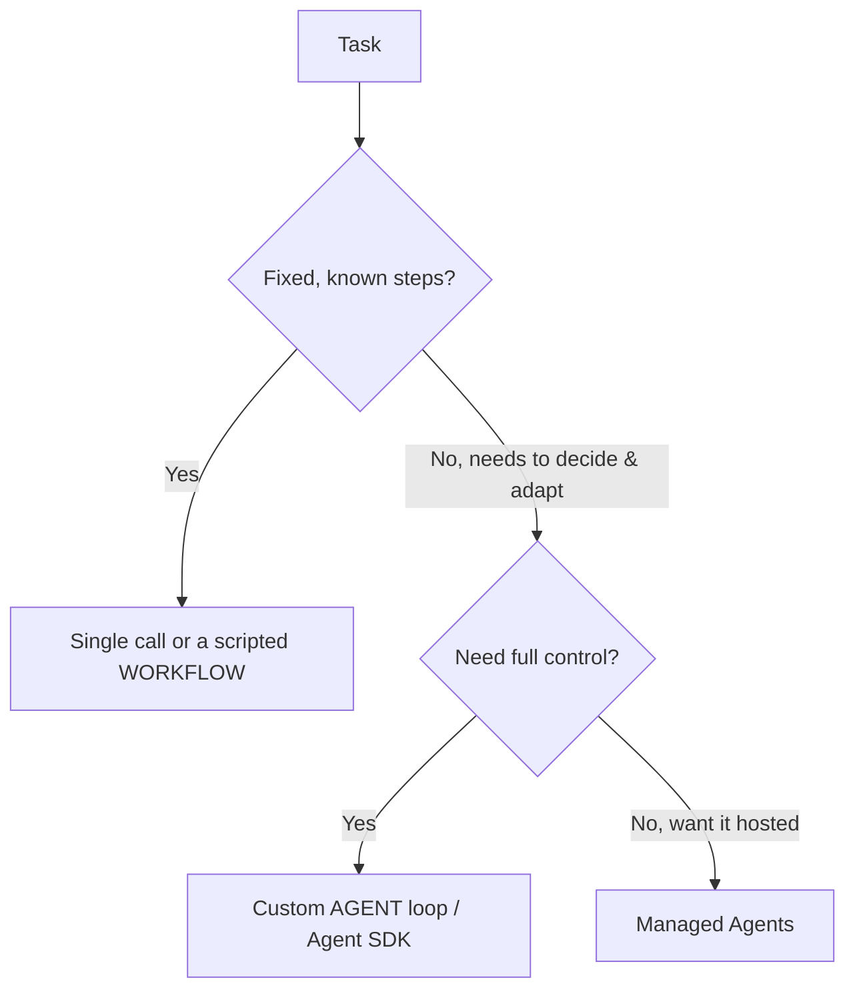

<LevelBadge level="advanced" />

<VerifyNote lastVerified="2026-06-20" source="https://platform.claude.com/docs/en/docs/agents-and-tools">
Das Agenten-Tooling (das Agent SDK, verwaltete Optionen) entwickelt sich schnell weiter — überprüfe die aktuellen Optionen in der offiziellen Dokumentation.
</VerifyNote>

Ein **Agent** ist ein Modell, das in einer Schleife läuft: Er verfolgt ein Ziel, indem er [Tools](/docs/api/tool-use) aufruft, Ergebnisse beobachtet und über den nächsten Schritt entscheidet, bis er fertig ist. Bevor du einen baust, wähle die *einfachste Lösung, die funktioniert*.

## Der Entscheidungstest (nicht überbauen)

- **Einzelaufruf** — ein einziger Prompt beantwortet die Frage. Die meisten Aufgaben. Am günstigsten, am zuverlässigsten.
- **Workflow** — du orchestrierst eine feste Abfolge von Aufrufen im Code (deterministischer Kontrollfluss). Verwende dies, wenn die Schritte bekannt sind.
- **Agent** — das Modell entscheidet die Schritte dynamisch. Verwende dies nur, wenn der Weg sich wirklich nicht fest verdrahten lässt.

> Greife dann zu einem Agenten, wenn Anpassungsfähigkeit der eigentliche Punkt ist — nicht weil es beeindruckend klingt. Ein Workflow, den du kontrollierst, ist leichter zu testen und zu debuggen.

## Die Schleife entwerfen

Ein minimaler eigener Agent:

1. **System-Prompt**: das Ziel, die Einschränkungen und die verfügbaren Tools.
2. **Schleife**: Nachrichten senden → bei `tool_use` das Tool ausführen, `tool_result` anhängen, wiederholen → bis zu einer finalen Antwort oder einer Abbruchbedingung.
3. **Schutzmechanismen**: eine Obergrenze für die maximale Anzahl an Iterationen, ein Token-/Kostenbudget und die Validierung der Tool-Eingaben.
4. **Kontextverwaltung**: zusammenfassen/kürzen, während der Verlauf wächst (dieselbe Idee wie [Kontextverwaltung](/docs/claude-code/context-management)).

Das **[Claude Agent SDK](/docs/claude-code/headless-and-agent-sdk)** liefert dir diese Schleife — Tools, Berechtigungen, Kontextverwaltung — alles inklusive, sodass du sie nicht selbst von Hand bauen musst.

## Mach ihn robust

- **Begrenze alles**: Iterationen, Zeit, Kosten. Agenten können in Schleifen geraten.
- **Behandle Tool-Fehler** elegant (gib den Fehler als Ergebnis zurück).
- **Least Privilege + Human-in-the-Loop** für riskante Aktionen — siehe [Agenten absichern](/docs/security/securing-agents).
- **Evaluiere** ihn anhand realer Fälle, bevor du ihm vertraust — siehe [Evals](/docs/foundations/evals).

## Weiter

- [Tool-Nutzung](/docs/api/tool-use) · [Headless & Agent SDK](/docs/claude-code/headless-and-agent-sdk)
- [Verwaltete Agenten](/docs/api/managed-agents) · [Cowork & Agententeams](/docs/api/cowork-and-agent-teams)
- [Agenten & Tools absichern](/docs/security/securing-agents)
