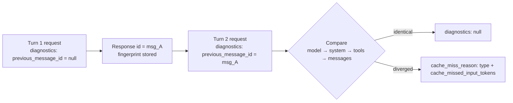

<LevelBadge level="advanced" />

<Callout type="objectives" items={[
  "Einen Prompt-Cache-Miss aus der API-Antwort diagnostizieren, statt Prompt-Bytes von Hand zu diffen",
  "Das diagnostics-Objekt in eine Anfrage einbauen und previous_message_id durch eine Konversationsschleife führen",
  "Alle sechs cache_miss_reason-Typen lesen und die jeweils implizierte konkrete Behebung anwenden",
  "Einen echten Bug von einem abgelaufenen Cache-Eintrag unterscheiden, indem du Diagnostik mit usage kombinierst",
  "Die drei Wege vermeiden, auf denen dieses Werkzeug dich still in die Irre führt: nur die früheste Abweichung, ausstehende Vergleiche und eine Token-Zahl, die keine Abrechnungsgröße ist"
]} />

Du hast [Prompt-Caching](/docs/api/prompt-caching) eingerichtet, ausgeliefert, und `cache_read_input_tokens` ist **null**. Etwas in deinem Prefix hat sich geändert — aber die Antwort gibt dir keinen Hinweis darauf, was. Die traditionelle Lösung ist trostlos: zwei aufeinanderfolgende Anfragen auf die Platte serialisieren, sie Byte für Byte diffen und nach einem Timestamp jagen, den irgendwer vor sechs Monaten in einen System-Prompt interpoliert hat.

**Cache-Diagnostik ersetzt das.** Übergib die `id` deiner vorherigen Antwort, und die API vergleicht die beiden Anfragen und benennt die erste Stelle, an der sie abgewichen sind — das Modell, den System-Prompt, die Tools oder die Nachrichtenhistorie — plus eine Schätzung, wie viel cachefähiges Prefix du verloren hast.

<VerifyNote lastVerified="2026-09-28" source="https://platform.claude.com/docs/en/build-with-claude/cache-diagnostics">
Cache-Diagnostik erreichte **am 23. September 2026 die allgemeine Verfügbarkeit in der Claude API**; der Beta-Header `cache-diagnosis-2026-04-07` ist nicht mehr erforderlich, und Anfragen, die ihn weiterhin senden, funktionieren wie bisher. Verfügbarkeit, Feldnamen und die `cache_miss_reason`-Union können sich alle ändern — bestätige es in der offiziellen Cache-Diagnostik-Dokumentation.
</VerifyNote>

## Das Mentalmodell

Die API behält einen kleinen **Fingerprint** jeder Anfrage, für die du das Opt-in gibst, geschlüsselt über die `id` der Antwort dieser Anfrage. Bei deiner nächsten Anfrage gibst du diese `id` zurück, die API baut einen Fingerprint für die neue Anfrage, vergleicht die beiden und meldet den **ersten Abweichungspunkt**.



Drei Dinge an diesem Diagramm zählen mehr als die Feldnamen:

1. **Das Objekt ist das Opt-in.** Die API speichert einen Fingerprint *nur* für Anfragen, die `diagnostics` enthalten. Lass es einen Turn weg, und der Lookup des nächsten Turns schlägt fehl.
2. **Die Vergleichsreihenfolge ist die Prefix-Reihenfolge.** Modell, dann System, dann Tools, dann Messages — dieselbe Links-nach-rechts-Reihenfolge, in der auch der Cache selbst aufgebaut wird.
3. **Es meldet Struktur, nicht Cache-Ergebnis.** Diagnostik beantwortet *"hat sich meine Anfrage geändert?"* — eine andere Frage als *"hat der Cache getroffen?"*. Du brauchst beide Messwerte, um zu handeln. Siehe [Kombiniere es mit usage](#kombiniere-es-mit-usage).

<Flashcards title="Vokabular der Cache-Diagnostik" cards={[
  {front:"Fingerprint", back:"Ein leichtgewichtiger Datensatz, den die API für jede Anfrage speichert, die das diagnostics-Objekt enthält. Nur kryptografische Hashes und Token-Zahl-Schätzungen — niemals Rohtext des Prompts. Geschlüsselt über die Antwort-id, begrenzt auf deine Organisation und deinen Workspace, läuft nach kurzer Zeit ab."},
  {front:"previous_message_id", back:"Die id der Antwort, mit der die aktuelle Anfrage verglichen werden soll. Übergib im ersten Turn null, um das Opt-in zu geben, wenn es noch nichts zu vergleichen gibt."},
  {front:"cache_miss_reason", back:"Eine diskriminierte Union über type. Benennt die erste Stelle, an der die beiden Anfragen abwichen — oder erklärt, warum kein Vergleich erzeugt wurde."},
  {front:"cache_missed_input_tokens", back:"Wird von den vier *_changed-Typen mitgeführt. Eine Schätzung, wie viele Input-Tokens nach dem Abweichungspunkt lagen — also wie viel cachefähiges Prefix du verloren hast."},
  {front:"Nur die früheste Abweichung", back:"Die Antwort benennt den ersten Unterschied und hört dort auf. Eine spätere Abweichung kann dahinter verborgen sein, deshalb ist Debugging eine Schleife aus Beheben und Neu-Messen, keine Einmal-Ablesung."}
]} />

## Eine Konversation instrumentieren

<Steps items={[
  {title: "Füge das diagnostics-Objekt in jeden Turn ein", body: "Nimm diagnostics in jede Anfrage auf, nicht nur in die, die du debuggst. Die API speichert nur für Anfragen einen Fingerprint, die das Objekt tragen, also unterbricht ein einziger Turn ohne es die Kette, und der nächste Turn meldet previous_message_not_found."},
  {title: "Übergib im ersten Turn null", body: "In Turn eins gibt es nichts zu vergleichen. Sende previous_message_id als null — damit gibst du das Opt-in und registrierst den Fingerprint. Das diagnostics-Feld der Antwort wird null sein, was erwartet ist und kein Fehler."},
  {title: "Führe die Antwort-id weiter", body: "Setze in jedem folgenden Turn previous_message_id auf die id der vorherigen Antwort. In einer Schleife ist das eine Variable, die du nach jedem Aufruf neu zuweist."},
  {title: "Lies diagnostics von der Antwort ab", body: "Bei Non-Streaming-Aufrufen ist es ein diagnostics-Feld auf oberster Ebene der Message. Bei Streaming-Aufrufen kommt es im message_start-Event und wird bis in die akkumulierte Endnachricht mitgeführt."},
  {title: "Behebe die gemeldete Ursache, dann messe erneut", body: "Nur die früheste Abweichung wird gemeldet. Nachdem du sie behoben hast, lass es neu laufen — eine zweite Ursache kann die ganze Zeit hinter der ersten gesessen haben."}
]} />

Die Anfrageform ist klein. Alles andere am Aufruf bleibt unverändert:

<PromptCard title="Turn 2 — Vergleich mit der vorherigen Antwort">{`curl https://api.anthropic.com/v1/messages \\
  -H "x-api-key: $ANTHROPIC_API_KEY" \\
  -H "anthropic-version: 2023-06-01" \\
  -H "content-type: application/json" \\
  -d '{
    "model": "claude-opus-5-5",
    "max_tokens": 1024,
    "cache_control": {"type": "ephemeral"},
    "system": "You are an AI assistant analyzing a large document. <document>...</document>",
    "messages": [
      {"role": "user", "content": "Summarize section 1."},
      {"role": "assistant", "content": "Section 1 covers..."},
      {"role": "user", "content": "Now summarize section 2."}
    ],
    "diagnostics": {"previous_message_id": "msg_01Xyz..."}
  }' | jq '{id, usage, diagnostics}'`}</PromptCard>

In einer Multi-Turn-Schleife schrumpft es auf eine einzige neu zugewiesene Variable zusammen — `prev_id` startet als `None` und wird nach jedem Aufruf `r.id`:

```python
messages = []
prev_id = None

for turn, user_message in enumerate(prompts, start=1):
    messages.append({"role": "user", "content": user_message})

    r = client.beta.messages.create(
        model="claude-opus-5-5",
        max_tokens=1024,
        cache_control={"type": "ephemeral"},
        system=SYSTEM,
        messages=messages,
        diagnostics={"previous_message_id": prev_id},
    )

    if r.diagnostics is not None and r.diagnostics.cache_miss_reason is not None:
        print(f"Turn {turn} cache_miss_reason: {r.diagnostics.cache_miss_reason.type}")

    messages.append({"role": "assistant", "content": r.content})
    prev_id = r.id
```

## Die Antwort lesen

Das `diagnostics`-Feld hat **drei** mögliche Formen, und die ersten zwei zu verwechseln ist die häufigste Fehldeutung:

| Wert | Bedeutung |
|---|---|
| `null` | Entweder hast du das `diagnostics`-Objekt nicht gesendet, oder `previous_message_id` war `null` (erster Turn), **oder** ein Vergleich lief und fand keine Abweichung. |
| `cache_miss_reason` ist `null` | Der Vergleich lief noch, als die Antwort serialisiert wurde — das kann passieren, wenn eine Antwort sehr schnell startet. Nicht schlüssig; prüfe den nächsten Turn. |
| `cache_miss_reason` ist ein Objekt | Ein Abweichungspunkt, oder eine Erklärung, warum kein Vergleich erzeugt wurde. |

:::caution `null` ist absichtlich ambivalent
Ein `diagnostics`-Feld mit `null` bedeutet "nichts zu melden" — was sowohl *"dein Prefix ist identisch"* als auch *"du hast nie das Opt-in gegeben"* abdeckt. Wenn du überall `null` siehst und eine Diagnose erwartet hast, stelle sicher, dass du das `diagnostics`-Objekt tatsächlich in **beiden** Turns sendest, bevor du schlussfolgerst, dass dein Prompt stabil ist.
:::

Ein befüllter Miss sieht so aus:

```json
{
  "id": "msg_01Xyz...",
  "type": "message",
  "role": "assistant",
  "usage": {
    "input_tokens": 42,
    "cache_read_input_tokens": 0,
    "cache_creation_input_tokens": 41850,
    "output_tokens": 210
  },
  "diagnostics": {
    "cache_miss_reason": {
      "type": "system_changed",
      "cache_missed_input_tokens": 41850
    }
  }
}
```

## Die sechs Gründe, und was du tatsächlich ändern musst

Vier Typen benennen einen Abweichungspunkt. Zwei bedeuten, dass überhaupt kein Vergleich stattgefunden hat — und diese als "mein Prompt hat sich geändert" zu lesen schickt dich auf die Jagd nach einem Bug, der nicht existiert.

| `type` | Was abwich | Die Behebung |
|---|---|---|
| `model_changed` | Das `model` unterscheidet sich von der vorherigen Anfrage. Der Cache ist pro Modell, also wirft ein Router, ein A/B-Test oder ein Fallback, der mitten in der Konversation das Modell wechselt, das ganze Prefix weg. | Halte das Modell für die Lebensdauer einer gecachten Konversation konstant. Wenn du Fallback brauchst, behandle jedes Modell als eigene Cache-Linie. |
| `system_changed` | Der `system`-Parameter unterscheidet sich — fast immer ein Timestamp, eine Request-ID, eine Session-ID oder ein Benutzername, der in einen ansonsten stabilen Prompt interpoliert wurde. | Mache den System-Prompt zu einer byte-stabilen Konstante. Verschiebe jeden dynamischen Wert in die erste `user`-Nachricht **nach** deinem Cache-Breakpoint. |
| `tools_changed` | Das `tools`-Array unterscheidet sich: ein Tool wurde hinzugefügt, entfernt oder umsortiert — oder `input_schema`-JSON wurde zwischen Turns nicht deterministisch serialisiert. | Sende in jedem Turn dieselbe Tool-Liste in fester Reihenfolge und serialisiere Schemas deterministisch (Objektschlüssel sortieren). |
| `messages_changed` | Modell, System und Tools stimmen alle überein, aber ein früherer Eintrag in `messages` wurde verändert, umsortiert oder entfernt, statt ergänzt zu werden. Meist Historien-Kürzung, oder Assistant-Turns und `tool_result`-Blöcke, die beim erneuten Senden anders serialisiert wurden. | Behandle die Historie als **append-only**. Gib Assistant-`content` und Tool-Ergebnisse wortgetreu zurück, statt sie zu rekonstruieren. |
| `previous_message_not_found` | Kein gespeicherter Fingerprint für diese `previous_message_id`. **Das ist kein Beweis, dass sich deine Anfrage geändert hat.** Die vorherige Anfrage hat das `diagnostics`-Objekt weggelassen, lief in einem anderen Workspace oder war zu lange her. | Sende `diagnostics` in jedem Turn und halte aufeinanderfolgende Turns zeitlich nah beieinander. |
| `unavailable` | Es wurde keine Diagnose erzeugt. Deckt zwei verschiedene Fälle ab: ein Prompt-relevanter Parameter *außer* model/system/tools unterschied sich, oder die Konversation ist lang genug, dass die Abweichung jenseits des Vergleichshorizonts liegt. | Halte `tool_choice`, `thinking`, `context_management`, `output_config`, `output_format` und dein aktives Set an `anthropic-beta`-Headern ebenfalls konstant — sie beeinflussen alle den Prompt. |

:::tip `unavailable` ist das, was Leute falsch lesen
Es bedeutet **nicht** "das Feature ist kaputt". Meistens bedeutet es, dass die vier verglichenen Flächen alle übereinstimmten und sich etwas anderes bewegt hat — das Set an Beta-Headern ist ein Lieblingsverdächtiger, weil es üblicherweise in gemeinsamer Client-Konfiguration weit vom Aufrufort gesetzt wird und niemand es als Teil des Prompts betrachtet.
:::

## Kombiniere es mit usage

Diagnostik allein ist die halbe Ablesung. `usage.cache_read_input_tokens` ist die andere Hälfte, und die beiden zusammen sagen dir, ob du auf einen Bug oder auf Physik schaust.

| Diagnostik | Cache-Read-Tokens | Was es tatsächlich bedeutet |
|---|---|---|
| `null` | Hoch | Funktioniert wie vorgesehen. Stabiles Prefix, Cache-Treffer. Nichts zu tun. |
| `null` | Niedrig oder null | **Nicht dein Bug.** Die Anfragen stimmten überein; der Cache-Eintrag war einfach abgelaufen. Verkürze den Abstand zwischen den Turns oder wechsle zur [1-Stunden-Cache-Dauer](https://platform.claude.com/docs/en/build-with-claude/prompt-caching#1-hour-cache-duration). |
| Ein `*_changed`-Typ | Niedrig oder null | **Dein Bug.** Die Anfrage hat sich geändert. Behebe die Ursache, die der `type` benennt. |
| Ein `*_changed`-Typ | Hoch | Selten. Etwas hat sich spät im Prompt geändert, aber ein früherer `cache_control`-Breakpoint hat noch getroffen. Wert zu beheben, geringe Auswirkung. |

Diese zweite Zeile ist die, die dem Feature seinen Wert verdient. "Cache-Reads sind null" war früher nicht von "wir haben einen Prefix-Bug" zu unterscheiden, und Teams verbrannten Tage mit Letzterem, obwohl die Antwort Erstere war. Zusammen gelesen trennt Diagnostik *deinen* Fehler von der Lebensdauer *des Caches*.

Diese Matrix gilt für Turns, in denen du eine echte `previous_message_id` übergeben hast. Sie gilt **nicht** im ersten Turn (`diagnostics` ist immer `null` und Cache-Reads sind normalerweise null, weil der Cache gerade geschrieben wird), und auch nicht, wenn `cache_miss_reason` `null`, `previous_message_not_found` oder `unavailable` ist — in all diesen Fällen wurde kein Vergleich erzeugt.

## Häufige Fehler

- **Nur den fehlschlagenden Turn instrumentieren.** Der Fingerprint lebt auf der *vorherigen* Anfrage. `diagnostics` nur dem Turn hinzuzufügen, den du debuggst, garantiert `previous_message_not_found`. Instrumentiere die ganze Schleife.
- **`cache_missed_input_tokens` als Abrechnungsgröße behandeln.** Es wird aus **Byte-Längen vor der Tokenisierung** abgeleitet, ist also ein Größenordnungs-Indikator — "du hast ungefähr 40k Prefix verloren", nicht "dir wurden 41.850 Tokens berechnet". Es kann von `usage.input_tokens` abweichen und dieses gelegentlich übersteigen.
- **Nach einer Behebung aufhören.** Nur die früheste Abweichung wird gemeldet. `system_changed` zu beheben kann sofort ein `tools_changed` offenlegen, das immer schon da war. Messe nach jeder Behebung erneut, bis die Diagnostik verstummt.
- **Über Workspaces hinweg debuggen.** Die vorherige Anfrage muss in derselben Organisation *und* demselben Workspace gelaufen sein. Vergleiche den `anthropic-workspace-id`-Response-Header auf beiden Antworten, bevor du einem `previous_message_not_found` glaubst.
- **Es auf Bedrock oder Google Cloud erwarten.** Cache-Diagnostik gibt es **nur in der Claude API**. Wenn du multi-cloud bist, instrumentiere den Claude-API-Pfad, behebe das Prefix dort und liefere die Behebung überall aus — die Regeln zur Prefix-Stabilität sind identisch, auch wo die Diagnose nicht verfügbar ist.
- **Einen ausstehenden Vergleich als Unbedenklichkeitsbescheinigung lesen.** `cache_miss_reason: null` bedeutet, dass der Vergleich beim Serialisieren der Antwort noch nicht fertig war. Das ist nicht schlüssig, kein Bestehen.

## Ist es sicher, es angeschaltet zu lassen?

Größtenteils ja — und das ändert, wie du es nutzt. Es ist **von Entwurf her Best-Effort**: Diagnostik blockiert oder bricht deine Anfrage nie; wenn Informationen nicht verfügbar sind, bekommst du `unavailable` oder einen `null`-Grund statt eines Fehlers. Der gespeicherte Fingerprint enthält nur kryptografische Hashes und Token-Zahl-Schätzungen, niemals Rohtext des Prompts, und das Feature ist **ZDR-fähig (qualifiziert)**.

Das macht es vernünftig, `diagnostics` dauerhaft in einer Staging-Umgebung verdrahtet zu lassen, statt es während eines Vorfalls anzuschrauben — was der einzige Weg ist, die langsame Regression zu erwischen, bei der jemand einen Timestamp in einen System-Prompt einfügt und deine Cache-Trefferrate über eine Woche hinweg verfällt.

<Quiz title="Prüfe dich selbst" questions={[
  {q:"Deine Antwort in Turn 2 kommt mit diagnostics auf null und cache_read_input_tokens auf null zurück. Was ist die wahrscheinlichste Erklärung?",options:["Ein stiller Invalidator hat deinen System-Prompt verändert","Die Anfragen stimmten überein, aber der Cache-Eintrag war schon abgelaufen","Das Diagnostik-Feature ist für dein Konto nicht verfügbar"],answer:1,explain:"Ein diagnostics-Wert von null bei niedrigen Cache-Reads bedeutet, dass die beiden Anfragen identisch waren, der Cache-Eintrag aber nicht mehr verfügbar war. Das ist ein TTL-Problem, kein Prefix-Bug — verkürze den Abstand zwischen den Turns oder wechsle zur 1-Stunden-Cache-Dauer."},
  {q:"Du erhältst previous_message_not_found. Was sagt dir das über deinen Prompt?",options:["Nichts — es bedeutet, dass für diese id kein Fingerprint gespeichert wurde","Dass deine Nachrichtenhistorie gekürzt wurde","Dass sich das Modell zwischen den Turns geändert hat"],answer:0,explain:"previous_message_not_found ist kein Beweis dafür, dass sich deine Anfrage geändert hat. Es bedeutet, dass für diese previous_message_id kein gespeicherter Fingerprint existiert — üblicherweise weil die vorherige Anfrage das diagnostics-Objekt wegließ, in einem anderen Workspace lief oder zu lange her gesendet wurde."},
  {q:"Du behebst das gemeldete system_changed und der nächste Lauf meldet tools_changed. Was ist passiert?",options:["Deine Behebung hat einen neuen Bug im tools-Array eingeführt","Nur die früheste Abweichung wird gemeldet, also war die Tools-Abweichung hinter der System-Abweichung verborgen","Der Vergleichshorizont wurde überschritten"],answer:1,explain:"Die Antwort meldet nur die früheste Abweichung. Die erste Ursache zu beheben legt offen, was dahinter saß, weshalb Cache-Debugging eine Schleife aus Beheben und Neu-Messen ist statt einer einzelnen Ablesung."},
  {q:"Wie solltest du den Wert von cache_missed_input_tokens behandeln?",options:["Als die exakte Zahl der Tokens, die dir berechnet wurden","Als Größenordnungs-Indikator dafür, wie viel Prefix verloren ging","Als die Größe deines Cache-Breakpoints"],answer:1,explain:"Er wird aus Byte-Längen vor der Tokenisierung abgeleitet, schätzt also, wie viel cachefähiges Prefix nach dem Abweichungspunkt lag. Behandle ihn als Größenordnungs-Indikator, nicht als Abrechnungsgröße — er kann von usage.input_tokens abweichen und dieses gelegentlich übersteigen."}
]} />

<Callout type="takeaways" items={[
  "Sende das diagnostics-Objekt in jedem Turn und führe die id der vorherigen Antwort weiter — der Fingerprint wird nur für Anfragen gespeichert, die das Opt-in geben.",
  "diagnostics beantwortet 'hat sich meine Anfrage geändert?'; usage.cache_read_input_tokens beantwortet 'hat der Cache getroffen?'. Du brauchst beides, um einen Prefix-Bug von einem abgelaufenen Eintrag zu unterscheiden.",
  "Vier *_changed-Typen benennen einen Abweichungspunkt; previous_message_not_found und unavailable bedeuten, dass kein Vergleich lief, und sind kein Beweis für eine Änderung.",
  "Nur die früheste Abweichung wird gemeldet, also behebe, messe neu und wiederhole, bis die Diagnostik verstummt.",
  "cache_missed_input_tokens ist eine byte-abgeleitete Größenordnungsschätzung, keine Abrechnungsgröße.",
  "Nur Claude API — nicht auf Amazon Bedrock oder Google Cloud — aber die Regeln zur Prefix-Stabilität, die es lehrt, gelten überall."
]} />

## Weiter

- [Prompt-Caching & Kostenoptimierung](/docs/api/prompt-caching) — setze den Breakpoint von Anfang an korrekt, damit es weniger zu diagnostizieren gibt.
- [Prompt-Caching bei den verschiedenen Anbietern](/docs/models/prompt-caching-across-providers) — dieselben Prefix-Regeln bei OpenAI, Gemini und DeepSeek, und die Break-Even-Rechnung, wann Caching ein Verlust ist.
- [Tokens, Kontext & Preise](/docs/api/tokens-and-pricing) — was die Tokens, die du gerade aufgehört hast zu verschwenden, tatsächlich kosten.
