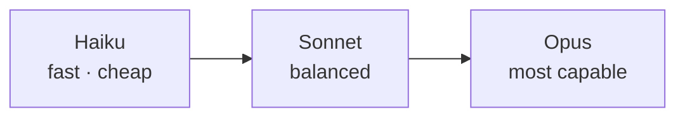

<LevelBadge level="beginner" />

Anthropic bietet eine Modellfamilie mit unterschiedlichen Punkten in Bezug auf Leistungsfähigkeit/Kosten/Geschwindigkeit. Gut zu wählen bedeutet vor allem, das Modell auf die Aufgabe abzustimmen — und nicht für Leistungsfähigkeit zu bezahlen, die du nicht brauchst.

## Die aktuellen Modelle

<ModelTable />

## Probier es aus: Welches Modell passt?

Beantworte drei Fragen und erhalte eine erste Empfehlung:

<ModelPicker />

## Das mentale Modell: eine Leistungsleiter

- **Beginne mit Sonnet.** Es ist das Standard-Arbeitstier — starkes Reasoning und Coding zu vernünftigen Kosten. Die meisten Aufgaben sollten hier starten.
- **Steige nur dann auf Opus auf**, wenn Sonnet an seine Grenzen stößt und Qualität wichtiger ist als Kosten (schwieriges Reasoning, knifflige Agenten, verzwickter Code).
- **Steige auf Haiku ab** für umfangreiche, latenzempfindliche oder einfache Arbeit (Klassifizierung, Extraktion, Routing, günstige Sub-Agenten).

## Wie man tatsächlich wählt

1. **Standardmäßig Sonnet** und ausliefern.
2. **Stößt du an eine Qualitätsgrenze?** Probiere Opus nur an der schwierigen Teilmenge.
3. **Schmerzen Kosten oder Latenz?** Prüfe, ob Haiku für diesen Schritt gut genug ist.
4. **Mische Modelle.** Verwende Haiku für günstiges Vor-/Nachbearbeiten und Sonnet/Opus für den schwierigen Kern. Diese „Modell-Staffelung" ist einer der größten Kostenhebel — siehe [Kosten & Latenz](/docs/foundations/cost-and-latency).

:::tip Wähle nicht allein anhand von Benchmarks
Öffentliche Benchmarks sind ein erster Hinweis, kein Urteil für *deine* Aufgabe. Führe ein winziges [Eval](/docs/foundations/evals) an einer Handvoll deiner echten Eingaben mit zwei Modellen durch — das dauert Minuten und ist besser als zu raten.
:::

## Die exakte Modell-ID nachschlagen

Übergib immer die aktuelle API-Modell-ID (z. B. in deinem `messages.create`-Aufruf). Hol sie dir aus der [Modelltabelle oben](/docs/whats-new/models-and-pricing) oder der offiziellen Modellseite — und lies sie bevorzugt aus einer Konfiguration, statt sie an vielen Stellen fest zu verdrahten, damit Modell-Upgrades eine einzeilige Änderung bleiben.

## Weiter

- [Tokens, Kontext & Preise](/docs/api/tokens-and-pricing)
- [Dein erster API-Aufruf](/docs/api/first-call)
- [Aktuelle Modelle & Preise](/docs/whats-new/models-and-pricing)
