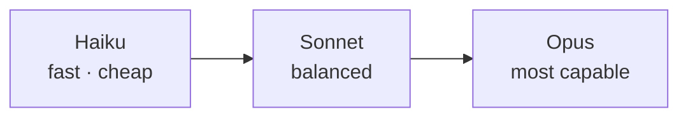

<LevelBadge level="beginner" />

Anthropic bietet eine Modellfamilie an verschiedenen Punkten von Fähigkeit/Kosten/Geschwindigkeit an. Gut zu wählen heißt vor allem: das Modell auf die Aufgabe zuschneiden — und keine Fähigkeit zu bezahlen, die du nicht brauchst.

<Callout type="objectives" items={[
  "Die Leiter Haiku → Sonnet → Opus als Fähigkeit/Kosten/Geschwindigkeit-Tradeoff lesen",
  "Vom richtigen Default starten statt zu raten und dann bewusst hoch oder runter gehen",
  "Tiers in einem System mischen — der größte Kostenhebel, den die meisten nie ziehen",
  "Die exakte Model-ID richtig nachschlagen, damit Upgrades eine Ein-Zeilen-Änderung bleiben",
]} />

## Die aktuellen Modelle

<ModelTable />

## Probier's aus: welches Modell passt?

Beantworte drei Fragen und bekomme eine Startempfehlung:

<ModelPicker />

## Das mentale Modell: eine Fähigkeitsleiter

- **Starte mit Sonnet.** Das ist der Standard-Zugpferd — starkes Reasoning und Coding zu vernünftigen Kosten. Die meisten Aufgaben sollten hier beginnen.
- **Steige zu Opus auf**, wenn Sonnet strauchelt und Qualität mehr zählt als Kosten (hartes Reasoning, kniffelige Agenten, verhedderter Code).
- **Steige auf Haiku ab** für hohe Volumen, latenzsensible oder einfache Arbeit (Klassifikation, Extraktion, Routing, günstige Sub-Agenten).

## So wählst du tatsächlich

<Steps items={[
  {title: "Auf Sonnet defaulten und ausliefern", body: "Es ist das ausgewogene Zugpferd. Woanders zu starten heißt zu optimieren, bevor du Evidenz über deine tatsächliche Aufgabe hast."},
  {title: "Gegen eine Qualitätsdecke gelaufen? Probiere Opus nur auf der harten Teilmenge", body: "Rüste nicht die gesamte Workload hoch. Finde die Fälle, in denen Sonnet scheitert, und route nur die zu Opus — du kaufst die Qualität, ohne sie überall zu bezahlen."},
  {title: "Kosten oder Latenz tun weh? Prüfe, ob Haiku für den Schritt reicht", body: "Klassifikation, Extraktion, Routing und günstige Subagenten brauchen selten ein größeres Modell. Teste es, statt anzunehmen."},
  {title: "Modelle mischen", body: "Nutze Haiku für günstiges Pre-/Post-Processing und Sonnet/Opus für den harten Kern. Dieses Model-Tiering ist einer der größten Kostenhebel — siehe Kosten & Latenz."},
]} />

Model-Tiering verdient einen eigenen Read: [Kosten & Latenz](/docs/foundations/cost-and-latency).

:::tip Wähle nicht allein nach Benchmarks
Öffentliche Benchmarks sind ein Starthinweis, kein Urteil für *deine* Aufgabe. Fahre eine winzige [Eval](/docs/foundations/evals) auf einer Handvoll deiner echten Inputs über zwei Modelle — dauert Minuten und schlägt Raten.
:::

## Die exakte Model-ID nachschlagen

Übergib immer die aktuelle API-Model-ID (z. B. in deinem `messages.create`-Call). Hol sie aus der [Modelltabelle oben](/docs/whats-new/models-and-pricing) oder der offiziellen Models-Seite — und lies sie lieber aus der Config, statt sie an vielen Stellen hart zu codieren, damit Modell-Upgrades eine Ein-Zeilen-Änderung sind.

<Quiz title="Prüfe dich selbst" questions={[
  {q: "Du baust etwas Neues und hast keine Daten dazu, welches Modell passt. Wo startest du?", options: ["Opus, dann runterstufen, wenn es zu teuer ist", "Sonnet — das ausgewogene Default — und dann mit Evidenz hoch oder runter", "Haiku, dann upgraden, sobald die Ausgabe schwach aussieht"], answer: 1, explain: "Sonnet ist das Zugpferd: starkes Reasoning und Coding zu vernünftigen Kosten. Starte dort und liefere aus, dann lass echte Fehlschläge sagen, ob du zu Opus greifen oder auf Haiku runter gehen sollst."},
  {q: "Sonnet macht 90 % deines Traffics gut, scheitert aber an harten 10 %. Bester Zug?", options: ["Alles auf Opus umziehen", "Nur die harte Teilmenge zu Opus routen und den Rest auf Sonnet lassen", "Mehr Beispiele hinzufügen und die Fehlschläge akzeptieren"], answer: 1, explain: "Die ganze Workload hochzuziehen zahlt Opus-Preise für Fälle, die Sonnet schon meistert. Nur die harte Teilmenge zu routen kauft die Qualität dort, wo sie gebraucht wird — die Essenz von Model-Tiering."},
  {q: "Ein Benchmark zeigt Modell A vor Modell B. Was solltest du für deine App schließen?", options: ["Modell A nutzen — Benchmarks entscheiden das", "Nicht viel — fahre eine winzige Eval auf deinen eigenen echten Inputs über beide", "Modell B nutzen, weil Benchmarks immer manipuliert sind"], answer: 1, explain: "Öffentliche Benchmarks sind ein Hinweis, kein Urteil für deine Aufgabe. Eine kleine Eval auf einer Handvoll deiner echten Inputs dauert Minuten und schlägt Raten."},
  {q: "Warum die Model-ID aus der Config lesen, statt sie durch deinen Code zu streuen?", options: ["Config-Werte werden vom SDK verschlüsselt gespeichert", "Damit ein Modell-Upgrade eine Ein-Zeilen-Änderung statt einer Suche durch jede Call-Site wird", "Die API lehnt literale Model-IDs ab"], answer: 1, explain: "Model-IDs ändern sich, wenn sich das Angebot bewegt. Die aktuelle ID in einer Config zu halten heißt, ein Upgrade berührt eine Zeile — und du liest den Wert immer aus der Live-Modelltabelle nach."},
]} />

<Callout type="takeaways" items={[
  "Haiku → Sonnet → Opus ist eine Fähigkeit/Kosten/Geschwindigkeit-Leiter — wähle eine Sprosse, rate kein Modell.",
  "Auf Sonnet defaulten und ausliefern; nur mit Evidenz aus deiner eigenen Aufgabe hoch oder runter gehen.",
  "Rüste die harte Teilmenge auf, nicht die ganze Workload — Routing schlägt Pauschal-Upgrades.",
  "Tiers in einem System zu mischen ist einer der größten verfügbaren Kostenhebel.",
  "Benchmarks sind ein Hinweis; eine winzige Eval auf deinen echten Inputs ist das Urteil.",
  "Model-ID aus der Config lesen und in der Live-Modelltabelle nachschlagen — Modellfakten niemals hart codieren.",
]} />

## Weiter

- [Tokens, Kontext & Preise](/docs/api/tokens-and-pricing)
- [Dein erster API-Aufruf](/docs/api/first-call)
- [Aktuelle Modelle & Preise](/docs/whats-new/models-and-pricing)
