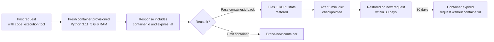

<LevelBadge level="intermediate" />

<Callout type="objectives" items={[
  "Die Sandbox mit einem einzigen Tool-Block einschalten und wissen, was Claude damit macht — Bash-Befehle, Dateibearbeitungen und (mit den neueren Versionen) eine persistente Python-REPL",
  "Die richtige Tool-Version wählen — code_execution_20250825 vs. 20260120 vs. 20260521 — und genau verstehen, was jede freischaltet",
  "Dateien hinein- und herausbekommen — Upload mit container_upload, erzeugte Dateien über das OUTPUT_DIR-Muster erfassen",
  "Einen Container über mehrere Requests wiederverwenden, um den Zustand bis zu 30 Tage am Leben zu halten, und wissen, wann ein frischer Container sicherer ist",
  "Die Preise richtig lesen — 1.550 kostenlose Stunden pro Monat, danach 0,05 $ pro Container-Stunde — und die eine Kombination kennen, die es komplett kostenlos macht",
  "Die Multi-Umgebungs-Verwirrung vermeiden, wenn du Code Execution neben deinem eigenen Bash-Tool bereitstellst"
]} />

<VerifyNote lastVerified="2026-08-25" source="https://platform.claude.com/docs/en/agents-and-tools/tool-use/code-execution-tool">
Tool-Versionsstrings, Modellkompatibilität, Ressourcenlimits und Preisstufen ändern sich — prüfe Feldnamen und Freistunden-Obergrenzen anhand der offiziellen Referenz, bevor du deine Architektur auf eine bestimmte Zahl auslegst.
</VerifyNote>

Das **Code Execution Tool** ist Anthropics serverseitige Sandbox: Füge deinem `tools`-Array einen JSON-Block hinzu, und Claude bekommt eine Bash-Shell, einen Dateieditor und einen Python-3.11-Interpreter, alles in einem Linux-Container, den die API für dich bereitstellt. Du führst nie selbst Befehle aus oder sendest `tool_result`-Blöcke zurück — die API führt jeden Aufruf aus und streamt die Ausgabe in derselben Antwort zurück.

Das ist das Primitiv unter vielem, was Anthropic als Nächstes ausliefert: [Programmatic Tool Calling](/docs/api/programmatic-tool-calling) führt Python in genau diesem Container aus; die neuen Tools [Web Search](https://platform.claude.com/docs/en/agents-and-tools/tool-use/web-search-tool) und [Web Fetch](https://platform.claude.com/docs/en/agents-and-tools/tool-use/web-fetch-tool) nutzen es unsichtbar für die dynamische Ergebnisfilterung. Die Sandbox zu verstehen zahlt sich über die gesamte Plattform hinweg aus.

## Wann du dazu greifen solltest

<Callout type="info" items={[
  "Nicht-triviale Mathematik — große Zahlen, viele Schritte, präzisionsempfindliche Ergebnisse, die Claude ohne Ausführung raten würde",
  "Datenanalyse auf Dateien, die du hochlädst — CSV, Excel, JSON, XML, Bilder, PDFs",
  "Erzeugen von Visualisierungen, PDFs oder Tabellen, die ein Mensch anschließend herunterlädt",
  "Mehrstufige Skripte, die Zwischenzustände speichern und iterieren müssen — eine persistente Python-REPL über mehrere Requests",
  "Jede Arbeitslast, die sonst ein riesiges Tool-Ergebnis zum Modell zurückschicken würde — die Sandbox filtert es lokal"
]} />

Claude führt *keinen* Code aus für einfache Arithmetik, allgemein bekannte Fakten, faktische/konversationelle Anfragen oder einfache Einheitenumrechnungen. Ist die Anfrage ein Grenzfall, bitte explizit darum: **"run code to verify this"**.

## Drei Tool-Versionen — was jede hinzufügt

Derzeit gibt es drei aktuelle Versionen des Tools. Alle drei liefern dieselben Blockformen zurück, und keine benötigt einen `anthropic-beta`-Header.

| Version                     | Was sie hinzufügt                                                                                                                                                                                                                                              |
| --------------------------- | ------------------------------------------------------------------------------------------------------------------------------------------------------------------------------------------------------------------------------------------------------------ |
| `code_execution_20250825`   | Bash-Befehle und Dateioperationen (`view`, `create`, `str_replace`). Das verwenden die meisten Beispiele.                                                                                                                                                       |
| `code_execution_20260120`   | Fügt **REPL-Zustandspersistenz** und Unterstützung für [Programmatic Tool Calling](/docs/api/programmatic-tool-calling) aus der Sandbox heraus hinzu. Der Zustand des Python-Interpreters (Variablen, Imports) überlebt Requests, die den Container wiederverwenden. |
| `code_execution_20260521`   | Gleiche Laufzeit wie `20260120`. Die Tool-Beschreibung nennt jetzt das **90-Sekunden-Wanduhr-Limit pro Python-Zelle** beim Programmatic Tool Calling, sodass Claude lang laufende Zellen einplanen kann, statt mitten in der Berechnung abgeschnitten zu werden. |

**Zwei Faustregeln:**

- Wenn du die aktuellen Web-Search- oder Web-Fetch-Tools verwendest (`web_search_20260209` / `web_fetch_20260209` oder neuer), **musst** du auf `code_execution_20260120` oder neuer sein — das ist die für deren dynamische Filterung erforderliche Code-Execution-Version.
- Claude Haiku 4.5 akzeptiert die neueren Typstrings, unterstützt aber Programmatic Tool Calling und REPL-Persistenz tatsächlich nicht; auf Haiku verhalten sich die neueren Versionen wie `code_execution_20250825`.

## Die Sandbox in einem Request zünden

<Steps items={[
  {title: "Den Tool-Block hinzufügen", body: "Füge in tools einen Eintrag hinzu, dessen type auf die gewünschte Version und dessen name auf code_execution gesetzt ist. Es gibt keine weiteren Parameter — beide Felder sind fix."},
  {title: "Eine Nachricht senden, die von Berechnung profitiert", body: "Bitte Claude, zu rechnen, eine Datei zu parsen, ein Diagramm zu erzeugen oder einen Shell-Befehl auszuführen. Claude entscheidet, ob die Anfrage eine Ausführung rechtfertigt."},
  {title: "Die verschachtelte Antwort lesen", body: "Die Antwort mischt server_tool_use-Blöcke (der Befehl, den Claude ausgeführt hat) mit passenden tool_result-Blöcken (stdout, stderr, return_code und alle erfassten Dateien), gefolgt von Claudes Textantwort."},
  {title: "Optional den Container wiederverwenden", body: "Die Antwort enthält ein container-Objekt auf oberster Ebene mit einer id. Gib diese id beim nächsten Request zurück, um Dateien und (mit den neueren Tool-Versionen) den Python-Zustand am Leben zu halten."}
]} />

<PromptCard title="Minimaler cURL-Request — Mittelwert und Standardabweichung">{`curl https://api.anthropic.com/v1/messages \\
  -H "x-api-key: $ANTHROPIC_API_KEY" \\
  -H "anthropic-version: 2023-06-01" \\
  -H "content-type: application/json" \\
  -d '{
    "model": "claude-opus-5",
    "max_tokens": 4096,
    "messages": [{
      "role": "user",
      "content": "Use the code execution tool to calculate the mean and standard deviation of [1, 2, 3, 4, 5, 6, 7, 8, 9, 10]"
    }],
    "tools": [{
      "type": "code_execution_20250825",
      "name": "code_execution"
    }]
  }'`}</PromptCard>

Die Antwort verschachtelt `server_tool_use`-Blöcke mit `bash_code_execution_tool_result`- (oder `text_editor_code_execution_tool_result`-) Blöcken, dann folgt Claudes Zusammenfassungstext.

## Sub-Tools, die du gratis bekommst

Das Hinzufügen des Code Execution Tools schaltet stillschweigend zwei Sub-Tools frei, zwischen denen Claude in jedem Zug wählen kann:

- **`bash_code_execution`** — beliebigen Shell-Befehl ausführen. Das Ergebnis enthält `stdout`, `stderr`, `return_code` und eine `content`-Liste aller Dateien, die der Befehl in `$OUTPUT_DIR` hinterlassen hat.
- **`text_editor_code_execution`** — Dateien ansehen, erstellen und bearbeiten (inklusive Quellcode). Unterstützte Befehle: `view`, `create`, `str_replace`. Diffs kommen im Unified-Diff-Format zurück (`old_start`, `new_start`, `lines`).

Der Python-Interpreter ist kein eigenes Sub-Tool — Claude schreibt Python mit dem Dateieditor und führt es mit einem Bash-Befehl aus. Mit `code_execution_20260120` oder neuer plus Programmatic Tool Calling bleibt der *Interpreter-Zustand* über Zellen hinweg erhalten, die den Container wiederverwenden.

## Dateien in den Container bekommen

Lade die Datei mit der [Files API](https://platform.claude.com/docs/en/build-with-claude/files) hoch und referenziere sie dann in der Nachricht mit einem `container_upload`-Content-Block. Die Python-Umgebung kann CSV, Excel (`.xlsx`, `.xls`), JSON, XML, Bilder (JPEG/PNG/GIF/WebP) und textbasierte Formate verarbeiten.

<PromptCard title="Eine CSV hochladen und Claude um Analyse bitten">{`# 1. Upload the file
FILE_ID=$(curl -sS https://api.anthropic.com/v1/files \\
  -H "x-api-key: $ANTHROPIC_API_KEY" \\
  -H "anthropic-version: 2023-06-01" \\
  -F "file=@data.csv" | jq -r '.id')

# 2. Reference it with a container_upload block
curl https://api.anthropic.com/v1/messages \\
  -H "x-api-key: $ANTHROPIC_API_KEY" \\
  -H "anthropic-version: 2023-06-01" \\
  -H "content-type: application/json" \\
  -d '{
    "model": "claude-opus-5",
    "max_tokens": 4096,
    "messages": [{
      "role": "user",
      "content": [
        {"type": "text", "text": "Analyze this CSV data"},
        {"type": "container_upload", "file_id": "'"$FILE_ID"'"}
      ]
    }],
    "tools": [{"type": "code_execution_20250825", "name": "code_execution"}]
  }'`}</PromptCard>

## Dateien wieder herausbekommen — das `$OUTPUT_DIR`-Muster

Das ist die Falle, die niemand dokumentiert, bis sie zuschnappt: **Nur Dateien auf der obersten Ebene von `$OUTPUT_DIR` werden erfasst und als `file_id`-Einträge zurückgegeben.** Jeder `bash_code_execution`-Aufruf bekommt ein frisches, leeres Verzeichnis, das als `$OUTPUT_DIR` verfügbar ist; alles, was Claude anderswo im Container schreibt, bleibt dort und wird nicht an deinen Client übergeben.

Wenn deine Anwendung darauf angewiesen ist, eine bestimmte Datei zu erhalten, sei im Prompt explizit und strukturiere den Befehl so, dass `ls` die Erfassung im selben Tool-Ergebnis bestätigt:

```bash
python /tmp/make_report.py && cp /tmp/report.pdf "$OUTPUT_DIR/" && ls "$OUTPUT_DIR"
```

Claude sieht die `content`-Liste der Antwort nicht — nur deinen Prompt und sein eigenes stdout —, also ist die `ls`-Zeile das, was ihm sagt, dass das Kopieren geklappt hat.

Einmal erfasst, sind Dateien über die Files API herunterladbar (`client.files.download(file_id)`). Dateien, die Code Execution über die Files API *erstellt*, bleiben bestehen, bis du sie löschst — unabhängig vom 30-Tage-Ablauf des Containers.

## Der Container-Lebenszyklus



- **Container leben 30 Tage ab Erstellung.** Der `expires_at`-Zeitstempel in jeder Antwort ist ein kürzerer, *rollierender* Wert und spiegelt das harte 30-Tage-Limit nicht wider.
- **Nach ~5 Minuten Inaktivität** wird der Container gecheckpointet. Ein Request mit seiner ID innerhalb des 30-Tage-Fensters stellt ihn wieder her.
- **Ein abgelaufener Container kann nicht wiederverwendet werden.** Requests, die ihn referenzieren, liefern einen Fehler — sende den Request erneut ohne den `container`-Parameter, um einen frischen zu bekommen.

## Laufzeit-Spezifikationen — was die Sandbox tatsächlich ist

| Eigenschaft        | Wert                                                                                                        |
| ------------------ | ----------------------------------------------------------------------------------------------------------- |
| Python-Version     | 3.11                                                                                                        |
| Betriebssystem     | Linux (x86_64 / AMD64)                                                                                      |
| Arbeitsspeicher    | 5 GiB RAM                                                                                                   |
| Festplatte         | 5 GiB Workspace                                                                                             |
| CPU                | 1                                                                                                            |
| Ausführungszeit    | Obergrenze pro gesamtem Tool-Aufruf, von der API durchgesetzt; mit Programmatic Tool Calling kommt pro REPL-Zelle ein 90-Sekunden-Wanduhr-Limit hinzu |
| Internet           | **Vollständig deaktiviert** — keine ausgehenden Netzwerkanfragen                                             |
| Sandbox-Isolation  | Vollständige Isolation vom Host und von anderen Containern                                                   |
| Workspace-Bereich  | Container sind auf den Workspace deines API-Keys beschränkt                                                  |

Vorinstallierte Bibliotheken umfassen den üblichen Data-Science-Stack (pandas, numpy, scipy, scikit-learn, statsmodels), Visualisierung (matplotlib, seaborn), Dateiverarbeitung (pyarrow, openpyxl, xlsxwriter, xlrd, pillow, python-pptx, python-docx, pypdf, pdfplumber, pypdfium2, pdf2image, pdfkit, tabula-py, reportlab, Img2pdf), Mathematik (sympy, mpmath), Hilfsmittel (tqdm, python-dateutil, pytz, joblib) sowie Kommandozeilen-Tools (`unzip`, `unrar`, `7zip`, `bc`, `rg`, `fd`, `sqlite`).

**Es gibt kein `pip install`.** Ohne Internet kann Claude zur Laufzeit keine zusätzlichen Pakete holen. Plane mit dem, was schon da ist.

## Preise — und die eine Kombination, die es kostenlos macht

<VerifyNote lastVerified="2026-08-25" source="https://platform.claude.com/docs/en/agents-and-tools/tool-use/code-execution-tool#usage-and-pricing">
Freistunden-Obergrenzen und Stundensätze können sich ändern — prüfe immer den aktuellen Preisabschnitt der offiziellen Docs, bevor du einen Budget-Alarm um diese Zahlen herum baust.
</VerifyNote>

**Code Execution ist kostenlos, wenn dein Request auch Web Search oder Web Fetch enthält** (`web_search_20260209` oder neuer, `web_fetch_20260209` oder neuer). In diesen Requests fallen für Code-Execution-Tool-Aufrufe keine zusätzlichen Gebühren über die Standard-Token-Kosten hinaus an — das deckt sowohl die dynamische Filterung, die Anthropic unsichtbar ausführt, als auch jeden Code ab, den Claude direkt schreibt.

Ohne diese Tools wird Code Execution nach Ausführungszeit abgerechnet:

- Die minimal abgerechnete Ausführungszeit beträgt **5 Minuten** pro Container.
- Jede Organisation erhält **1.550 kostenlose Stunden pro Monat**.
- Oberhalb der kostenlosen Stufe kostet die zusätzliche Nutzung **0,05 $ pro Stunde, pro Container**.
- Wenn dem Request Dateien angehängt sind, wird der Container vorgeladen — die Ausführungszeit wird abgerechnet, auch wenn Claude das Tool nie aufruft.

Verfolge die Nutzung über den Zähler `usage.server_tool_use.code_execution_requests` in der Antwort.

## Die Multi-Umgebungs-Falle

Wenn du zusätzlich dein eigenes [Bash-Tool](https://platform.claude.com/docs/en/agents-and-tools/tool-use/bash-tool) oder eine eigene REPL bereitstellst, sieht Claude jetzt *zwei* Ausführungsumgebungen: Anthropics sandboxed Container und deine lokale. Der Zustand wird zwischen ihnen nicht geteilt — Claude vergisst das gelegentlich und greift zur falschen.

Füge deinem System-Prompt explizite Hinweise hinzu, wenn beide koexistieren:

<PromptCard title="System-Prompt-Klarstellung für Multi-Umgebungs-Setups">{`When multiple code execution environments are available, be aware that:
- Variables, files, and state do NOT persist between different execution environments.
- Use the code_execution tool for general-purpose computation in Anthropic's sandboxed environment.
- Use client-provided execution tools (e.g., bash) when you need access to the user's local system, files, or data.
- If you need to pass results between environments, explicitly include outputs in subsequent tool calls rather than assuming shared state.`}</PromptCard>

Dieselbe Falle schnappt leise zu, wenn du Web Search oder Web Fetch neben deinem eigenen Shell-Tool aktivierst: Die automatisch für die dynamische Filterung bereitgestellte Code Execution zählt als *zweite* Umgebung, obwohl du sie nie zu `tools` hinzugefügt hast.

## Fehler, die du tatsächlich sehen wirst

| Tool        | Fehlercode                | Bedeutung                                                                  |
| ----------- | ------------------------- | -------------------------------------------------------------------------- |
| Alle        | `unavailable`             | Tool vorübergehend nicht verfügbar — mit Backoff erneut versuchen          |
| Alle        | `execution_time_exceeded` | Der gesamte Tool-Aufruf hat seine maximale Zeit überschritten — begrenze deine Befehle |
| Alle        | `invalid_tool_input`      | Fehlerhafte Parameter                                                      |
| Alle        | `too_many_requests`       | Rate-Limit — vor dem erneuten Versuch zurückhalten                         |
| bash        | `output_file_too_large`   | Befehlsausgabe hat die Obergrenze überschritten — aufteilen, in eine Datei umleiten |
| text_editor | `file_not_found`          | Ziel für Anzeige oder Bearbeitung existiert nicht                          |

Eine abgelaufene Container-Referenz liefert einen Fehler, keinen frischen Container — lass den `container`-Parameter weg und versuche es erneut.

Lang laufende Antworten können den Stop-Grund `pause_turn` enthalten. Sende die Antwort unverändert zurück, damit Claude fortfährt, oder ändere sie, um zu unterbrechen.

## Migration vom veralteten Nur-Python-Tool

Wenn du noch auf dem veralteten `code_execution_20250522` bist (nur Python, benötigte den Beta-Header `code-execution-2025-05-22`), ist das Upgrade ein Einzeiler-Diff:

```diff
- "type": "code_execution_20250522"
+ "type": "code_execution_20250825"
```

Die neuen Versionen fügen Bash und Dateioperationen zu dem hinzu, was das alte Tool konnte — kein Beta-Header nötig. Wenn du Antworten programmatisch parst, ändert sich der Blocktyp von `code_execution_result` zu den Formen `bash_code_execution_result` und `text_editor_code_execution_*_result`.

## Teste dich selbst

<Quiz questions={[
  {
    q: "Du stellst code_execution_20250825 und web_search_20260209 im selben Request bereit. Wie sieht die Abrechnung aus?",
    options: [
      "Zahlung pro Web-Suche + Zahlung pro Code-Execution-Container-Stunde",
      "Kostenlose Code Execution (Web Search ist vorhanden); Standard-Input/Output-Tokens werden weiterhin bezahlt",
      "Kostenlose Web Search, wenn sie mit Code Execution kombiniert wird",
      "Beide Tools kostenlos — Anthropic bündelt das Paar"
    ],
    answer: 1,
    explain: "Wenn web_search_20260209 (oder neuer) oder web_fetch_20260209 (oder neuer) in deinem Request ist, fallen für Code-Execution-Tool-Aufrufe keine zusätzlichen Gebühren über die Standard-Token-Kosten hinaus an — das deckt sowohl die dynamische Filterung als auch jeden Code ab, den Claude direkt ausführt."
  },
  {
    q: "Claude schreibt /tmp/report.pdf während eines bash_code_execution-Aufrufs. Dein Client extrahiert Datei-IDs aus der Antwort — keine PDF erscheint. Warum?",
    options: [
      "Die API erfasst nur Dateien auf der obersten Ebene von $OUTPUT_DIR — /tmp liegt im Container, wird aber nicht zurückgegeben",
      "PDFs erfordern, dass die Files API separat aktiviert wird",
      "Du musst den Container-Endpunkt nach erzeugten Dateien abfragen",
      "Bash kann keine PDFs erzeugen — nutze das Texteditor-Sub-Tool"
    ],
    answer: 0,
    explain: "Jeder bash_code_execution-Aufruf bekommt ein leeres Verzeichnis, das als $OUTPUT_DIR erreichbar ist. Nur Dateien auf der obersten Ebene dieses Verzeichnisses werden erfasst und zurückgegeben. Eine nach /tmp geschriebene Datei ist immer noch im Container — du kannst den Container wiederverwenden und Claude bitten, sie per cp nach $OUTPUT_DIR zu kopieren."
  },
  {
    q: "Du brauchst REPL-Zustand (Variablenbindungen), der zwischen Requests bestehen bleibt. Welche Tool-Version setzt du?",
    options: [
      "code_execution_20250522 (veraltet)",
      "code_execution_20250825 — die REPL ist immer persistent",
      "code_execution_20260120 oder neuer, und die container.id bei jedem folgenden Request zurückgeben",
      "Jede Version, solange du den Header anthropic-beta: code-execution-repl setzt"
    ],
    answer: 2,
    explain: "REPL-Zustandspersistenz und Programmatic Tool Calling kamen mit code_execution_20260120 und bleiben in _20260521 erhalten. Die Persistenz erfordert außerdem die Wiederverwendung des Containers, indem du container.id beim nächsten Request zurückgibst. Ein Beta-Header ist nicht nötig."
  }
]} />

## Vokabular

<Flashcards title="Code-Execution-Glossar" cards={[
  {front: "$OUTPUT_DIR", back: "Leeres Verzeichnis pro Befehl, dessen Dateien auf oberster Ebene automatisch erfasst und als file_id-Einträge im Tool-Ergebnis zurückgegeben werden. Anderswo im Container geschriebene Dateien bleiben im Container."},
  {front: "container_upload", back: "Content-Block, der eine Files-API-Datei-ID referenziert und die Datei für diesen Zug in der Sandbox verfügbar macht."},
  {front: "container.id", back: "Bezeichner auf oberster Ebene, der mit jeder Antwort zurückkommt, die Code Execution verwendet hat. Gib ihn beim nächsten Request zurück, um Dateien (und bei neueren Tool-Versionen den Python-REPL-Zustand) bis zu 30 Tage am Leben zu halten."},
  {front: "server_tool_use", back: "Blocktyp in der Antwort, der den Befehl zeigt, den Claude die API ausführen ließ — gepaart mit einem passenden bash_code_execution_tool_result- oder text_editor_code_execution_tool_result-Block."},
  {front: "pause_turn", back: "Stop-Grund, der anzeigt, dass die API einen lang laufenden Zug pausiert hat. Sende die Antwort unverändert zurück, damit Claude fortfährt, oder bearbeite sie, um zu unterbrechen."},
  {front: "Dynamische Filterung", back: "Automatische Nutzung von Code Execution hinter Web Search / Web Fetch, um Ergebnisse zu verkleinern oder umzuwandeln, bevor sie in den Kontext gelangen. Von der API bereitgestellt — du fügst das Tool dafür nicht hinzu."}
]} />

## Kernpunkte

<Callout type="takeaways" items={[
  "Ein Tool-Block, ein Name — code_execution_20250825 für die meisten Fälle, 20260120 oder 20260521, wenn du REPL-Persistenz oder Programmatic Tool Calling brauchst",
  "Container-Wiederverwendung ist der Multiplikator — gib container.id zurück, um Dateien und Zustand bis zu 30 Tage am Leben zu halten",
  "Dateien rein: container_upload mit einer Files-API-ID. Dateien raus: nur Dateien auf der obersten Ebene von $OUTPUT_DIR werden erfasst",
  "Kombiniere mit Web Search oder Web Fetch, damit Code Execution über die Token-Kosten hinaus kostenlos wird",
  "Kein Internet, kein pip install — plane mit dem vorinstallierten Bibliotheksbestand",
  "Füge deinem System-Prompt Multi-Umgebungs-Hinweise hinzu, sobald du auch dein eigenes Bash-Tool bereitstellst"
]} />

## Weiter

- [Programmatic Tool Calling](/docs/api/programmatic-tool-calling) — deine eigenen Tools aus Python heraus im selben Container aufrufen
- [Task Budgets](/docs/api/task-budgets) — den gesamten Token-Verbrauch über eine agentische Schleife hinweg deckeln, damit lang laufender Code nicht ausufert
- [Prompt Caching](/docs/api/prompt-caching) — ein stabiles Präfix wiederverwenden, um wiederholte Aufrufe günstig zu halten
- [Advisor Tool](/docs/api/advisor-tool) — einen schnellen Ausführer mit einem intelligenteren Berater kombinieren
