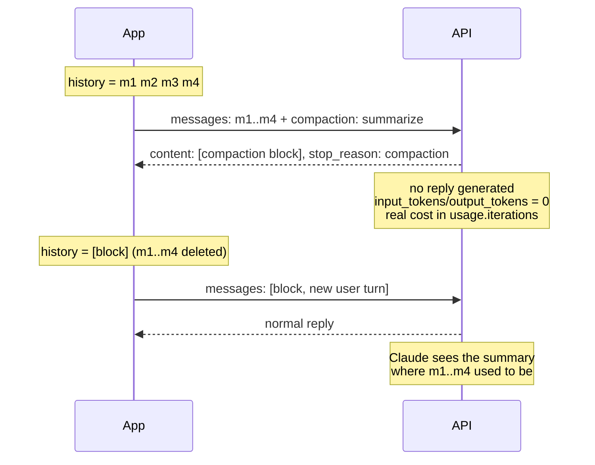

<LevelBadge level="advanced" />

<Callout type="objectives" items={[
  "Die vier Arten der Kontext-Verkleinerung unterscheiden — Context Editing, On-Demand-Compaction, Keep-Tail, Hintergrund und Schwellenwert — und die richtige wählen",
  "Eine Compaction-Anfrage absetzen und den signierten Compaction-Block lesen, der anstelle einer Antwort zurückkommt",
  "Den Austausch korrekt durchführen: Block zuerst, zusammengefasste Nachrichten entfernt, Beta-Header bei jeder späteren Anfrage",
  "Die zwei Austausch-Fehler erkennen, die HTTP 200 zurückgeben und die Konversation stillschweigend beschädigen",
  "Den Fall behandeln, in dem keine Zusammenfassung zurückkommt — fünf Stop-Reasons, jeder mit einer anderen Lösung",
  "Berechnen, was Compaction tatsächlich kostet (usage.iterations, nicht die Token-Felder auf oberster Ebene)",
  "Wissen, was eine Zusammenfassung nie mitnehmen kann: Bilder, Dokumente, Uploads, abgerufene URLs und frühere System-Anweisungen"
]} />

<VerifyNote lastVerified="2026-10-02" source="https://platform.claude.com/docs/en/build-with-claude/compaction-on-demand">
On-Demand-Compaction ist in **Public Beta** hinter dem Header `compact-2026-09-04`, gestartet am 14. September 2026. Schwellenwert-Compaction ist eine separate Beta (`compact-2026-01-12`). Beta-Header, Feldnamen, Error-Codes und Plattform-Verfügbarkeit sind aus der offiziellen Referenz zitiert und können sich ändern, solange das Feature in Beta ist — vor dem Ausliefern erneut verifizieren. Verfügbarkeit zum Zeitpunkt des Schreibens: Claude API, Claude Platform auf AWS, Google Cloud und Microsoft Foundry (alle Beta); **nicht verfügbar auf Amazon Bedrock**. Die Modell-Unterstützung ist eine Capability pro Modell, keine feste Liste — siehe [Support zur Laufzeit prüfen](#support-zur-laufzeit-prüfen) und [Modelle & Preise](/docs/whats-new/models-and-pricing).
</VerifyNote>

Jeder lang laufende Agent stößt irgendwann an dieselbe Wand: die Konversation wächst, bis die nächste Anfrage nicht mehr hineinpasst. Du hast zwei ehrliche Optionen — alten Kontext wegwerfen oder ihn *komprimieren*. Compaction ist die Komprimierungs-Option, erledigt vom Modell, serverseitig: du sendest die Konversation mit einem zusätzlichen Parameter, und anstelle einer Antwort erhältst du einen **signierten Summary-Block**, den du anstelle der Nachrichten zurückschickst, die er ersetzt.

Die Signatur ist der interessante Teil. Der Block ist kein String, den du selbst geschrieben und eingefügt hast — er ist Content, den die API erzeugt hat und den sie verifiziert. Ändere ein einziges Zeichen des Summary-Textes, und die nächste Anfrage scheitert mit `compaction_signature_invalid`.

## Welches Verkleinerungs-Werkzeug ist welches

Vier Features überlappen sich hier, und Teams verwechseln sie ständig. Sie erledigen unterschiedliche Jobs:

| Feature | Wer entscheidet | Was es tut | Wo der Block landet |
| --- | --- | --- | --- |
| **Context Editing** (`clear_tool_uses_20250919`) | Du, deklarativ | **Löscht** alte Tool-Ergebnisse ersatzlos — keine Zusammenfassung | Kein Block; siehe [Memory & Context Editing](/docs/api/memory-and-context-editing) |
| **On-Demand-Compaction** (`compaction`) | Du, pro Anfrage | Fasst die Nachrichten zusammen, die du sendest, in einem separaten Aufruf, der keine Antwort zurückgibt | Du setzt den Block **an den Anfang** und löschst, was er ersetzt hat |
| **Keep-Tail-Compaction** | Du, durch die Wahl eines Schnittpunkts | Wie on demand, aber die letzten Turns bleiben wortwörtlich erhalten | Block zuerst, danach die behaltenen Turns |
| **Hintergrund-Compaction** | Du, asynchron | Wie on demand, aber die Konversation läuft weiter, während die Zusammenfassung geschrieben wird | Der Block ersetzt genau die Nachrichten, die du gesendet hast; späteren Turns bleiben |
| **Schwellenwert-Compaction** (`compact_20260112`) | Die API, bei einem Token-Trigger | Fasst älteren Kontext *mitten in einer gewöhnlichen Anfrage* zusammen | Der Block **folgt** den zusammengefassten Nachrichten, und die API entfernt sie für dich |

Zwei Regeln, die man sich merken sollte, bevor man überhaupt Code schreibt:

- **Context Editing löscht, Compaction fasst zusammen.** Für sehr lange Läufe kannst du beides schichten — aber nicht in derselben Anfrage wie `compaction` (siehe [Grenzen](#grenzen-und-wechselwirkungen)).
- **On-Demand- und Schwellenwert-Compaction geben ihre Blöcke in entgegengesetzte Richtungen zurück.** On demand: der Block kommt zuerst, du entfernst die alten Nachrichten. Schwellenwert: der Block kommt zuletzt, die API entfernt sie. Das zu verdrehen ist der mit Abstand häufigste Fehler.

## So funktioniert der Austausch



Die Compaction-Anfrage liegt **außerhalb des Pfads der Konversation**: sie trägt deinen Verlauf, gibt eine Zusammenfassung zurück und erzeugt keinen Assistant-Turn. Deine nächste echte Anfrage ist die, die die Konversation fortsetzt.

## Support zur Laufzeit prüfen

Die Modell-Unterstützung für Compaction ist ein Capability-Flag und nichts, was man hart verdrahten sollte. Rufe die Models API mit dem Beta-Header auf und lies `capabilities.compaction` für jedes Modell. Das übersteht Modell-Launches und Deprecations auf eine Weise, wie es eine kopierte Liste nie tut.

## Setze deine erste Compaction-Anfrage ab

<Steps items={[
  {title: "Den Beta-Header hinzufügen", body: "Sende anthropic-beta: compact-2026-09-04 bei der Compaction-Anfrage UND bei jeder späteren Anfrage, die den zurückgegebenen Block mitführt. Vergisst du ihn bei einer späteren Anfrage, erhältst du einen verwirrenden Validierungsfehler, der besagt, compaction sei kein erwarteter Content-Block-Typ — der Header wird in der Meldung nie erwähnt."},
  {title: "Die Konversation im aktuellen Stand senden, plus den compaction-Parameter", body: "Auf oberster Ebene: compaction mit type 'summarize'. Die API fasst jede Nachricht der Anfrage genau einmal zusammen und gibt ausschließlich den Block zurück."},
  {title: "Denselben System-Prompt und dieselben Tools senden wie im Rest der Konversation", body: "Der Summarizer liest sie. Er führt nie ein Tool aus. Bei Modellen mit erhaltenem Thinking bleibt das Thinking in allen Turns, die du nach dem Block behältst, nur dann gültig, wenn System-Prompt und Tools übereinstimmen."},
  {title: "max_tokens echten Spielraum geben", body: "max_tokens begrenzt den gesamten Summarization-Aufruf, einschließlich des Thinkings, das das Modell vor dem Schreiben der Zusammenfassung betreibt. Mehrere Tausend Token sind die richtige Größenordnung — 4096 in Anthropics eigenen Beispielen."},
  {title: "Compacten, BEVOR du aus dem Context Window herauswächst", body: "Die Compaction-Anfrage selbst muss in das Context Window des Modells passen. Eine Konversation, die schon zu groß zum Senden ist, ist auch zu groß zum Compacten."},
  {title: "stop_reason prüfen, bevor du nach dem Block suchst", body: "Eine erfolgreiche Compaction endet mit stop_reason 'compaction'. Jeder andere Stop-Reason bedeutet, dass keine Zusammenfassung erzeugt wurde — und die Antwort ist trotzdem ein 200 mit leerem content."}
]} />

<PromptCard title="curl — eine Zusammenfassung der bisherigen Konversation anfordern">{`curl https://api.anthropic.com/v1/messages \\
  -H "x-api-key: $ANTHROPIC_API_KEY" \\
  -H "anthropic-version: 2023-06-01" \\
  -H "anthropic-beta: compact-2026-09-04" \\
  -H "content-type: application/json" \\
  -d '{
    "model": "claude-opus-5-5",
    "max_tokens": 4096,
    "messages": [
      {"role": "user", "content": "I am building a recipe app. Name the main entities."},
      {"role": "assistant", "content": "Recipe, Ingredient, Step, and a RecipeIngredient entry holding quantity and unit."},
      {"role": "user", "content": "Good. Now suggest field names for Recipe."}
    ],
    "compaction": {"type": "summarize"}
  }'`}</PromptCard>

Zurück kommt ein einzelner Content-Block und ein unverwechselbarer Stop-Reason:

```json
{
  "content": [
    {
      "type": "compaction",
      "content": "Summary of the conversation: the user is designing the data model for a recipe app...",
      "signature": "EuYBCkQY..."
    }
  ],
  "stop_reason": "compaction",
  "usage": {
    "input_tokens": 0,
    "output_tokens": 0,
    "iterations": [{"type": "compaction", "input_tokens": 144, "output_tokens": 276}]
  }
}
```

Beachte die Nullen. Die Token-Felder auf oberster Ebene sind null, *weil keine Antwort erzeugt wurde* — die echten Kosten stecken in `usage.iterations`. Wenn dein Kosten-Dashboard nur die Felder auf oberster Ebene summiert, sieht Compaction kostenlos aus, und deine Rechnung wird widersprechen.

Streaming funktioniert, aber es gibt nichts zu streamen: du erhältst ein `content_block_start` mit dem vollständigen Block, dann `content_block_stop`, ohne Delta-Events dazwischen (`ping`-Events können drumherum eintreffen).

## Von der Zusammenfassung aus weitermachen

Ersetze die Nachrichten, die du gesendet hast, durch die zurückgegebene Assistant-Nachricht und behalte den Block **Byte für Byte** so, wie die API ihn geliefert hat — `content`, `signature` und nichts zusätzlich.

<PromptCard title="Die nächste Anfrage — Block zuerst, alte Nachrichten weg">{`{
  "model": "claude-opus-5-5",
  "max_tokens": 2048,
  "messages": [
    {
      "role": "assistant",
      "content": [
        {
          "type": "compaction",
          "content": "Summary of the conversation: the user is designing the data model...",
          "signature": "EuYBCkQY..."
        }
      ]
    },
    {"role": "user", "content": "Now do the same for Ingredient."}
  ]
}`}</PromptCard>

Drei Regeln bestimmen den Austausch:

1. **Der Block steht in `messages` an erster Stelle** — entweder als eigene `assistant`-Nachricht oder als erster Content-Block der ersten Nachricht (`user` oder `assistant`, beides ist in Ordnung).
2. **Die zusammengefassten Nachrichten werden entfernt.** Bleibt eine davon *vor* dem Block stehen, erhältst du einen 400 mit `compaction_block_misplaced`.
3. **Genau ein `compaction`-Block pro Anfrage**, bei jeder späteren Anfrage, mit dem Beta-Header.

Zwei `assistant`-Nachrichten in Folge sind hier erlaubt — traf eine Antwort ein, während die Zusammenfassung geschrieben wurde, folgt sie einfach auf den Block.

### Die zwei Fehler, die keinen Error auslösen

<Callout type="warning" items={[
  "Zusammengefasste Nachrichten, die NACH dem Block stehen bleiben: kein Fehler. Die API schickt sie bereitwillig erneut an Claude, du bezahlst also für die Zusammenfassung UND für den Verlauf, den sie ersetzen sollte.",
  "Block in einer späteren Anfrage weggelassen: kein Fehler. Claude bekommt einfach keine Zusammenfassung, und die Konversation verliert stillschweigend alles vor dem Austausch.",
  "Beide Fehlschläge geben HTTP 200 zurück. Nichts in der Antwort sagt dir, dass du es falsch gemacht hast — prüfe in Tests die Form deines Verlaufs, nicht die Status-Codes."
]} />

### Erneut compacten

Um eine Konversation zu compacten, die schon mit einem Block beginnt, sende erneut `compaction`. Der neue Block fasst die alte Zusammenfassung *und* alles danach zusammen. Von da an sendest du nur noch den neuesten Block.

## Compaction in einer Schleife

Die Entscheidung über das *Wann* liegt bei dir. Die billige Schätzung für „wie groß wird meine nächste Anfrage“ ist `input_tokens + output_tokens` aus der letzten Antwort — die nächste Anfrage sendet diese Antwort wieder mit, sie zählt also. Mit aktivem [Prompt Caching](/docs/api/prompt-caching) deckt `input_tokens` nur die Token nach dem letzten Cache-Breakpoint ab, addiere also auch `cache_read_input_tokens` und `cache_creation_input_tokens`. Oder sende dieselben Nachrichten an den Token-Counting-Endpoint.

<PromptCard title="Python — compacten, wenn die nächste Anfrage zu groß würde">{`from anthropic.types.beta import BetaMessageParam

client = anthropic.Anthropic()
COMPACT_AT_TOKENS = 120_000   # set this near your real input budget
SYSTEM = "You help design a recipe app's data model. Keep answers short."
QUESTIONS = [...]             # your stream of user turns

history: list[BetaMessageParam] = []
for turn, question in enumerate(QUESTIONS, start=1):
    history.append({"role": "user", "content": question})
    response = client.beta.messages.create(
        model="claude-opus-5-5",
        max_tokens=8192,
        system=SYSTEM,
        betas=["compact-2026-09-04"],
        messages=history,
    )
    history.append({"role": "assistant", "content": response.content})

    # The next request resends this reply too, so count it.
    conversation_tokens = response.usage.input_tokens + response.usage.output_tokens
    if conversation_tokens > COMPACT_AT_TOKENS and turn < len(QUESTIONS):
        summary = client.beta.messages.create(
            model="claude-opus-5-5",
            max_tokens=4096,
            system=SYSTEM,                      # same system prompt and tools
            betas=["compact-2026-09-04"],
            messages=history,
            compaction={"type": "summarize"},
        )
        if summary.stop_reason == "compaction":  # check BEFORE reading content
            history = [{"role": "assistant", "content": summary.content}]`}</PromptCard>

Beachte die Form des Austauschs: der Verlauf wird **ersetzt**, nicht erweitert. Und die `stop_reason`-Prüfung kommt zuerst — kommt keine Zusammenfassung zurück, behält diese Schleife ihren vollständigen Verlauf und versucht es nach dem nächsten Turn erneut, was genau der richtige Fallback ist.

In Python verwendest du `client.beta.messages`. Wenn du `client.messages` aufrufst und Blöcke selbst serialisierst, nutze `to_dict()` oder `model_dump(exclude_none=True)` — ein einfaches `model_dump()` fügt dem Block `citations: null` und `text: null` hinzu, und die API weist Felder zurück, die sie nicht selbst zurückgegeben hat.

Der Tool-Runner des SDK kann das für dich übernehmen: rufe `compact_before_next_turn()` auf (`compactBeforeNextTurn()` in TypeScript, Java und PHP; `CompactBeforeNextTurn()` in C# und Go), und er setzt die Compaction-Anfrage ab, sobald der aktuelle Turn und seine Tool-Calls abgeschlossen sind. Erzeuge den Runner mit der Beta `compact-2026-09-04` — der Runner fügt sie nicht selbst hinzu.

## Die letzten Turns wortwörtlich behalten

Dafür gibt es **keinen Parameter**, was viele überrascht. Keep-Tail-Compaction ist eine Entscheidung darüber, was du in die Anfrage packst: du wählst einen Schnittpunkt, sendest nur die älteren Nachrichten zur Zusammenfassung und setzt den zurückgegebenen Block vor die Turns, die du behalten hast.

<Steps items={[
  {title: "Den Schnitt wählen", body: "Nachrichten davor gehen in die Compaction-Anfrage; Nachrichten von ihm an bleiben in voller Länge erhalten. Je mehr du behältst, desto weniger Platz gewinnst du."},
  {title: "Nie einen Tool-Call von seinem Ergebnis trennen", body: "Jeder Tool-Call und sein Ergebnis müssen auf derselben Seite landen. Enden die Nachrichten, die du sendest, in einem Assistant-Turn, dessen Tool-Call noch kein Ergebnis hat, weist die API die Compaction-Anfrage zurück."},
  {title: "Zwischen einer Antwort und der nächsten User-Nachricht schneiden", body: "Diese Grenze erfüllt auch die Bedingung, die erhaltenes Thinking in den behaltenen Turns gültig hält. Ein Schnitt am Ende einer Anfrage, die du schon abgesetzt hast, funktioniert ebenfalls: compacte genau die Nachrichten dieser Anfrage und behalte alles seither."},
  {title: "Den Verlauf als Block + behaltene Turns neu aufbauen", body: "Alles aus den Austauschregeln oben gilt weiterhin — Block zuerst, zusammengefasste Nachrichten weg, Beta-Header bei jeder Anfrage."}
]} />

## Im Hintergrund compacten

Hintergrund-Compaction (oder asynchrone Compaction) ändert zwei Dinge in der Schleife: die Compaction-Anfrage läuft, während die Konversation auf ihrem **vollständigen** Verlauf weiterläuft, und der Austausch wartet, bis der Block eintrifft.

<Steps items={[
  {title: "Festhalten, wie viele Nachrichten du gesendet hast", body: "Setze die Compaction-Anfrage auf einer Kopie des Verlaufs ab und merke dir die Anzahl — genau das wird der Block ersetzen."},
  {title: "Auf dem vollständigen Verlauf weitersprechen", body: "Hänge neue Turns an, ändere nichts, was schon im Verlauf steht, und starte keine zweite Compaction-Anfrage, solange eine aussteht."},
  {title: "Bei Eintreffen von vorne ersetzen", body: "Kommt die Antwort mit stop_reason 'compaction' zurück, entferne genau diese N Nachrichten vom Anfang und setze die zurückgegebene Nachricht an ihre Stelle. Alles, was seither angehängt wurde, bleibt danach stehen."},
  {title: "Den getauschten Verlauf bei der nächsten Anfrage senden", body: "Das hält Thinking gültig, das erzeugt wurde, während die Zusammenfassung geschrieben wurde."},
  {title: "Die ausstehende Anfrage abarbeiten, bevor du aufhörst", body: "Ist eine Compaction-Anfrage noch unterwegs, wenn deine Schleife endet, warte auf sie und führe den Austausch durch — sonst ist eine Zusammenfassung verloren, für die du schon bezahlt hast."}
]} />

Während diese Anfrage läuft, hast du zwei Anfragen gleichzeitig offen, und die Compaction-Anfrage zählt wie jede andere gegen deine Rate Limits. Starte sie also, solange das Context Window noch Platz für die Turns hat, die in der Zwischenzeit eintreffen.

## Schwellenwert-Compaction: die API entscheiden lassen

Schwellenwert-Compaction ist die automatische Variante. Du konfigurierst sie einmal als `context_management`-Edit auf deinen gewöhnlichen Anfragen, und die API fasst älteren Kontext mitten in einer Anfrage zusammen, sobald die Input-Token deinen Trigger überschreiten.

| Feld | Bedeutung |
| --- | --- |
| `type` | `"compact_20260112"` |
| `trigger` | `{"type": "input_tokens", "value": N}` — `input_tokens` ist der einzige Trigger-Typ; `value` muss mindestens 50.000 betragen (Standard 150.000) |
| `pause_after_compaction` | standardmäßig `false` — setze es, um nach dem Erzeugen der Zusammenfassung zu pausieren, statt die Antwort fortzusetzen |
| `instructions` | Optionaler eigener Summarization-Prompt; ist er vorhanden, ersetzt er den Standard-Prompt vollständig |

Das Zurückgeben des Blocks ist der einfache Teil und das Gegenteil von on demand: hänge den gesamten Response-Content an, Block inklusive, und die API entfernt bei späteren Anfragen die Blöcke *davor*. Der Beta-Header ist `compact-2026-01-12`.

Wähle Schwellenwert-Compaction, wenn du ein Verhalten nach dem Motto „nie wieder darüber nachdenken“ willst. Wähle on demand, wenn Compaction an einer *semantischen* Grenze passieren soll — Ende einer Teilaufgabe, nachdem ein Plan abgestimmt ist, bevor eine neue Datei geöffnet wird — und nicht bei einem Token-Stand. Und wähle eine pro Anfrage: `compaction` und `context_management` können nicht zusammen gesendet werden, Schwellenwert-Compaction kann nicht auf einer Anfrage laufen, die einen signierten On-Demand-Block mitführt, und der Tool-Runner weigert sich zu compacten, solange sein `context_management` ein Compaction-Edit enthält.

## Einen eigenen Summarization-Prompt schreiben

Ohne `instructions` verwendet die API ihren eigenen Summarization-Prompt. Ein nicht leerer `instructions`-String (bis zu 16.384 Zeichen) **ersetzt diesen Prompt vollständig** — er wird nicht daran angehängt.

<PromptCard title="instructions — sagen, was überleben muss, und Tool-Calls verbieten">{`{
  "compaction": {
    "type": "summarize",
    "instructions": "Summarize this design conversation. Preserve every entity and field name agreed so far, every decision marked FINAL, and the user's latest open request. Do not call tools; respond with the summary text only."
  }
}`}</PromptCard>

Zwei Dinge verdienen ihren Platz in jeder eigenen `instructions`: eine explizite Liste dessen, was erhalten bleiben muss, und „keine Tools aufrufen“. Ein Summarizer, der ein Tool aufruft, produziert überhaupt keine Zusammenfassung (siehe nächster Abschnitt).

## Wenn keine Zusammenfassung zurückkommt

Eine Zusammenfassung entsteht nur, wenn der Summarization-Aufruf normal endet, mit Text und ohne Tool-Call. Andernfalls erhältst du einen **200 mit leerem `content`** — und genau deshalb ist `stop_reason` das, worauf du verzweigen musst. Der Aufruf wird in jedem Fall berechnet und in `usage.iterations` ausgewiesen (Nullverbrauch, wenn kein Aufruf möglich war). In jedem Fall kannst du ohne Zusammenfassung weitermachen und später compacten.

| `stop_reason` | Ursache | Behebung |
| --- | --- | --- |
| `"max_tokens"` | Die Zusammenfassung wurde abgeschnitten | Mit größerem `max_tokens` erneut senden |
| `"model_context_window_exceeded"` | Kein Platz für den Summarization-Prompt | Mit kürzeren `instructions` oder weniger Nachrichten erneut senden |
| `"tool_use"` | Das Modell hat ein Tool aufgerufen, statt zusammenzufassen | Mit `instructions` erneut senden, die Tool-Calls verbieten |
| `"refusal"` | Die Anfrage wurde abgelehnt — `stop_details` nennt die Policy-Kategorie | Ohne Zusammenfassung weitermachen |
| `"end_turn"` | Der Aufruf gab keinen Text zurück | Ohne Zusammenfassung weitermachen |

## Fehler

Die meisten 400er tragen eine Meldung, die sagt, was zu entfernen oder erneut zu senden ist; einige tragen zusätzlich einen `error.details.error_code`, der mit `compaction_` beginnt.

| Fehler | Ursache | Behebung |
| --- | --- | --- |
| 529 `overloaded_error` + `compaction_unavailable` | Vorübergehendes Serverproblem beim Erzeugen oder Lesen eines Blocks | Wiederholen |
| 400 `compaction_block_misplaced` | Zusammengefasste Nachrichten stehen noch vor dem Block | Sie entfernen, damit der Block zuerst kommt |
| 400 `compaction_signature_invalid` / `compaction_content_mismatch` | `signature` oder `content` des Blocks wurden nach der Rückgabe verändert | Den Block exakt so senden, wie er zurückgegeben wurde |
| 400 `compaction_nothing_to_summarize` | `messages` enthält keinen `user`- oder `assistant`-Content | Mindestens eine Nachricht senden |
| 400 (nur Meldung) | Mehr als ein `compaction`-Block in der Anfrage | Genau einen senden — den neuesten |
| 400 (nur Meldung) | Der letzte `assistant`-Turn endet mit einem Tool-Call ohne Ergebnis | Die Tool-Ergebnisse dieses Turns senden, dann compacten |
| 400 (nur Meldung) | `stop_sequences`, `output_config.format` für strukturierte Ausgabe oder ein `tool_choice` vom Typ `any`/`tool` in einer Compaction-Anfrage gesendet | Entfernen — bei einem Summarization-Aufruf hätten sie keine Wirkung |
| 400 Validierungsfehler, der ein zusätzliches Feld nennt, z. B. `compaction.citations: Extra inputs are not permitted` | Der Block wurde mit Feldern neu serialisiert, die die API nie zurückgegeben hat | Mit `to_dict()` / `model_dump(exclude_none=True)` serialisieren |
| 400 „`compaction` requires `anthropic-beta: compact-2026-09-04`“ | Beta-Header fehlt in der Compaction-Anfrage | Den Header hinzufügen |
| 400 Validierungsfehler, der besagt, `compaction` sei kein erwarteter Content-Block-Typ | Beta-Header fehlt in einer *späteren* Anfrage, die den Block mitführt — die Meldung erwähnt den Header nicht | Den Header bei jeder Anfrage hinzufügen, die den Block mitführt |

## Grenzen und Wechselwirkungen

- **Ein Verkleinerungs-Mechanismus pro Anfrage.** `compaction` und `context_management` lassen sich nicht kombinieren.
- **Task Budgets.** Sende `output_config.task_budget.remaining` nicht mit `compaction` und nicht auf Anfragen, die den Block mitführen — das ergibt einen 400. Siehe [Task Budgets](/docs/api/task-budgets).
- **Prompt Caching.** `cache_control` auf dem Block setzt einen Breakpoint direkt nach der Zusammenfassung — meist genau dort, wo du einen haben willst, denn die Zusammenfassung ist jetzt ein stabiles Präfix. Den Block bei späteren Anfragen zurückzusenden verursacht keine zusätzlichen Compaction-Kosten.
- **Token Counting** ignoriert den `compaction`-Parameter vollständig.
- **Frühere System-Nachrichten lösen sich auf.** Eine `role: "system"`-Nachricht mitten in der Konversation, die im zusammengefassten Bereich liegt, wird wie alles andere zusammengefasst, ihre Anweisungen gelten also nicht mehr, sobald der Block sie ersetzt. Ist eine Anweisung weiterhin wichtig, formuliere sie in einer neuen `role: "system"`-Nachricht direkt nach deinem nächsten neuen `user`-Turn erneut und behalte sie von da an im Verlauf.
- **Manche Inhalte können eine Zusammenfassung überhaupt nicht überleben.** Bilder, Dokumente, `container_upload`-Blöcke und abgerufene URLs innerhalb der zusammengefassten Nachrichten sind **weg** — die Zusammenfassung ist Text. Formuliere oder lade alles neu, was ein späterer Turn noch braucht.

<Callout type="tip" items={["Behandle die Compaction-Grenze als Checkpoint, über den du nachdenken kannst: logge den Summary-Text des Blocks zusammen mit der Anzahl der Nachrichten, die er ersetzt hat. Verhält sich ein Agent später so, als hätte er etwas vergessen, sagt dir dieses Log mit einem Blick, ob die Information wegzusammengefasst wurde oder nie erfasst war.","Compaction ist ein Werkzeug für das Context Window, kein Kostenwerkzeug. Es reduziert die Token, die du bei jedem späteren Turn erneut sendest, aber der Summarization-Aufruf selbst wird berechnet — bei einer kurzen Konversation gibst du leicht mehr aus, als du sparst.","Wenn du zusätzlich clientseitig kürzt, entscheide, welche Schicht welchen Inhalt besitzt: Context Editing für veraltete Tool-Ergebnisse, Compaction für den Erzählfaden. Zwei Mechanismen, die sich um dieselben Nachrichten streiten, sind der Weg zu Zusammenfassungen, die Dinge beschreiben, die das Modell nicht mehr sehen kann."]} />

## Häufige Fehler

- **`content[0]` lesen, bevor `stop_reason` geprüft wurde.** Fünf verschiedene Stop-Reasons geben mit einem 200 ein leeres `content` zurück. Das ist die Fehlerquelle Nummer eins für `IndexError` in Compaction-Code.
- **Die Token-Felder auf oberster Ebene summieren.** Sie sind bei einer Compaction-Antwort null. Die Kosten stehen in `usage.iterations`.
- **Den Block neu serialisieren.** Jedes Feld, das du hinzufügst und das die API nicht zurückgegeben hat (`citations: null` ist der Klassiker), wird abgewiesen.
- **Zu spät compacten.** Die Compaction-Anfrage muss selbst in das Context Window passen. „Compacten, wenn die Anfrage fehlschlägt“ ist keine Strategie.
- **Einen Tail behalten, der einen Tool-Call von seinem Ergebnis trennt.** Wird direkt abgewiesen — wähle Schnitte an den Grenzen von User-Nachrichten.
- **Annehmen, dass Bilder überleben.** Tun sie nicht. Uploads und abgerufene Seiten auch nicht.

## Selbsttest

<Quiz questions={[
  {
    q: "Deine Compaction-Anfrage gibt HTTP 200 zurück, aber response.content ist eine leere Liste. Was ist passiert?",
    options: [
      "Die Konversation war zu kurz zum Zusammenfassen — nichts zu tun",
      "Es wurde keine Zusammenfassung erzeugt; stop_reason sagt dir, welche von fünf Ursachen es war, und du kannst ohne sie weitermachen",
      "Der Beta-Header fehlte",
      "Die Signatur ist bei der Verifizierung durchgefallen"
    ],
    answer: 1,
    explain: "Eine Zusammenfassung entsteht nur, wenn der Summarization-Aufruf normal mit Text und ohne Tool-Call endet. Andernfalls ist die Antwort trotzdem ein 200 mit leerem content, und stop_reason ist max_tokens, model_context_window_exceeded, tool_use, refusal oder end_turn. Verzweige immer auf stop_reason, bevor du content liest."
  },
  {
    q: "Wohin gehört der Block nach einer On-Demand-Compaction in messages — und was passiert mit den Nachrichten, die er zusammengefasst hat?",
    options: [
      "Nach hinten, und die API entfernt die zusammengefassten Nachrichten für dich",
      "Nach vorne, und du musst die zusammengefassten Nachrichten selbst entfernen",
      "Irgendwohin, solange es genau einen Block gibt",
      "Nach vorne, und die zusammengefassten Nachrichten solltest du zur Nachvollziehbarkeit behalten"
    ],
    answer: 1,
    explain: "On-Demand-Compaction: der Block kommt zuerst, und du löschst, was er ersetzt hat — zusammengefasste Nachrichten vor ihm stehen zu lassen ergibt einen 400 compaction_block_misplaced, und sie dahinter stehen zu lassen schickt sie stillschweigend erneut an Claude. Die Schwellenwert-Compaction ist die, die umgekehrt funktioniert: ihr Block folgt den zusammengefassten Nachrichten, und die API entfernt sie für dich."
  },
  {
    q: "Eine Konversation enthielt einen Screenshot, auf den sich der Agent immer wieder bezieht. Du compactest. Was muss dein Code tun?",
    options: [
      "Nichts — die Zusammenfassung beschreibt das Bild gut genug",
      "Nichts — Image-Blöcke bleiben über eine Compaction hinweg erhalten",
      "Das Bild erneut hochladen oder neu beschreiben, denn Bilder, Dokumente, container_upload-Blöcke und abgerufene URLs überleben eine Zusammenfassung nicht",
      "instructions so setzen, dass Bildinhalte erhalten bleiben"
    ],
    answer: 2,
    explain: "Der Compaction-Block ist Text plus eine Signatur. Bilder, Dokumente, container_upload-Blöcke und abgerufene URLs innerhalb der zusammengefassten Nachrichten sind weg, sobald der Block sie ersetzt — formuliere oder lade alles neu, was ein späterer Turn noch braucht. Kein instructions-String ändert daran etwas."
  }
]} />

## Begriffe

<Flashcards title="Compaction-Glossar" cards={[
  {front: "compaction block", back: "Der Content-Block, den die API anstelle einer Antwort zurückgibt. Zwei Felder zählen: content (der lesbare Summary-Text) und signature (wird bei jeder späteren Anfrage verifiziert). Sende ihn Byte für Byte zurück."},
  {front: "stop_reason: compaction", back: "Der einzige Stop-Reason, der bedeutet, dass eine Zusammenfassung erzeugt wurde. Prüfe ihn, bevor du content liest — fünf andere Stop-Reasons geben einen 200 mit leerem content zurück."},
  {front: "compact-2026-09-04", back: "Beta-Header für On-Demand-Compaction. Erforderlich bei der Compaction-Anfrage UND bei jeder späteren Anfrage, die den Block mitführt."},
  {front: "compact_20260112", back: "Der context_management-Edit-Typ für die SCHWELLENWERT-Compaction (Header compact-2026-01-12). Triggert auf input_tokens, Minimum 50.000, Standard 150.000."},
  {front: "usage.iterations", back: "Dort werden die echten Kosten eines Compaction-Aufrufs ausgewiesen, als Eintrag vom Typ 'compaction'. Die input_tokens und output_tokens auf oberster Ebene sind null, weil keine Antwort erzeugt wurde."},
  {front: "compaction_block_misplaced", back: "400-Fehler: zusammengefasste Nachrichten stehen noch vor dem Block. Der Block muss in messages zuerst kommen."},
  {front: "Keep-Tail-Compaction", back: "Kein Parameter — du wählst einen Schnittpunkt, sendest nur die älteren Nachrichten zur Zusammenfassung und setzt den Block vor die Turns, die du behalten hast. Trenne nie einen Tool-Call von seinem Ergebnis."},
  {front: "Hintergrund-Compaction", back: "Setze die Compaction-Anfrage auf einem Snapshot ab, während die Konversation auf ihrem vollständigen Verlauf weiterläuft, und ersetze dann genau die Nachrichten, die du gesendet hast, wobei alles seither Angehängte erhalten bleibt."}
]} />

## Das Wichtigste

<Callout type="takeaways" items={[
  "Compaction tauscht einen Summarization-Aufruf gegen einen kürzeren Verlauf — die API fasst die Nachrichten zusammen, die du sendest, und gibt einen SIGNIERTEN Block zurück, den du an ihrer Stelle verwendest",
  "On demand: Block zuerst, du löschst, was er ersetzt hat. Schwellenwert: Block zuletzt, die API löscht für dich. Das zu verwechseln ist der häufigste Bug",
  "Verzweige auf stop_reason, nie auf den HTTP-Status — eine fehlgeschlagene Zusammenfassung ist ein 200 mit leerem content, und beide Austausch-Fehler ebenso",
  "Die Kosten stehen in usage.iterations; die Token-Felder auf oberster Ebene sind null. Compaction spart Token beim erneuten Senden, nicht zwangsläufig Geld",
  "Compacte, BEVOR das Context Window voll ist — die Compaction-Anfrage muss auch hineinpassen",
  "Bilder, Dokumente, Uploads, abgerufene URLs und frühere System-Anweisungen überleben eine Zusammenfassung nicht. Formuliere neu, was weiterhin wichtig ist",
  "Ein Mechanismus pro Anfrage: compaction und context_management lassen sich nicht kombinieren, und ein signierter Block blockiert die Schwellenwert-Compaction"
]} />

## Weiter

- [Memory & Context Editing](/docs/api/memory-and-context-editing) — das löschbasierte Geschwister und wie du es mit Compaction schichtest
- [Task Budgets](/docs/api/task-budgets) — die unverbindliche Token-Obergrenze, die eine ganze agentische Schleife umspannt, auch über Compaction hinweg
- [Prompt Caching](/docs/api/prompt-caching) — warum ein Compaction-Block ein ungewöhnlich guter Cache-Breakpoint ist
- [Context Engineering](/docs/frontiers/context-engineering) — Compaction, Notizen machen und Just-in-Time-Retrieval als eine Disziplin
