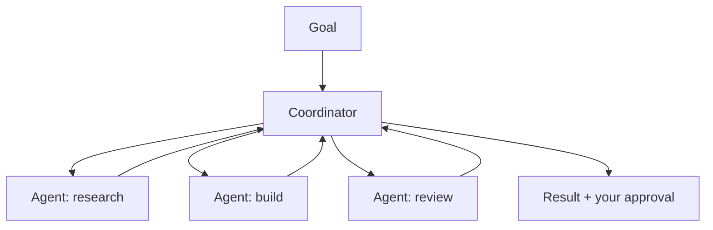

<LevelBadge level="advanced" />

<VerifyNote lastVerified="2026-06-20" source="https://platform.claude.com/docs">
Cowork und Agententeams sind sich schnell verändernde Bereiche von 2026 — Namen, Verfügbarkeit und Fähigkeiten ändern sich häufig. Überprüfe die aktuellen Details in der offiziellen Anthropic-Dokumentation/den Ankündigungen.
</VerifyNote>

Über einen einzelnen Agenten hinaus hat Anthropic Bereiche auf **Produktebene** veröffentlicht, mit denen Agenten dauerhafte, kollaborative Arbeit leisten können: **Cowork** (ein agentischer Desktop-Arbeitsbereich) und **Agententeams** (mehrere zusammenarbeitende Agenten). Diese Seite ist eine grobe Übersicht — überprüfe die Einzelheiten anhand der offiziellen Dokumentation, da sich diese schnell weiterentwickeln.

## Claude Cowork

Stell es dir als einen **Arbeitsbereich vor, in dem ein Agent echte, mehrstufige Arbeit** an deiner Seite leistet — er arbeitet über einen längeren Zeithorizont als eine einzelne Chat-Runde mit Dateien und Tools, während du beaufsichtigst. Es ist der auf Verbraucher/Profis ausgerichtete Verwandte davon, einen Agenten auf der API zu bauen: Die Schleife wird bereitgestellt, du gibst die Ziele vor.

## Agententeams

Wo ein Agent nicht ausreicht, **arbeiten mehrere Agenten zusammen** — sie teilen ein Ziel auf, jeder mit einer Rolle und Tools, und koordinieren sich auf ein Ergebnis hin. Konzeptionell spiegelt das die [Subagenten](/docs/claude-code/subagents) von Claude Code wider, jedoch als Produktbereich für dauerhafte Multi-Agenten-Zusammenarbeit statt für eine einzelne delegierte Teilaufgabe.

## Wie sich dies zum Rest der Website verhält

- Es selbst, programmatisch bauen → [Agenten bauen](/docs/api/building-agents) + das [Agent SDK](/docs/claude-code/headless-and-agent-sdk).
- Delegation innerhalb einer Coding-Sitzung → [Subagenten](/docs/claude-code/subagents).
- Gehostete Schleife/State/Scheduling → [Verwaltete Agenten](/docs/api/managed-agents).

## Die Konstante: Beaufsichtigung

:::warning Mehr Autonomie, mehr Sorgfalt
Multi-Agenten-Arbeit über lange Zeithorizonte verstärkt sowohl den Nutzen *als auch* das Risiko. Behalte Menschen bei folgenreichen Aktionen in der Schleife, beschränke den Tool-Zugriff eng und überprüfe die Ausgaben — siehe [Verantwortungsvolle Nutzung](/docs/security/responsible-use) und [Agenten absichern](/docs/security/securing-agents).
:::

## Weiter

- [Subagenten & parallele Agenten](/docs/claude-code/subagents)
- [Verwaltete Agenten](/docs/api/managed-agents)
- [Verantwortungsvolle Nutzung, Ethik & Verifizierung](/docs/security/responsible-use)
