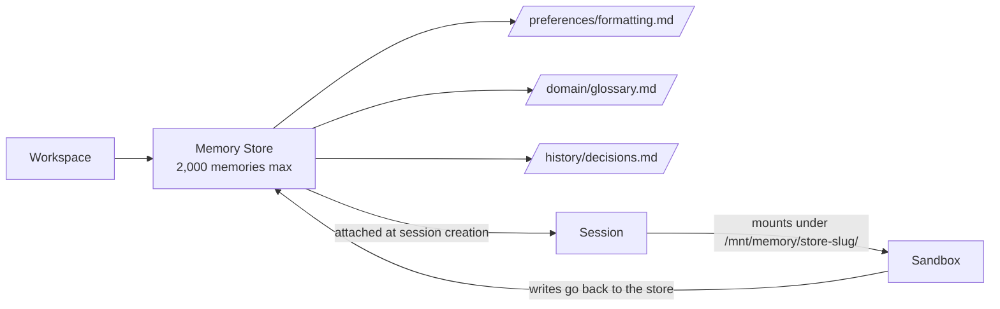

<LevelBadge level="advanced" />

<Callout type="objectives" items={["Was ein Memory Store ist — und wie er sich vom älteren clientseitigen Memory-Tool unterscheidet", "Wie Stores in die Session-Sandbox unter /mnt/memory/ eingehängt werden und wie der Agent sie nutzt", "Die Beta-Header-Regel, über die alle stolpern (agent-memory-2026-07-22 vs. managed-agents-2026-04-01)", "Der vollständige Lebenszyklus: erstellen → befüllen → anhängen → lesen/schreiben → Versionen auditieren → redigieren", "Die konkreten Limits: 8 Stores pro Session, 2.000 Memories pro Store, 100 kB pro Memory"]} />

<VerifyNote lastVerified="2026-07-30" source="https://platform.claude.com/docs/en/managed-agents/memory">
Memory Stores sind seit dem 22. Juli 2026 in **Public Beta**. Endpunkte, Header-Strings und Limits ändern sich während der Beta — bestätige gegen die offizielle Referenz, bevor du ausrollst.
</VerifyNote>

Wenn du mit [Managed Agents](/docs/api/managed-agents) gebaut hast, weißt du, dass jede Session standardmäßig mit einem frischen Kontext startet. Wenn die Session endet, geht alles, was der Agent gelernt hat, mit ihr verloren. **Memory Stores** sind der First-Party-Fix: serverseitige, versionierte Sammlungen von Textdokumenten, die über Sessions hinweg bestehen und in der Sandbox des Agenten als gewöhnliches Verzeichnis eingehängt werden, das er mit seinen Datei-Tools lesen und schreiben kann.

## Memory Stores vs. das clientseitige Memory-Tool

Es gibt jetzt **zwei verschiedene „Memory"-Primitive** in der Claude-Plattform. Nicht verwechseln.

| | **Memory Stores** (diese Seite) | **Clientseitiges Memory-Tool** ([eigene Seite](/docs/api/memory-and-context-editing)) |
|---|---|---|
| **Wo der Speicher liegt** | Anthropic-gehostet, Workspace-scoped | Dein eigener Speicher (Redis, Postgres, Dateien …) |
| **Wer die Schleife dreht** | Managed Agents | Du (Messages-API + Tool-Loop) |
| **Beta-Header** | `agent-memory-2026-07-22` | `context-management-2025-06-27` (Memory-Tool) |
| **Wie der Agent liest** | Als Dateien eingehängt unter `/mnt/memory/` | Tool-Aufrufe (`view`, `str_replace`, `create` …) |
| **Audit-Trail** | Unveränderliche Versionen, Redact-Endpunkt | Was du selbst baust |

Dieselbe *Idee* (persistenter Zustand); unterschiedliches *Primitiv*. Alles darunter dreht sich um **Memory Stores** — die serverseitige Variante, nur für Managed Agents.

## Das mentale Modell

Ein Store ist ein Ordner mit kleinen Markdown-/Textdateien (Memories), auf deinen Workspace beschränkt. Wenn du ihn an eine Session anhängst, erscheint er als Mount in der Sandbox, und Claude liest und schreibt ihn mit dem Standard-[Agent-Toolset](https://platform.claude.com/docs/en/managed-agents/tools) — denselben Tools, die er für den Rest des Dateisystems nutzt.

Zwei wichtige Folgen:

- Eine **Notiz zu jedem Mount** (Name, Mount-Pfad, Zugriffsmodus, Beschreibung und optionale sessionbezogene `instructions`) wird automatisch in den System-Prompt eingefügt. Der Agent weiß, dass der Mount existiert, ohne dass du es ihm sagst.
- Schreibvorgänge **außerhalb** des Mount-Pfads — irgendwo anders unter `/mnt/memory/` — landen im container-lokalen Scratch und gehen am Sessionende verloren. Nur Schreibvorgänge auf den Mount-Pfad bleiben erhalten.

## Die Beta-Header-Regel (der Klassiker-Fehler)

Hier verlieren Leute 20 Minuten.

<Callout type="warning" items={["Memory-Store-Endpunkte verwenden anthropic-beta: agent-memory-2026-07-22 — sonst nichts.", "Session-Endpunkte (auch das Anhängen eines Memory Stores an eine Session) verwenden weiterhin managed-agents-2026-04-01.", "Beide auf einer Memory-Store-Anfrage zu senden liefert HTTP 400. Wenn dein Code Beta-Header explizit setzt, ersetzen — nicht anhängen."]} />

Wenn du das offizielle SDK nutzt, setzt es den richtigen Header automatisch. Wenn du auf rohem HTTP arbeitest, trenne deine Aufrufe:

| Aufruf | Header |
|---|---|
| `POST /v1/memory_stores` (erstellen) | `agent-memory-2026-07-22` |
| `POST /v1/memory_stores/{id}/memories` (Memory erstellen/auflisten/aktualisieren/löschen) | `agent-memory-2026-07-22` |
| `POST /v1/memory_stores/{id}/memory_versions/…/redact` | `agent-memory-2026-07-22` |
| `POST /v1/sessions` — Store in `resources[]` anhängen | `managed-agents-2026-04-01` |

## Der Lebenszyklus

<Steps items={[{title: "1. Store erstellen", body: "POST /v1/memory_stores mit Name und Beschreibung. Die Beschreibung wird an den Agenten übergeben, also formuliere sie wie ein Briefing: 'Per-user preferences and project context'."}, {title: "2. Befüllen (optional)", body: "Referenzmaterial mit memories.create unter Pfaden wie /formatting_standards.md vorladen. Ideal für geteiltes Read-only-Wissen, das jede Session sehen soll."}, {title: "3. Beim Session-Aufbau anhängen", body: "Einen resources[]-Eintrag mit type: memory_store, memory_store_id, access und optionalen instructions an POST /v1/sessions übergeben. Stores können nur beim Session-Aufbau angehängt werden — nicht mitten in der Session hinzugefügt oder entfernt."}, {title: "4. Den Agenten lesen/schreiben lassen", body: "Der Store wird unter /mnt/memory/[store-slug]/ eingehängt (lies den exakten mount_path aus der Antwort). Die üblichen Datei-Tools des Agenten erledigen den Rest, und ihre Aufrufe erscheinen als agent.tool_use/agent.tool_result-Events im Stream."}, {title: "5. Auditieren und redigieren", body: "Jeder Schreibvorgang erzeugt eine unveränderliche Memory-Version. Nutze memory_versions, um die Historie zu inspizieren, per Rückschreiben eines früheren Inhalts zurückzurollen oder sensiblen Inhalt mit dem Redact-Endpunkt aus der Historie zu entfernen."}]} />

## Store und ersten Memory erstellen

Name und Beschreibung des Stores sind das, was der Agent sieht — schreibe sie wie eine Ordner-README.

<PromptCard title="Store erstellen (curl, rohes HTTP)">{`curl -s https://api.anthropic.com/v1/memory_stores \\
  -H "x-api-key: $ANTHROPIC_API_KEY" \\
  -H "anthropic-version: 2023-06-01" \\
  -H "anthropic-beta: agent-memory-2026-07-22" \\
  -H "content-type: application/json" \\
  -d '{"name": "User Preferences", "description": "Per-user preferences and project context."}'
# -> {"id": "memstore_01Hx...", ...}`}</PromptCard>

<PromptCard title="Ein Memory befüllen">{`curl -s "https://api.anthropic.com/v1/memory_stores/$store_id/memories" \\
  -H "x-api-key: $ANTHROPIC_API_KEY" \\
  -H "anthropic-version: 2023-06-01" \\
  -H "anthropic-beta: agent-memory-2026-07-22" \\
  -H "content-type: application/json" \\
  -d '{"path": "/formatting_standards.md", "content": "All reports use GAAP formatting. Dates are ISO-8601."}'`}</PromptCard>

## Einen Store an eine Session anhängen

Beachte, dass der Header hier zurück auf `managed-agents-2026-04-01` wechselt — Session-Endpunkte, inklusive Attach, verwenden den Managed-Agents-Header.

<PromptCard title="Beim Session-Aufbau anhängen (read_write)">{`curl -s https://api.anthropic.com/v1/sessions \\
  -H "x-api-key: $ANTHROPIC_API_KEY" \\
  -H "anthropic-version: 2023-06-01" \\
  -H "anthropic-beta: managed-agents-2026-04-01" \\
  -H "content-type: application/json" \\
  -d '{
    "agent": "$AGENT_ID",
    "environment_id": "$ENVIRONMENT_ID",
    "resources": [{
      "type": "memory_store",
      "memory_store_id": "$STORE_ID",
      "access": "read_write",
      "instructions": "User preferences and project context. Check before starting any task."
    }]
  }'`}</PromptCard>

Das Feld `instructions` ist auf 4.096 Zeichen begrenzt und wird dem Agenten neben `name` und `description` des Stores angezeigt.

## Zugriffsmodi und das Injection-Risiko

`access` steht standardmäßig auf `read_write`. Das ist die richtige Wahl, wenn der Agent aus der Session *lernen* soll. Es ist die **falsche** Wahl für einen Store, den niemand (und nichts) verändern soll.

<Callout type="warning" items={["Ein read_write-Store liegt hinter jedem Prompt-Injection-Risiko in der Session. Wenn der Agent nicht-vertrauenswürdige Eingaben verarbeitet (User-Prompts, geladene Seiten, Ausgaben von Drittanbieter-Tools), kann eine erfolgreiche Injection bösartigen Inhalt in den Store schreiben. Spätere Sessions lesen das dann als vertrauenswürdiges Gedächtnis.", "Faustregel: Geteiltes Referenzmaterial (Standards, Glossare, Domain-Docs) wird als read_only angehängt. Nur per-user- oder per-Session-Zustand, der wachsen muss, ist read_write.", "Wenn nötig, beides anhängen: ein read_only-Referenz-Store plus ein read_write-Scratch-Store. Bis zu 8 pro Session."]} />

## Die konkreten Limits

Alle aus den offiziellen Docs, alle merkenswert:

| Limit | Wert |
|---|---|
| Memory Stores pro Session | **8** |
| Memories pro Store | **2.000** |
| Bytes pro Memory | **100 kB** (~25k Tokens) |
| `instructions`-Länge (pro Attach) | **4.096 Zeichen** |
| Versions-Aufbewahrung | **30 Tage** (aktuelle Versionen werden immer gehalten) |

Wenn ein Store 2.000 Memories erreicht, schlagen weitere Schreibvorgänge fehl — direkte API-Aufrufe *und* die Datei-Writes des Agenten. Der von den Docs empfohlene Fix ist nicht „ein riesiger Store": **viele kleine, fokussierte Stores** verwenden (einer pro User, einer für geteilte Referenz, einer pro Projekt), veraltete Einträge mit `memories.delete` löschen oder eine [Dream-Session](https://platform.claude.com/docs/en/managed-agents/dreams) laufen lassen, um zu konsolidieren.

## Audit-Trail, Versionen und Rollback

Jeder Schreibvorgang auf einem Memory erzeugt eine unveränderliche **Memory-Version** (`memver_...`). Versionen gehören dem Store, nicht dem Memory, also überleben sie auch, wenn das Memory selbst gelöscht wird — der Audit-Trail bleibt vollständig.

Praktische Muster:

- **Point-in-Time-Inspektion:** `GET /v1/memory_stores/{id}/memory_versions?memory_id=…` — wer hat wann was geändert, neueste zuerst.
- **Rollback:** Es gibt keinen dedizierten Restore-Endpunkt. Hol die gewünschte Version und schreibe deren `content` mit `memories.update` zurück (oder `memories.create`, wenn das Elter-Memory weg ist).
- **Sichere gleichzeitige Bearbeitungen:** Übergib eine `content_sha256`-Vorbedingung an `memories.update`. Wenn der Head-Hash nicht mehr passt, wird dein Update abgelehnt und du liest vor dem Retry neu — klassische Optimistic Concurrency.

## Compliance: eine Version redigieren

Wenn PII, ein Secret oder eine User-Löschanfrage den Inhalt *aus der Historie verschwinden* lassen muss, nutze Redact. Es entfernt den Inhalt, erhält aber den Audit-Trail (wer hat wann was gemacht).

<Callout type="tip" items={["Du kannst den aktuellen Head eines lebenden Memory nicht redigieren. Schreib erst eine neue Version (oder lösche das Memory), dann redigier die alte Version.", "Weil Versionen ihr Elter-Memory überleben, löscht das Löschen des Memory die Historie nicht automatisch — du redigierst weiterhin pro Version.", "Die Versions-Aufbewahrung beträgt mindestens 30 Tage. Wenn du für Compliance längere Aufbewahrung brauchst, exportiere Versionen per API, bevor sie ablaufen."]} />

## Häufige Fehler

<Callout type="tip" items={["Beide Beta-Header auf einem Memory-Store-Aufruf senden — du bekommst HTTP 400. Ersetzen, nicht anhängen.", "Versuchen, einen Store aus einer laufenden Session hinzuzufügen oder zu entfernen — nicht unterstützt. Attach passiert beim Session-Aufbau, Punkt.", "Einen geteilten Referenz-Store als read_write anhängen — eine Injection später sind deine Standards für jede zukünftige Session verdorben.", "Einen riesigen Store statt vieler fokussierter — du triffst das 2.000er-Limit und sperrst weitere Schreibvorgänge aus.", "Nach /mnt/memory/scratch/ schreiben in der Hoffnung, es bleibt erhalten — alles außerhalb des Mount-Pfads ist container-lokal und verdampft am Sessionende."]} />

## Teste dich selbst

<Quiz title="Teste dich selbst" questions={[{q: "Du schickst eine Memory-Store-Create-Anfrage mit anthropic-beta: agent-memory-2026-07-22 UND anthropic-beta: managed-agents-2026-04-01. Was passiert?", options: ["Beide Header werden akzeptiert", "Die Anfrage liefert HTTP 400 — Memory-Store-Endpunkte müssen agent-memory-2026-07-22 allein verwenden", "Der neuere Header gewinnt still", "Das SDK entfernt den älteren Header auch bei rohem HTTP automatisch"], answer: 1, explain: "Die Docs sind eindeutig: kombiniere die beiden nicht auf Memory-Store-Endpunkten — beide zu senden liefert 400. Session-Endpunkte (inklusive Attach) verwenden weiterhin managed-agents-2026-04-01."}, {q: "Wo erscheint ein Memory Store in der Session-Sandbox?", options: ["/etc/memory/[store-id]", "/mnt/memory/[store-slug]/, wobei der Slug der bereinigte Anzeigename ist", "/tmp/memory-[store-id]", "Gar nicht — der Agent muss eine API aufrufen, um ihn zu lesen"], answer: 1, explain: "Der Store wird unter /mnt/memory/ mit einem Slug des Store-Namens eingehängt. Lies immer den exakten mount_path aus der Memory-Store-Resource der Session, statt ihn zu konstruieren."}, {q: "Dein Agent verarbeitet E-Mails von externen Nutzern. Welcher Zugriffsmodus ist am sichersten für einen geteilten 'Standards & Glossar'-Store?", options: ["read_write, damit der Agent das Glossar mit der Zeit verbessern kann", "read_only, weil eine Prompt-Injection sonst geteiltes Referenzmaterial vergiften könnte", "read_write mit striktem System-Prompt", "Egal — Zugriffsmodi sind nur beratend"], answer: 1, explain: "Zugriff wird auf Dateisystem-Ebene erzwungen. read_only-Stores lehnen Schreibvorgänge auch bei erfolgreicher Prompt-Injection ab und schützen geteilte Referenz davor, für zukünftige Sessions vergiftet zu werden."}, {q: "Du musst ein geleaktes Secret aus der Historie löschen. Welche Reihenfolge klappt?", options: ["Das Memory löschen — die Historie geht mit weg", "Direkt die aktuelle Head-Version redigieren", "Eine neue Version schreiben (oder das Memory löschen), dann die alte Version redigieren", "Den Store archivieren"], answer: 2, explain: "Du kannst den aktuellen Head eines lebenden Memory nicht redigieren. Erst neue Version schreiben (oder Memory löschen), dann Redact auf die alte Version aufrufen — Versionen überleben ihr Elter."}, {q: "Wie groß darf ein Memory maximal sein und wie viele Memories passen in einen Store?", options: ["10 kB pro Memory, 200 Memories pro Store", "100 kB pro Memory, 2.000 Memories pro Store", "1 MB pro Memory, 500 Memories pro Store", "Während der Beta gibt es keine expliziten Limits"], answer: 1, explain: "100 kB (~25k Tokens) pro Memory und 2.000 Memories pro Store. Die Docs empfehlen viele kleine, fokussierte Dateien statt weniger großer."}]} />

<Callout type="takeaways" items={["Memory Stores sind das serverseitige Persistent-Memory-Primitiv für Managed Agents — anders als das clientseitige Memory-Tool.", "Header-Regel: agent-memory-2026-07-22 auf Memory-Store-Endpunkten, managed-agents-2026-04-01 auf Session-Endpunkten. Nie beide.", "Stores werden beim Session-Aufbau angehängt und unter /mnt/memory/[store-slug]/ gemountet; Hinzufügen/Entfernen mitten in der Session ist nicht unterstützt.", "Default read_only für geteilte Referenz; nur per-user- oder per-Session-Wachstum sollte read_write sein.", "Jeder Schreibvorgang erzeugt eine unveränderliche Version; Rollback ist 'holen + zurückschreiben'; Redact scrubbt Historie für Compliance."]} />

## Weiter

- [Managed Agents](/docs/api/managed-agents) — das übergeordnete Konzept: Agents, Sessions, Environments, Vaults, Deployments
- [Building Agents on the API](/docs/api/building-agents) — falls du deine eigene Schleife baust
- [Memory-Tool & Context Editing (clientseitig)](/docs/api/memory-and-context-editing) — das *andere* Memory-Primitiv
- [Prompt Injection](/docs/security/prompt-injection) — warum `read_only` bei geteilten Stores zählt
- [Agent Memory Architectures](/docs/frontiers/agent-memory-architectures) — die Design-Muster hinter Persistent-Memory-Systemen
