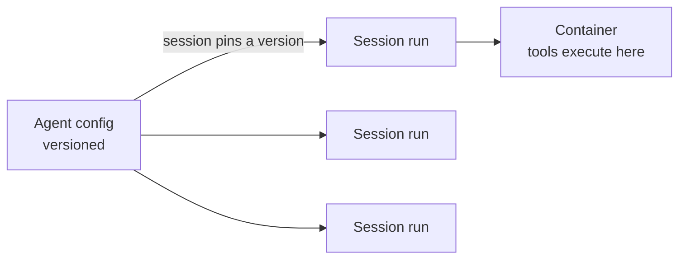

<LevelBadge level="advanced" />

<VerifyNote lastVerified="2026-06-26" source="https://platform.claude.com/docs/en/docs/agents-and-tools">
Die Fähigkeiten und Verfügbarkeit verwalteter Agenten ändern sich — die API befindet sich in der Beta-Phase. Prüfe Endpunkte, Feldnamen und Zugriff in der offiziellen Dokumentation, bevor du darauf aufbaust.
</VerifyNote>

<Callout type="objectives" items={["Verstehen, was ein verwalteter (von Anthropic gehosteter) Agent-Loop für dich übernimmt", "Die zwei zentralen Objekte unterscheiden: ein versionierter Agent vs. eine Session pro Lauf", "Geheimnisse sicher mit Vaults einschleusen — ohne dass das Modell sie je sieht", "Einen Agenten mit Scheduled Deployments auf einen Cron-Zeitplan setzen — kein Scheduler zu hosten", "Wissen, wann verwaltet einem eigenen Loop überlegen ist, und welche Leitplanken weiterhin gelten"]} />

Wenn dir [einen eigenen Agent-Loop zu bauen](/docs/api/building-agents) mehr Infrastruktur ist, als du selbst betreiben möchtest, führt ein **verwalteter** (von Anthropic gehosteter) Agent den Loop für dich aus — sodass du dich auf die *Aufgabe* des Agenten konzentrierst und nicht auf Session-Verkabelung, Retries, State und Scheduling.

## Die zwei Objekte: Agent vs. Session

Das ist das mentale Modell, an dem alles andere hängt. Sie sind bewusst getrennt.

- Ein **Agent** ist eine *persistierte, versionierte Konfiguration* — Modell, System-Prompt, Tools, MCP-Server und Skills. Du erstellst ihn einmal. Jede Aktualisierung erzeugt eine neue, unveränderliche Version.
- Eine **Session** ist eine *Laufzeitinstanz* — eine Ausführung, die per ID auf einen Agenten zeigt. Die Konfiguration liegt beim Agenten, niemals bei der Session.

<Callout type="tip">
Sessions **pinnen** auf die Agent-Version, mit der sie erstellt wurden: laufende Sessions behalten ihre Version, neue Sessions erhalten die neueste. So lieferst du Konfigurationsänderungen aus, ohne laufende Arbeit zu unterbrechen.
</Callout>

## Was dir „verwaltet“ einbringt

Statt den Loop selbst zu bauen und zu hosten, erhältst du gehostete Bausteine:

- **Sessions** — persistente Läufe, die du pro Ausführung erstellst und fortsetzt; Events werden über SSE gestreamt.
- **Umgebungen** — Container-Infrastruktur, entweder `cloud` (von Anthropic gehostet) oder `self_hosted` (Tools laufen in deiner eigenen VPC). Ein Container pro Session ist der Arbeitsbereich des Agenten.
- **Memory-Stores** — persistenter State über Sessions hinweg, mit Versionierung und Redaktion, ohne dass du eine Datenbank verdrahten musst.
- **Vaults** — Geheimnisse für MCP-Authentifizierung und andere Dienste.
- **Geplante Deployments** — Agenten, die nach einem Cron-Zeitplan laufen, unbeaufsichtigt.

<PromptCard title="Einen Agenten erstellen (versionierte Konfiguration) und dann eine Session dagegen laufen lassen">{`# 1. Create the agent once
POST /v1/agents        -> returns $AGENT_ID
# 2. Each execution is a session pinned to that agent
POST /v1/sessions      { "agent": "$AGENT_ID" }`}</PromptCard>

## Vaults: Geheimnisse, die das Modell nie sieht

Ein autonomer Agent benötigt oft einen API-Schlüssel — aber das *Modell* sollte ihn niemals lesen. Vault-Credentials (`mcp_oauth`, `static_bearer`, `environment_variable`) werden beim Egress substituiert: ein `environment_variable`-Credential wird zur Ausführungszeit in die Sandbox eingeschleust und ist für das Modell *niemals sichtbar*.

<Callout type="warning">
Das ist das sichere Muster, um einem Agenten mächtigen Zugriff zu geben. Füge keine Schlüssel in den System-Prompt oder eine Nachricht ein — sie werden Teil des Kontexts, den das Modell (und deine Logs) sehen können. Lege sie in einen Vault.
</Callout>

## Geplante Deployments: ein Agent auf einem Cron

Ein **Deployment** hängt einen Cron-Zeitplan an einen Agenten. Wenn der Zeitplan auslöst, startet es eine frische Session und schließt seine Aufgabe ab — kein Scheduler, den du bauen oder hosten musst. Gut für einen nächtlichen Datenabgleich, einen wöchentlichen Compliance-Scan oder eine tägliche Zusammenfassung.

<Steps items={[
  {title: "Den Zeitplan definieren", body: "POST /v1/deployments mit agent, environment_id, initial_events (muss eine user.message enthalten) und einem schedule: ein POSIX-Cron-Ausdruck plus eine IANA-Zeitzone."},
  {title: "Jedes Auslösen = ein Lauf", body: "Jeder Auslöseversuch erzeugt einen Lauf-Datensatz (drun_-Präfix). Erfolg trägt eine session_id; Fehlschlag trägt einen error.type (z. B. environment_archived, session_rate_limited). Läufe auflisten über GET /v1/deployment_runs?deployment_id=..."},
  {title: "Den Lebenszyklus steuern", body: "Pause unterdrückt künftige Auslösungen (manuelle Läufe funktionieren weiterhin); Unpause setzt beim nächsten Vorkommen fort und holt verpasste Auslösungen NICHT nach; Archivierung ist endgültig."},
  {title: "Bei Bedarf auslösen", body: "POST /v1/deployments/{id}/run startet sofort eine Session — auch im pausierten Zustand — mit trigger_context.type: manual."}
]} />

<PromptCard title="Ein wöchentlicher Compliance-Scan, freitags um 20:00 Uhr New Yorker Zeit">{`POST /v1/deployments
{
  "name": "Weekly compliance scan",
  "agent": "$AGENT_ID",
  "environment_id": "$ENVIRONMENT_ID",
  "initial_events": [
    {"type": "user.message", "content": [{"type": "text", "text": "Run the compliance scan and summarize findings."}]}
  ],
  "schedule": {"type": "cron", "expression": "0 20 * * 5", "timezone": "America/New_York"}
}`}</PromptCard>

<Callout type="tip">
Cron ist `minute hour day-of-month month day-of-week`, mit Granularität auf Minutenebene. DST verwendet Wanduhrzeit-Semantik: eine Zeit, die bei der Umstellung auf Sommerzeit nicht existiert, wird übersprungen; eine Zeit, die bei der Umstellung auf Winterzeit zweimal auftritt, löst zweimal aus. Wähle für alles Sensible eine Zeitzone und eine Uhrzeit, die diese Grenzfälle vermeidet.
</Callout>

## Wann verwaltet vs. benutzerdefiniert wählen

| Wähle **verwaltet**, wenn… | Wähle einen **eigenen Loop / SDK**, wenn… |
|---|---|
| Du Hosting, State, Scheduling und Geheimnisse erledigt haben möchtest | Du volle Kontrolle über den Loop und die Tools brauchst |
| Du schnell prototypisierst | Du strikte Anforderungen an eigene Infrastruktur/Compliance hast |
| Betriebliche Einfachheit wichtiger ist als Kontrolle | Du tief in deinen eigenen Stack einbettest |

Es ist ein Spektrum — einzelner Aufruf → Workflow → benutzerdefinierter Agent (SDK) → verwaltet. Beginne so einfach, wie es die Aufgabe erlaubt; gehe nur dann eine Stufe höher, wenn du es brauchst.

## Es gelten dieselben Leitplanken

Ob gehostet oder nicht — ein autonomer Agent führt weiterhin Aktionen aus. Behalte **geringste Rechte**, **begrenzte Kosten/Iterationen** und **menschliche Freigabe für riskante Schritte** bei — siehe [Agenten absichern](/docs/security/securing-agents) und [Autonome Läufe härten](/docs/security/hardening-autonomous-runs).

<Callout type="takeaways" items={["Verwaltete Agenten geben den Loop, Sessions, Umgebungen, Memory, Vaults und Scheduling ab, sodass du dich auf die Aufgabe konzentrierst", "Ein Agent ist versionierte Konfiguration; eine Session ist ein Lauf, der auf eine Version pinnt — die Konfiguration liegt beim Agenten, nicht bei der Session", "Vault-environment_variable-Credentials werden zur Ausführung eingeschleust und sind für das Modell niemals sichtbar — der sichere Weg, einem Agenten Geheimnisse zu geben", "Ein geplantes Deployment ist ein Cron-Ausdruck + IANA-Zeitzone; jedes Auslösen erzeugt einen Lauf, und Unpause holt verpasste Auslösungen nicht nach", "Verwaltet sitzt am gehosteten Ende von einzelner Aufruf -> Workflow -> benutzerdefiniert -> verwaltet; die Autonomie-Leitplanken gelten weiterhin"]} />

## Überprüfe dich selbst

<Quiz title="Überprüfe dich selbst" questions={[
  {
    q: "Was ist der Unterschied zwischen einem Agenten und einer Session?",
    options: [
      "Es sind zwei Namen für dasselbe Objekt",
      "Ein Agent ist versionierte Konfiguration; eine Session ist eine Laufzeitausführung, die auf eine Agent-Version pinnt",
      "Eine Session hält das Modell und den System-Prompt; ein Agent ist nur eine ID",
      "Ein Agent führt die Tools aus; eine Session speichert Geheimnisse"
    ],
    answer: 1,
    explain: "Ein Agent ist die persistierte, versionierte Konfiguration (Modell, Prompt, Tools, MCP, Skills). Eine Session ist eine Instanz pro Ausführung, die den Agenten referenziert und bei der Erstellung auf dessen Version pinnt."
  },
  {
    q: "Wie solltest du einem verwalteten Agenten einen API-Schlüssel geben, den er benötigt?",
    options: [
      "Ihn in den System-Prompt legen, damit der Agent ihn lesen kann",
      "Ihn in der ersten Benutzernachricht der Session übergeben",
      "Ihn als Vault-Credential speichern, das zur Ausführung eingeschleust und für das Modell nie sichtbar ist",
      "Ihn fest in die Tool-Definition einkodieren"
    ],
    answer: 2,
    explain: "Vault-Credentials (z. B. ein Typ environment_variable) werden beim Egress substituiert und sind für das Modell nie sichtbar — Schlüssel im Prompt oder in einer Nachricht werden Teil des sichtbaren Kontexts."
  },
  {
    q: "Ein geplantes Deployment wurde zwei Tage pausiert und dann wieder fortgesetzt. Was passiert mit den Auslösungen, die während der Pause ausgelöst hätten?",
    options: [
      "Sie werden nachgeholt — jeder verpasste Lauf wird beim Fortsetzen ausgeführt",
      "Sie werden nicht nachgeholt; das Deployment setzt einfach beim nächsten geplanten Vorkommen fort",
      "Das Deployment wird automatisch archiviert",
      "Alle verpassten Läufe werden in eine Warteschlange gestellt und im Abstand von einer Minute ausgeführt"
    ],
    answer: 1,
    explain: "Unpause setzt beim nächsten Vorkommen fort und holt verpasste Auslösungen nicht nach. (Du kannst jederzeit einen Lauf mit dem manuellen Trigger erzwingen, sogar im pausierten Zustand.)"
  }
]} />

## Weiter

- [Agenten auf der API bauen](/docs/api/building-agents)
- [Cowork & Agent-Teams](/docs/api/cowork-and-agent-teams)
- [Headless-Modus & das Agent SDK](/docs/claude-code/headless-and-agent-sdk)
- [Agenten absichern](/docs/security/securing-agents)
