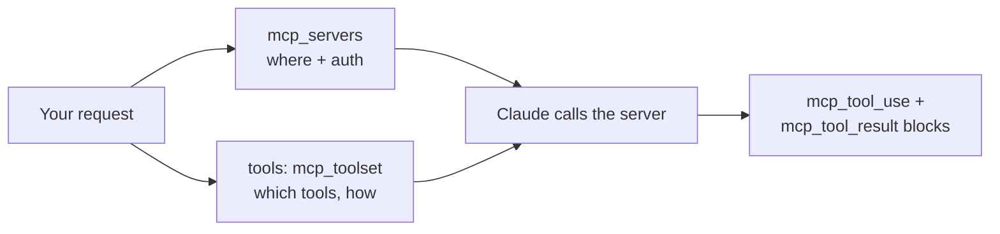

<LevelBadge level="advanced" />

Das **Model Context Protocol (MCP)** ist der offene Standard, um KI mit externen Tools und Daten zu verbinden. In der API musst du gar keinen MCP-Client selbst betreiben: Der **MCP-Connector** lässt dich in deinem Request einen Remote-Server nennen, und Claude ruft dessen Tools innerhalb des normalen Agent-Loops auf. Zwei Request-Felder ersetzen eine ganze Integrationsschicht.

<Callout type="objectives" items={[
  "Wann der MCP-Connector hand-definierte Tools schlägt — und wann nicht",
  "Die exakte Request-Form: mcp_servers für die Verbindung, mcp_toolset für die Policy",
  "Allowlist, Denylist und Per-Tool-Config — und wie sich die drei Config-Schichten mischen",
  "Die Response-Blöcke, die du behandeln musst: mcp_tool_use und mcp_tool_result",
  "Die echten Grenzen: nur HTTPS, nur Tools, Plattformlücken und keine ZDR-Abdeckung",
]} />

<VerifyNote lastVerified="2026-07-20" source="https://platform.claude.com/docs/en/agents-and-tools/mcp-connector">
Der Connector ist in Beta und der Header hat sich schon einmal geändert: aktuelle Version ist `mcp-client-2025-11-20`, `mcp-client-2025-04-04` ist **deprecated**. Feldnamen, Plattformverfügbarkeit und Beta-Status bewegen sich — bestätige gegen die offizielle Seite und [modelcontextprotocol.io](https://modelcontextprotocol.io), bevor du ausrollst.
</VerifyNote>

## MCP vs. hand-definierte Tools

| | [Tool Use](/docs/api/tool-use) (custom) | MCP-Connector |
|---|---|---|
| Du definierst | Das Schema jedes Tools, und du führst es aus | Eine Verbindung zu einem Server, der Tools *publiziert* |
| Wer führt das Tool aus | Dein Code, in deinem Loop | Anthropics Seite ruft den Remote-Server auf |
| Am besten für | Ein paar bespoke Funktionen in deiner App | Wiederverwendung bestehender Integrationen (GitHub, DBs, Browser, SaaS) |
| Auth | Dein Code | Ein OAuth-Bearer-Token, das du pro Server lieferst |

Sie koexistieren. Definiere deine app-spezifischen Tools direkt und zieh vorgefertigte Fähigkeit über MCP dazu.



## Die Request-Form

Zwei Teile, und sie sind bewusst getrennt: **`mcp_servers`** sagt, *wo der Server ist und wie authentifiziert wird*; der **`mcp_toolset`**-Eintrag im `tools`-Array sagt, *welche seiner Tools du bereit bist freizugeben und wie*.

<Steps items={[
  {title: "Den Beta-Header senden", body: "anthropic-beta: mcp-client-2025-11-20 — ohne ihn wird das mcp_servers-Feld nicht akzeptiert. In den SDKs ist das die betas-Liste in einem beta.messages.create-Call."},
  {title: "Server in mcp_servers deklarieren", body: "Gib ihm type url, eine https url und einen eindeutigen name. Füge authorization_token hinzu, wenn der Server OAuth verlangt — den OAuth-Flow führst du selbst, du übergibst das resultierende Access-Token."},
  {title: "Passendes mcp_toolset zu tools hinzufügen", body: "Setze mcp_server_name auf den soeben genutzten Namen. Ohne weitere Config ist jedes Tool auf dem Server mit Defaults aktiviert."},
  {title: "Die neuen Response-Blöcke behandeln", body: "Claudes Antwort kann mcp_tool_use- und mcp_tool_result-Content-Blöcke enthalten. Rendere oder logge sie wie Tool-Blöcke — nimm nicht an, die Antwort sei reiner Text."},
]} />

<PromptCard title="Minimaler MCP-Connector-Call (cURL)">{`curl https://api.anthropic.com/v1/messages \\
  -H "Content-Type: application/json" \\
  -H "X-API-Key: $ANTHROPIC_API_KEY" \\
  -H "anthropic-version: 2023-06-01" \\
  -H "anthropic-beta: mcp-client-2025-11-20" \\
  -d '{
    "model": "MODEL_ID",
    "max_tokens": 1000,
    "messages": [{"role": "user", "content": "What tools do you have available?"}],
    "mcp_servers": [
      {"type": "url", "url": "https://example.com/sse", "name": "example-mcp", "authorization_token": "YOUR_TOKEN"}
    ],
    "tools": [
      {"type": "mcp_toolset", "mcp_server_name": "example-mcp"}
    ]
  }'`}</PromptCard>

:::tip Modell niemals hart codieren
`MODEL_ID` oben ist bewusst ein Platzhalter. Lies die aktuelle ID aus [Aktuelle Modelle & Preise](/docs/whats-new/models-and-pricing) und halte sie in der Config, damit ein Modell-Upgrade eine Ein-Zeilen-Änderung ist.
:::

Die API erzwingt strikte Paarung: Jeder Server in `mcp_servers` muss von **genau einem** Toolset referenziert werden, und jedes Toolset-`mcp_server_name` muss zu einem deklarierten Server passen. Mismatches sind Validierungsfehler, keine stillen No-Ops.

## Wähle, was Claude tatsächlich darf

Diesen Teil bekommen die meisten Integrationen falsch hin. Ein Toolset nimmt ein `default_config`, das auf jedes Tool angewandt wird, plus `configs` mit Per-Tool-Overrides. Priorität, höchste zuerst: **Per-Tool `configs` → set-weites `default_config` → System-Defaults**.

**Denylist** — alles aktivieren, dann die gefährlichen abschalten. Sinnvoll, wenn du Breite willst, aber keine zerstörerischen Writes:

```json
{
  "type": "mcp_toolset",
  "mcp_server_name": "calendar-mcp",
  "configs": {
    "delete_all_events": { "enabled": false },
    "share_calendar_publicly": { "enabled": false }
  }
}
```

**Allowlist** — per Default deaktivieren, dann die Überlebenden namentlich nennen. Das ist die Least-Privilege-Haltung — und die, zu der man per Default greift:

```json
{
  "type": "mcp_toolset",
  "mcp_server_name": "calendar-mcp",
  "default_config": { "enabled": false },
  "configs": {
    "search_events": { "enabled": true },
    "create_event": { "enabled": true }
  }
}
```

:::warning Eine Denylist blockiert nur das, an das du gedacht hast
Server können Tools ergänzen. Eine Denylist gewährt still jedes Tool, das nach ihrem Schreiben ausgeliefert wurde; eine Allowlist *ignoriert* sie still. Für alles, was Kundendaten oder Geld berührt, allowliste. Beachte auch: Ein Tool in `configs` zu nennen, das es auf dem Server nicht gibt, loggt eine Backend-Warnung, wirft aber **keinen** Fehler — ein Tippfehler in einer Allowlist deaktiviert also still das Tool, das du eigentlich freischalten wolltest. Verifiziere gegen die Live-Toolliste des Servers.
:::

## Halte die Schemata aus deinem Kontext raus

Die Beschreibung jedes aktivierten Tools wird mit dem Request geschickt, ein fetter Katalog belastet also jeden Turn. Die Antwort des Connectors ist `defer_loading: true`: Die Beschreibung bleibt aus dem initialen Kontext und Claude zieht sie bei Bedarf via Tool Search Tool nach.

```json
{
  "type": "mcp_toolset",
  "mcp_server_name": "calendar-mcp",
  "default_config": { "defer_loading": true },
  "configs": {
    "search_events": { "defer_loading": false }
  }
}
```

Lies das so: *alles deferren außer dem einen Tool, mit dem diese Aufgabe startet*. Ein Toolset akzeptiert auch `cache_control`, sodass ein stabiler Katalog hinter einem [Prompt-Caching](/docs/api/prompt-caching)-Breakpoint sitzen kann, statt jeden Turn neu abgerechnet zu werden. Für die Zahlen dahinter — und warum das Deferren von Tools die Selection-Accuracy *erhöht* statt sie zu senken — siehe [Die MCP-Token-Steuer](/docs/claude-code/mcp-token-cost). Wenn nicht die Definitionen, sondern die *Ergebnisse* deinen Kontext fluten, greife stattdessen zu [Programmatic Tool Calling](/docs/api/programmatic-tool-calling).

## Was zurückkommt

Zwei Content-Block-Typen, die du behandeln musst:

```json
{ "type": "mcp_tool_use", "id": "mcptoolu_...", "name": "echo",
  "server_name": "example-mcp", "input": { "param1": "value1" } }

{ "type": "mcp_tool_result", "tool_use_id": "mcptoolu_...", "is_error": false,
  "content": [ { "type": "text", "text": "Hello" } ] }
```

Beachte `server_name` am Use-Block: Mit mehreren angebundenen Servern ist das der Weg, einen Call zuzuordnen — essenziell für Logging und um zu debuggen, welche Integration schiefging. Und `is_error` ist ein Feld, keine Exception: Ein fehlgeschlagenes MCP-Tool kommt als *Result* zurück, dein Loop muss es also prüfen, statt Erfolg anzunehmen.

## Die Grenzen, die beißen

<Callout type="warning" items={[
  "Nur Tools. Von der MCP-Spec unterstützt der Connector derzeit Tool-Calls — nicht Prompts oder Resources. Brauchst du die? Betreibe einen eigenen Client und nutze die SDK-MCP-Helper.",
  "Nur remote HTTPS. Der Server muss öffentlich über HTTP erreichbar sein (Streamable HTTP oder SSE Transports). Ein lokaler stdio-Server kann so nicht angebunden werden — das ist, was Claude Code und die Desktop-Apps tun.",
  "Plattformlücken. Verfügbar auf der Claude API, Claude Platform on AWS und Microsoft Foundry (Hosted-on-Anthropic-Deployments). Derzeit nicht auf Amazon Bedrock oder Google Cloud.",
  "Kein Zero-Data-Retention. Mit MCP-Servern ausgetauschte Daten — Tool-Definitionen und Ausführungsergebnisse — fallen unter die Standard-Retention, nicht unter ZDR.",
  "Du besitzt das OAuth. Die API nimmt ein authorization_token; es zu beschaffen und vor Ablauf zu refreshen ist deine Aufgabe.",
]} />

## Derselbe Standard, drei Oberflächen

- **API** (diese Seite) — Remote-Server per URL, via Connector.
- **[Claude Code](/docs/claude-code/mcp)** — lokale und remote Server in deinen Dev-Sessions.
- **[Die Apps](/docs/claude-app/connectors)** — MCP treibt Connectors.

Lerne das Protokoll einmal; es überträgt sich. Nur die Verdrahtung unterscheidet sich.

## Vertrauen

:::warning Ein MCP-Server ist Code plus Zugriff
Binde nur Server an, denen du vertraust, halte sie mit einer Allowlist auf Least Privilege und denk daran: Inhalte, die ein Server zurückgibt, sind untrusted Input und können [Prompt Injection](/docs/security/prompt-injection) tragen. Prüfe Drittanbieter-Server, bevor du sie verdrahtest — [Drittanbieter-Code prüfen](/docs/security/reviewing-third-party-code) und [MCP-Server absichern](/docs/security/securing-mcp-servers).
:::

<Flashcards title="MCP-Connector-Vokabular" cards={[
  {front: "MCP-Connector", back: "Einen Remote-MCP-Server direkt aus der Messages-API aufrufen, ohne eigenen MCP-Client."},
  {front: "mcp_servers", back: "Request-Feld, das die Verbindung trägt: type, https url, eindeutiger name, optionales authorization_token."},
  {front: "mcp_toolset", back: "Ein Eintrag im tools-Array, der sagt, welche Tools eines Servers aktiviert sind und wie. Zeigt via mcp_server_name auf einen Server."},
  {front: "default_config vs. configs", back: "Set-weite Defaults vs. Per-Tool-Overrides. configs schlägt default_config, das schlägt System-Defaults."},
  {front: "defer_loading", back: "Hält die Beschreibung eines Tools aus dem initialen Kontext, bis Claude danach sucht — der Fix für einen aufgeblähten Tool-Katalog."},
  {front: "is_error bei einem Tool-Result", back: "Ein fehlgeschlagenes MCP-Tool liefert einen Result-Block mit is_error true — keine Exception. Prüfe es in deinem Loop."},
]} />

<Quiz title="Prüfe dich selbst" questions={[
  {q: "Du willst, dass Claude nur search_events und create_event von einem Kalender-Server nutzt. Wie sieht das korrekte Toolset aus?", options: ["Sie in einem allowed_tools-Array in der Server-Definition auflisten", "default_config.enabled auf false setzen und die beiden dann in configs aktivieren", "defer_loading true bei jedem anderen Tool setzen"], answer: 1, explain: "allowed_tools gehört zum deprecated Header mcp-client-2025-04-04. In der aktuellen Version allowlistest du, indem du in default_config per Default deaktivierst und spezifische Tools in configs aktivierst. defer_loading beeinflusst Kontextkosten, nicht Berechtigungen."},
  {q: "Ein MCP-Tool-Call scheitert. Wo taucht das auf?", options: ["Als HTTP-Fehler am Messages-Request", "Als mcp_tool_result-Content-Block mit is_error auf true", "Die Response lässt den Tool-Call still weg"], answer: 1, explain: "Fehlschläge kommen innerhalb der Response als Result-Block mit is_error true zurück. Code, der Erfolg annimmt, rendert einen gescheiterten Call fröhlich als Fakt."},
  {q: "Du brauchst, dass Claude MCP-Resources von einem lokalen stdio-Server liest. Kann der Connector das?", options: ["Ja — setze type auf stdio in mcp_servers", "Nein — der Connector ist remote-HTTPS und nur Tool-Calls; betreibe einen eigenen Client mit den SDK-MCP-Helpern", "Ja, aber nur auf Bedrock"], answer: 1, explain: "Der Connector unterstützt Tool-Calls gegen öffentlich erreichbare HTTPS-Server. Lokale stdio-Server, MCP-Prompts und MCP-Resources brauchen einen eigenen Client, für den die SDKs Helper bereitstellen."},
  {q: "Dein Tool-Katalog spannt vier Server und dominiert jeden Turn das Kontextfenster. Günstigster erster Zug?", options: ["Auf ein Modell mit größerem Kontext wechseln", "default_config.defer_loading true setzen und nur die Tools un-defern, mit denen eine Aufgabe startet", "Die Arbeit auf vier separate Requests splitten"], answer: 1, explain: "Deferred Loading hält Beschreibungen aus dem Kontext, bis Claude sie sucht. Es senkt die Per-Turn-Schema-Steuer ohne Fähigkeitsverlust — und verbessert eher die Tool-Auswahl, weil weniger Tools den Kontext füllen."},
]} />

<Callout type="takeaways" items={[
  "Der Connector ersetzt einen MCP-Client mit zwei Request-Feldern — aber nur für Remote-HTTPS-Server und nur für Tool-Calls.",
  "mcp_servers ist die Verbindung; das mcp_toolset in tools ist die Policy. Jeder Server muss mit genau einem Toolset paaren.",
  "Allowlist (default_config.enabled false plus explizite configs) schlägt Denylist: Später zum Server hinzugefügte Tools werden ignoriert, nicht gewährt.",
  "defer_loading und cache_control sind deine Hebel, wenn Tool-Schemata das Kontextfenster zu fressen beginnen.",
  "mcp_tool_use- und mcp_tool_result-Blöcke behandeln — inklusive is_error, das ein Feld ist, keine Exception.",
  "Prüfe den Beta-Header vor dem Ausliefern: mcp-client-2025-11-20 ist aktuell, mcp-client-2025-04-04 ist deprecated.",
]} />

## Quellen & weiterführend

- [MCP-Connector — Anthropic-Doku](https://platform.claude.com/docs/en/agents-and-tools/mcp-connector) — die maßgebliche Feldreferenz und Migrations-Guide.
- [Model Context Protocol Specification](https://modelcontextprotocol.io) — der offene Standard selbst, inklusive Authorization.

## Weiter

- [Tool Use / Function Calling](/docs/api/tool-use)
- [Agenten auf der API bauen](/docs/api/building-agents)
- [Die MCP-Token-Steuer](/docs/claude-code/mcp-token-cost)
- [Baue & verdrahte deinen ersten MCP-Server](/docs/walkthroughs/first-mcp-server)
- [MCP-Config-Builder](/docs/tools/mcp-config-builder)
