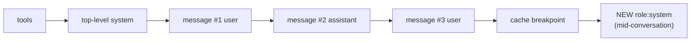

import Tabs from '@theme/Tabs';
import TabItem from '@theme/TabItem';

<LevelBadge level="advanced" />

<VerifyNote lastVerified="2026-07-21" source="https://platform.claude.com/docs/en/build-with-claude/mid-conversation-system-messages">
Unterstützte Modelle, Platzierungsregeln und Bedrock-/Vertex-Parität ändern sich — die Modellliste und den Status „kein Beta-Header" in den offiziellen Docs erneut bestätigen.
</VerifyNote>

Jahrelang war das Top-Level-Feld `system` der einzige Ort mit **Operator-Autorität** — den Anweisungen, die das Modell so behandelt, als kämen sie von dir und nicht vom Endnutzer. Für einen einmaligen Chat war das in Ordnung, für eine lange agentische Sitzung aber mühsam: Sobald du den System-Prompt bearbeitet hast, um „ab jetzt parametrisiertes SQL verwenden" hinzuzufügen, hast du den allerersten Teil der Anfrage verändert. Der Hash des [Prompt-Caches](/docs/api/prompt-caching) beginnt bei `tools → system → messages`, also invalidiert das Mutieren von `system` jeden gecachten Turn danach. Deine Optionen waren, die ganze Historie neu zu verarbeiten oder die neue Regel zu einem gewöhnlichen `user`-Turn zu degradieren — und dabei die „Operator"-Priorität zu verlieren.

**System-Nachrichten mitten in der Konversation** schließen diese Lücke. Statt den Anfang des Prompts zu bearbeiten, hängst du einen `{"role": "system"}`-Block in `messages` an. Der gecachte Präfix bleibt unangetastet, also liest der nächste Aufruf ihn weiterhin aus dem Cache, und die neue Anweisung trägt weiterhin System-Gewicht für jeden folgenden Turn.

<Callout type="objectives" items={["Warum das Steuern eines langen Agents früher einen vollständigen Cache-Miss erzwang und wie mid-conversation System-Nachrichten das lösen","Die exakte Platzierungsregel — muss auf einen User-Turn oder einen Assistant-Turn mit Server-Tool folgen, niemals zwischen einem tool_use und dessen tool_result","Wie du es mit Prompt-Caching kombinierst, sodass die angehängte Nachricht selbst im nächsten Turn cachefähig wird","Welche Claude-Modelle die Funktion heute unterstützen und welches du weiter auf die alte Art steuern musst","Die Framing-Falle — warum ignoriere-was-der-Nutzer-gesagt-hat scheitert und was du stattdessen schreibst"]} />

## Warum es das gibt — die Cache-Invariante, die es schützt

Ein Cache-Hit erfordert, dass der Anfrage-Präfix **Byte-für-Byte identisch** bis zum Cache-Breakpoint ist. Dieser Präfix wird der Reihe nach gehasht: **tools → Top-Level `system` → `messages`**. Wenn du das `system`-Feld umschreibst, um mitten in der Sitzung eine neue Regel hinzuzufügen, ändert sich der Hash an Position zwei, und jeder Turn danach wird als frische Eingabe behandelt.

Genau darum geht es bei der neuen Rolle. Eine System-Nachricht am **Ende** von `messages` anzuhängen, lässt den Präfix-Hash unberührt, sodass die nächste Anfrage frühere Turns weiterhin aus dem Cache liest. Nur der neue Block zahlt für frische Verarbeitung.



Da der angehängte Block **nach** dem Breakpoint sitzt, ändert er den Hash von nichts, was davor liegt. Im nächsten Turn ist er selbst Teil der stabilen Historie und kann wie jede andere Nachricht in den gecachten Präfix aufgenommen werden.

<Flashcards title="Vokabular" cards={[{front:"Top-Level system",back:"Das system-Feld in der Anfrage. Ideal für die Persona und Regeln, die ab Turn eins gelten — Änderungen invalidieren den gesamten Präfix."},{front:"System-Nachricht mitten in der Konversation",back:"Eine Nachricht mit role: system, die in messages angehängt wird. Gleiche Operator-Priorität, ohne den gecachten Präfix zu berühren."},{front:"Reihenfolge des Präfix-Hashes",back:"tools → system → messages. Alles vor deinem Cache-Breakpoint muss Byte-identisch sein, damit es einen Cache-Hit gibt."},{front:"Operator-Priorität",back:"Wenn eine System-Anweisung und eine User-Anweisung in Konflikt stehen, folgt Claude der System-Anweisung — genau das macht sie operator-level."}]} />

## Das minimale Beispiel

Setze das Top-Level-`system` wie üblich, dann füge einen `role: "system"`-Block in `messages` an der Stelle ein, an der die neue Anweisung relevant wird.

<Tabs groupId="lang">
<TabItem value="python" label="Python">

```python
import anthropic

client = anthropic.Anthropic()

response = client.messages.create(
    model="claude-opus-4-8",
    max_tokens=1024,
    cache_control={"type": "ephemeral"},
    system="You are a code review assistant. Be concise.",
    messages=[
        {"role": "user", "content": "Review process() in utils.py for perf."},
        {"role": "assistant", "content": "For large inputs, prefer a generator."},
        {"role": "user", "content": "Now review the calling code."},
        # New rule appears mid-session. Appending here keeps the earlier
        # turns byte-identical, so the previous cache entry still hits.
        {"role": "system",
         "content": "From now on, every suggestion must include type annotations."},
    ],
)
print(response.content[0].text)
```

</TabItem>
<TabItem value="ts" label="TypeScript">

```ts
import Anthropic from "@anthropic-ai/sdk";

const client = new Anthropic();

const response = await client.messages.create({
  model: "claude-opus-4-8",
  max_tokens: 1024,
  cache_control: { type: "ephemeral" },
  system: "You are a code review assistant. Be concise.",
  messages: [
    { role: "user", content: "Review process() in utils.py for perf." },
    { role: "assistant", content: "For large inputs, prefer a generator." },
    { role: "user", content: "Now review the calling code." },
    // New rule appears mid-session. Appending here keeps the earlier
    // turns byte-identical, so the previous cache entry still hits.
    { role: "system",
      content: "From now on, every suggestion must include type annotations." },
  ],
});
```

</TabItem>
</Tabs>

Die Form der Antwort ändert sich nicht — System-Nachrichten erscheinen nicht im `content`-Array der Antwort. Sie beeinflussen den nächsten Assistant-Turn und leben danach als gewöhnliche Historie weiter.

## Die Platzierungsregel (hier kommt ein 400 her)

Die API ist strikt, wo ein `role: "system"`-Block innerhalb von `messages` stehen darf. Machst du das falsch, bekommst du einen `400 invalid_request_error`.

<Steps items={[
  {title: "Nicht der erste Eintrag", body: "Eine System-Nachricht darf nicht das erste Element in messages sein. Anweisungen, die ab Turn eins gelten sollen, gehören ins Top-Level-Feld system."},
  {title: "Muss auf einen User-Turn oder einen Assistant-Turn mit Server-Tool folgen", body: "Der Block unmittelbar davor muss eine User-Nachricht sein (einschließlich einer User-Nachricht mit tool_result-Blöcken) oder eine Assistant-Nachricht, die mit einem Server-Tool-Use endet."},
  {title: "Muss am Ende stehen oder einem Assistant-Turn vorausgehen", body: "Sie ist entweder der Abschluss von messages (Claude antwortet dann als Nächstes) oder direkt gefolgt von einem Assistant-Turn."},
  {title: "Niemals zwischen einem tool_use und dessen tool_result", body: "Das Paar tool_use / tool_result muss benachbart bleiben. Es mit einer System-Nachricht zu trennen, ist ein harter Fehler."}
]}/>

### Platzierung innerhalb einer Agent-Schleife

Der nützlichste Platz in einer [agentischen Schleife](/docs/api/building-agents) ist direkt nach der `user`-Nachricht, die Tool-Ergebnisse zurückgibt. Genau in diesem Moment weiß deine Anwendung normalerweise etwas Neues — die Datei hat sich geändert, das Budget ist gefallen, der Nutzer hat eine Folgefrage getippt — und will es einspeisen, bevor Claude den nächsten Turn übernimmt.

```json
[
  { "role": "user", "content": "Run the test suite and fix any failures." },
  {
    "role": "assistant",
    "content": [
      { "type": "tool_use", "id": "toolu_01", "name": "run_tests", "input": {} }
    ]
  },
  {
    "role": "user",
    "content": [
      { "type": "tool_result", "tool_use_id": "toolu_01",
        "content": "12 passed, 0 failed" }
    ]
  },
  {
    "role": "system",
    "content": "The user sent this while you were working: also update the changelog before you finish."
  }
]
```

Eine mitten im Flug eingehende User-Nachricht so weiterzuleiten, ist mächtig: Claude fügt den neuen Kontext in die Arbeit ein, die es gerade macht, statt ihn als Aufforderung zu behandeln, die aktuelle Tool-Schleife abzubrechen und neu zu starten.

## Prompt-Caching — wie du die Trefferquote hältst

System-Nachrichten mitten in der Konversation sind darauf ausgelegt, mit dem [Prompt-Cache](/docs/api/prompt-caching) kombiniert zu werden. Verwende beides zusammen und du bekommst das Beste aus beiden Welten — Operator-Autorität, ohne für das Neuverarbeiten der Historie zu bezahlen.

<Steps items={[
  {title: "Caching explizit einschalten", body: "Die neue Rolle bewirkt allein nichts für die Kosten. Setze cache_control (automatisches Caching auf dem Top-Level-Feld oder einen expliziten Breakpoint auf einem Content-Block). Ohne das zahlt jede Anfrage den vollen Preis."},
  {title: "Den Breakpoint auf den letzten stabilen Block setzen", body: "Das ist meist das Ende deines Top-Level-Feldes system oder ein stabiler Punkt in der Historie — die gleiche Regel wie zuvor."},
  {title: "Die System-Nachricht NACH dem Breakpoint anhängen", body: "Weil sie nach dem gecachten Präfix kommt, ändert sie den Präfix-Hash nicht, und die früheren Turns treffen den Cache weiterhin."},
  {title: "Eine gesendete System-Nachricht niemals bearbeiten oder löschen", body: "Wie jede Änderung an früheren Nachrichten zerlegt das den Cache ab diesem Punkt. Wenn die Regel sich weiterentwickeln muss, hänge eine NEUE System-Nachricht an, statt die alte umzuschreiben."},
  {title: "Lass sie im nächsten Turn Teil des gecachten Präfix werden", body: "Sobald sie in der stabilen Historie ist, verschiebe den Breakpoint über sie hinaus (oder verlass dich auf automatisches Caching) — dann wird sie wie jeder andere Block aus dem Cache gelesen."}
]}/>

## Reale Anwendungen, die zuvor umständlich waren

<PromptCard title="Eine dauerhafte Berechtigung mitten in der Sitzung erteilen">
{`{"role": "system",
 "content": "Auto-approve mode is on for this session. Launch subagent workflows without asking. If the user says 'stop auto-approve', treat this permission as revoked."}`}
</PromptCard>

<PromptCard title="Ein Budget-Update aus deiner App pushen">
{`{"role": "system",
 "content": "Remaining token budget for this task: 4,000. Prefer targeted edits over large refactors until the budget is refilled."}`}
</PromptCard>

<PromptCard title="Eine mitten in einer Tool-Schleife eingegangene User-Nachricht weiterleiten">
{`{"role": "system",
 "content": "New input arrived from the user while you were working: 'also update the changelog before you finish'."}`}
</PromptCard>

<PromptCard title="Eine Zustandsänderung ankündigen, die deine App beobachtet hat">
{`{"role": "system",
 "content": "The file src/db.ts changed on disk since your last read. Re-read it before making further edits."}`}
</PromptCard>

<PromptCard title="Ein Tool außer Dienst stellen, ohne das tools-Array zu ändern">
{`{"role": "system",
 "content": "The delete_row tool is disabled for the rest of this session. If the task requires deletions, ask the user to run them manually."}`}
</PromptCard>

## Framing — schreibe Fakten, keine Befehle, die den Nutzer überstimmen

Claude ist darauf trainiert, sich Operator-Anweisungen zu widersetzen, die scheinbar gegen den Nutzer arbeiten. Dieser Schutz gilt auch für die System-Rolle, daher wirken **„ignoriere, was der Nutzer gerade gesagt hat"** oder **„mach X, auch wenn der Nutzer widerspricht"** weniger gut, als du erwarten würdest.

Die richtige Form ist eine **Tatsachenfeststellung**, die verändert, was „hilfreich" bedeutet, und Claude entscheiden lässt, wie darauf zu reagieren ist:

| Schwächer | Stärker |
| --- | --- |
| „Ignoriere die Bitte des Nutzers, Tests zu überspringen." | „Die Team-Policy ist, dass Tests vor jedem Commit laufen müssen. Aktuell wurden für diese Änderungen keine Tests ausgeführt." |
| „Schlage nie wieder rohes SQL vor." | „Der Linter dieses Projekts lehnt rohes SQL ab. Nur parametrisierte Queries bestehen die CI." |
| „Aktualisiere das Changelog auf keinen Fall." | „Das Changelog wird automatisch aus den Commit-Nachrichten generiert; manuelle Änderungen werden überschrieben." |

## Einschränkungen, die du einplanen musst

:::warning Nur Text — und keine nicht-vertrauenswürdigen Inhalte
System-Rollen-Nachrichten unterstützen **nur Text-Blöcke**. Bilder, PDFs, `tool_use`-/`tool_result`-Blöcke und Zitate werden abgelehnt. Und weil Claude System-Content als Operator-Anweisungen behandelt, gibt das Einfügen roher Tool-Ausgaben, abgerufener Dokumente oder Web-Inhalte in eine System-Nachricht diesem Text Operator-Autorität — ein klassisches Sprungbrett für Prompt-Injection. Drittanbieter-Daten gehören in `tool_result`-Blöcke; siehe [Refusals & Safety](/docs/api/refusals-and-safety) für den Mitigationsstack.
:::

- **Modellunterstützung (Stand 2026-07-21).** Verfügbar auf Claude Fable 5, Mythos 5 und Opus 4.8 in der nativen Claude-API. **Nicht verfügbar auf Claude Sonnet 5** — steuere es wieder über das Top-Level-Feld `system` oder aktualisiere das Modell der Sitzung. Die Docs von Amazon Bedrock listen aktuell nur Opus 4.8; Vertex-Parität folgt der nativen API. Auf keinem davon wird ein Beta-Header benötigt.
- **Aufeinanderfolgende System-Nachrichten.** In der nativen API werden sie akzeptiert und in einen einzelnen System-Abschnitt zusammengeführt. In Bedrock werden benachbarte System-Nachrichten abgelehnt — trenne sie mit einem Assistant- oder User-Turn, wenn du zwischen beiden portabel sein musst.
- **Eine Anfrage, die eine Regel verletzt, scheitert hart.** Eine falsch platzierte System-Nachricht gibt einen `400 invalid_request_error` zurück. Deck das mit einem Unit-Test am Message-Builder in deiner Agent-Runtime ab — das Fehlerbild ist deterministisch und leicht abzusichern.

## Cross-Model-Realitätscheck

Andere Anbieter greifen für dieselben Anwendungsfälle zu anderen Primitiven — nützlich zu wissen, bevor du einen Agent über die Grenze portierst.

- **OpenAI Responses API** behandelt das Äquivalent als neuen `instructions`-String bei der Folge-Anfrage; sie erhält keinen gecachten Präfix so wie Anthropic.
- **Google Gemini** verwendet `systemInstruction` in der Anfrage; historisch galt das für den gesamten Aufruf statt als anhängbarer Turn.
- **Mid-generation „Interrupt"** ist ein separates Feature — Anthropic verfolgt es als offene [Community-Anfrage](https://github.com/anthropics/claude-code/issues/30492) für einen Weg, eine System-Nachricht zu pushen, *während das Modell noch generiert*. Mid-conversation System-Nachrichten feuern zwischen Turns, nicht innerhalb eines Turns.

Wenn du eine Agent-Runtime baust, die auf mehr als einem Anbieter laufen muss, halte das „Anhängen einer System-Rolle-Anweisung" hinter einer Schnittstelle — die Semantik ist ähnlich, die Wire-Formate und Cache-Garantien sind es nicht.

## Prüf dich selbst

<Quiz title="Quiz" questions={[
  {q:"Warum killt es deine Cache-Trefferquote, wenn du mitten in der Sitzung eine Regel im Top-Level-Feld system hinzufügst?",
   options:["Weil das system-Feld dadurch über das Cache-Größenlimit wächst","Weil der Präfix-Hash tools → system → messages ist, sodass eine Änderung an system jeden gecachten Turn danach invalidiert","Weil System-Änderungen eine neue Modellversion erzwingen"],
   answer:1,
   explain:"Der Präfix wird in der Reihenfolge tools → system → messages gehasht. Jede Änderung an system erzeugt einen anderen Hash für jede folgende Nachricht, also verpasst der gesamte gecachte Rest."},
  {q:"Welche Platzierung einer role:'system'-Nachricht wird IMMER mit 400 abgelehnt?",
   options:["Direkt nach einem User-Turn mit tool_result-Blöcken","Ganz am Ende von messages","Zwischen einem Assistant-tool_use-Block und dessen zugehörigem tool_result"],
   answer:2,
   explain:"Ein Paar tool_use / tool_result muss benachbart bleiben. Es mit einer System-Nachricht zu trennen, gibt invalid_request_error zurück. Die beiden anderen Platzierungen sind legal."},
  {q:"Deine App muss eine neue Regel an einen laufenden Sonnet-5-Agent pushen. Was ist heute der richtige Schritt?",
   options:["Eine role:'system'-Nachricht anhängen wie bei Opus 4.8","Das Top-Level-Feld system bearbeiten und den Cache-Miss für diese Sitzung in Kauf nehmen oder die Sitzung auf ein unterstütztes Claude-5-Modell heben","Die Regel in einen gefälschten tool_result-Block einpacken"],
   answer:1,
   explain:"Sonnet 5 akzeptiert keine mid-conversation System-Nachrichten. Falle auf das Top-Level-Feld system zurück (mit Cache-Miss-Kosten) oder betreibe die Sitzung auf Fable 5, Mythos 5 oder Opus 4.8."},
  {q:"Du hast gerade eine mid-conversation System-Nachricht angehängt. Welche Aktion bricht bei der nächsten Anfrage still den Cache?",
   options:["Die Nachricht unangetastet lassen und danach einen neuen User-Turn anhängen","Die gerade gesendete mid-conversation System-Nachricht umformulieren, um sie klarer zu machen","Deinen Cache-Breakpoint über die neue System-Nachricht hinaus verschieben"],
   answer:1,
   explain:"Das Bearbeiten einer bereits gesendeten Nachricht ändert den Präfix ab diesem Punkt. Hänge neue Anweisungen an, statt alte umzuschreiben; den Breakpoint über die Nachricht hinaus zu verschieben, ist genau der Weg, wie sie in späteren Turns Teil des gecachten Präfix wird."},
  {q:"Welcher Inhalt ist in einer mid-conversation System-Nachricht NICHT erlaubt?",
   options:["Ein reiner Text-String","Eine Liste von Text-Content-Blöcken","Ein Bild-Block oder ein Dokument-Block"],
   answer:2,
   explain:"System-Rollen-Nachrichten unterstützen nur Text-Blöcke. Bilder, Dokumente, Tool-Blöcke und Zitate geben einen Fehler zurück."}
]}/>

<Callout type="takeaways" items={[
  "Das Top-Level-system mitten in der Sitzung zu bearbeiten, invalidiert den Cache für jeden Turn danach — der Präfix-Hash ist tools → system → messages.",
  "Hänge stattdessen role:'system' an messages an: gleiche Operator-Priorität, gecachter Präfix bleibt unangetastet.",
  "Die Platzierung ist strikt — nach einem User-Turn oder einem Assistant-Turn mit Server-Tool, niemals zwischen einem tool_use und dessen tool_result.",
  "Kombiniere sie mit cache_control und sie wird selbst im nächsten Turn cachefähig; bearbeite sie nach dem Senden und du verlierst den Cache ab diesem Punkt.",
  "Verfügbar auf Fable 5, Mythos 5 und Opus 4.8 ohne Beta-Header — Sonnet 5 wird noch nicht unterstützt.",
  "Stelle Fakten fest, gib keine Befehle, die den Nutzer überstimmen — ignoriere-den-Nutzer löst Claudes eingebauten Widerstand aus, eine sachliche Einschränkung nicht.",
  "System-Rollen-Content ist reiner Text und trägt Operator-Autorität — füge dort niemals Tool-Ausgaben oder abgerufene Dokumente ein."
]}/>

## Quellen & weiterführende Lektüre

- [Mid-conversation system messages — Claude API docs](https://platform.claude.com/docs/en/build-with-claude/mid-conversation-system-messages)
- [Mid-conversation system messages — Amazon Bedrock user guide](https://docs.aws.amazon.com/bedrock/latest/userguide/claude-messages-mid-conversation-system.html)
- [Prompt caching — Claude API docs](https://platform.claude.com/docs/en/build-with-claude/prompt-caching)
- [Anthropic release notes (15. Juli 2026 — Feature-Launch)](https://releasebot.io/updates/anthropic)
- Verwandte Seiten hier: [Prompt Caching & Kostenoptimierung](/docs/api/prompt-caching) · [Agents auf der API bauen](/docs/api/building-agents) · [Tool Use](/docs/api/tool-use) · [Refusals & Safety](/docs/api/refusals-and-safety)

## Weiter

- [Agents auf der API bauen](/docs/api/building-agents)
- [Managed Agents](/docs/api/managed-agents)
- [Prompt Caching & Kostenoptimierung](/docs/api/prompt-caching)
