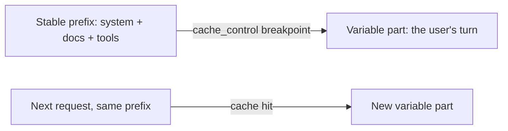

<LevelBadge level="advanced" />

<VerifyNote lastVerified="2026-06-20" source="https://docs.anthropic.com/en/docs/build-with-claude/prompt-caching">
Die Cache-Mechanik, die Berechtigung und die Preise von gecachten vs. frischen Tokens ändern sich — überprüfe dies in der offiziellen Prompt-Caching-Dokumentation.
</VerifyNote>

Wenn viele deiner Anfragen einen großen, unveränderlichen Block teilen — einen langen System-Prompt, ein großes Dokument, einen Tool-Katalog — ermöglicht dir das **Prompt-Caching**, dass die API den verarbeiteten Präfix wiederverwendet, statt ihn bei jedem Aufruf erneut einzulesen. Das senkt sowohl **Kosten** als auch **Latenz** beim gecachten Teil.

## Wie es funktioniert (das mentale Modell)

Du markierst einen **Cache-Breakpoint** nach dem stabilen Präfix. Beim ersten Aufruf wird er verarbeitet und gecacht; nachfolgende Aufrufe, die den **exakt gleichen Präfix** teilen, treffen den Cache und zahlen dafür deutlich weniger.

## Die Invariante, an der es steht oder fällt

:::warning Caching ist präfix-exakt
Ein Cache-Treffer erfordert, dass der gecachte Präfix **Byte für Byte identisch** ist. Der häufigste Fehler: ein *stiller Invalidator* nahe dem Anfang des Prompts — ein Zeitstempel, ein wechselnder Benutzername, eine umsortierte Tool-Liste — der den Präfix ändert und deine Trefferquote stillschweigend auf null fallen lässt.
:::

**Setze alles Stabile zuerst, alles Variable zuletzt** und halte den Präfix wirklich konstant.

## Wo es sich am meisten lohnt

- Lange **System-Prompts**, die über Nutzer hinweg wiederverwendet werden.
- **RAG / Dokument-Q&A**, bei dem derselbe Quelltext wiederholt abgefragt wird.
- **Agenten** mit einem festen Tool-Katalog und festen Anweisungen über viele Runden hinweg.

Kombiniere Caching mit **Batching** für Offline-Workloads und mit der richtigen Dimensionierung des Modells ([Ein Modell auswählen](/docs/api/choosing-a-model)) für die größten kombinierten Einsparungen — siehe [Kosten & Latenz](/docs/foundations/cost-and-latency).

## Weiter

- [Tokens, Kontext & Preise](/docs/api/tokens-and-pricing)
- [Streaming & mehrstufige Konversationen](/docs/api/streaming)
- [Agenten auf der API bauen](/docs/api/building-agents)
