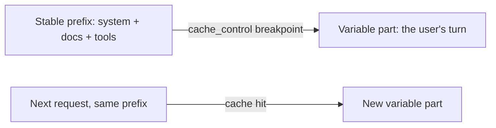

import Tabs from '@theme/Tabs';
import TabItem from '@theme/TabItem';

<LevelBadge level="advanced" />

<VerifyNote lastVerified="2026-06-21" source="https://docs.anthropic.com/en/docs/build-with-claude/prompt-caching">
Cache-Mechanik, Eignung sowie die Preisgestaltung von gecachten gegenüber frischen Tokens ändern sich — prüfe dies in der offiziellen Prompt-Caching-Dokumentation.
</VerifyNote>

Wenn viele deiner Anfragen einen großen, unveränderlichen Block teilen — einen langen System-Prompt, ein großes Dokument, einen Tool-Katalog — ermöglicht **Prompt-Caching** der API, den bereits verarbeiteten Präfix wiederzuverwenden, statt ihn bei jedem Aufruf erneut einzulesen. Das senkt sowohl **Kosten** als auch **Latenz** beim gecachten Teil.

## Wie es funktioniert (das mentale Modell)

Du markierst einen **Cache-Breakpoint** nach dem stabilen Präfix. Beim ersten Aufruf wird er verarbeitet und gecacht; nachfolgende Aufrufe, die den **exakt gleichen Präfix** teilen, treffen den Cache und zahlen dafür deutlich weniger.



## Den Breakpoint setzen (zum Kopieren)

Füge `cache_control` zum **letzten stabilen Block** hinzu — hier ein großer System-Prompt. Der Turn des Nutzers kommt danach und variiert frei; alles bis einschließlich des markierten Blocks wird gecacht.

<Tabs groupId="lang">
<TabItem value="python" label="Python">

```python
import anthropic

client = anthropic.Anthropic()

message = client.messages.create(
    model="claude-sonnet-4-6",
    max_tokens=1024,
    system=[
        {
            "type": "text",
            "text": LARGE_STABLE_PROMPT,  # long, unchanging — the cached prefix
            "cache_control": {"type": "ephemeral"},
        }
    ],
    messages=[{"role": "user", "content": "Summarize the key points."}],  # varies per call
)

print(message.usage.cache_read_input_tokens)  # > 0 means you got a hit
```

</TabItem>
<TabItem value="ts" label="TypeScript">

```ts
import Anthropic from "@anthropic-ai/sdk";

const client = new Anthropic();

const message = await client.messages.create({
  model: "claude-sonnet-4-6",
  max_tokens: 1024,
  system: [
    {
      type: "text",
      text: LARGE_STABLE_PROMPT, // long, unchanging — the cached prefix
      cache_control: { type: "ephemeral" },
    },
  ],
  messages: [{ role: "user", content: "Summarize the key points." }], // varies per call
});

console.log(message.usage.cache_read_input_tokens); // > 0 means you got a hit
```

</TabItem>
</Tabs>

Der erste Aufruf zahlt einen kleinen **Schreib**-Aufschlag, um den Cache zu befüllen; jeder spätere Aufruf mit demselben Präfix liest ihn zu einem Bruchteil des Eingabepreises zurück. Der Präfix muss lang genug sein, um in Frage zu kommen — einige tausend Tokens, je nach Modell —, sonst wird er stillschweigend nicht gecacht.

## Die Invariante, an der es steht oder fällt

:::warning Caching ist präfix-exakt
Ein Cache-Treffer erfordert, dass der gecachte Präfix **Byte für Byte identisch** ist. Der häufigste Fehler: ein *stiller Invalidator* nahe dem Anfang des Prompts — ein Zeitstempel, ein wechselnder Benutzername, eine umsortierte Tool-Liste — der den Präfix ändert und deine Trefferquote stillschweigend auf null fallen lässt.
:::

**Setze alles Stabile zuerst, alles Variable zuletzt** und halte den Präfix wirklich konstant.

## Prüfen, ob es tatsächlich funktioniert

Verlasse dich nicht auf Annahmen — lies es aus dem `usage` der Antwort zurück:

- **`cache_creation_input_tokens`** — Tokens, die bei diesem Aufruf in den Cache geschrieben wurden (die erste Anfrage).
- **`cache_read_input_tokens`** — Tokens, die aus dem Cache bedient wurden (die Einsparung).
- **`input_tokens`** — der nicht gecachte Rest, zum vollen Preis abgerechnet.

Wenn `cache_read_input_tokens` über wiederholte Anfragen hinweg, die einen Präfix teilen sollten, bei **null** bleibt, ist ein stiller Invalidator am Werk — vergleiche die gerenderten Prompt-Bytes zweier Aufrufe, um ihn zu finden.

## Wo es sich am meisten lohnt

- Lange **System-Prompts**, die über Nutzer hinweg wiederverwendet werden.
- **RAG / Dokument-Q&A**, bei dem derselbe Quelltext wiederholt abgefragt wird.
- **Agenten** mit einem festen Tool-Katalog und festen Anweisungen über viele Runden hinweg.

Kombiniere Caching mit **Batching** für Offline-Workloads und mit der richtigen Dimensionierung des Modells ([Ein Modell auswählen](/docs/api/choosing-a-model)) für die größten kombinierten Einsparungen — siehe [Kosten & Latenz](/docs/foundations/cost-and-latency).

## Weiter

- [Tokens, Kontext & Preise](/docs/api/tokens-and-pricing)
- [Streaming & mehrstufige Konversationen](/docs/api/streaming)
- [Agenten auf der API bauen](/docs/api/building-agents)
