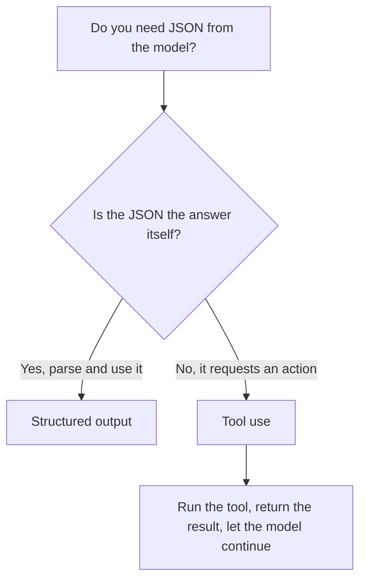

<LevelBadge level="intermediate" />

<VerifyNote lastVerified="2026-06-20" source="https://docs.anthropic.com/en/docs/build-with-claude/structured-outputs">
Der genaue Mechanismus zur Durchsetzung eines Schemas entwickelt sich weiter — überprüfe den aktuellen Ansatz (Output-Konfiguration / Parse-Helfer) in der offiziellen Dokumentation.
</VerifyNote>

Wenn Claudes Ausgabe in andere Software einfließt, brauchst du **zuverlässige Struktur** — jedes Mal gültiges JSON, das einer bekannten Form entspricht. Verlass dich nicht auf „antworte in JSON" und hoffe; nutze die Unterstützung für strukturierte Ausgaben der Plattform.

## Der zuverlässige Weg

Stelle ein **JSON-Schema** für die Ausgabe bereit und lass die API/das SDK es durchsetzen, parse es dann in ein typisiertes Objekt (z. B. Pydantic in Python, Zod in TypeScript). Die Parse-Helfer des SDK liefern dir ein typisiertes Ergebnis statt eines Strings, den du selbst mit `JSON.parse` parsen und validieren musst.

```python
# Conceptual shape — see the official docs for the current API surface.
from pydantic import BaseModel

class Ticket(BaseModel):
    title: str
    priority: str   # "low" | "medium" | "high"
    tags: list[str]

# Request the model to return data conforming to Ticket's JSON schema,
# then parse the response into a Ticket instance.
```

## Warum nicht einfach um JSON bitten?

Du *kannst* im Prompt um JSON bitten, und für einfache Fälle funktioniert das — aber es kann abdriften: vereinzelter Fließtext, ein nachgestelltes Komma, ein fehlendes Feld. Schema-durchgesetzte Ausgabe beseitigt diese Fehlerklasse, was in dem Moment wichtig wird, in dem ein nachgelagertes System davon abhängt.

## Strukturierte Ausgabe vs. Tool-Nutzung

Beide Funktionen übergeben dem Modell ein **JSON Schema**, daher sehen sie sich ähnlich — und man wählt die falsche. Der Unterschied liegt in der *Absicht*, nicht im Mechanismus:

| | **Strukturierte Ausgabe** | **[Tool-Nutzung](/docs/api/tool-use)** |
|---|---|---|
| Was du willst | Die **endgültige Antwort**, in einer festen Form | Dass das Modell eine **Fähigkeit aufruft** (eine Funktion aufrufen, Daten abrufen, eine Aktion ausführen) |
| Wer es verwendet | Dein Code, direkt | Dein Code führt das Tool aus und gibt das Ergebnis dann an das Modell zurück |
| Form des Turns | Eine Antwort, fertig | Eine Schleife: Modell fragt, du führst aus, Modell macht weiter |
| Typische Verwendung | Extraktion, Klassifikation, Parsen | Agenten, Live-Abfragen, Seiteneffekte |

Eine schnelle Faustregel:



Wenn das JSON *das* Ergebnis ist, nutze strukturierte Ausgabe. Wenn das JSON das Modell ist, das deinen Code bittet, *etwas zu tun*, dann ist das Tool-Nutzung. Agenten verwenden oft beides: Tools, um zu handeln, strukturierte Ausgabe, um ein sauberes Endergebnis zurückzugeben.

## Tipps

- **Halte Schemas eng.** Verwende Enums für feste Auswahlmöglichkeiten; markiere Pflichtfelder.
- **Beschreibe Felder.** Feldbeschreibungen leiten das Modell wie Mini-Prompts.
- **Validiere trotzdem** an der Grenze — defensives Parsen ist eine günstige Absicherung.
- Für **Extraktions**-Aufgaben schlägt strukturierte Ausgabe + ein klares Schema jedes Mal die freie Form.

## Weiter

- [Tool-Nutzung / Function Calling](/docs/api/tool-use) — Tools verwenden ebenfalls JSON-Schemas
- [Dein erster API-Aufruf](/docs/api/first-call)
- [Wiederverwendbare Prompt-Vorlagen](/docs/templates/prompts)
