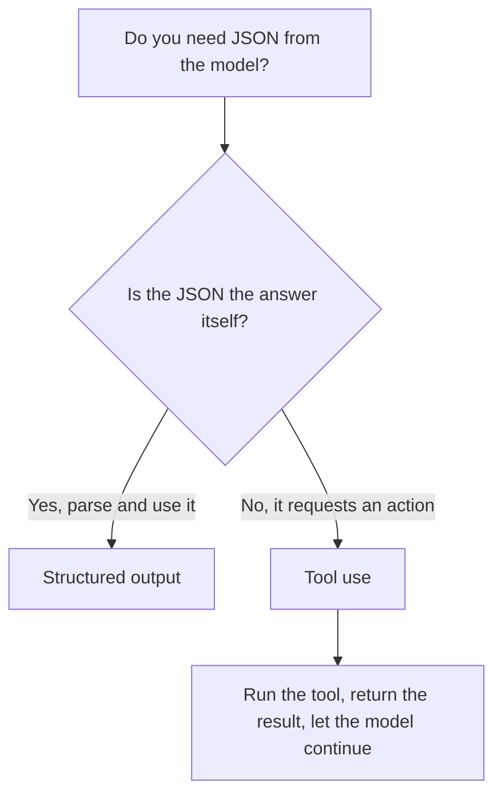

<LevelBadge level="intermediate" />

<VerifyNote lastVerified="2026-06-20" source="https://platform.claude.com/docs/en/docs/build-with-claude/structured-outputs">
Der genaue Mechanismus zur Durchsetzung eines Schemas entwickelt sich weiter — bestätige den aktuellen Ansatz (Output-Konfiguration / Parse-Helfer) in der offiziellen Dokumentation.
</VerifyNote>

<Callout type="objectives" items={["Erklären, warum schema-erzwungene Ausgabe besser ist als das Prompten nach JSON und Hoffen", "Ein JSON Schema bereitstellen und die Antwort in ein typisiertes Objekt parsen (Pydantic / Zod)", "Strukturierte Ausgabe von Tool Use anhand der Absicht unterscheiden, nicht anhand des Mechanismus", "Die vier Tipps für straffe, zuverlässige Schemas anwenden", "Mit einer Ein-Frage-Faustregel das richtige Werkzeug wählen"]} />

Wenn Claudes Ausgabe andere Software speist, brauchst du **zuverlässige Struktur** — jedes Mal valides JSON, das einer bekannten Form entspricht. Verlasse dich nicht auf „antworte in JSON" und Hoffnung; nutze die Unterstützung der Plattform für strukturierte Ausgabe.

Diese Lektion führt dich von *warum Prompt-and-Pray scheitert* zu *wie du ein Schema durchsetzt und es in ein typisiertes Objekt parst* — und wie du strukturierte Ausgabe von Tool Use unterscheidest, wenn sie identisch aussehen. Arbeite sie von oben nach unten durch und teste dich dann mit dem Quiz gegen Ende.

## Der zuverlässige Weg

Stelle ein **JSON Schema** für die Ausgabe bereit und lass die API/das SDK es durchsetzen, parse dann in ein typisiertes Objekt (z. B. Pydantic in Python, Zod in TypeScript). Die Parse-Helfer des SDK liefern dir ein typisiertes Ergebnis statt eines Strings, den du selbst mit `JSON.parse` verarbeiten und validieren musst.

<Steps items={[
  {title: "Die Form definieren", body: "Modelliere die benötigte Ausgabe als JSON Schema — in Python über ein Pydantic BaseModel, in TypeScript über ein Zod-Schema."},
  {title: "Schemakonforme Ausgabe anfordern", body: "Bitte das Modell, Daten zurückzugeben, die diesem Schema entsprechen, sodass die API/das SDK es durchsetzt, statt es dem Zufall zu überlassen."},
  {title: "In ein typisiertes Objekt parsen", body: "Nutze die Parse-Helfer des SDK, um direkt ein typisiertes Ergebnis zu erhalten — kein manuelles JSON.parse plus selbstgebaute Validierung."}
]} />

```python
# Conceptual shape — see the official docs for the current API surface.
from pydantic import BaseModel

class Ticket(BaseModel):
    title: str
    priority: str   # "low" | "medium" | "high"
    tags: list[str]

# Request the model to return data conforming to Ticket's JSON schema,
# then parse the response into a Ticket instance.
```

Möchtest du eine konkrete Anfrage zum Anpassen? Hier ist die Form dessen, was du dem Modell übergibst — ersetze das Modell durch dein eigenes Schema.

<PromptCard title="Schemakonforme Ausgabe anfordern">{`Return the data conforming to this JSON Schema:

{
  "title": "string",
  "priority": "low | medium | high",
  "tags": ["string"]
}

Do not include any prose outside the JSON.`}</PromptCard>

## Warum nicht einfach nach JSON prompten?

Du *kannst* im Prompt nach JSON fragen, und für einfache Fälle funktioniert das — aber es kann abdriften: streunende Prosa, ein nachgestelltes Komma, ein fehlendes Feld. Schema-erzwungene Ausgabe beseitigt diese Fehlerklasse, was in dem Moment zählt, in dem ein nachgelagertes System davon abhängt.

<Callout type="warning" items={["Geprompttes JSON funktioniert in Demos und bricht in der Produktion: Der Fehler zeigt sich erst, wenn ein nachgelagertes System es parst.", "Drei klassische Abdriftungen, auf die du achten solltest: streunende Prosa um das JSON herum, ein nachgestelltes Komma, ein fehlendes Pflichtfeld."]} />

## Strukturierte Ausgabe vs. Tool Use

Beide Funktionen übergeben dem Modell ein **JSON Schema**, also sehen sie gleich aus — und Leute wählen die falsche. Der Unterschied liegt in der *Absicht*, nicht im Mechanismus:

| | **Strukturierte Ausgabe** | **[Tool Use](/docs/api/tool-use)** |
|---|---|---|
| Was du willst | Die **endgültige Antwort**, in einer festen Form | Dass das Modell **eine Fähigkeit aufruft** (eine Funktion aufrufen, Daten abrufen, eine Aktion ausführen) |
| Wer es konsumiert | Dein Code, direkt | Dein Code führt das Tool aus und speist das Ergebnis zurück ins Modell |
| Form des Durchlaufs | Eine Antwort, fertig | Eine Schleife: Modell fragt, du führst aus, Modell macht weiter |
| Typischer Einsatz | Extraktion, Klassifizierung, Parsing | Agenten, Live-Abfragen, Seiteneffekte |

Eine schnelle Faustregel:



Wenn das JSON *das* Lieferergebnis ist, nutze strukturierte Ausgabe. Wenn das JSON das Modell ist, das deinen Code bittet, etwas zu *tun*, dann ist das Tool Use. Agenten nutzen oft beides: Tools, um zu handeln, strukturierte Ausgabe, um ein sauberes Endergebnis zurückzugeben.

## Tipps

<Callout type="tip" items={["Halte Schemas straff — nutze Enums für feste Auswahlmöglichkeiten; markiere Pflichtfelder.", "Beschreibe Felder — Feldbeschreibungen leiten das Modell wie Mini-Prompts.", "Validiere trotzdem an der Grenze — defensives Parsing ist eine günstige Versicherung.", "Für Extraktionsaufgaben schlägt strukturierte Ausgabe + ein klares Schema jedes Mal das Freiform-Format."]} />

<Callout type="takeaways" items={["Übergib der API/dem SDK ein JSON Schema und parse in ein typisiertes Objekt — kein Prompt-and-Pray.", "Das Prompten nach JSON kann abdriften (streunende Prosa, nachgestelltes Komma, fehlendes Feld); Schema-Durchsetzung beseitigt diese Fehlerklasse.", "Strukturierte Ausgabe vs. Tool Use unterscheiden sich durch die Absicht: Das JSON IST die Antwort vs. das JSON fordert eine Aktion an.", "Straffe Schemas, beschriebene Felder und Validierung an der Grenze machen Extraktion und Klassifizierung zuverlässig."]} />

## Die Begriffe festigen

<Flashcards cards={[
  {front: "Strukturierte Ausgabe", back: "Du übergibst der API/dem SDK ein JSON Schema für die endgültige Antwort und parst die Antwort in ein typisiertes Objekt (Pydantic / Zod). Das JSON IST das Lieferergebnis."},
  {front: "Tool Use", back: "Du übergibst dem Modell ein JSON Schema, damit es eine Fähigkeit aufrufen kann. Dein Code führt das Tool aus und speist dann das Ergebnis zurück — eine Schleife, keine Einmal-Antwort."},
  {front: "JSON Schema", back: "Die Form, auf die sich beide Funktionen stützen. In Python modellierst du sie mit einem Pydantic BaseModel; in TypeScript mit einem Zod-Schema."},
  {front: "Parse-Helfer", back: "SDK-Helfer, die direkt ein typisiertes Ergebnis zurückgeben, sodass du manuelles JSON.parse plus selbstgebaute Validierung umgehst."},
  {front: "Ein-Frage-Faustregel", back: "Ist das JSON die Antwort selbst? Ja → strukturierte Ausgabe. Nein, es fordert eine Aktion an → Tool Use."}
]} />

<Quiz title="Überprüfe dich selbst" questions={[
  {
    q: "Was ist der zuverlässige Weg, um strukturiertes JSON von Claude zu erhalten?",
    options: [
      "Im Prompt 'antworte in JSON' fragen und bei Fehlern erneut versuchen",
      "Ein JSON Schema bereitstellen, die API/das SDK es durchsetzen lassen und dann in ein typisiertes Objekt parsen",
      "Freien Text generieren und einen Regex schreiben, um die Felder zu extrahieren"
    ],
    answer: 1,
    explain: "Stelle ein JSON Schema bereit und lass die API/das SDK es durchsetzen, parse dann in ein typisiertes Objekt wie Pydantic (Python) oder Zod (TypeScript)."
  },
  {
    q: "Warum ist das Prompten nach JSON riskant, sobald ein nachgelagertes System davon abhängt?",
    options: [
      "Es ist langsamer als die Schema-Durchsetzung",
      "Es kann abdriften — streunende Prosa, ein nachgestelltes Komma oder ein fehlendes Feld",
      "Es kostet mehr Tokens als Tool Use"
    ],
    answer: 1,
    explain: "Geprompttes JSON funktioniert für einfache Fälle, kann aber abdriften; schema-erzwungene Ausgabe beseitigt diese Fehlerklasse."
  },
  {
    q: "Was unterscheidet strukturierte Ausgabe tatsächlich von Tool Use?",
    options: [
      "Strukturierte Ausgabe nutzt JSON Schema; Tool Use nicht",
      "Die Absicht: Strukturierte Ausgabe ist die endgültige Antwort in einer festen Form, Tool Use ruft eine Fähigkeit auf",
      "Tool Use ist für Python und strukturierte Ausgabe ist für TypeScript"
    ],
    answer: 1,
    explain: "Beide übergeben dem Modell ein JSON Schema, also sehen sie gleich aus. Der Unterschied liegt in der Absicht, nicht im Mechanismus — die endgültige Antwort vs. das Aufrufen einer Fähigkeit."
  },
  {
    q: "Welcher ist ein vernünftiger Rat für den Entwurf von Schemas?",
    options: [
      "Felder optional lassen und Enums zugunsten von Flexibilität weglassen",
      "Enums für feste Auswahlmöglichkeiten nutzen, Pflichtfelder markieren und trotzdem an der Grenze validieren",
      "Dem Schema vertrauen und die geparste Ausgabe nie validieren"
    ],
    answer: 1,
    explain: "Halte Schemas straff (Enums, Pflichtfelder), beschreibe Felder wie Mini-Prompts und validiere trotzdem an der Grenze als günstige Versicherung."
  }
]} />

## Weiter

- [Tool Use / Function Calling](/docs/api/tool-use) — Tools nutzen ebenfalls JSON-Schemas
- [Dein erster API-Aufruf](/docs/api/first-call)
- [Wiederverwendbare Prompt-Vorlagen](/docs/templates/prompts)
