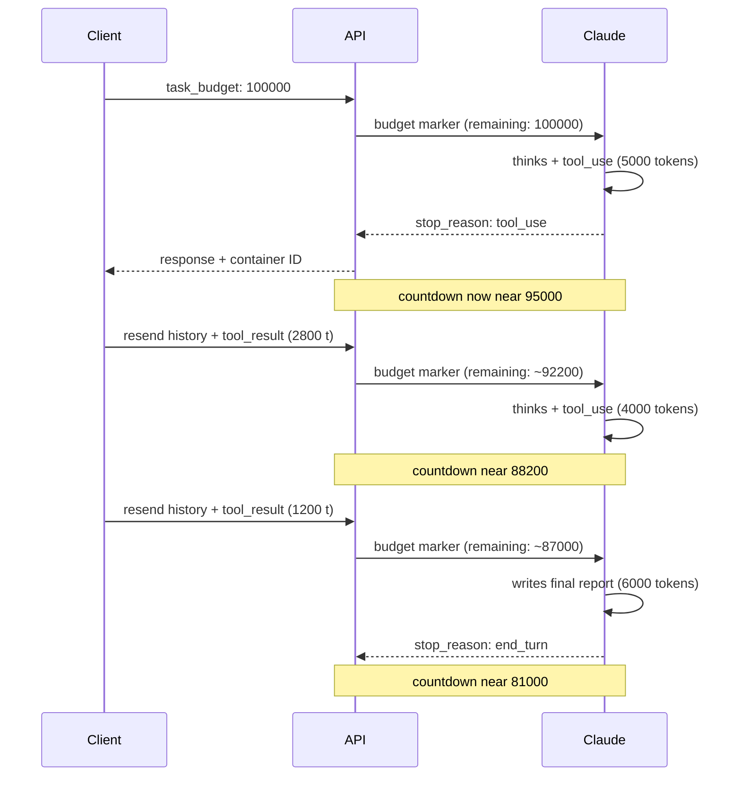

<LevelBadge level="advanced" />

<Callout type="objectives" items={[
  "Verstehen, was ein Task Budget ist — ein beratender, für das Modell sichtbarer Token-Countdown über eine gesamte agentische Schleife",
  "task_budget korrekt konfigurieren — innerhalb von output_config, mit dem Beta-Header task-budgets-2026-03-13, auf einem unterstützten Modell",
  "Erkennen, was tatsächlich gegen das Budget zählt (Tokens, die Claude in diesem Turn sieht) und was nicht (wiederholte Payload aus erneut gesendeter Historie)",
  "Eine Budgetgröße wählen, die hilft, statt ablehnungsähnliches Verhalten auszulösen — erst messen, dann großzügig setzen",
  "Ein Budget mit dem Feld remaining über eine Kompaktierung hinweg mitführen und die Falle der Prompt-Caching-Invalidierung vermeiden",
  "Task Budgets, Session Budgets, Effort und max_tokens auseinanderhalten — vier Hebel, vier verschiedene Aufgaben"
]} />

<VerifyNote lastVerified="2026-08-25" source="https://platform.claude.com/docs/en/build-with-claude/task-budgets">
Task Budgets befinden sich in der **öffentlichen Beta** — der Beta-Header (`task-budgets-2026-03-13`), die Liste der unterstützten Modelle, das Minimum von 20.000 Tokens und die exakten Feldnamen auf `output_config.task_budget` sind aus der offiziellen Referenz zitiert und können sich während der Beta ändern. Vor dem Ausliefern erneut verifizieren.
</VerifyNote>

Agenten mit langem Horizont verbrauchen Tokens auf eine Weise, die von außen schwer vorhersehbar ist. Eine einzelne Anfrage, die sich zu einem Dutzend Runden aus Denken plus Tool-Aufruf ausweitet, kann still und leise das 10-Fache eines typischen Turns kosten. **Task Budgets** sind Anthropics Antwort darauf: Man gibt Claude eine beratende Token-Obergrenze für die gesamte agentische Schleife und lässt das Modell sich *selbst regulieren* — sein Denken dosieren, Aktionen priorisieren und mit einer Zusammenfassung abschließen, wenn das Budget zur Neige geht, statt von `max_tokens` mitten in einem Tool-Aufruf abgeschnitten zu werden.

Zwei Dinge unterscheiden Task Budgets von jedem anderen Kostenhebel, den Sie vielleicht schon kennen:

- **Der Countdown ist für das Modell sichtbar.** Claude sieht eine serverseitig eingefügte laufende Markierung „verbleibende Tokens“ und passt sein Verhalten daran an. Ihr Client sieht diese Markierung nie in einem usage-Feld.
- **Er ist beratend, nicht erzwungen.** Task Budgets sind ein weicher Hinweis; die harte Obergrenze bleibt `max_tokens`. Das ist ein Feature — Claude kann das Budget gelegentlich überschreiten, wenn das Unterbrechen einer laufenden Aktion störender wäre als sie abzuschließen.

## Wie der Budget-Countdown funktioniert

Der Countdown spiegelt die Tokens wider, die **Claude in dieser Schleife verarbeitet hat** — Denken, Tool-Aufrufe, Tool-Ergebnisse und Ausgabe — nicht die Größe Ihrer Request-Payload. Wenn Ihr Client bei jedem Turn die vollständige Konversation erneut sendet, wächst die *Payload* monoton, aber das *Budget* verringert sich nur um das, was für Claude in diesem Turn neu ist.

<Callout type="warning" items={[
  "Der Countdown ist nur für das Modell sichtbar. API-Antworten enthalten kein Feld für das verbleibende Budget — kein task_budget-Eintrag in usage, kein SDK-Accessor dafür. Um den Verbrauch clientseitig zu verfolgen, summieren Sie output_tokens über alle Requests Ihrer Schleife.",
  "Wenn Ihr Client bei jedem Folge-Request die vollständige Historie sendet UND dabei remaining herunterzählt, sieht das Modell ein zu niedrig angegebenes Budget und schließt früher ab, als das Budget tatsächlich erlaubt. Setzen Sie ein großzügiges Budget und lassen Sie das Modell sich gegen den serverseitigen Countdown selbst regulieren."
]} />

## Ihren ersten budgetierten Request abschicken

<Steps items={[
  {title: "Den Beta-Header mitsenden", body: "Fügen Sie anthropic-beta: task-budgets-2026-03-13 zum Request hinzu. Ohne ihn wird output_config.task_budget ignoriert."},
  {title: "Ein unterstütztes Modell wählen", body: "Aktuell: Claude Opus 5, Fable 5, Mythos 5, Opus 4.8, Opus 4.7. Sonnet 5, Sonnet 4.6, Haiku 4.5 und das ältere Opus 4.6 werden NICHT unterstützt."},
  {title: "task_budget innerhalb von output_config setzen", body: "Das Objekt hat drei Felder — type (immer tokens), total (die Obergrenze in Tokens) und remaining (optional, um ein Budget über eine Kompaktierung hinweg mitzuführen). Das Minimum für total ist 20.000 Tokens; darunter gibt es einen 400-Fehler."},
  {title: "max_tokens großzügig halten", body: "task_budget umfasst die gesamte agentische Schleife; max_tokens ist die harte Obergrenze pro Request. Bei Effort high oder xhigh sollte max_tokens bei 64k oder mehr liegen, damit Claude pro Request genug Raum zum Denken und Handeln hat."}
]} />

<PromptCard title="Minimaler Request — einen Codebase-Review-Agenten auf 64k Tokens budgetieren">{`curl https://api.anthropic.com/v1/messages \\
  -H "x-api-key: $ANTHROPIC_API_KEY" \\
  -H "anthropic-version: 2023-06-01" \\
  -H "anthropic-beta: task-budgets-2026-03-13" \\
  -H "content-type: application/json" \\
  -d '{
    "model": "claude-opus-5",
    "max_tokens": 128000,
    "stream": true,
    "messages": [{
      "role": "user",
      "content": "Review the codebase and propose a refactor plan."
    }],
    "output_config": {
      "effort": "high",
      "task_budget": {"type": "tokens", "total": 64000}
    }
  }'`}</PromptCard>

## Welche Modelle es tatsächlich unterstützen

| Modell            | Unterstützung                                              |
| ----------------- | ---------------------------------------------------------- |
| Claude Opus 5     | Beta — `task-budgets-2026-03-13` setzen                    |
| Claude Fable 5    | Beta — `task-budgets-2026-03-13` setzen                    |
| Claude Mythos 5   | Beta — `task-budgets-2026-03-13` setzen                    |
| Claude Sonnet 5   | Nicht unterstützt                                          |
| Claude Opus 4.8   | Beta — `task-budgets-2026-03-13` setzen                    |
| Claude Opus 4.7   | Beta — `task-budgets-2026-03-13` setzen                    |
| Claude Opus 4.6   | Nicht unterstützt                                          |
| Claude Sonnet 4.6 | Nicht unterstützt                                          |
| Claude Haiku 4.5  | Nicht unterstützt                                          |

Task Budgets werden auf [Claude Code](/docs/claude-code/what-is-claude-code) oder Cowork-Oberflächen **nicht** unterstützt — nutzen Sie sie direkt über die Messages API auf einem der unterstützten Modelle. Wenn Sie stattdessen eine harte Dollar-Obergrenze für eine Managed-Agents-Session brauchen, ist das ein separates Feature: [Managed Agents Session Budgets](/docs/api/managed-agents-session-budgets).

## Ein Budget wählen — erst messen, nicht raten

Das richtige Budget hängt davon ab, wie viel Arbeit Ihre Schleife aktuell leistet. Anthropics eigene Empfehlung: **erst messen, dann feinjustieren.**

<Steps items={[
  {title: "Eine repräsentative Stichprobe OHNE task_budget laufen lassen", body: "Summieren Sie für jede Aufgabe in der Stichprobe usage.output_tokens über jeden Request der Schleife, plus die Token-Größe aller Tool-Ergebnisse, die Sie zwischen den Requests angehängt haben. Das ist die Gesamtmenge, die das Modell gesehen hat."},
  {title: "Das p99 Ihrer Verteilung pro Aufgabe nehmen", body: "Starten Sie dort. Ziel ist, Claude genug Spielraum zu geben, damit budgetierte Läufe nicht plötzlich hinter Ihrer aktuellen Baseline zurückbleiben."},
  {title: "Vom p99 aus nach oben oder unten justieren", body: "Wenn Claude regelmäßig zu früh abschließt, erhöhen Sie das Budget. Wenn Aufgaben konstant deutlich darunter bleiben, setzen Sie die Obergrenze niedriger, um Disziplin zu erzwingen. Gehen Sie nie unter das Minimum von 20.000 Tokens — die API gibt einen 400-Fehler zurück."}
]} />

<Callout type="warning" items={[
  "Ein für die Aufgabe zu kleines Budget kann ablehnungsähnliches Verhalten auslösen. Wenn Claude ein Budget sieht, das für die Arbeit klar unzureichend ist (etwa 20.000 Tokens für eine mehrstündige agentische Coding-Aufgabe), kann es die Aufgabe ablehnen, sie aggressiv verkleinern oder früh mit einem Teilergebnis stoppen — statt Arbeit zu beginnen, die es nicht abschließen kann.",
  "Wenn Sie nach dem Hinzufügen eines Budgets unerwartete Ablehnungen oder vorzeitige Stopps beobachten, erhöhen Sie das Budget, bevor Sie andere Parameter debuggen. Dimensionieren Sie anhand Ihrer tatsächlichen Verteilung der Aufgabenlängen, nicht anhand eines festen Standardwerts."
]} />

## Ein Budget über eine Kompaktierung hinweg mitführen

Wenn Ihre Schleife den Kontext zwischen Requests kompaktiert oder umschreibt — etwa frühere Turns zusammenfasst, um die Payload zu verkleinern — hat der Server **keine Erinnerung an das vor der Kompaktierung verbrauchte Budget**. Übergeben Sie `remaining` beim nächsten Request, damit der Countdown dort weiterläuft, wo Sie aufgehört haben:

<PromptCard title="Python — remaining über eine Kompaktierung hinweg mitführen">{`# Tokens spent before compaction, tracked client-side
tokens_spent_so_far = 45000

output_config = {
    "effort": "high",
    "task_budget": {
        "type": "tokens",
        "total": 128000,
        "remaining": 128000 - tokens_spent_so_far,
    },
}`}</PromptCard>

**Bei Schleifen, die bei jedem Turn die vollständige, unkompaktierte Historie erneut senden, lassen Sie `remaining` weg** und überlassen dem Server das Verfolgen des Countdowns. Es manuell zu setzen, wenn es nicht nötig ist, lädt zu Abweichungen ein zwischen dem, was Ihr Client als verbraucht annimmt, und dem, was Claude tatsächlich gesehen hat.

## Wechselwirkungen mit anderen Parametern

| Wechselwirkung mit   | Wie es zusammenspielt                                                                                                                                                                                                                                                                                                         |
| -------------------- | ------------------------------------------------------------------------------------------------------------------------------------------------------------------------------------------------------------------------------------------------------------------------------------------------------------------------------ |
| `max_tokens`         | **Orthogonal.** `max_tokens` ist eine harte Obergrenze pro Request; `task_budget` ist eine beratende Obergrenze über die gesamte Schleife. Keiner der beiden Werte muss auf oder unter dem anderen liegen. Kombinieren Sie sie: `task_budget` gibt Claude ein Ziel, an dem es sich orientiert, `max_tokens` verhindert unkontrollierte Generierung in einem einzelnen Request. |
| [Effort](/docs/api/effort-tuning) | **Komplementär.** Effort steuert, wie tief Claude pro Schritt nachdenkt (Breite des Denkens). Task Budgets steuern, wie viel Gesamtarbeit die Schleife leisten darf (Breite der Iteration). Beide zusammen abstimmen.                                                                                                        |
| [Adaptives Denken](https://platform.claude.com/docs/en/build-with-claude/thinking) | Task Budgets **schließen** Thinking-Tokens in die Zählung ein, sodass adaptives Denken natürlich herunterskaliert, wenn sich das Budget erschöpft.                                                                                                                                                                             |
| [Prompt Caching](/docs/api/prompt-caching) | **Falle der Cache-Invalidierung.** Die Countdown-Markierung wird pro Turn eingefügt und stimmt zwischen Requests nicht überein. Wenn Ihr Client `task_budget.remaining` bei jedem Folge-Request herunterzählt, invalidiert der geänderte Wert jedes Cache-Präfix, das ihn enthält. Setzen Sie das Budget einmal beim initialen Request und lassen Sie das Modell sich selbst regulieren. |

## Task Budget im Vergleich zu den anderen Budgets

Ailmanac behandelt bereits drei Features in „Budget“-Form. Sie sind nicht austauschbar.

| Feature                                                                          | Einheit         | Geltungsbereich                     | Durchsetzung                               | Benötigter Header                              |
| -------------------------------------------------------------------------------- | --------------- | ----------------------------------- | ------------------------------------------ | ---------------------------------------------- |
| **Task Budgets** (diese Seite)                                                   | Tokens          | Eine agentische Schleife (ggf. viele Requests) | **Beratend** — weicher Hinweis an das Modell | `anthropic-beta: task-budgets-2026-03-13`      |
| **`max_tokens`**                                                                 | Tokens          | Ein Request                         | **Hart** — schneidet ab mit `stop_reason: max_tokens` | Keiner                                         |
| **`output_config.effort`**                                                       | Effort-Stufe    | Tiefe pro Schritt                   | Beratend (vom Modell gesteuert)            | Keiner                                         |
| [**Managed Agents Session Budgets**](/docs/api/managed-agents-session-budgets)   | US-Cent         | Eine ganze Managed-Agents-Session   | **Hart** — Server pausiert bei `budget_reached` | Managed-Agents-Beta-Header                     |

Stellen Sie es sich so vor: `max_tokens` ist eine Sicherung (brennt an einem festen Punkt durch), das Task Budget ist ein Coach, der Claude den Spielstand zuflüstert (passt das Spiel an), Effort ist der Spielstil, und das Session Budget ist der Buchhalter, der die Gehaltsobergrenze durchsetzt. Nutzen Sie alle vier zusammen, wenn Sie begrenzte, selbstregulierende, dollar-gedeckelte Agenten brauchen.

## Testen Sie sich selbst

<Quiz questions={[
  {
    q: "Sie setzen task_budget.total auf 100000 für einen Codebase-Audit-Agenten. Während des Laufs wächst die kumulierte Payload Ihres Clients über die Requests hinweg auf 250000 Tokens, weil Sie bei jedem Turn die vollständige Historie erneut senden. Was macht der Countdown, den Claude am Ende sieht?",
    options: [
      "Er ging auf null und der Lauf wurde abgebrochen — Sie haben das Budget überschritten",
      "Er verringert sich nur um das, was Claude in diesem Turn tatsächlich verarbeitet, nicht um die Größe der erneut gesendeten Payload — die vollständige Historie zählt einmal",
      "Er entspricht Ihrer Payload-Größe — 250000 überschreitet 100000, also hat Claude abgelehnt",
      "Er verringert sich nur bei Output-Tokens, hat sich also kaum bewegt"
    ],
    answer: 1,
    explain: "Das Task Budget zählt, was Claude in jedem Turn sieht — Denken, Tool-Aufrufe, Tool-Ergebnisse und Text — nicht die Größe der Request-Payload. Wiederholte Historie in Folge-Requests wird einmal gezählt; neuer Inhalt (wie frische Tool-Ergebnisse) zählt gegen das Budget, sobald er erscheint."
  },
  {
    q: "Sie kompaktieren den Kontext zwischen Requests. Was tun Sie, damit der Countdown nicht zurückgesetzt wird?",
    options: [
      "Nichts — der Server verfolgt das Budget automatisch über die Kompaktierung hinweg",
      "max_tokens beim Folge-Request erhöhen",
      "task_budget.remaining beim nächsten Request übergeben, gesetzt auf total minus das, was Sie bereits clientseitig verfolgt haben",
      "Ein neues task_budget.total in Höhe des verbleibenden Betrags setzen"
    ],
    answer: 2,
    explain: "Wenn Sie den Kontext kompaktieren oder umschreiben, hat der Server keine Erinnerung an den Budgetverbrauch vor der Kompaktierung. Übergeben Sie beim nächsten Request das Feld remaining, gesetzt auf (total - tokens_spent_so_far), clientseitig verfolgt."
  },
  {
    q: "Sie setzen task_budget.total auf 20000 für eine lange agentische Coding-Aufgabe, und Claude lehnt plötzlich ab oder stoppt früh mit einem Teilergebnis. Was ist die Lösung?",
    options: [
      "anthropic-beta: task-budgets-strict-2026-03-13 hinzufügen, um Einhaltung zu erzwingen",
      "Das Budget erhöhen — 20k ist der minimal akzeptierte Wert, und ein für die Aufgabe klar unzureichendes Budget kann ablehnungsähnliches Verhalten auslösen",
      "max_tokens senken, damit es zum Budget passt",
      "Zu Sonnet 5 wechseln, das kleine Budgets besser handhabt"
    ],
    answer: 1,
    explain: "Ein für die Aufgabe zu kleines Budget löst ablehnungsähnliches Verhalten aus — Claude kann Arbeit ablehnen, die es nicht abschließen kann. Erhöhen Sie zuerst das Budget; messen Sie Ihre tatsächliche Verteilung der Aufgabenlängen und dimensionieren Sie anhand des p99 statt eines festen Standardwerts. (Außerdem: Sonnet 5 unterstützt Task Budgets überhaupt nicht.)"
  }
]} />

## Vokabular

<Flashcards title="Task-Budget-Glossar" cards={[
  {front: "task_budget", back: "Objekt innerhalb von output_config mit den Feldern type ('tokens'), total (Obergrenze) und optional remaining (zum Mitführen über eine Kompaktierung hinweg). Das Minimum für total ist 20.000."},
  {front: "task-budgets-2026-03-13", back: "Der anthropic-beta-Header, der zum Opt-in erforderlich ist. Ohne ihn wird output_config.task_budget ignoriert."},
  {front: "Countdown-Markierung", back: "Serverseitig eingefügte Markierung, die Claude in jedem Turn sieht und die die verbleibenden Tokens in der aktuellen agentischen Schleife anzeigt. Wird nie im usage-Objekt der Antwort ausgegeben."},
  {front: "Beratend, nicht erzwungen", back: "Task Budgets sind ein weicher Hinweis — Claude kann gelegentlich überziehen, um eine laufende Aktion nicht zu unterbrechen. Die harte Obergrenze bleibt max_tokens."},
  {front: "remaining", back: "Optionales Feld, um ein Budget über eine Kompaktierung hinweg mitzuführen. Bei Schleifen, die die vollständige unkompaktierte Historie erneut senden, weglassen — den Server verfolgen lassen."},
  {front: "Ablehnungsähnliches Verhalten", back: "Wenn Claude ein Budget sieht, das für die Aufgabe klar zu klein ist, kann es ablehnen, den Umfang reduzieren oder früh stoppen. Lösung: Budget erhöhen, bevor andere Parameter debuggt werden."}
]} />

## Kernaussagen

<Callout type="takeaways" items={[
  "Task Budgets sind ein FÜR DAS MODELL SICHTBARER, BERATENDER Token-Countdown über die gesamte agentische Schleife — Claude reguliert sich daran selbst",
  "Opt-in mit dem Beta-Header task-budgets-2026-03-13 auf einem unterstützten Modell — Opus 5, Fable 5, Mythos 5, Opus 4.8 oder Opus 4.7. Sonnet, Haiku und Claude Code unterstützen es nicht",
  "Der Countdown zählt Tokens, die CLAUDE in diesem Turn SIEHT — nicht die Größe der erneut gesendeten Payload — wiederholte Historie wird also nicht doppelt berechnet",
  "Erst messen (p99 Ihrer Token-Verteilung pro Aufgabe), dann großzügig setzen. Zu klein dimensionierte Budgets verursachen ablehnungsähnliches Verhalten",
  "Nutzen Sie remaining, um das Budget über eine Kompaktierung hinweg mitzuführen; lassen Sie es weg, wenn Sie unkompaktierte Historie erneut senden, und überlassen Sie dem Server das Verfolgen",
  "Kombinieren Sie mit max_tokens als harte Sicherung und mit effort zur Feinabstimmung der Tiefe pro Schritt — vier Hebel, die vier verschiedene Aufgaben erfüllen"
]} />

## Weiter

- [Effort-Tuning](/docs/api/effort-tuning) — die fünf Effort-Stufen und wie sie mit Task Budgets zusammenspielen
- [Managed Agents Session Budgets](/docs/api/managed-agents-session-budgets) — harte Dollar-Obergrenzen für eine Session, von der Plattform durchgesetzt
- [Prompt Caching](/docs/api/prompt-caching) — wie sich die Falle der Cache-Invalidierung bei sich ändernden Budgetwerten auswirkt
- [Code-Execution-Tool](/docs/api/code-execution) — die Sandbox-Laufzeit, auf die sich langlaufende Agenten oft stützen
- [Agenten auf Claude bauen](/docs/api/building-agents) — der vollständige Lebenszyklus der agentischen Schleife, den diese Budgets prägen
