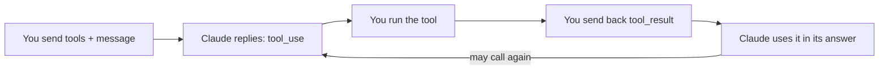

import Tabs from '@theme/Tabs';
import TabItem from '@theme/TabItem';

<LevelBadge level="intermediate" />

<VerifyNote lastVerified="2026-06-20" source="https://platform.claude.com/docs/en/docs/build-with-claude/tool-use">
Die Anfrage-/Antwortformen der Tool-Nutzung sind stabil, entwickeln sich aber weiter — überprüfe die Felder in der offiziellen Tool-Use-Dokumentation.
</VerifyNote>

**Tool-Nutzung** lässt Claude Funktionen aufrufen, die *du* definierst — Suche, einen Rechner, deine Datenbank, jede beliebige API — und die Ergebnisse verwenden. Sie ist die Grundlage jedes [Agenten](/docs/api/building-agents).

## Die Schleife



1. Du fügst eine Liste von **Tool-Definitionen** hinzu (Name, Beschreibung, JSON-Schema-Eingabe).
2. Wenn Claude entscheidet, eines zu verwenden, gibt es einen `tool_use`-Block (mit Argumenten) zurück und stoppt.
3. **Du führst** das Tool aus und sendest die Ausgabe als `tool_result` zurück.
4. Claude fährt fort und ruft möglicherweise weitere Tools auf, bis es antwortet.

## Ein Tool definieren (Python)

```python
tools = [{
    "name": "get_weather",
    "description": "Get current weather for a city.",
    "input_schema": {
        "type": "object",
        "properties": {"city": {"type": "string"}},
        "required": ["city"],
    },
}]

msg = client.messages.create(
    model="claude-sonnet-4-6", max_tokens=1024,
    tools=tools,
    messages=[{"role": "user", "content": "What's the weather in Rome?"}],
)
# If msg.stop_reason == "tool_use": run the tool, then send a tool_result back.
```

## Tipps

- **Beschreibungen sind Prompts.** Eine klare Tool-`description` und Parameterdokumentation verbessern enorm, wann/wie Claude es aufruft.
- **Validiere Eingaben**, die du erhältst, vor der Ausführung — vertraue ihnen niemals blind.
- **Gib Fehler als Ergebnisse zurück.** Wenn ein Tool fehlschlägt, sende ein `tool_result`, das den Fehler beschreibt, damit Claude sich erholen kann.
- **Serverseitige Tools.** Anthropic bietet auch integrierte Tools (z. B. Websuche, Codeausführung, Computernutzung) — schau in die Dokumentation für das aktuelle Angebot.

:::warning Tools = Aktionen = Risiko
Ein Tool, das echte Aktionen ausführt, erbt ein Sicherheitsmodell. Wende Least Privilege an und behalte einen Menschen bei riskanten Aufrufen in der Schleife — siehe [Agenten & Tools absichern](/docs/security/securing-agents).
:::

## Weiter

- [Agenten auf der API bauen](/docs/api/building-agents)
- [Strukturierte Ausgabe](/docs/api/structured-output)
- [MCP & Verbindung zu Tools](/docs/api/mcp)
