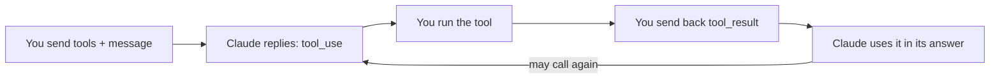

import Tabs from '@theme/Tabs';
import TabItem from '@theme/TabItem';

<LevelBadge level="intermediate" />

<VerifyNote lastVerified="2026-06-20" source="https://platform.claude.com/docs/en/docs/build-with-claude/tool-use">
Die Anfrage-/Antwortformate der Tool-Nutzung sind stabil, entwickeln sich aber weiter — bestätige die Felder in der offiziellen Tool-Use-Dokumentation.
</VerifyNote>

**Tool-Nutzung** ermöglicht es Claude, Funktionen aufzurufen, die *du* definierst — eine Suche, einen Taschenrechner, deine Datenbank, jede beliebige API — und deren Ergebnisse zu verwenden. Sie ist die Grundlage jedes [Agenten](/docs/api/building-agents).

<Callout type="objectives" items={["Wie die vierstufige agentische Schleife funktioniert, von den Tool-Definitionen bis zur finalen Antwort","Wie man ein Tool in Python mit Name, Beschreibung und JSON-Schema-Eingabe definiert","Warum Tool-Beschreibungen als Prompts wirken, die prägen, wann und wie Claude sie aufruft","Wie man Eingaben validiert, Fehler als Ergebnisse zurückgibt und serverseitige Tools sicher nutzt"]} />

## Die Schleife

Tool-Nutzung ist ein Dialog, kein einzelner Aufruf. Du reichst Claude ein Menü von Tools; Claude wählt eines aus und pausiert; du führst es aus und meldest zurück; Claude fügt das Ergebnis in seine Antwort ein — und wiederholt das bei Bedarf.

<Steps items={[{title: "Schicke das Menü", body: "Du fügst eine Liste von Tool-Definitionen hinzu — jede mit einem Namen, einer Beschreibung und einer JSON-Schema-Eingabe."}, {title: "Claude wählt ein Tool", body: "Wenn Claude beschließt, eines zu verwenden, gibt es einen tool_use-Block mit Argumenten zurück und stoppt."}, {title: "Du führst aus", body: "Du führst das Tool selbst aus und schickst die Ausgabe als tool_result zurück."}, {title: "Claude fährt fort", body: "Claude fährt fort, ruft möglicherweise weitere Tools auf, bis es antwortet."}]} />

## Ein Tool definieren (Python)

Eine Tool-Definition ist einfach ein Name, eine Beschreibung in einfacher Sprache und ein JSON-Schema für die Eingabe. Übergib sie in `tools` und prüfe dann `stop_reason`, um zu erkennen, wann Claude handeln möchte.

<PromptCard title="get_weather-Tool + erster Aufruf">{`tools = [{
    "name": "get_weather",
    "description": "Get current weather for a city.",
    "input_schema": {
        "type": "object",
        "properties": {"city": {"type": "string"}},
        "required": ["city"],
    },
}]

msg = client.messages.create(
    model="claude-sonnet-4-6", max_tokens=1024,
    tools=tools,
    messages=[{"role": "user", "content": "What's the weather in Rome?"}],
)
# If msg.stop_reason == "tool_use": run the tool, then send a tool_result back.`}</PromptCard>

## Tipps

Kleine Entscheidungen darüber, wie du Tools definierst und verarbeitest, machen einen großen Unterschied bei der Zuverlässigkeit.

- **Beschreibungen sind Prompts.** Eine klare Tool-`description` und Parameter-Dokumentation verbessern enorm, wann/wie Claude es aufruft.
- **Validiere Eingaben**, die du erhältst, bevor du sie ausführst — vertraue ihnen niemals blind.
- **Gib Fehler als Ergebnisse zurück.** Wenn ein Tool fehlschlägt, schicke ein `tool_result`, das den Fehler beschreibt, damit Claude sich erholen kann.
- **Serverseitige Tools.** Anthropic bietet außerdem integrierte Tools an (z. B. Websuche, Codeausführung, Computer-Use) — prüfe die Dokumentation für das aktuelle Menü.

:::warning Tools = Aktionen = Risiko
Ein Tool, das echte Aktionen ausführt, erbt ein Sicherheitsmodell. Wende das Least-Privilege-Prinzip an und behalte bei riskanten Aufrufen einen Menschen in der Schleife — siehe [Agenten & Tools absichern](/docs/security/securing-agents).
:::

<Flashcards title="Vokabular der Tool-Nutzung" cards={[{front: "tool_use-Block", back: "Was Claude zurückgibt, wenn es beschließt, ein Tool aufzurufen — einschließlich der Argumente — woraufhin es stoppt und auf dich wartet."}, {front: "tool_result", back: "Die Nachricht, die du zurückschickst und die die Ausgabe des Tools trägt (oder eine Fehlerbeschreibung, damit Claude sich erholen kann)."}, {front: "input_schema", back: "Das JSON-Schema, das die Eingaben eines Tools beschreibt: Typen, Eigenschaften und welche Felder erforderlich sind."}, {front: "Serverseitige Tools", back: "Integrierte Tools, die Anthropic anbietet, z. B. Websuche, Codeausführung, Computer-Use — prüfe die Dokumentation für das aktuelle Menü."}]} />

<Quiz title="Überprüfe dich selbst" questions={[{q: "Nachdem Claude einen tool_use-Block zurückgegeben hat, wer führt das Tool aus?", options: ["Claude führt es automatisch auf Anthropics Servern aus", "Du führst es aus und schickst die Ausgabe als tool_result zurück", "Das JSON-Schema führt es aus"], answer: 1, explain: "Claude gibt einen tool_use-Block zurück und stoppt; du führst das Tool aus und schickst das Ergebnis als tool_result zurück."}, {q: "Ein von dir definiertes Tool schlägt zur Laufzeit fehl. Was ist das empfohlene Vorgehen?", options: ["Stillschweigend erneut versuchen, bis es gelingt", "Ein tool_result schicken, das den Fehler beschreibt, damit Claude sich erholen kann", "Den Dialog beenden"], answer: 1, explain: "Gib Fehler als Ergebnisse zurück — ein tool_result, das den Fehlschlag beschreibt, lässt Claude sich erholen."}, {q: "Warum ist eine klare Tool-Beschreibung so wichtig?", options: ["Sie dient nur der Dokumentation und Claude ignoriert sie", "Beschreibungen sind Prompts — sie prägen, wann und wie Claude das Tool aufruft", "Sie ändert die Validierungsregeln des JSON-Schemas"], answer: 1, explain: "Beschreibungen sind Prompts: Eine klare Beschreibung und Parameter-Dokumentation verbessern enorm, wann und wie Claude ein Tool aufruft."}]} />

<Callout type="takeaways" items={["Tool-Nutzung ist eine Schleife: Tool-Definitionen schicken, Claude gibt einen tool_use-Block zurück und stoppt, du führst aus und gibst ein tool_result zurück, Claude fährt fort, bis es antwortet.","Eine Tool-Definition ist ein Name, eine Beschreibung und eine JSON-Schema-Eingabe — übergib sie in tools und prüfe stop_reason == tool_use.","Beschreibungen sind Prompts; validiere Eingaben vor der Ausführung; gib Fehlschläge als tool_result-Fehler zurück, damit Claude sich erholen kann.","Anthropic bietet außerdem serverseitige Tools an, und jedes Tool, das echte Aktionen ausführt, braucht Least Privilege plus einen Menschen in der Schleife."]} />

## Weiter

- [Agenten auf der API bauen](/docs/api/building-agents)
- [Strukturierte Ausgabe](/docs/api/structured-output)
- [MCP & Verbindung mit Tools](/docs/api/mcp)
