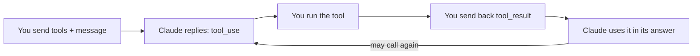

<LevelBadge level="intermediate" />

**Tool-Nutzung** ermöglicht es Claude, Funktionen aufzurufen, die *du* definierst — eine Suche, einen Taschenrechner, deine Datenbank, jede beliebige API — und deren Ergebnisse zu verwenden. Sie ist die Grundlage jedes [Agenten](/docs/api/building-agents).

Die meisten Tutorials zur Tool-Nutzung hören nach der vierstufigen Schleife auf. Die Schleife ist der einfache Teil. Was Integrationen in der Produktion tatsächlich zerlegt, ist spezifischer und wird seltener diskutiert: die Nachrichtenformen, die ein `400` zurückgeben, das Fehlerfeld, mit dem Claude sich erholen kann statt sich zu entschuldigen, und die Tatsache, dass **das Erzwingen eines Tool-Aufrufs auf den neuesten Claude-Modellen nicht mehr funktioniert**. Diese Seite deckt all das ab.

<Callout type="objectives" items={["Wie die vierstufige agentische Schleife funktioniert, von den Tool-Definitionen bis zur finalen Antwort","Wie man eine Tool-Definition schreibt — und Beschreibungen, die tatsächlich steuern, wann Claude das Tool aufruft","Die drei Regeln zur Nachrichtenform, die einen 400er zurückgeben, und der Fehlertext, der dir verrät, welche du gebrochen hast","Warum tool_choice \"any\" und \"tool\" auf den neuesten Modellen jetzt fehlschlagen, und die zwei Ersatzlösungen","Wie man mit strict: true schemakonforme Tool-Eingaben garantiert","Warum Tool-Ergebnisse der mit Abstand wahrscheinlichste Ort sind, an dem eine Prompt Injection deinen Agenten erreicht"]} />

<VerifyNote lastVerified="2026-09-29" source="https://platform.claude.com/docs/en/agents-and-tools/tool-use/define-tools">
Die Felder der Tool-Definition, die `tool_choice`-Unterstützungsmatrix, die Formatierungsregeln für
`tool_result`, das Verhalten von `is_error` und die Semantik von `strict: true` wurden am
29. September 2026 gegen Anthropics Seiten „Define tools“, „Handle tool calls“ und „Strict tool use“
verifiziert. Die Modellunterstützung für erzwungene Tool-Nutzung ändert sich mit jedem Release —
prüfe die Unterstützungsmatrix auf der Define-tools-Seite erneut, bevor du dich darauf verlässt, und
siehe [Aktuelle Modelle & Preise](/docs/whats-new/models-and-pricing) für die aktuelle Aufstellung.
</VerifyNote>

## Die Schleife

Tool-Nutzung ist ein Dialog, kein einzelner Aufruf. Du reichst Claude ein Menü von Tools; Claude wählt eines aus und pausiert; du führst es aus und meldest zurück; Claude fügt das Ergebnis in seine Antwort ein — und wiederholt das bei Bedarf.


```mermaid
flowchart LR
  A[You send tools + message] --> B[Claude replies: tool_use]
  B --> C[You run the tool]
  C --> D[You send back tool_result]
  D --> E[Claude uses it in its answer]
  E -->|may call again| B
```

<Steps items={[{title: "Schicke das Menü", body: "Du fügst eine Liste von Tool-Definitionen hinzu — jede mit einem Namen, einer Beschreibung und einer JSON-Schema-Eingabe."}, {title: "Claude wählt ein Tool", body: "Wenn Claude beschließt, eines zu verwenden, kommt die Antwort mit stop_reason \"tool_use\" zurück, dazu ein oder mehrere tool_use-Blöcke, die jeweils eine id, einen name und ein input-Objekt tragen."}, {title: "Du führst aus", body: "Du führst das Tool selbst aus und schickst die Ausgabe als tool_result zurück, das auf die tool_use-id verweist."}, {title: "Claude fährt fort", body: "Claude fährt fort, ruft möglicherweise weitere Tools auf, bis es mit einem normalen stop_reason antwortet."}]} />

Beachte den Plural in Schritt 2: Claude kann **mehrere `tool_use`-Blöcke in einer Antwort** zurückgeben. Verzweige über das `type`-Feld jedes Blocks, statt `content[0]` anzunehmen — eine Antwort beginnt meist mit einem `text`-Block, und auf den neuesten Modellen kann sie stattdessen mit `thinking`-Blöcken beginnen.

## Ein Tool definieren

Eine Tool-Definition ist ein Name, eine Beschreibung in einfacher Sprache und ein JSON Schema für die Eingabe.

| Feld | Erforderlich | Hinweise |
| --- | --- | --- |
| `name` | ja | Muss dem Regex `^[a-zA-Z0-9_-]{1,128}$` entsprechen |
| `description` | ja | Was es tut, wann man es nutzt, wann *nicht*. Ziel: mindestens 3–4 Sätze |
| `input_schema` | ja | Ein JSON-Schema-Objekt, das die Parameter beschreibt |
| `input_examples` | nein | Ein Array von Beispiel-Eingabeobjekten, jedes valide gegen das Schema |
| `strict` | nein | Auf `true` setzen, um schemakonforme Eingaben zu erzwingen — siehe unten |
| `cache_control` | nein | Die Definition über Turns hinweg cachen (siehe [Prompt Caching](/docs/api/prompt-caching)) |

<PromptCard title="get_weather-Tool + erster Aufruf (Python)">{`tools = [{
    "name": "get_weather",
    "description": (
        "Get the current weather for a city. Use this when the user asks about "
        "present conditions or temperature in a named place. Returns temperature "
        "in the requested unit plus a one-word sky condition. It does NOT return "
        "forecasts — use get_forecast for anything in the future."
    ),
    "input_schema": {
        "type": "object",
        "properties": {
            "city": {"type": "string", "description": "City and region, e.g. 'Rome, IT'"},
            "unit": {"type": "string", "enum": ["celsius", "fahrenheit"]},
        },
        "required": ["city"],
        "additionalProperties": False,
    },
}]

msg = client.messages.create(
    model="claude-opus-5-5", max_tokens=1024,
    tools=tools,
    messages=[{"role": "user", "content": "What's the weather in Rome?"}],
)

if msg.stop_reason == "tool_use":
    for block in msg.content:            # iterate — never index content[0]
        if block.type == "tool_use":
            result = run_tool(block.name, block.input)
            # send back a tool_result carrying block.id`}</PromptCard>

### Beschreibungen sind Prompts

Das `description`-Feld ist der mit Abstand stärkste Hebel für die Qualität der Tool-Nutzung — es wird vom Modell gelesen, nicht von deinen Teamkollegen. Anthropics eigene Leitlinien sind eindeutig, was eine gute Beschreibung auszeichnet:

- **Sage, wann man es *nicht* verwenden soll.** Die meisten Fehlauswahlen bestehen darin, dass ein Tool für eine Aufgabe aufgerufen wird, die einem benachbarten Tool gehört.
- **Konsolidieren statt vermehren.** Statt `create_pr`, `review_pr`, `merge_pr` liefere ein einziges Tool mit einem `action`-Parameter aus. Weniger, breiter angelegte Tools reduzieren die Mehrdeutigkeit bei der Auswahl.
- **Vergib Namespaces über Dienste hinweg.** `github_list_prs` und `slack_send_message` schlagen `list_prs` und `send_message`, sobald deine Tool-Oberfläche wächst.
- **Gib signalstarke Ergebnisse zurück.** Stabile, semantische Identifier (Slugs, UUIDs) und nur die Felder, die Claude braucht, um den nächsten Schritt zu wählen. Aufgeblähte Tool-Ausgabe verbrennt Kontext und begräbt das Signal.
- **Für fummelige Eingaben füge `input_examples` hinzu.** Schema-validierte Beispiele kosten jeweils rund 20–50 Tokens bei einfachen Objekten und 100–200 bei komplex verschachtelten, und ein ungültiges Beispiel gibt einen 400er zurück.

## Die Antwort verarbeiten: die drei Regeln, die einen 400er zurückgeben

Hier bricht funktionierender Code üblicherweise. Ein `tool_result` ist eine ganz normale `user`-Nachricht, aber die API erzwingt drei Platzierungsregeln.

<Steps items={[{title: "Ergebnisse müssen unmittelbar auf ihr tool_use folgen", body: "Zwischen der tool_use-Nachricht des Assistenten und deiner tool_result-Nachricht darf keine Nachricht liegen. Brich diese Regel, und die API meldet: tool_use ids were found without tool_result blocks immediately after."}, {title: "tool_result-Blöcke kommen ZUERST im content-Array", body: "Jeder Text, den du hinzufügst, muss NACH allen tool_result-Blöcken kommen. Ein text-Block vor einem tool_result ist ein 400er."}, {title: "Wenn ein Server-Tool-Aufruf noch unaufgelöst ist, schicke NUR tool_result-Blöcke", body: "Wenn derselbe Assistenten-Turn auch ein Server-Tool aufgerufen hat, für das noch kein Ergebnis vorliegt, beendet angehängter Text den Turn zu früh und der Request schlägt mit einem 400er fehl, der das unaufgelöste Server-Tool benennt."}]} />

```json
// ❌ 400 — text before tool_result
{"role": "user", "content": [
  {"type": "text", "text": "Here are the results:"},
  {"type": "tool_result", "tool_use_id": "toolu_01", "content": "15 degrees"}
]}

// ✅ correct — results first, text after (client tools only)
{"role": "user", "content": [
  {"type": "tool_result", "tool_use_id": "toolu_01", "content": "15 degrees"},
  {"type": "text", "text": "What should I do next?"}
]}
```

Das `content` eines `tool_result` kann ein einfacher String sein oder eine Liste von `text`-, `image`-, `document`- oder `search_result`-Blöcken. Bei einem Tool, das nichts zurückgibt, kann es auch vollständig weggelassen werden.

### Fehlschläge als Ergebnisse zurückgeben, nicht als Exceptions

Wenn ein Tool eine Exception wirft, brich die Schleife nicht ab — gib den Fehlschlag mit `is_error` zurück:

```json
{"role": "user", "content": [{
  "type": "tool_result",
  "tool_use_id": "toolu_01A09q90qw90lq917835lq9",
  "content": "Rate limit exceeded. Retry after 60 seconds.",
  "is_error": true
}]}
```

Schreibe die Nachricht für einen Leser, der entscheiden muss, was als Nächstes zu tun ist. `"failed"` sagt Claude nichts; `"Rate limit exceeded. Retry after 60 seconds."` sagt ihm, dass es warten soll statt sofort erneut zu versuchen. Wenn ein Tool-Aufruf ungültig ist oder ein Parameter fehlt, versucht Claude es typischerweise zwei- bis dreimal mit Korrekturen, bevor es aufgibt und sich beim Nutzer entschuldigt — eine instruktive Fehlermeldung ist also oft der Unterschied zwischen Erholung und Sackgasse.

## Schemakonforme Eingaben garantieren: `strict: true`

`strict: true` an einer Tool-Definition zu setzen beschränkt das Token-Sampling des Modells auf schemakonforme Ausgabe (grammatikbeschränktes Sampling). Das `input` in jedem `tool_use`-Block entspricht dann nachweisbar deinem `input_schema`, und der `name` ist immer ein echtes Tool — kein `"2"`, wo du `2` brauchtest, kein fehlendes Pflichtfeld, keine Schicht aus Validieren und erneut Versuchen.

<PromptCard title="Strikte Tool-Definition">{`{
  "name": "search_flights",
  "description": "Search bookable flights for a route and date.",
  "strict": true,
  "input_schema": {
    "type": "object",
    "properties": {
      "destination": {"type": "string"},
      "departure_date": {"type": "string", "format": "date"},
      "passengers": {"type": "integer", "enum": [1, 2, 3, 4, 5, 6]}
    },
    "required": ["destination", "departure_date"],
    "additionalProperties": false
  }
}`}</PromptCard>

Drei Einschränkungen, die man kennen sollte, bevor man es überall aktiviert:

- Das Schema muss innerhalb der unterstützten JSON-Schema-Teilmenge bleiben — derselben, die [Strukturierte Ausgabe](/docs/api/structured-output) verwendet.
- Die **Toolset**-Einträge für Computer Use und Browser Use lehnen `strict: true` ab; ein Request, der es bei einem von beiden setzt, wird zurückgewiesen.
- Kompilierte Schemas werden bis zu 24 Stunden getrennt vom Nachrichteninhalt gecacht. Anthropics Leitlinie ist explizit: **lege keine geschützten Gesundheitsdaten in Schemas ab** — weder in Property-Namen noch in `enum`-Werten, `const`-Werten oder `pattern`-Regexes. PHI gehört in den Nachrichteninhalt, der die HIPAA-Schutzmaßnahmen trägt, die gecachte Schemas nicht haben.

## `tool_choice` — und warum das Erzwingen eines Tools jetzt fehlschlägt

`tool_choice` steuert, ob Claude ein Tool aufrufen *darf*, *muss* oder *nicht darf*. Es nimmt vier Werte an:

| Wert | Bedeutung |
| --- | --- |
| `auto` | Claude entscheidet. Der Standard, sobald `tools` vorhanden ist |
| `any` | Claude muss eines deiner Tools aufrufen, wählt aber selbst, welches |
| `tool` | Claude muss das benannte Tool aufrufen |
| `none` | Claude darf kein Tool aufrufen. Der Standard, wenn keine `tools` vorhanden sind |

Hier ist der Teil, der in jedem anderen Guide zur Tool-Nutzung derzeit fehlt. **`any` und `tool` werden nicht universell unterstützt, und auf den neuesten Modellen geben sie einen 400er zurück.**

| Modell oder Einstellung | Einschränkung | Stattdessen verwenden |
| --- | --- | --- |
| Manuelles Extended Thinking (`thinking`-Typ `enabled`) | `any` und `tool` werfen einen Fehler | `auto` oder `none`. Adaptives Thinking allein blockiert erzwungene Tool-Nutzung *nicht* |
| Claude Opus 5.5, Sonnet 5.5, Fable 5.1, Mythos 5.1 | `any` und `tool` geben einen 400er zurück, unabhängig von den Thinking-Einstellungen | `auto` plus `strict: true`, oder [Strukturierte Ausgabe](/docs/api/structured-output). `none` funktioniert weiterhin |

Der Fehler ist explizit:

```text
tool_choice: type "tool" and "any" are not supported for this model.
```

Die gleiche Validierung gilt für den Token-Counting-Endpunkt, sodass ein Request, der das Token-Counting passiert, dich später nicht überrascht.

### Was man stattdessen tun sollte

Die beiden Motivationen auseinanderzuziehen macht die Migration offensichtlich, denn erzwungene Tool-Nutzung erledigte zwei voneinander unabhängige Aufgaben:

- **„Ich brauche schemakonformes JSON.“** Darum ging es beim Erzwingen eines Aufrufs eigentlich nie. Lass `tool_choice` auf `auto` und setze `strict: true`, oder verschiebe das Schema zu [Strukturierte Ausgabe](/docs/api/structured-output), wenn du eine Antwort statt eines Aufrufs willst.
- **„Ich brauche, dass es das Tool aufruft und nicht mit mir plaudert.“** Dann sage das im Prompt. Zu benennen, wann das Tool zutrifft — „Nutze `get_weather` für jede Frage zu aktuellen Bedingungen“ — steuert weiterhin, welches Tool `auto` auswählt.

Den Verzicht auf erzwungene Tool-Nutzung belohnt noch ein Bonus: `any` und `tool` funktionierten durch Vorbefüllen der Assistenten-Nachricht, was jede natürlichsprachliche Präambel vor den `tool_use`-Blöcken unterdrückte. Unter `auto` kann Claude erklären, was es gerade vorhat — und genau das willst du in einem Agenten mit Nutzerkontakt meistens.

:::tip Caching-Falle
`tool_choice` mitten im Dialog zu ändern **invalidiert gecachte Nachrichtenblöcke**. Tool-Definitionen und System-Prompts bleiben gecacht, aber der Nachrichteninhalt muss neu verarbeitet werden. Wenn du `tool_choice` pro Turn umgeschaltet hast, hat dich das unbemerkt Geld gekostet — siehe [Prompt Caching](/docs/api/prompt-caching).
:::

## Client-Tools vs. Server-Tools

Nicht jedes Tool braucht einen Handler in deiner Codebasis.

- **Client-Tools** — deine eigenen. Du definierst das Schema, du führst aus, du gibst ein `tool_result` zurück. Die Schleife von oben.
- **Client-Tools mit Anthropic-Schema** — bash, Text-Editor, Memory. Das Schema ist vordefiniert, aber ausgeführt werden sie weiterhin von *deiner* App.
- **Server-Tools** — Websuche, Web-Fetch, Codeausführung, Tool Search. Sie laufen auf Anthropics Infrastruktur, ohne Handler-Code auf deiner Seite, und Fehler werden transparent behandelt: für ein Server-Tool gibst du niemals `is_error` zurück.
- **Client-Toolsets** — Computer Use und Browser Use sind ein einzelner Eintrag ohne `name`, der eine feste Menge von Mitglieds-Tools deklariert. Ihre `tool_use`-Blöcke tragen ein zusätzliches `toolset_name`-Feld (`"computer"` oder `"browser"`), und der `name` ist das aufgerufene Mitglied, etwa `screenshot` oder `navigate`. **Verzweige über beide Felder** und gib `toolset_name` im Ergebnis zurück — ein Mitglieds-Ergebnis, das es weglässt, wird zurückgewiesen.

## Häufige Fehler

- **`content[0]` indexieren** statt zu iterieren und über `type` zu verzweigen. Antworten beginnen häufig mit einem `text`-Block und auf den neuesten Modellen mit `thinking`-Blöcken.
- **Nur ein `tool_use` pro Antwort behandeln.** Claude kann in einem Turn mehrere Tools aufrufen; eine Schleife, die das erste beantwortet und den Rest verwirft, lässt `tool_use`-ids ohne Ergebnisse zurück — und das ist beim nächsten Request ein 400er.
- **Deinen Kommentar vor die Ergebnisse stellen.** `tool_result`-Blöcke kommen immer zuerst.
- **Tool-Exceptions verschlucken.** Eine Exception in deinem Handler beendet die Schleife; ein `is_error`-Ergebnis lässt Claude sich anpassen.
- **Aus Gewohnheit zu `tool_choice: "any"` greifen.** Auf den aktuellen Flaggschiff-Modellen ist das ein 400er — und `strict: true` war ohnehin die bessere Antwort.
- **Tool-Ausgaben als vertrauenswürdig behandeln.** Siehe unten.

:::warning Tool-Ergebnisse sind die größte Injection-Fläche deines Agenten
Tool-Ergebnisse tragen regelmäßig Inhalte, die du nicht kontrollierst: Webseiten, eingehende E-Mails, Nutzer-Uploads, Drittanbieter-APIs. Ein Angreifer, der irgendetwas davon beeinflussen kann, kann Anweisungen einbetten, die auf dein Modell zielen — indirekte Prompt Injection. Halte nicht vertrauenswürdige Inhalte **innerhalb von `tool_result`-Blöcken**, nie in den `system`-Prompt oder einen einfachen `text`-Block des Nutzers eingefügt, und lies [Prompt Injection](/docs/security/prompt-injection) und [Agenten & Tools absichern](/docs/security/securing-agents). Ein Tool, das echte Aktionen ausführt, erbt außerdem ein Sicherheitsmodell: Least Privilege und ein Mensch in der Schleife für alles Irreversible.
:::

<Flashcards title="Vokabular der Tool-Nutzung" cards={[{front: "tool_use-Block", back: "Was Claude zurückgibt, wenn es beschließt, ein Tool aufzurufen — trägt id, name und input — woraufhin es stoppt und auf dich wartet. Eine Antwort kann mehrere enthalten."}, {front: "tool_result", back: "Ein Block in einer user-Nachricht, der die Ausgabe eines Tools trägt, verknüpft über die tool_use-id. Muss zuerst im content-Array stehen, unmittelbar nach der tool_use-Nachricht des Assistenten."}, {front: "is_error", back: "Optionaler Boolean an einem tool_result, der den Aufruf als fehlgeschlagen markiert. Claude liest die Nachricht und passt sich an — meist mit zwei bis drei erneuten Versuchen, bevor es sich entschuldigt."}, {front: "strict: true", back: "Grammatikbeschränktes Sampling an einer Tool-Definition: die Tool-Eingabe entspricht nachweisbar deinem input_schema. Erfordert additionalProperties false; wird bei computer/browser-Toolset-Einträgen zurückgewiesen; halte PHI aus dem Schema heraus."}, {front: "tool_choice", back: "auto | any | tool | none. auto ist der Standard, wenn tools vorhanden sind; none, wenn nicht. any und tool geben auf Opus 5.5, Sonnet 5.5, Fable 5.1 und Mythos 5.1 einen 400er zurück."}, {front: "toolset_name", back: "Zusätzliches Feld an den Mitglieds-Blöcken von Computer Use und Browser Use (\"computer\" oder \"browser\"). Verzweige darüber zusammen mit name und gib es im Ergebnis zurück, sonst wird das Ergebnis abgelehnt."}]} />

<Quiz title="Überprüfe dich selbst" questions={[{q: "Du setzt tool_choice auf {\"type\": \"tool\", \"name\": \"get_weather\"} bei claude-opus-5-5. Was passiert?", options: ["Claude wird gezwungen, get_weather aufzurufen", "Der Request gibt einen 400er zurück — erzwungene Tool-Nutzung wird auf diesem Modell nicht unterstützt", "Claude ignoriert tool_choice und antwortet in Text"], answer: 1, explain: "Auf Opus 5.5, Sonnet 5.5, Fable 5.1 und Mythos 5.1 geben die tool_choice-Typen \"any\" und \"tool\" unabhängig von den Thinking-Einstellungen einen 400er zurück. Nutze auto mit strict: true, oder strukturierte Ausgabe."}, {q: "Deine user-Nachricht enthält einen text-Block, der die Ergebnisse erklärt, gefolgt von zwei tool_result-Blöcken. Was tut die API?", options: ["Sie akzeptiert sie — die Reihenfolge ist egal", "Sie gibt einen 400er zurück: tool_result-Blöcke müssen zuerst kommen, Text danach", "Sie verwirft den text-Block stillschweigend"], answer: 1, explain: "tool_result-Blöcke müssen ZUERST im content-Array stehen; jeder Text muss nach allen von ihnen kommen."}, {q: "Ein von dir definiertes Tool wirft zur Laufzeit einen Verbindungsfehler. Was ist das empfohlene Vorgehen?", options: ["Die Exception werfen und den Dialog beenden", "Stillschweigend erneut versuchen, bis es gelingt", "Ein tool_result mit is_error true und einer instruktiven Nachricht wie 'Rate limit exceeded. Retry after 60 seconds.' schicken"], answer: 2, explain: "Gib den Fehlschlag als tool_result mit is_error true zurück. Eine instruktive Nachricht sagt Claude, was als Nächstes zu tun ist; ein generisches 'failed' sagt ihm nichts."}, {q: "Warum sollten nicht vertrauenswürdige Web-Inhalte in einem tool_result-Block bleiben, statt in den System-Prompt eingefügt zu werden?", options: ["tool_result-Blöcke sind günstiger bei den Tokens", "Es begrenzt indirekte Prompt Injection — Inhalt in einem tool_result wird als Daten gerahmt, nicht als Anweisung", "Der System-Prompt hat eine Längenbegrenzung"], answer: 1, explain: "Tool-Ergebnisse tragen Inhalte, die du nicht kontrollierst. Sie in tool_result-Blöcken zu halten statt im System-Prompt oder in einfachem user-Text ist Anthropics empfohlene Eindämmung gegen indirekte Prompt Injection."}]} />

<Callout type="takeaways" items={["Tool-Nutzung ist eine Schleife: Tool-Definitionen schicken, Claude gibt einen oder mehrere tool_use-Blöcke zurück und stoppt, du führst aus und gibst tool_results zurück, Claude fährt fort. Iteriere über die content-Blöcke nach type — indexiere niemals content[0].","Drei Platzierungsregeln verursachen die meisten 400er: Ergebnisse müssen unmittelbar auf ihr tool_use folgen, tool_result-Blöcke kommen zuerst im content-Array, und ein unaufgelöster Server-Tool-Aufruf bedeutet: nur Ergebnisse.","Erzwungene Tool-Nutzung ist auf den neuesten Modellen weg: tool_choice \"any\" und \"tool\" geben auf Opus 5.5, Sonnet 5.5, Fable 5.1 und Mythos 5.1 einen 400er zurück. Nutze auto mit strict: true, oder strukturierte Ausgabe, und steuere die Tool-Auswahl aus dem Prompt.","strict: true garantiert schemakonforme Eingaben über grammatikbeschränktes Sampling — aber halte PHI aus Schemas heraus und setze es nicht an computer/browser-Toolset-Einträgen.","Gib Fehlschläge als tool_results mit is_error und einer instruktiven Nachricht zurück, damit Claude sich anpassen kann statt sich zu entschuldigen.","Tool-Ergebnisse sind der wahrscheinlichste Weg, auf dem eine indirekte Prompt Injection deinen Agenten erreicht — halte nicht vertrauenswürdige Inhalte darin, wende Least Privilege an und sichere irreversible Aktionen über einen Menschen ab."]} />

## Weiter

- [Programmatisches Tool Calling](/docs/api/programmatic-tool-calling) — lass Claude dieselben Tools aus Python heraus in einer Sandbox aufrufen, das spart Roundtrips und hält Zwischenergebnisse aus dem Kontext heraus
- [Strukturierte Ausgabe](/docs/api/structured-output) — die andere Hälfte des Ersatzes für erzwungene Tool-Nutzung, wenn du eine JSON-Antwort statt eines Aufrufs willst
- [Agenten auf der API bauen](/docs/api/building-agents) — verpacke die Schleife in einen echten Agenten
- [Claude Opus 5.5: Der Field Guide](/docs/models/opus-5-5-field-guide) — die vollständige Migrationsgeschichte hinter der Entfernung erzwungener Tool-Nutzung
- [MCP & Verbindung zu Tools](/docs/api/mcp) — hol dir Tools von einem Server, statt sie selbst zu definieren
