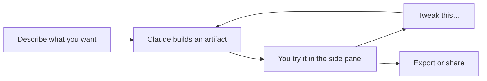

<LevelBadge level="beginner" />

<VerifyNote lastVerified="2026-09-25" source="https://support.claude.com/en/articles/17153992-what-are-artifacts-and-how-do-i-use-them">
Artifacts sind auf **Free, Pro, Max, Team und Enterprise** verfügbar. Die drei *Templates* — **Claude Docs**, **Claude Slides** und **Claude Design** — sind **in der Beta und nur in bezahlten Plänen**: standardmäßig aktiv auf Pro, Max und Team, und auf Enterprise aus, bis ein Owner sie einzeln einschaltet. Die Fähigkeiten hier bewegen sich schnell — bestätige das aktuelle Verhalten im Help Center.
</VerifyNote>

**Artifacts** sind Outputs, die Claude in einem **Seitenpanel** neben dem Chat rendert — ein Dokument, ein Deck, ein Diagramm, eine funktionierende App — und die du sehen, nutzen und weiterentwickeln kannst, getrennt vom Text der Konversation.

Seit dem [Merge im September 2026](/docs/claude-app/one-claude-docs-and-slides) leben im Panel auch die drei **Templates**. Damit ist "Artifact" der Container und "Template" die Ausgangsform.

<Callout type="objectives" items={[
  "Wissen, was das Artifact-Panel produzieren kann und welche Outputs einfache Artifacts sind und welche Beta-Templates",
  "Zwischen einem Doc, einem Deck, einem Design, einer ausführbaren App und einer herunterladbaren Datei wählen — ohne Trial and Error",
  "Ein Artifact in normaler Sprache weiterentwickeln, statt alles von vorn zu erfragen",
  "Wissen, welche Artifacts du exportieren kannst, in welchen Formaten und in welchen Plänen"
]} />

## Was du bauen kannst

| Output | Was es ist | Plan |
| --- | --- | --- |
| **Mini-Web-Apps & Tools** | Ein Rechner, ein Quiz, ein Formular, eine kleine interaktive Demo | Alle Pläne |
| **Diagramme & Schaubilder** | Visualisierungen und einfache Daten-Dashboards | Alle Pläne |
| **Code** | Etwas, das du lesen und ausführen kannst | Alle Pläne |
| **Claude Docs** | Ein lebendiges Dokument mit mehreren Tabs, das du gemeinsam mit Claude und deinem Team bearbeitest | Bezahlt, Beta |
| **Claude Slides** | Ein Deck, gebaut aus deinen Notizen oder der Konversation, direkt vor Ort präsentierbar | Bezahlt, Beta |
| **Claude Design** | Visualisierungen, Mockups, Prototypen und Landingpages nach deinem Designsystem | Bezahlt, Beta |

Die Exporte unterscheiden sich je Typ: Docs gehen nach **Word, PDF, Markdown und Google Docs**; Slides nach **PowerPoint und PDF**; Designs als **.zip, PDF, PowerPoint oder eigenständiges HTML**.

## Warum es für Nicht-Entwickler mächtig ist

Du kannst etwas *Nutzbares* bauen — "mach mir einen Trinkgeldrechner für ein Gruppenessen", "ein Dashboard aus dieser CSV" — indem du es beschreibst, und es dann im Gespräch verfeinern ("füge ein Feld für die Servicegebühr hinzu", "mach die Buttons größer"). Es ist das klarste Beispiel dafür, **mit KI zu bauen, ohne selbst Code zu schreiben**.

## Wie du mit Artifacts arbeitest

<Steps items={[
  {title: "Frag nach der Sache, mit Details", body: "Nenne den Zweck, die Inputs, die Zielgruppe und die Optik. Vagheit ist der Hauptgrund, warum ein erstes Artifact daneben liegt — dieselbe Regel wie beim normalen Prompting."},
  {title: "Oder wähle die Form selbst", body: "Wähle im Nachrichtenfeld Output und dann ein Template, oder starte eines über den Artifacts-Tab. Mach das, wenn Claude immer wieder eine andere Form produziert als die, die du im Kopf hattest."},
  {title: "Entwickle es in normaler Sprache weiter", body: "Claude aktualisiert dasselbe Artifact, statt ein neues zu erstellen. Eine Änderung auf einmal ist weit leichter richtig hinzubekommen als eine Liste von fünf."},
  {title: "Nutze es, dann exportiere oder teile", body: "Probiere es im Panel aus. Docs, Slides und Designs haben jeweils ihre eigenen Exportformate; die Regeln fürs Teilen hängen von deinem Plan ab."}
]} />

<PromptCard title="Ein konkreter Artifact-Auftrag schlägt einen vagen">{`Build me an interactive artifact: a tip calculator for a group dinner.

Inputs: bill total, number of people, tip percentage (slider, 0-30%,
default 18), and a toggle for "service charge already included".
Output: tip amount, total, and per-person share, updating live.

Audience: my friends on their phones — big tap targets, works at
375px wide, no explanation text.`}</PromptCard>

## Tipps

- **Sei konkret** bei Inputs/Outputs und Zielgruppe — genau wie bei gutem [Prompting](/docs/prompting/basics).
- **Entwickle in kleinen Schritten.** Eine Änderung auf einmal ist leichter richtig hinzubekommen.
- **Prüfe jede Logik und jede Zahl**, die ein Artifact berechnet, bei wichtigen Einsätzen ([Halluzinationen](/docs/foundations/hallucinations)).
- **Diagramme in einem Doc aktualisieren sich nicht selbst.** Änderst du die Daten, behält das Diagramm die alten Werte, bis du Claude bittest, es neu zu bauen.

## Quiz

<Quiz questions={[
  {q: "Du bist im Free-Plan und bittest Claude, eine Konversation in ein teilbares Dokument mit mehreren Tabs zu verwandeln. Was bekommst du?", options: ["Ein Claude Doc — Artifacts gibt es in jedem Plan", "Ein Claude Doc, aber nur lesend", "Kein Claude Doc — die Templates sind in der Beta und nur in bezahlten Plänen; du kannst aber weiterhin ein einfaches Artifact oder eine herunterladbare Datei bekommen", "Nichts, Artifacts brauchen einen bezahlten Plan"], answer: 2, explain: "Artifacts selbst sind auf Free, Pro, Max, Team und Enterprise verfügbar. Die drei Templates — Docs, Slides und Design — sind in der Beta und nur in bezahlten Plänen. In Free bekommst du weiterhin einfache Artifacts und generierte Dateien."},
  {q: "Claude hat ein Artifact gebaut, das fast passt, aber die Buttons sind zu klein. Was ist der effiziente Schritt?", options: ["Eine neue Konversation mit einer vollständigeren Spezifikation starten", "Die Änderung in normaler Sprache erfragen — Claude aktualisiert dasselbe Artifact", "Es exportieren und von Hand bearbeiten", "Fünf Korrekturen auf einmal erfragen, um Turns zu sparen"], answer: 1, explain: "Im Gespräch weiterzuentwickeln aktualisiert dasselbe Artifact, und genau das ist der Sinn des Panels. Und eine Änderung auf einmal landet verlässlicher als ein Bündel von fünf."}
]} />

<Callout type="takeaways" items={[
  "Artifact = der Container im Seitenpanel; Template = die Ausgangsform (Docs, Slides, Design).",
  "Einfache Artifacts funktionieren in jedem Plan; die drei Templates sind Beta in bezahlten Plänen und auf Enterprise standardmäßig aus.",
  "Entwickle dasselbe Artifact in normaler Sprache weiter — starte die Konversation nicht neu.",
  "Prüfe berechnete Zahlen immer, und baue Diagramme nach einer Datenänderung neu."
]} />

## Weiter

- [One Claude: Der Merge, Claude Docs & Claude Slides](/docs/claude-app/one-claude-docs-and-slides) — die Templates im Detail und ihre Grenzen
- [Echte Dateien generieren (docx/pptx/xlsx/pdf)](/docs/claude-app/generating-files) — wenn du stattdessen einen Download willst
- [Playbook Datenanalyse](/docs/playbooks/data-analysis)
