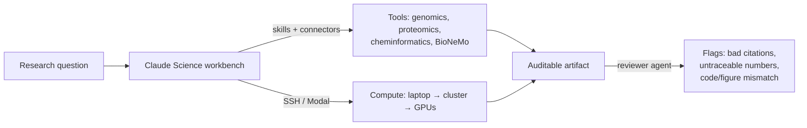

<LevelBadge level="advanced" />

<VerifyNote lastVerified="2026-07-13" source="https://www.anthropic.com/news/claude-science-ai-workbench">
Claude Science befindet sich in der Beta-Phase. Gebündelte Skills, angebundene Modelle, Rechenoptionen und Tarifverfügbarkeit ändern sich schnell — bestätige die aktuellen Details in der App und in der offiziellen Ankündigung, bevor du dich darauf verlässt.
</VerifyNote>

<Callout type="objectives" items={["Verstehen, was Claude Science ist — und welches konkrete Problem es löst, das ein Chatfenster nicht kann", "Seine drei Säulen kennenlernen: integrierte Werkzeuge, überprüfbare Artefakte und verwaltete Rechenleistung", "Sehen, wie der Reviewer-Agent nicht nachvollziehbare Zahlen und nicht übereinstimmende Abbildungen automatisch erkennt", "Wissen, wann man zu Claude Science greift statt zu normalem Claude oder Claude Code", "Es in die breitere Landschaft der KI für die Wissenschaft einordnen, ohne zu übertreiben, was ein Modell verifizieren kann"]} />

Die meiste wissenschaftliche Arbeit mit einem allgemeinen Chatbot bricht an derselben Naht: Das Modell denkt gut, aber die *Werkzeuge, Daten und Rechenleistung* liegen woanders — ein Cluster, ein Notebook, ein Genombrowser, ein Faltungsmodell. Du kopierst Ergebnisse von Hand hin und her, und niemand kann später exakt rekonstruieren, wie eine Abbildung entstanden ist. **Claude Science** (Beta, gestartet am **30. Juni 2026**) ist Anthropics Versuch, diese Naht zu schließen: eine KI-*Werkbank*, in der das Denken, die Werkzeuge, die Rechenleistung und die Herkunft alle an einem Ort liegen.

Es ist eine eigenständige App — kein Prompt, den du in den Chat einfügst. Stell es dir vor wie [Claude Code](/docs/claude-code/what-is-claude-code), ausgerichtet auf Nasslabor- und computergestützte Biologie-Workflows statt auf Software-Repositorys.

## Das Problem, auf das es abzielt

Ein Forscher, der etwa eine Einzelzell-RNA-Pipeline betreibt, jongliert mit: einer Datenquelle, einem QC-Werkzeug, einer Plotting-Bibliothek, einem Faltungsmodell auf einer GPU und einem Zitationsmanager — plus dem mentalen Aufwand, sich zu merken, welche Version welches Skripts vor drei Wochen welche Abbildung erzeugt hat. Allgemeine Assistenten helfen bei *einem* Schritt und verlieren beim Rest den Faden.

<Callout type="tip">
Die Werteinheit in der Wissenschaft ist keine gute Antwort — es ist eine **reproduzierbare** Antwort. Claude Science ist genau darum herum gebaut: Seine Ausgaben sind so gestaltet, dass ein Reviewer (Mensch oder Agent) jede Zahl bis zu dem Code und der Umgebung zurückverfolgen kann, die sie erzeugt haben.
</Callout>

## Die drei Säulen

### 1. Integrierte Werkzeuge — die Umgebung kommt vorverdrahtet

Claude Science wird mit **über 60 kuratierten Skills und Konnektoren** ausgeliefert, die für Genomik, Einzelzellanalyse, Proteomik, Strukturbiologie und Cheminformatik vorkonfiguriert sind. Entscheidend ist, dass es sich nativ mit **NVIDIA BioNeMo**-Modellen verbindet — darunter **Evo 2** (genomisches Foundation-Modell), **Boltz-2** (Struktur-/Affinitätsvorhersage) und **OpenFold3** (Proteinfaltung) — sodass Faltung oder Affinitätsvorhersage ein Schritt in deinem Workflow ist, nicht ein separates Portal.

Das ist dieselbe [Skills-und-Konnektoren](/docs/claude-code/skills)-Maschinerie, die du vielleicht von Claude Code kennst, kuratiert für einen wissenschaftlichen Stack statt für einen Software-Stack.

### 2. Überprüfbare Artefakte — Herkunft ist der Standard, kein nachträglicher Einfall

Jede Ausgabe trägt ihre vollständige Abstammung:

- den **exakten Code und die Umgebung**, die sie erzeugt haben,
- eine **Beschreibung in natürlicher Sprache**, wie sie erstellt wurde, und
- die **vollständige Nachrichtenhistorie** dahinter.

Darüber hinaus markiert ein **Reviewer-Agent** automatisch **falsche Zitate, nicht nachvollziehbare Zahlen und Abbildungen, die nicht zu ihrem zugrunde liegenden Code passen**. Letzteres ist die nicht offensichtliche Absicherung: Ein plausibel aussehendes Diagramm, dessen Daten nicht tatsächlich aus dem Code im Artefakt stammen, wird erkannt.

<Callout type="warning">
Der Reviewer-Agent reduziert eine Fehlerklasse — er macht Ausgaben nicht *korrekt*. Er markiert Zitate, die er nicht verifizieren kann, und Zahlen, die er nicht zurückverfolgen kann; er kann nicht für das Versuchsdesign, die biologische Gültigkeit oder dafür bürgen, ob die richtige Frage gestellt wurde. Herkunft ≠ Wahrheit. Die Wissenschaft verantwortest weiterhin du.
</Callout>

### 3. Verwaltete Rechenleistung — von deinem Laptop bis zu Hunderten von GPUs

Claude Science **verwaltet Rechenleistung auf deinem Laptop, deinem Cluster oder GPUs auf Abruf** und skaliert **von einer einzelnen GPU bis zu Hunderten, je nach Bedarf**. Es arbeitet mit bestehender Infrastruktur — HPC-Cluster über **SSH** oder **Modal**-Konten — sodass schwere Jobs dort laufen, wo deine Daten und Kontingente bereits liegen, ohne dass du die Orchestrierung von Hand schreibst.

## Native wissenschaftliche Visualisierung

Ergebnisse werden **in der Oberfläche** dargestellt, nicht als Dateien, die du herunterlädst und anderswo öffnest: **3D-Proteinstrukturen, Genombrowser-Spuren und chemische Strukturen** werden nativ angezeigt. Du inspizierst eine Faltung oder einen Locus dort, wo du darüber nachgedacht hast — die [Artefakt](/docs/claude-app/artifacts)-Idee, erweitert auf wissenschaftliche Objekte.

## Ein typischer Workflow

<Steps items={[{title: "Die Frage formulieren", body: "Formuliere die biologische Frage und richte Claude Science über einen Konnektor auf deine Datenquelle aus."}, {title: "Die Pipeline zusammenstellen lassen", body: "Es wählt Skills aus (QC, Alignment, Faltung) und schlägt Schritte vor — prüfe sie, bevor schwere Berechnungen laufen."}, {title: "Dort laufen lassen, wo die Daten liegen", body: "Lagere den teuren Schritt an deinen HPC-Cluster über SSH oder an GPUs auf Abruf aus; leichte Schritte bleiben lokal."}, {title: "Nativ inspizieren", body: "Betrachte die 3D-Struktur, Genomspur oder chemische Struktur inline, statt sie zuerst zu exportieren."}, {title: "Ein überprüfbares Artefakt ausliefern", body: "Die Ausgabe bündelt Code, Umgebung, Methode in natürlicher Sprache und Nachrichtenhistorie — und der Reviewer-Agent markiert alles Nicht-Nachvollziehbare."}]} />

<PromptCard title="Eine erste, konkrete Anfrage innerhalb von Claude Science">{`Load the connected single-cell dataset, run standard QC (filter low-count cells and high-mito), and show a UMAP colored by cluster. Keep every step in an auditable artifact I can hand to a reviewer.`}</PromptCard>

<PromptCard title="Den schweren Schritt auf echte Rechenleistung schieben">{`Predict the structure of this sequence with the connected folding model, run it on my HPC cluster over SSH, and render the 3D structure inline when it finishes.`}</PromptCard>

## Wann man es verwendet (und wann nicht)

| Verwende Claude Science, wenn… | Greif zu etwas anderem, wenn… |
|---|---|
| Du reproduzierbare, überprüfbare wissenschaftliche Ausgaben brauchst | Du eine schnelle einmalige Antwort willst → normales [Claude](/docs/claude-app/getting-started) |
| Deine Arbeit sich über Genomik-/Proteomik-/Cheminformatik-Werkzeuge erstreckt | Du Software entwickelst → [Claude Code](/docs/claude-code/what-is-claude-code) |
| Schwere Berechnungen auf deinem Cluster oder GPUs auf Abruf laufen müssen | Du keine Datenkonnektoren oder Rechenleistung zum Anbinden hast |
| Herkunft (Code + Umgebung + Historie) für die Überprüfung wirklich zählt | Du im Free-Tarif bist oder unter Windows (siehe Verfügbarkeit) |

## Verfügbarkeit und Grenzen

- **Tarife:** Beta für **Claude Pro, Max, Team und Enterprise**-Nutzer. (Kein Free-Tarif.)
- **Plattformen:** **macOS und Linux** — beachte, dass es zum Start keinen Windows-Client gibt.
- **Status:** Beta — erwarte, dass sich die gebündelte Skill-Liste, die angebundenen Modelle und die Rechenoptionen verschieben.

<Callout type="tip">
Claude Science ist Claude-spezifisch, aber das *Muster* ist branchenweit: Assistenten bekommen Schichten für Werkzeugintegration, Herkunft und Rechenleistung, damit sie echte Arbeit leisten können, statt sie nur zu beschreiben. Achte auf entsprechende „Werkbank"-Züge anderer KI-Labore — die Reproduzierbarkeitslatte, die Claude Science setzt, ist ein guter Maßstab, um sie zu beurteilen.
</Callout>

<Flashcards title="Claude-Science-Vokabular" cards={[{front: "Claude Science", back: "Anthropics KI-Werkbank für Wissenschaftler in der Beta: integrierte Forschungswerkzeuge, überprüfbare Artefakte, native Visualisierung und verwaltete Rechenleistung in einer App."}, {front: "Überprüfbares Artefakt", back: "Eine Ausgabe, gebündelt mit dem exakten Code, seiner Umgebung, einer Methode in natürlicher Sprache und der vollständigen Nachrichtenhistorie — sodass jedes Ergebnis dahin zurückverfolgt werden kann, wie es entstanden ist."}, {front: "Reviewer-Agent", back: "Eine automatische Prüfung, die falsche Zitate, nicht nachvollziehbare Zahlen und Abbildungen markiert, die nicht zu ihrem zugrunde liegenden Code passen. Reduziert Fehler; garantiert keine Korrektheit."}, {front: "BioNeMo", back: "NVIDIAs Sammlung biologischer Foundation-Modelle. Claude Science verbindet sich nativ mit Evo 2, Boltz-2 und OpenFold3."}, {front: "Verwaltete Rechenleistung", back: "Claude Science führt Jobs auf deinem Laptop, HPC-Cluster (über SSH) oder GPUs auf Abruf (z. B. Modal) aus und skaliert von einer GPU bis zu Hunderten."}, {front: "Cheminformatik", back: "Computergestützte Analyse chemischer Strukturen und Eigenschaften — eine der Domänen, für die Claude Science Skills vorverdrahtet, neben Genomik, Einzelzellanalyse, Proteomik und Strukturbiologie."}]} />

<Quiz title="Überprüfe dich selbst" questions={[{q: "Was ist das einzelne markanteste Designziel von Claude Science im Vergleich zu einem allgemeinen Chatbot?", options: ["Schnellere Antworten", "Reproduzierbarkeit — jedes Ergebnis lässt sich bis zum Code und zur Umgebung zurückverfolgen, die es erzeugt haben", "Ein größeres Kontextfenster"], answer: 1, explain: "Seine Ausgaben sind überprüfbare Artefakte (Code + Umgebung + Methode in natürlicher Sprache + Nachrichtenhistorie), so gebaut, dass ein Reviewer jede Zahl zurückverfolgen kann. Dieses herkunftszentrierte Design ist das Kernunterscheidungsmerkmal."}, {q: "Der Reviewer-Agent markiert eine Abbildung, deren Zahlen nicht zum Code im Artefakt passen. Was hat er bewiesen?", options: ["Dass die Wissenschaft falsch ist", "Dass das Ergebnis korrekt ist", "Dass die Abbildung nicht nachvollziehbar ist — ein Herkunftsproblem, kein Urteil über die Biologie"], answer: 2, explain: "Der Reviewer erkennt nicht nachvollziehbare Zahlen, falsche Zitate und Code/Abbildungs-Diskrepanzen. Er reduziert eine Fehlerklasse, kann aber nicht bestätigen, dass die zugrunde liegende Wissenschaft gültig ist — Herkunft ist nicht Wahrheit."}, {q: "Du musst ein Protein auf dem HPC-Kontingent deines Labors von innerhalb der Werkbank falten. Claude Science kann…", options: ["Nur in Anthropics Cloud laufen", "Den Job auf deinem Cluster über SSH (oder GPUs auf Abruf) laufen lassen und nach Bedarf skalieren", "Überhaupt keine Berechnungen durchführen"], answer: 1, explain: "Claude Science verwaltet Rechenleistung auf deinem Laptop, Cluster (über SSH) oder GPUs auf Abruf (z. B. Modal), von einer einzelnen GPU bis zu Hunderten."}, {q: "Welcher Nutzer kann Claude Science zum Start nicht verwenden?", options: ["Ein Max-Nutzer unter macOS", "Ein Enterprise-Nutzer unter Linux", "Ein Free-Tarif-Nutzer unter Windows"], answer: 2, explain: "Es ist Beta für Pro, Max, Team und Enterprise (kein Free-Tarif) und wird nur für macOS und Linux ausgeliefert — ein Free-/Windows-Nutzer ist also in beiderlei Hinsicht ausgeschlossen."}]} />

<Callout type="takeaways" items={["Claude Science ist eine eigenständige Beta-App — eine KI-Werkbank für Wissenschaftler, kein Prompt, den du in den Chat einfügst.", "Seine drei Säulen: vorverdrahtete Werkzeuge (60+ Skills, natives BioNeMo — Evo 2, Boltz-2, OpenFold3), überprüfbare Artefakte und verwaltete Rechenleistung.", "Überprüfbare Artefakte bündeln Code + Umgebung + Methode + Nachrichtenhistorie; ein Reviewer-Agent markiert nicht nachvollziehbare Zahlen, falsche Zitate und Code/Abbildungs-Diskrepanzen.", "Die Berechnung läuft dort, wo deine Daten liegen: Laptop, HPC über SSH oder GPUs auf Abruf, skalierend von eins bis Hunderte.", "Beta für Pro/Max/Team/Enterprise nur unter macOS und Linux; Herkunft reduziert Fehler, zertifiziert aber nie, dass die Wissenschaft korrekt ist."]} />

## Quellen & weiterführende Literatur

- [Claude Science, eine KI-Werkbank für Wissenschaftler — Anthropic](https://www.anthropic.com/news/claude-science-ai-workbench) — die Startankündigung (30. Juni 2026); Quelle für die 60+ Skills, BioNeMo-Anbindungen, die Struktur überprüfbarer Artefakte, den Reviewer-Agenten, die Rechenoptionen und die Verfügbarkeit.
- [NVIDIA BioNeMo](https://www.nvidia.com/en-us/clara/bionemo/) — die Foundation-Modell-Plattform für Biologie hinter Evo 2, Boltz-2 und OpenFold3.
- [Modal](https://modal.com/) — eines der On-Demand-Rechen-Backends, die Claude Science nutzen kann.
- Verwandtes auf AILmanac: [Claude Code](/docs/claude-code/what-is-claude-code), [Skills](/docs/claude-code/skills), [Artefakte](/docs/claude-app/artifacts) und [Managed Agents](/docs/api/managed-agents).
