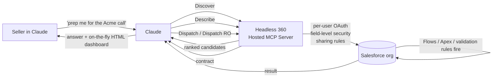

<LevelBadge level="intermediate" />

<VerifyNote lastVerified="2026-09-01" source="https://www.salesforce.com/news/press-releases/2026/08/26/salesforce-and-anthropic-announce-claudeforce/">
Claudeforce wurde am **26. August 2026** angekündigt; **Salesforce in Claude** befindet sich derzeit in einem **ausgewählten Pilot**, die **offene Beta ist für September 2026 geplant**. Die 4-Tool-Oberfläche des Headless 360 MCP ist eine von Salesforce veröffentlichte API (Beta, Juli 2026). Skill-Anzahl, Preise und der genaue Umfang der Slack-/Agentforce-Stränge ändern sich wöchentlich — prüfen Sie die verlinkten Salesforce-Developers-Dokumente, bevor Sie eine Org darauf festlegen.
</VerifyNote>

Am **26. August 2026** kündigten Salesforce und Anthropic gemeinsam **Claudeforce** an, eine Partnerschaft mit vier Strängen. Das erste ausgelieferte Stück ist **Salesforce in Claude** — ein Plugin, mit dem eine Claude-Konversation über Live-CRM-Daten schlussfolgern und kontrolliert handeln kann, mit **37 vorgefertigten Sales-Skills** (beim Launch nur ~8 öffentlich benannt), einer für September 2026 geplanten offenen Beta und — das ist der Teil, den die Presse überspringt — einer **überraschend kleinen MCP-Oberfläche** darunter.

Die meisten Berichte sind umgeschnittene Pressemitteilungen. Diese Seite ist der praktische Feldführer: die Architektur, die 37 Skills aus nur **4 MCP-Tools** möglich macht, die **zwei sehr unterschiedlichen Auth-Modelle**, mit denen das Plugin ausgeliefert wird, und die **Governance-Fallen**, die RevOps treffen werden, wenn man es wie eine weitere Chrome-Erweiterung behandelt.

<Callout type="objectives" items={[
  "Verstehen, was in der offenen Beta im September 2026 tatsächlich ausgeliefert wird — die vier Claudeforce-Stränge und welcher davon 'Salesforce in Claude' ist",
  "Sehen, warum das Plugin nur 4 MCP-Tools (Discover / Describe / Dispatch / Dispatch Read-Only) braucht, um die gesamte Salesforce-API-Oberfläche zugänglich zu machen",
  "Die beiden Auth-Routen unterscheiden — OAuth pro Nutzer (Claude) vs. Client-Credentials-Integrationsnutzer (Slack) — und die richtige für Ihre Org wählen",
  "Die 37 Skills nach Berechtigungsstufe klassifizieren (read-only / recommend / write), bevor Sie einen davon aktivieren",
  "Die vier Fallen vermeiden: überprovisionierte Profile, vergessene Automatisierungs-Nebeneffekte, die Kollision mit dem Winter-'27-Upgrade und Schatten-IT-MCP-Server"
]} />

## Was Claudeforce tatsächlich ist (und was nicht)

Claudeforce ist eine Partnerschaft mit vier Strängen, kein Produkt. Nur ein Strang — **Salesforce in Claude** — öffnet im September 2026. Die Stränge zu verwechseln ist der Weg, auf dem RevOps-Teams am Ende den falschen Pilot aufsetzen.

<Steps items={[
  {title: "Strang 1 — Salesforce in Claude (offene Beta Sept. 2026)", body: "Ein Salesforce-Plugin, das INNERHALB der Claude-App läuft. Verkäufer bleiben in Claude; Claude greift über Salesforces Hosted MCP in ihre Org. Das ist der Strang, um den es auf dieser Seite geht."},
  {title: "Strang 2 — Claude innerhalb von Salesforce-Produkten", body: "Die umgekehrte Richtung: Anthropics Modelle als vollwertige Bürger über Agentforce hinweg verfügbar (Atlas Reasoning Engine, Agentforce Vibes, Agentforce Coworker, Agent Builder). Andere UX, andere Admin-Oberfläche, anderer Rollout-Zeitplan."},
  {title: "Strang 3 — Claude als Standardmodell in Slack", body: "Slack-KI-Funktionen (Huddle-Zusammenfassungen, Channel-Recaps, Nachrichtenentwürfe) beginnen, Claude als Standard-Backing-Modell zu nutzen. Anders gesteuert — siehe die Slack-Auth-Route unten."},
  {title: "Strang 4 — Kommerzielle gegenseitige Nutzung", body: "Salesforce wird ein großer Anthropic-Kunde; Anthropic wird ein großer Salesforce-Kunde. Interessant für den Einkauf, irrelevant für das technische Setup."}
]} />

Der Rest dieser Seite ist Strang 1: **Salesforce in Claude**.

## Die 4-Tool-Architektur, die auf 37 Skills skaliert

Das eine nicht offensichtliche Detail an Claudeforce ist, dass das Plugin **nicht** pro Fähigkeit ein Tool registriert. Salesforces **[Headless 360 Hosted MCP Server](https://developer.salesforce.com/docs/platform/hosted-mcp-servers/guide/headless-360-mcp.html)** (Beta, Juli 2026) stellt genau **vier MCP-Tools** bereit, und Claude erreicht jeden Skill, indem es sie kombiniert.

<Steps items={[
  {title: "Discover", body: "Semantische Suche über einen Vektorindex jeder API und jedes Skills in der verbundenen Org. Claude übergibt seine Interpretation Ihrer Anfrage; Discover liefert eine gerankte Liste von Kandidaten-Operationen. Das ist der Grund, warum 'finde mir das Deal-Health-Ding für diesen Account' keine 200 vorregistrierten Tools braucht, die den Kontext zumüllen."},
  {title: "Describe", body: "Für einen gewählten Kandidaten liefert Describe den technischen Vertrag: Parameter, Abhängigkeiten, geordnete Schritte, Nebeneffekte. Claude nutzt es, um zu prüfen, ob Discover das Richtige gefunden hat, bevor es sich festlegt, irgendetwas auszuführen."},
  {title: "Dispatch", body: "Führt die gewählte Operation aus. Leitet zum richtigen Endpunkt weiter. Erzwingt Nutzer-Zugriffsschranken, bevor der Aufruf Salesforce erreicht. Das ist der Schreibpfad — Validierungsregeln, Flows, Apex-Trigger und CPU-Governor-Limits feuern alle wie gewohnt nachgelagert von Dispatch."},
  {title: "Dispatch Read-Only", body: "Nur-GET-Variante. Gleicher Discovery-Ablauf, gleiche Zugriffsprüfungen, aber das Tool kann physisch nichts verändern. Das ist der pilotsichere Standard und das Tool, an das die Read-only-Skills gebunden sind."}
]} />

Zwei Implikationen, die die meisten Launch-Beiträge übersehen:

- **Die Tool-Oberfläche bleibt klein und stabil**, aber der **Skill-Katalog wächst unabhängig davon** auf Salesforce-Seite — Claude braucht keine neue Tool-Registrierung, um einen neuen Skill zu erreichen.
- **Feldebenen-Sicherheit, Objektberechtigungen und Sharing-Regeln gelten für jeden Tool-Aufruf** — die Durchsetzung passiert in der Org, nicht in Claude. Wenn ein Nutzer ein Feld in der Salesforce-UI nicht sehen kann, zeigt Discover es nicht an, und Dispatch würde es ohnehin verweigern.

## Die zwei Auth-Routen — und warum der Unterschied zählt

Claudeforce wird mit **zwei OAuth-Modellen** ausgeliefert, die an dasselbe, gleich aussehende Plugin geheftet sind, und sie haben sehr unterschiedliche Sicherheitsprofile. Das falsch zu machen ist der Weg, auf dem man versehentlich jedem Vertriebsmitarbeiter in der Org die effektiven Berechtigungen eines einzigen Integrationsnutzers gibt.

<Steps items={[
  {title: "Route A — Salesforce in Claude (OAuth pro Nutzer)", body: "Nutzt Salesforce External Client Apps mit dem Scope mcp_api. Ein einzelner Admin führt die einmalige Verbindung auf Org-Ebene durch; jeder Verkäufer autorisiert sich dann als er selbst. Jeder Claude-Tool-Aufruf läuft als die anfragende Person, mit DEREN Profil, Permission Sets, Sharing-Regeln und Feldebenen-Sicherheit. Das ist die korrekte Haltung für alles, was für Nutzer sichtbar ist."},
  {title: "Route B — Claude in Slack (Client Credentials)", body: "Nutzt den OAuth-2.0-Client-Credentials-Flow mit einem dedizierten Integrationsnutzer. Access Bundles teilen EINE Agenten-Credential über Nutzer hinweg. Jede Anfrage läuft als derselbe Integrationsnutzer — das heißt, dessen Berechtigungen werden zur effektiven Obergrenze für alle, die ihn nutzen. Bequem, aber die falsche Form für alles mit Anforderungen an nutzerspezifische Datenisolation."}
]} />

<Callout type="warning" items={[
  "Wenn Sie den Slack-Integrationsnutzer mit einem breiten Sales-Ops-Profil ausstatten, damit 'es einfach funktioniert', erbt jeder darüber geleitete Slack-Nutzer diesen effektiven Zugriff. Beschränken Sie das Profil des Integrationsnutzers auf den engsten Umfang, den Slack tatsächlich braucht, und fügen Sie dann Fähigkeiten über Permission Sets hinzu — dasselbe Prinzip wie bei jedem geteilten Service-Account."
]} />

## Die 37 Skills, klassifiziert nach Berechtigungsstufe

Salesforce hat beim Launch nur eine Handvoll Skills benannt; weitere folgen bis Ende 2026. Womit Sie jetzt schon planen können: Jeder Skill landet in einer von **drei Berechtigungsstufen**, und die Oberfläche lässt sie identisch aussehen. Die Klassifizierung liegt bei Ihnen.

| Benannter Skill (Aug. 2026) | Berechtigungsstufe | Grobe Dispatch-Route |
| --- | --- | --- |
| Daily Briefing | Read-only | Dispatch RO |
| Pipeline-Review | Read-only | Dispatch RO |
| Forecast-Narrativ | Read-only | Dispatch RO |
| Meeting-Vorbereitung | Read-only | Dispatch RO |
| Deal-Health-Review | Read-only | Dispatch RO |
| Win/Loss-Analyse | Read-only | Dispatch RO |
| Salesforce-Hygiene | Recommend | Dispatch RO → Entwürfe |
| Aktivitätsprotokollierung | Write | Dispatch (POST/PATCH) |

Die verbleibenden ~29 Skills sind beim Launch unveröffentlicht; dieselbe Triage gilt, sobald sie erscheinen:

<Steps items={[
  {title: "Read-only (nur Dispatch RO)", body: "Analysiert, fasst zusammen, ruft ab. Kann nichts verändern. Für die Pilot-Kohorte frei aktivieren. Der Fehlermodus ist 'falsche Antwort', nicht 'falscher Schreibvorgang'."},
  {title: "Recommend (Dispatch RO + Entwürfe)", body: "Analysiert UND schlägt Änderungen vor, überlässt die eigentliche Mutation aber als Entwurf einem Menschen. Aktivieren, nachdem sich die Read-only-Stufe bewährt hat. Der Fehlermodus ist ein schlechter Entwurf, den ein Verkäufer ungelesen genehmigen könnte — messen Sie die Korrekturrate, nicht nur die Geschwindigkeit."},
  {title: "Write (Dispatch POST/PATCH/DELETE)", body: "Verändert CRM-Daten direkt. Jeder Schreibvorgang läuft durch die Validierungsregeln, Flows, Apex-Trigger und CPU-Governor-Limits der Org, GENAU so, als hätte ein Mensch auf Speichern geklickt. Zuletzt aktivieren, pro Skill, mit nutzerspezifischer Profil-Eingrenzung, und erst nachdem Sie die Genauigkeit der Recommend-Stufe mindestens 4 Wochen lang gemessen haben."}
]} />

## Einen Pilot aufsetzen — die RevOps-Checkliste

<Steps items={[
  {title: "1. Die Profile prüfen, die Sie gleich freigeben", body: "Jedes überprovisionierte Profil, das hinter einer langsamen UI harmlos war, wird hinter einem schnellen Agenten wirklich riskant. Führen Sie vor dem Pilot ein Berechtigungs-Audit bei den Nutzern durch, die Sie einladen: welche Objekte, welche Felder, welches Record-Type-Sharing. Das Plugin setzt getreu durch, was diese Profile sagen — einschließlich jeder historischen Überprovisionierung, die niemand bemerkt hat."},
  {title: "2. Pilot-Nutzer an ein eingeschränktes Permission Set binden", body: "Erstellen Sie ein Permission Set 'Claudeforce Pilot': bestimmte Objekte, bestimmte Felder, zunächst read-only. Weisen Sie es zusätzlich zu ihrem normalen Profil zu, damit Sie es am Ende des Pilots sauber entfernen können, ohne den Basiszugriff anzufassen."},
  {title: "3. Überall mit Dispatch Read-Only starten", body: "Aktivieren Sie in den ersten zwei Sprints nur Read-only-Skills. So können Sie die Genauigkeit messen, ohne eine Rollback-Fläche zu haben. Achten Sie auf halluzinierte Feldnamen oder falsche Datensatz-Lookups — das sind die Fehlermodi, die bis in die Write-Stufe überleben."},
  {title: "4. DREI Workflows über die drei Berechtigungsstufen für den Write-Stufen-Pilot wählen", body: "Einen read-only, einen recommend, einen write. Unterschiedliche Risikoprofile decken unterschiedliche Governance-Lücken auf, und ein Pilot pro Stufe ist günstiger als ein Pilot pro Skill."},
  {title: "5. Ihre API-Baseline versionieren", body: "Salesforce in Claude erfordert API v67.0+; Winter '27 führt v68.0 ein. Wenn Ihre Org während des Beta-Fensters (Sept.–Okt. 2026) automatisch auf Winter '27 upgradet, fixieren Sie die API-Version des Plugins explizit, damit ein Plattform-Upgrade nicht mitten im Pilot die Semantik verschiebt."},
  {title: "6. Team-eigene MCP-Verbindungen während der Beta verbieten", body: "Wenn einzelne Teams eigene Hosted MCP Server aufsetzen, um 'schneller voranzukommen', haben Sie Schatten-IT mit hübscherer Verpackung neu erfunden. Zentralisieren Sie die MCP-Governance bei denselben Admins, die Connected Apps und Profile verantworten."}
]} />

<PromptCard title="Prompt-Vorlage für Verkäufer: sicheres Montags-Pipeline-Briefing (Read-only-Stufe)">{`You are preparing my Monday pipeline briefing from Salesforce.

Every Monday at 07:00 local:

1. Use the "Pipeline review" skill on my named accounts (owner = me,
   stage != Closed Lost, close date in current quarter).
2. Use the "Deal-health review" skill on the top 10 by amount.
3. Use the "Meeting preparation" skill for accounts I have a meeting
   with in the next 5 business days.

Constraints (do NOT violate):
- Read-only pass only. If any skill proposes a write (update stage,
  log activity, change amount) STOP and surface it as a draft in
  the output — do NOT dispatch it.
- Do not log activities on my behalf. Do not update fields.
- If a skill returns a field you cannot see under my profile, do
  not guess the value — flag it as "hidden by permissions".

Produce a single briefing:
- 3-bullet TL;DR
- "Pipeline movement since last Monday" (opportunity-level, cite
  the Salesforce record IDs)
- "Deals I should touch this week" (with why, from deal-health)
- "Meetings this week" (with prep pack from meeting-preparation)
- "Proposed writes (NOT DISPATCHED)" — every draft change the agent
  wanted to make, so I can review in one place.`}</PromptCard>

Zwei Dinge, die dieser Prompt tut und die meisten „Kopiere diese Vorlage“-Beiträge nicht:

- Er **fixiert den Pilot auf read-only** mit einer expliziten Invariante „wenn der Skill einen Schreibvorgang vorschlägt, STOPP“. In einer geplanten oder langlaufenden Claude-Session können Sie keine Rückfrage „bist du sicher?“ beantworten — Invarianten müssen im Prompt leben.
- Er verlangt vom Modell, **jeden Schreibvorgang, den es vornehmen wollte, an einer Stelle auszuweisen**, damit Sie die Genauigkeit eines Skills auf Recommend-Stufe messen können, bevor Sie ihn auf die Write-Stufe befördern. Das ist der günstigste Weg, sich diese Beförderung zu verdienen.

## Die vier Fallen, die Sie treffen werden

<Steps items={[
  {title: "1. Überprovisionierte Profile werden zum aktiven Schadensradius", body: "Dasselbe Permission Set, das hinter einer UI meist in Ordnung war, ist hinter einem Agenten, der 30 Schreibvorgänge pro Minute per Dispatch ausführen kann, wirklich gefährlich. Lösung: Profil-Audit VOR dem Pilot, nicht danach."},
  {title: "2. Automatisierungs-Nebeneffekte feuern bei jedem Dispatch-Schreibvorgang", body: "Dispatch PATCH ist ein normaler Salesforce-Schreibvorgang. Jede Validierungsregel, jeder Flow, Process Builder, Apex-Trigger und jedes CPU-Zeit-Governor-Limit feuert genau wie bei einem menschlichen Klick. Ein gut gemeinter Skill in einer Schleife kann CPU-Limits auslösen oder unerwünschte Flow-gesteuerte E-Mails auffächern. Lösung: Instrumentieren Sie Ihre Automatisierung in der Pilot-Org, bevor Sie Write-Stufen-Skills aktivieren."},
  {title: "3. Winter '27 landet während der offenen Beta", body: "Die Winter-'27-Produktions-Upgrades (Sept.–Okt. 2026) kollidieren mit der offenen Claudeforce-Beta. Wenn ein Skill mitten im Fenster kaputtgeht, debuggen Sie ZWEI gleichzeitige Plattformänderungen. Lösung: API-Version im Plugin fixieren und das Winter-'27-Upgrade der Pilot-Kohorte nach Möglichkeit AUSSERHALB des Beta-Fensters planen."},
  {title: "4. Slack-Route ≠ Claude-Route", body: "Weil Slack Client Credentials mit einem Integrationsnutzer verwendet, ist 'Slack Zugriff auf Claudeforce geben' nicht dieselbe Governance-Form wie einzelnen Nutzern das Plugin in Claude zu geben. Behandeln Sie sie als zwei separate Rollouts mit zwei separaten Audit-Trails."}
]} />

## Wo Claudeforce im Verhältnis zu Agentforce steht

Salesforce liefert **Agentforce** seit 2024 aus, und Claude ist seit Ende 2025 EINES seiner Foundation-Modelle. Claudeforce ersetzt Agentforce nicht — es fügt eine **neue Oberfläche** hinzu (die Claude-App) und **formalisiert** Claude über vier Agentforce-Ebenen hinweg (Atlas Reasoning Engine, Agentforce Vibes, Agentforce Coworker, Agent Builder). Die Modellwahl bleibt: Agent Builder bietet weiterhin Amazon Nova neben Claude an.

Grobe Entscheidungstabelle für Teams, die beides anschauen:

| Sie wollen... | Greifen Sie zu |
| --- | --- |
| Verkäufern eine Chat-Oberfläche geben, die über Live-CRM schlussfolgert | Salesforce in Claude (das Plugin) |
| KI-Funktionen IN Ihre Salesforce-UI einbetten (Datensätze, Listenansichten, Buttons) | Agentforce |
| Einen eigenen Agenten mit Tools, Gedächtnis, Eskalationsrichtlinien bauen | Agent Builder (innerhalb von Salesforce) |
| Wiederholbare Backoffice-CRM-Arbeit End-to-End automatisieren | Agentforce Coworker |
| Claude nutzen, um Salesforce-Code zu schreiben (Apex, LWC) | Agentforce Vibes |

Wenn mehr als eine Zeile zutrifft, ist die falsche Wahl, eine auszusuchen und sie zu erzwingen — Claudeforce ist so konzipiert, dass Plugin, Agentforce und Agent Builder komplementär sind und Nutzer innerhalb derselben Org zwischen ihnen wechseln können.

## Wann Sie Salesforce in Claude NICHT nutzen sollten

- **Sie brauchen eine Maschine-zu-Maschine-Integration.** Das Plugin ist eine Chat-Oberfläche mit Mensch in der Schleife. Für unbeaufsichtigte CRM-Schreibvorgänge in großem Maßstab verbinden Sie den [Headless 360 MCP Server](https://developer.salesforce.com/docs/platform/hosted-mcp-servers/guide/headless-360-mcp.html) direkt mit [Managed Agents](/docs/api/managed-agents), ohne die Claude-App dazwischen.
- **Sie liefern bereits eine Agentforce-Erfahrung aus, die Ihre Verkäufer kennen.** Eine zweite Oberfläche fragmentiert Ihre Schulung und verdoppelt die Governance-Arbeit. Wählen Sie die, in der Ihr Team lebt.
- **Sie haben keine Salesforce-Admins, die das steuern.** Das Plugin macht die Org mächtiger und leichter erreichbar — eine schlechte Kombination, wenn niemand Profile, Permission Sets und MCP-Verbindungen verantwortet.
- **Ihre Compliance-Haltung verbietet Inferenz über Kundendaten.** Auch wenn das Plugin die Inferenz über Amazon Bedrock innerhalb der Salesforce Trust Boundary leitet, verlassen Prompt-Inhalte und zurückgegebene Daten trotzdem die Speicherebene. Lesen Sie Ihren AVV, bevor Sie pilotieren.

## Quiz

<Quiz questions={[
  {q: "Wie viele MCP-Tools stellt der Headless-360-Server Claude bereit, unabhängig davon, wie viele 'Skills' im Katalog sind?", options: ["37 — eines pro vorgefertigtem Skill", "Hunderte — eines pro Salesforce-API-Operation", "4 — Discover, Describe, Dispatch, Dispatch Read-Only", "1 — ein generisches 'salesforce'-Tool"], answer: 2, explain: "Salesforce hält die MCP-Oberfläche bewusst winzig und stabil bei vier Tools (Discover / Describe / Dispatch / Dispatch RO). Neue Skills landen im Katalog hinter diesen vier Tools; das Modell braucht nicht für jeden eine neue Tool-Registrierung. Das ist es, was dasselbe Plugin von 37 Skills beim Launch später auf Hunderte skalieren lässt, ohne Claudes Kontextfenster zu verschmutzen."},
  {q: "Sie geben einem Verkäufer ein Permission Set mit Bearbeitungszugriff auf Opportunity.Amount und aktivieren einen Write-Stufen-Skill. Der Verkäufer bittet Claude, drei Opportunities um 10 % zu erhöhen. Was feuert auf Org-Seite?", options: ["Nur das rohe UPDATE — Claude umgeht die Org-Automatisierung aus Geschwindigkeitsgründen", "Das UPDATE plus alle Validierungsregeln, Flows und Apex-Trigger auf Opportunity, genau wie bei einem UI-Klick", "Nichts — Schreibvorgänge werden in eine Warteschlange gestellt und in einem nächtlichen Batch angewendet", "Automatisierung ist standardmäßig deaktiviert, wenn der Aufrufer ein Agent ist"], answer: 1, explain: "Dispatch PATCH ist ein normaler Salesforce-Schreibvorgang. Validierungsregeln, Flows, Process Builder, Apex-Trigger und CPU-Governor-Limits feuern alle. Deshalb steht 'Automatisierung prüfen' auf der Vor-Pilot-Checkliste — ein Agent mit 30 Schreibvorgängen pro Minute kann still ein Governor-Limit auslösen oder eine Flow-gesteuerte E-Mail auffächern, die Sie nicht erwartet haben."},
  {q: "Ihr CFO fragt: 'Wird die Slack-Claude-Integration genauso gesteuert wie Salesforce in Claude?' Was ist die richtige Antwort?", options: ["Ja — gleiches OAuth, gleiche Durchsetzung pro Nutzer", "Nein — Slack nutzt Client Credentials mit einem Integrationsnutzer, also läuft jede Anfrage als dieser eine Nutzer, nicht pro Verkäufer", "Ja — beide laufen durch die Salesforce Trust Boundary, also spielt es keine Rolle", "Nein — Slack hat keine Auth, es ist read-only"], answer: 1, explain: "Salesforce in Claude nutzt OAuth pro Nutzer über External Client Apps (Scope mcp_api) — jeder Aufruf läuft als die anfragende Person. Die Slack-Route nutzt OAuth 2.0 Client Credentials mit einem dedizierten Integrationsnutzer, sodass jede Anfrage über Slack als dieser Integrationsnutzer läuft. Das ist eine andere Governance-Form und braucht einen separaten Rollout und Audit-Trail."},
  {q: "Sie planen Ihren Claudeforce-Pilot für Anfang Oktober 2026. Welche konkrete Plattform-Timing-Gefahr müssen Sie einplanen?", options: ["Eine harte Frist, zu der der Pilot enden muss", "Winter-'27-Produktions-Upgrades landen im Sept.–Okt. 2026 und können mitten im Pilot die API-Semantik verschieben", "Anthropic stellt Claude Opus 4.8 ein", "Eine Preisänderung bei Sonnet 5 tritt am 1. September in Kraft"], answer: 1, explain: "Die Winter-'27-Upgrades (Sept.–Okt. 2026) kollidieren mit dem offenen Beta-Fenster. Fixieren Sie die API-Version des Plugins explizit und planen Sie nach Möglichkeit das Winter-'27-Upgrade der Pilot-Kohorte außerhalb des Beta-Fensters — sonst hat ein kaputter Skill zwei mögliche Ursachen, die Sie auseinanderhalten müssen. (Die Sonnet-5-Preisänderung zum 1. September wurde ABGESAGT; $2/$10 ist jetzt dauerhaft.)"}
]} />

## Quellen & weiterführende Lektüre

- Salesforce — [Salesforce and Anthropic Announce Claudeforce](https://www.salesforce.com/news/press-releases/2026/08/26/salesforce-and-anthropic-announce-claudeforce/) (Launch-Pressemitteilung, 26. Aug. 2026)
- Salesforce Developers — [Headless 360 (Beta) — Hosted-MCP-Servers-Referenz](https://developer.salesforce.com/docs/platform/hosted-mcp-servers/guide/headless-360-mcp.html) (kanonische 4-Tool-Architektur)
- Salesforce Developers — [Standard-Servers-Referenz](https://developer.salesforce.com/docs/platform/hosted-mcp-servers/guide/servers-reference.html) (Auth pro Nutzer, Durchsetzung der Feldebenen-Sicherheit)
- Salesforce Developers Blog — [Announcing the Headless 360 MCP Server Beta](https://developer.salesforce.com/blogs/2026/07/announcing-the-headless-360-mcp-server-beta) (Architektur-Launch Juli 2026)
- Anthropic — [Dauerhafte Preise für Claude Sonnet 5](https://www.anthropic.com/news/claude-sonnet-5) (10. Aug. 2026, $2/$10 als dauerhaft bestätigt — die Erhöhung zum 1. September wurde abgesagt)
- Verwandt auf AILmanac: [Connectors (MCP) in den Apps](/docs/claude-app/connectors) · [Cowork Scheduled Tasks](/docs/claude-app/cowork-scheduled-tasks) · [Skill.md Open Standard](/docs/models/skill-md-open-standard) · [Managed Agents](/docs/api/managed-agents) · [Managed Agents Domain Restrictions](/docs/api/managed-agents-domain-restrictions) · [MCP-Server absichern](/docs/security/securing-mcp-servers) · [MCP Tool Poisoning & Rug Pulls](/docs/security/mcp-tool-poisoning-and-rug-pulls)

## Weiter

- [Connectors (MCP) in den Apps](/docs/claude-app/connectors) — das allgemeine Konzept, das dieses Plugin spezialisiert
- [MCP-Server absichern](/docs/security/securing-mcp-servers) — die Sicherheitsmuster, die Sie anwenden sollten, bevor Sie den Pilot öffnen
- [Managed Agents](/docs/api/managed-agents) — die API-seitige Alternative, wenn Sie das ohne die Claude-App in der Schleife brauchen
