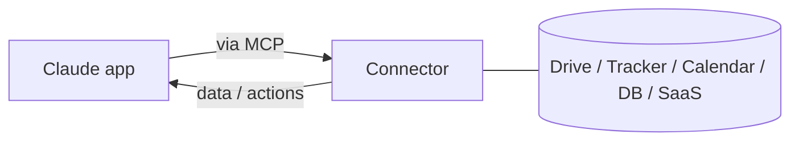

<LevelBadge level="intermediate" />

<VerifyNote lastVerified="2026-06-20" source="https://platform.claude.com/docs">
Welche Connectors existieren und welche Verfügbarkeit je nach Tarif besteht, ändert sich häufig – bestätige die aktuellen Optionen in der App/im Hilfecenter.
</VerifyNote>

**Connectors** ermöglichen es den Claude-Apps, **über den Chat hinaus** zu reichen – in deine Tools und Daten (Laufwerke, Issue-Tracker, Kalender, Datenbanken und mehr) – sodass Claude aus echten Systemen antworten und in ihnen handeln kann. Im Hintergrund werden sie vom offenen **[Model Context Protocol (MCP)](/docs/claude-code/mcp)** angetrieben.

## Was sie tun

Ohne Connectors weiß Claude nur, was sich im Gespräch befindet. Mit einem Connector kann es (mit deiner Erlaubnis) relevante Informationen aus einem verbundenen Dienst abrufen – z. B. ein Dokument finden, aktuelle Issues lesen, einen Kalender prüfen – und sie in seiner Antwort verwenden.

## Derselbe Standard, überall

Connectors sind die **app-seitige** Form von MCP. Dasselbe Protokoll treibt [MCP in Claude Code](/docs/claude-code/mcp) und [auf der API](/docs/api/mcp) an. Lerne das Konzept einmal; es gilt über alle Oberflächen hinweg.

## Einrichten & verwenden

1. **Verbinde** den Dienst (autorisiere per OAuth, wo unterstützt).
2. **Gewähre minimale Rechte** – nur den Zugriff, den die Aufgabe benötigt.
3. **Frage natürlich** – „Finde mein Q3-Planungsdokument und fasse die Risiken zusammen."

## Sicherheit

:::warning Ein Connector ist Zugriff + (manchmal) Aktionen
- Autorisiere nur Dienste und Berechtigungen, denen du vertraust.
- Aus externen Quellen abgerufene Inhalte können [Prompt-Injection](/docs/security/prompt-injection) enthalten – sei vorsichtig, wenn ein Connector nicht vertrauenswürdiges Material liest.
- Prüfe, was ein Drittanbieter-Connector tun kann, bevor du ihn aktivierst ([Drittanbieter-Code prüfen](/docs/security/reviewing-third-party-code)).
:::

## Weiter

- [MCP-Server in Claude Code](/docs/claude-code/mcp)
- [MCP & Verbindung zu Tools (API)](/docs/api/mcp)
- [KI in deinen bestehenden Tools](/docs/claude-app/ai-in-your-tools)
