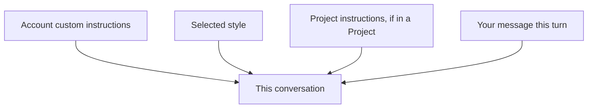

<LevelBadge level="beginner" />

<VerifyNote lastVerified="2026-06-20" source="https://www.anthropic.com">
Die genauen Namen und Orte von Custom Instructions und Styles in den Claude-Apps ändern sich – bestätige es in der App/im Hilfecenter.
</VerifyNote>

Müde, in jedem Chat „sei knapp" oder „Ich bin Krankenpfleger, erkläre entsprechend" zu wiederholen? **Custom Instructions** und **Styles** lassen dich deine Standardeinstellungen einmal festlegen, sodass sie überall gelten.

## Custom Instructions = dein persönlicher System-Prompt

Lege feste Fakten und Vorlieben fest – wer du bist, was du tust, wie du Antworten magst – und Claude wendet sie über Gespräche hinweg an. Es ist die Consumer-App-Version eines [System-Prompts](/docs/foundations/roles) (und der Verwandte von [CLAUDE.md](/docs/claude-code/claude-md) für Entwickler).

Gute Dinge, die man einbeziehen sollte:
- **Kontext zu dir** („Ich führe eine kleine Bäckerei"; „Ich programmiere in Python").
- **Ausgabevorlieben** („standardmäßig kurze Stichpunkt-Antworten"; „zeige immer deine Begründung").
- **Harte Regeln** („nie Emojis verwenden"; „metrische Einheiten").

## Styles = Darstellungsvoreinstellungen

**Styles** ändern Tonfall/Format (knapp, formell, erklärend usw.) und können pro Gespräch gewechselt werden. Nutze einen Style, wenn du *eine andere Stimme für diesen Chat* möchtest, ohne deine festen Anweisungen umzuschreiben.

## Wie sie sich überlagern

Spezifischerer/späterer Kontext setzt sich bei einem Konflikt tendenziell durch – also können die Anweisungen eines [Projects](/docs/claude-app/projects) oder eine explizite Bitte in deiner Nachricht deine globalen Standardeinstellungen überschreiben. Halte sie konsistent, um Überraschungen zu vermeiden.

## Tipps

- **Halte Anweisungen kurz und wahr** – wie bei CLAUDE.md schaden Aufblähung und veraltete Regeln.
- **Schreibe keine Geheimnisse** in Custom Instructions.
- **Überprüfe sie** gelegentlich, wenn sich deine Bedürfnisse ändern.

## Weiter

- [System-, User- & Assistant-Rollen](/docs/foundations/roles)
- [Projects: Dauerhafte Arbeitsbereiche](/docs/claude-app/projects)
- [CLAUDE.md & Memory-Dateien](/docs/claude-code/claude-md)
