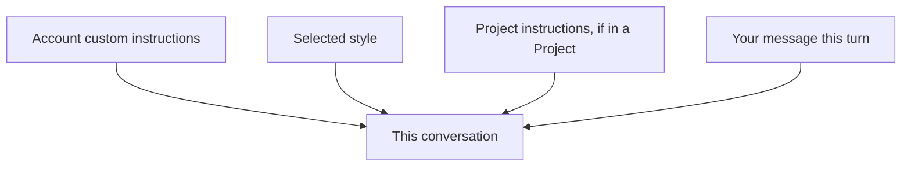

<LevelBadge level="beginner" />

<Callout type="objectives" items={[
  "Custom Instructions von Styles unterscheiden – und wissen, wann du zu welchem greifst",
  "Einen ersten Satz fester Anweisungen in drei Zeilen schreiben, der es wert ist, behalten zu werden",
  "Die Überlagerungsreihenfolge verstehen, wenn vier Anweisungsebenen sich widersprechen",
  "Die zwei Fehler vermeiden, die feste Anweisungen schlimmer machen als keine",
]} />

<VerifyNote lastVerified="2026-08-02" source="https://www.anthropic.com">
Die genauen Namen und Orte von Custom Instructions und Styles in den Claude-Apps ändern sich – bestätige es in der App/im Hilfecenter.
</VerifyNote>

Müde, in jedem Chat „sei knapp“ oder „Ich bin Krankenpfleger, erkläre entsprechend“ zu wiederholen? **Custom Instructions** und **Styles** lassen dich deine Standardeinstellungen einmal festlegen, sodass sie überall gelten.

## Custom Instructions = dein persönlicher System-Prompt

Lege feste Fakten und Vorlieben fest – wer du bist, was du tust, wie du Antworten magst – und Claude wendet sie über Gespräche hinweg an. Es ist die Consumer-App-Version eines [System-Prompts](/docs/foundations/roles) (und der Verwandte von [CLAUDE.md](/docs/claude-code/claude-md) für Entwickler).

Gute Dinge, die man einbeziehen sollte:
- **Kontext zu dir** („Ich führe eine kleine Bäckerei“; „Ich programmiere in Python“).
- **Ausgabevorlieben** („standardmäßig kurze Stichpunkt-Antworten“; „zeige immer deine Begründung“).
- **Harte Regeln** („nie Emojis verwenden“; „metrische Einheiten“).

<Steps items={[
  {title: "Schreibe den einen Satz über dich, den du immer wieder neu eintippst", body: "Rolle, Fachgebiet und alles, was die richtige Antwort verändert – „Ich bin Gemeindekrankenpfleger in Großbritannien“ oder „Ich schreibe Python-3.12-Services“."},
  {title: "Ergänze deine Standard-Ausgabeform", body: "Eine Zeile: kurze Stichpunkte, kein Vorgeplänkel, metrische Einheiten. Das ist der Teil, der sich in jedem einzelnen Zug auszahlt."},
  {title: "Füge höchstens zwei harte Regeln hinzu", body: "Regeln, die du jedes Mal durchsetzen würdest, etwa „nie Emojis verwenden“. Ein langes Regelwerk ist für Claude schwerer einzuhalten als ein kurzes."},
  {title: "Höre dort auf und nutze es eine Woche", body: "Füge eine Regel erst hinzu, wenn du dich dabei erwischst, dieselbe Korrektur zweimal zu tippen. Anweisungen, die du dir nicht merken kannst, sind Anweisungen, die du nicht debuggen kannst."},
]} />

<PromptCard title="Ein Starter-Satz an Custom Instructions">{`I'm a district nurse in the UK. I read fast and act on summaries.

Default to short bullet answers with no preamble. Metric units. Flag anything
that is clinical guidance I should confirm against current NHS sources.

Never use emoji.`}</PromptCard>

## Styles = Darstellungsvoreinstellungen

**Styles** ändern Tonfall/Format (knapp, formell, erklärend usw.) und können pro Gespräch gewechselt werden. Nutze einen Style, wenn du *eine andere Stimme für diesen Chat* möchtest, ohne deine festen Anweisungen umzuschreiben.

## Wie sie sich überlagern

```mermaid
flowchart TD
  A[Account custom instructions] --> C[This conversation]
  B[Selected style] --> C
  D[Project instructions, if in a Project] --> C
  E[Your message this turn] --> C
```

Spezifischerer/späterer Kontext setzt sich bei einem Konflikt tendenziell durch – also können die Anweisungen eines [Projects](/docs/claude-app/projects) oder eine explizite Bitte in deiner Nachricht deine globalen Standardeinstellungen überschreiben. Halte sie konsistent, um Überraschungen zu vermeiden.

## Tipps

- **Halte Anweisungen kurz und wahr** – wie bei CLAUDE.md schaden Aufblähung und veraltete Regeln.
- **Schreibe keine Geheimnisse** in Custom Instructions.
- **Überprüfe sie** gelegentlich, wenn sich deine Bedürfnisse ändern.

<Flashcards title="Vier Ebenen, vier Aufgaben" cards={[
  {front: "Custom Instructions", back: "Kontoweite feste Fakten und Vorlieben. Gelten für jedes Gespräch. Das Consumer-App-Äquivalent eines System-Prompts."},
  {front: "Styles", back: "Darstellungsvoreinstellungen – Tonfall und Format – pro Gespräch umschaltbar. Nutze einen, wenn du nur für diesen Chat eine andere Stimme möchtest."},
  {front: "Project Instructions", back: "Anweisungen, die auf einen Project-Arbeitsbereich beschränkt sind, neben dessen Dateien. Spezifischer als deine Konto-Standards, deshalb setzen sie sich tendenziell durch."},
  {front: "CLAUDE.md", back: "Der Verwandte für Entwickler: eine Datei mit festen Projektanweisungen, die Claude Code liest. Dieselbe Disziplin – kurz, wahr, gepflegt."},
  {front: "Die Überlagerungsregel", back: "Spezifischerer oder späterer Kontext setzt sich bei einem Konflikt tendenziell durch. Halte die Ebenen konsistent, damit du nie raten musst, welche gegriffen hat."},
]} />

<Quiz title="Prüfe dich selbst" questions={[
  {q: "Du möchtest nur für ein Gespräch einen formellen Tonfall, ohne deine Standardeinstellungen anzutasten. Was nutzt du?", options: ["Custom Instructions", "Einen Style", "Project Instructions", "CLAUDE.md"], answer: 1, explain: "Styles ändern Tonfall und Format und können pro Gespräch gewechselt werden – genau der Fall für eine andere Stimme in einem Chat."},
  {q: "Deine Konto-Anweisungen sagen „immer Stichpunkte verwenden“, aber die Anweisungen eines Projects verlangen Prosa. Was passiert in diesem Project tendenziell?", options: ["Die Konto-Anweisungen setzen sich durch, weil sie global sind", "Die Project-Anweisungen setzen sich tendenziell durch, weil sie spezifischer sind", "Claude weigert sich und bittet dich zu wählen", "Beide werden ignoriert"], answer: 1, explain: "Spezifischerer oder späterer Kontext setzt sich tendenziell durch, also können die Anweisungen eines Projects deine globalen Standardeinstellungen überschreiben – weshalb es darauf ankommt, die Ebenen konsistent zu halten."},
  {q: "Was von diesen Dingen gehört NICHT in Custom Instructions?", options: ["Deine Rolle und dein Fachgebiet", "Deine Standard-Ausgabeform", "Ein API-Schlüssel, den du oft wiederverwendest", "Eine harte Regel wie „metrische Einheiten“"], answer: 2, explain: "Schreibe keine Geheimnisse in Custom Instructions – sie reisen mit jedem Gespräch mit."},
]} />

<Callout type="takeaways" items={[
  "Custom Instructions sind feste Standards; Styles sind eine Stimme pro Chat. Greife zum engeren der beiden.",
  "Drei Zeilen – wer du bist, deine Standard-Ausgabeform, eine oder zwei harte Regeln – schlagen ein langes Regelwerk.",
  "Vier Ebenen fließen in jedes Gespräch ein: Konto-Anweisungen, Style, Project-Anweisungen, die Nachricht dieses Zugs.",
  "Spezifischerer oder späterer Kontext setzt sich bei einem Konflikt tendenziell durch, halte die Ebenen also konsistent.",
  "Schreibe nie Geheimnisse in feste Anweisungen und entferne veraltete Regeln, wenn sich deine Bedürfnisse ändern.",
]} />

## Weiter

- [System-, User- & Assistant-Rollen](/docs/foundations/roles)
- [Projects: Dauerhafte Arbeitsbereiche](/docs/claude-app/projects)
- [CLAUDE.md & Memory-Dateien](/docs/claude-code/claude-md)
