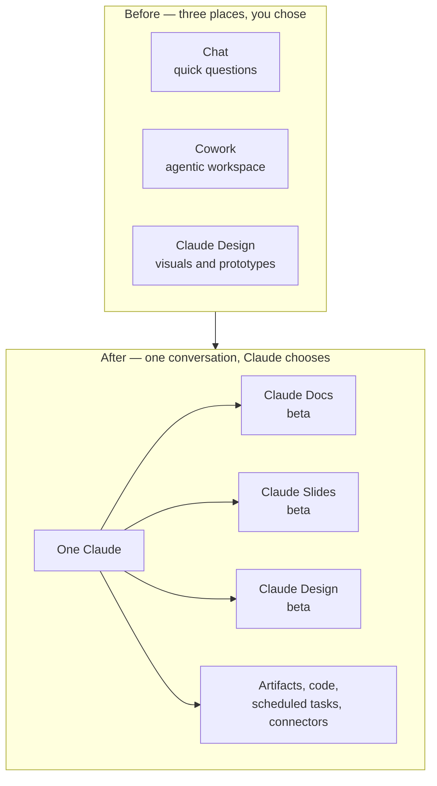

<LevelBadge level="beginner" />

<VerifyNote lastVerified="2026-09-25" source="https://claude.com/blog/cowork-is-now-claude">
Angekündigt am **16. September 2026**. Das zusammengelegte Erlebnis wird **schrittweise ausgerollt, beginnend mit Pro und Max** auf Web, Desktop und Mobil, danach Team und Free; Enterprise-Organisationen erhalten **mindestens 30 Tage Vorlauf**. Claude Docs, Claude Slides und Claude Design sind **in der Beta auf bezahlten Plänen**. Weil der Rollout gestaffelt ist, können zwei Accounts auf demselben Plan am selben Tag Unterschiedliches sehen — prüfe den [Help-Center-Artikel](https://support.claude.com/en/articles/16761823-claude-cowork-and-chat-are-one-claude) für den aktuellen Status, bevor du dich auf irgendetwas hier verlässt.
</VerifyNote>

Am **16. September 2026** hat Anthropic drei Produkte zu einem zusammengeführt. Chat, **Cowork** (der agentische Arbeitsbereich) und **Claude Design** sind nicht mehr getrennte Orte, zwischen denen du wählen musstest. Es gibt jetzt ein Konversationsfeld, und Claude entscheidet, was die Aufgabe braucht.

Die offizielle Formulierung ist kurz: *„Bitte Claude um das, was du brauchst, und es kann entscheiden, welches Tool es benutzt."* Die praktische Konsequenz ist länger, und um sie geht es auf dieser Seite — denn eine Zusammenlegung wie diese verschiebt Einstellungen, verabschiedet Gewohnheiten und liefert zwei neue Dokument-Tools, deren Limits nicht offensichtlich sind, bis du gegen sie stößt.

<Callout type="objectives" items={[
  "Verstehen, was am 16. September 2026 tatsächlich zusammengelegt wurde — und warum 'kein Modus zu wählen' verändert, wie du eine Aufgabe beginnst",
  "Jede Einstellung finden, die umgezogen ist: globale Anweisungen, Websuche, Recherche und Dateispeicher",
  "Korrekt zwischen Claude Docs, Claude Slides, Claude Design, einem einfachen Artifact und einer heruntergeladenen .docx/.pptx wählen",
  "Claude Docs so nutzen, wie es gedacht ist: Tabs, Inline-Kommentare, @Claude-Bearbeitungen und Echtzeit-Co-Authoring",
  "Die acht Limits kennen, die dich treffen werden — keine Versionshistorie, keine Kommentar-nur-Rolle, Diagramme, die sich nicht aktualisieren, und die Compliance-Konfigurationen, in denen Docs einfach nicht verfügbar ist",
  "Die Kosten für Nutzungslimits bei agentischer Arbeit vorhersehen, jetzt wo alles in einer Konversation läuft"
]} />

## Was zusammengelegt wurde, in einem Bild

Nichts, was du hattest, wird weggeworfen. Laut Anthropic: *„Bestehende Cowork-Aufgaben, Projekte, Connectors, Skills, Artifacts und Dateien werden übernommen, und diese Cowork-Aufgaben öffnen sich wie vorher, sodass du sie fortsetzen kannst."*

Was sich ändert, ist der **Einstiegspunkt**. Früher hast du die Form der Arbeit entschieden, bevor du sie beschrieben hast — Chat für eine Frage, Cowork für ein Projekt. Jetzt beschreibst du die Arbeit und Claude wählt die Maschinerie, mit demselben Kontext, denselben Skills und denselben Connectors, verfügbar aus jeder Konversation.

## Wohin alles umgezogen ist

Das ist der Teil, der die meiste „wo ist mein Button hin"-Verwirrung erzeugt, und der Teil, den kein Drittanbieter-Bericht abdeckt. Vier Dinge sind umgezogen:

| Was du benutzt hast | Wo es jetzt ist |
| --- | --- |
| Globale Anweisungen | **Einstellungen → Allgemein** |
| Websuche-Schalter | **Weg — es passiert automatisch.** Claude entscheidet, wann es sucht |
| Recherche | Tippe **`/deep-research`** oder nutze den **`+`**-Button |
| Deine Dateien | **Einstellungen → Speicherordner** |

<Callout type="warning" items={[
  "Der Websuche-Schalter ist nicht versteckt, er ist entfernt. Wenn dein Workflow davon abhing, die Suche für eine private oder offline denkende Aufgabe zwangsweise abzuschalten, existiert dieser Hebel in der UI nicht mehr — sag es stattdessen im Prompt ('antworte nur aus der Konversation; suche nicht im Web')."
]} />

## Die drei Templates: welches willst du eigentlich?

Die Zusammenlegung lieferte **Claude Docs** und **Claude Slides** als neue Tools und verlegte **Claude Design** in Konversationen hinein. Alle drei sind *Templates* — eine Ausgangsform für ein Artifact, keine separate App.

<Steps items={[
  {title: "Claude Docs — lebende Dokumente", body: "Rich-Text-Dokumente, die in deinem Claude-Account gespeichert werden, mit Überschriften, Tabellen und weiterer Formatierung und mit mehr als einem Tab (wie Abschnitte eines Notizbuchs). Du, Claude und deine Kolleginnen und Kollegen schreiben alle im selben Dokument, zur selben Zeit. Exportiert nach Word (.docx), PDF, Markdown (.md) und Google Docs. Greife danach, wenn das Dokument selbst das Ergebnis ist und sich weiter ändern wird."},
  {title: "Claude Slides — Präsentationen", body: "Decks, gebaut aus deinen Notizen, einem Bericht oder der Arbeit, die bereits in der Konversation steckt. Du kannst jede Folie direkt bearbeiten, präsentieren, ohne Claude zu verlassen, und nach PowerPoint und PDF exportieren. Greife danach, wenn du ein Deck aus Material brauchst, das du schon erzeugt hast."},
  {title: "Claude Design — Visuals und Prototypen", body: "Visuals, Mockups, Prototypen, One-Pager und Landingpages, gebaut gegen dein Designsystem. Exportiert als .zip, PDF, PowerPoint oder eigenständiges HTML. Greife danach, wenn die Ausgabe visuell ist oder zu einer Marke passen muss."},
  {title: "Ein einfaches Artifact — Code, Apps, Diagramme", body: "Weiterhin da, unverändert, auf jedem Plan einschließlich Free. Eine ausführbare Mini-App, ein Diagramm, ein Schaubild, ein Skript. Greife danach, wenn das Ding ausgeführt werden soll statt gelesen. Siehe Artifacts."},
  {title: "Eine generierte Datei — .docx / .pptx / .xlsx / .pdf", body: "Eine Einmal-Datei, die Claude baut und du herunterlädst. Keine Live-Bearbeitungsfläche, kein Teilen, keine Kommentare. Greife danach, wenn du eine Datei zum Weitergeben brauchst und sie in Claude nie wieder anfassen willst. Siehe Echte Dateien erzeugen."}
]} />

Der Unterschied, der am meisten zählt, sind die letzten beiden: **Ein Claude Doc ist ein lebendes Dokument mit einer URL, Mitarbeitenden und Kommentaren; eine generierte `.docx` ist ein Download.** Wenn du vor der Zusammenlegung nach „einem Word-Dokument" gefragt hast und eine Datei bekamst, kann dieselbe Frage jetzt ein Doc liefern, das du anschließend exportierst — was meist ist, was du wolltest, aber es ist ein anderes Objekt mit anderen Freigaberegeln.

### Drei Wege, eines zu erstellen

<Steps items={[
  {title: "In einer beliebigen Konversation fragen", body: "Einfache Sprache genügt — 'mach aus dem Plan, den wir gerade durchgearbeitet haben, eine Produktspezifikation, die ich mit dem Team teilen kann.' Claude stellt ein paar Fragen, bevor es beginnt, und entwirft dann das Dokument auf dem Bildschirm."},
  {title: "Ein Template explizit wählen", body: "Wähle Output im Nachrichtenfeld und dann ein Template. Nutze das, wenn Claude immer wieder eine andere Form wählt als du willst."},
  {title: "Vom Artifacts-Tab aus starten", body: "Wähle ein Template aus der Galerie und briefe dann Claude. Nützlich, wenn das Dokument und nicht die Konversation das ist, weswegen du gekommen bist."}
]} />

<PromptCard title="Ein Claude Doc so briefen, dass der erste Entwurf nah dran ist">{`Create a Claude Doc: a one-page product spec for the export feature
we just designed.

Structure it in four tabs:
  1. Summary — problem, proposed solution, who it's for
  2. Requirements — numbered, testable, each with a rationale
  3. Open questions — things I still need to decide, with your
     recommendation and the tradeoff for each
  4. Rejected alternatives — what we considered and why not

Rules:
- Pull the decisions from this conversation. Do not invent
  requirements I did not state.
- Where I was vague, leave a comment asking me the question
  instead of guessing.
- Add a table comparing the three export formats we discussed.

Ask me anything you need before you start drafting.`}</PromptCard>

## Claude Docs im Detail

### Bearbeiten, Kommentare und @Claude

Drei Bearbeitungswege existieren nebeneinander, und das ist der Sinn des Tools:

- **Du tippst.** Klick ins Dokument und tippe. Änderungen werden automatisch gespeichert.
- **Du fragst.** Fordere eine Änderung im Gespräch an; Claude bearbeitet und erklärt, was es getan hat und warum.
- **Du kommentierst.** Markiere Text und hinterlasse einen Kommentar für deine Mitarbeitenden — und **erwähne `@Claude` in einem Kommentar, damit Claude diese Bearbeitung direkt vornimmt.** Claude antwortet im Thread, macht die Änderung und erklärt sie.

Claude **hinterlässt auch eigene Kommentare während des Entwerfens**, um eine Entscheidung zu erklären oder dir eine Frage zu stellen. Das ist das Verhalten, um das es sich lohnt, deinen Prompt herum zu bauen: Claude zu sagen, es solle *in einem Kommentar fragen statt zu raten* (wie in der Prompt-Karte oben), verwandelt stilles Halluzinationsrisiko in eine sichtbare Frage, die du beantworten kannst.

Du kannst Claude auch bitten, **ein Diagramm, Schaubild, eine Grafik oder eine Zeitleiste** zu einem Dokument hinzuzufügen.

### Zusammenarbeit und Freigabe

Personen mit Bearbeitungszugriff arbeiten gleichzeitig mit dir und Claude am selben Dokument, und die Änderungen aller erscheinen in Echtzeit.

| | Betrachter | Bearbeiter |
| --- | --- | --- |
| Lesen | ✅ | ✅ |
| Bearbeiten | ❌ | ✅ |
| Kommentieren | ❌ | ✅ |
| Exportieren | ❌ | ✅ |

Die Freigaberegeln unterscheiden sich stark je nach Plan:

- **Pro / Max** — mit jeder Person teilen, die den Link hat.
- **Team / Enterprise** — bestimmte Personen oder eine Gruppe einladen oder mit allen in deiner Organisation teilen. **Docs können nicht außerhalb deiner Organisation geteilt werden**, weder per Link noch per E-Mail-Einladung.
- **In jedem Fall** — das Öffnen eines geteilten Dokuments erfordert einen Claude-Account, und **nur die Eigentümerin oder der Eigentümer kann ein Dokument umbenennen oder löschen.**

### Wo du es nutzen kannst

Docs funktionieren auf **Web, Desktop, Claude Code und Mobil** — aber die **iOS- und Android-Apps sind nur zum Ansehen**: keine Bearbeitung und keine Template-Auswahl vom Telefon. Plane damit, wenn deine Review-Schleife mobil ist.

## Die Limits, die dich treffen werden

Jedes davon ist dokumentiert, und jedes überrascht in Woche eins irgendjemanden.

<Steps items={[
  {title: "Noch keine Versionshistorie", body: "Es gibt keine Möglichkeit, einen früheren Zustand eines Dokuments zu sehen oder wiederherzustellen. Jede Person mit Bearbeitungszugriff kann alles überschreiben, und deine einzige Rettung ist ein Export, den du vorher gemacht hast. Exportiere bei einem Dokument, das zählt, an jedem Meilenstein nach Markdown, bis die Historie kommt."},
  {title: "Keine Zugriffsstufe nur für Kommentare", body: "Die Rollen sind Betrachter und Bearbeiter, nichts dazwischen. Eine Reviewerin, die kommentieren, aber nicht bearbeiten soll, existiert als Berechtigung nicht — gib Bearbeitungsrechte und verlasse dich auf Vertrauen, oder gib Leserechte und sammle Feedback woanders."},
  {title: "Diagramme und Schaubilder aktualisieren sich nicht automatisch", body: "Ein Diagramm, das Claude hinzugefügt hat, ist eine Momentaufnahme. Ändere die zugrunde liegenden Zahlen im Dokument, und das Diagramm zeigt weiter die alten, bis du Claude bittest, es neu zu erzeugen. Behandle jedes Visual als veraltet, bis es neu angefordert wurde."},
  {title: "Team und Enterprise können nicht extern teilen", body: "Kein Teilen per Link, keine E-Mail-Einladung außerhalb der Organisation. Wenn du ein Dokument an eine Kundin oder einen Kunden senden musst, exportiere es (Word, PDF, Markdown, Google Docs) und sende den Export."},
  {title: "Mobil ist nur zum Ansehen", body: "iOS und Android können ein Dokument lesen. Sie können keines bearbeiten und kein Template wählen."},
  {title: "Nicht verfügbar unter CMEK, ZDR und HIPAA", body: "Claude Docs ist für Organisationen nicht verfügbar, die mit kundenverwalteten Verschlüsselungsschlüsseln, Zero Data Retention oder HIPAA konfiguriert sind. Das ist die wichtigste Einzeltatsache für regulierte Teams, und es ist keine Rollout-Verzögerung — es ist ein Ausschluss."},
  {title: "Noch nicht in der Compliance-API", body: "Aktivität innerhalb eines Dokuments wird nicht in der Compliance-API erfasst. Wenn deine Audit-Haltung von diesem Export abhängt, ist Dokumentaktivität derzeit ein blinder Fleck."},
  {title: "Enterprise startet ausgeschaltet", body: "Auf Enterprise-Plänen sind die Templates aus, bis eine Eigentümerin oder ein Eigentümer jedes einzelne in den Organisationseinstellungen einschaltet. Auf Pro, Max und Team sind sie standardmäßig an."}
]} />

### Ebenfalls noch nicht unterstützt im zusammengelegten Erlebnis

Das vereinheitlichte Erlebnis unterstützt noch nicht die **GitHub-Integration („Add from GitHub")**, **Konversationsverzweigung**, **Suche über ältere Cowork-Aufgaben**, **Dispatch** (nur bestehende Nutzende) oder **Inkognito-Chats für Datei- und Code-Erstellung**. Wenn dein Workflow auf Verzweigung oder auf das Durchsuchen deiner Cowork-Historie setzt, ist diese Fähigkeit vorübergehend weg — nicht umgezogen.

## Was dich das kostet

Es gibt keinen separaten Preis. Der relevante Satz betrifft *Nutzungslimits*: *„Alles, was du mit Claude machst, zählt auf die Nutzungslimits deines Plans. Längere agentische Aufgaben, die im Web suchen, Code ausführen oder Dateien erstellen, verbrauchen in der Regel mehr als eine kurze Frage."* Claude Docs zählt genauso.

Die Zusammenlegung macht das schärfer, als es klingt. Früher war das Öffnen von Cowork ein bewusster Akt — du wusstest, dass du teure Arbeit beginnst. Jetzt kann eine beiläufig formulierte Anfrage im selben Feld einen langen agentischen Lauf auslösen, der sucht, Code ausführt und Dateien schreibt. **Das Kostensignal ist von der Tür zum Prompt gewandert.** Wenn du auf einem Plan bist, auf dem Limits zählen, sag explizit, was du willst:

<PromptCard title="Eine Anfrage günstig halten, wenn du nur eine Antwort willst">{`Answer from this conversation only. Do not search the web, do not
run code, and do not create any files or artifacts. Two paragraphs.`}</PromptCard>

Und umgekehrt, wenn du die volle Maschinerie willst:

<PromptCard title="Bewusst nach der teuren Version fragen">{`Take this as a full task, not a chat answer.

Research the three vendors below, check their current pricing pages,
build a comparison spreadsheet, and turn the recommendation into a
Claude Doc I can share with the team. Cite every figure with a link
and the date you read it.

Vendors: [A], [B], [C]`}</PromptCard>

## Deine eigenen Gewohnheiten migrieren

<Steps items={[
  {title: "Bring deine globalen Anweisungen neu unter", body: "Sie sind nach Einstellungen → Allgemein umgezogen. Öffne sie einmal und lies sie neu: Anweisungen, die für ein Chat-only-Claude geschrieben wurden ('du kannst nicht im Web surfen', 'frag nach, bevor du etwas Langes tust'), können jetzt aktiv gegen das zusammengelegte Verhalten arbeiten."},
  {title: "Greif nicht mehr nach dem Websuche-Schalter", body: "Er ist weg. Leg die Suchabsicht in den Prompt — entweder 'prüfe aktuelle Quellen' oder 'suche nicht'."},
  {title: "Lerne Recherche neu", body: "Tippe /deep-research oder nutze den +-Button. Es ist jetzt ein Befehl, kein Modus."},
  {title: "Prüfe alles, was annahm, Cowork sei separat", body: "Geplante Aufgaben, Connectors und Skills sind übernommen worden, aber Prompts, die 'das ist eine Cowork-Aufgabe' als Signal für mehr Anstrengung sagten, signalisieren nichts mehr. Ersetze diese Rahmung durch explizite Scope-Angaben, wie in den Prompt-Karten oben."},
  {title: "Entscheide deinen Docs-Export-Rhythmus", body: "Bis die Versionshistorie kommt, wähle einen Meilenstein-Rhythmus — exportiere nach Markdown, wann immer das Dokument einen Zustand erreicht, dessen Verlust dich ärgern würde."}
]} />

## Begriffe, die man kennen sollte

<Flashcards cards={[
  {front: "One Claude", back: "Die Zusammenlegung von Chat, Cowork und Claude Design am 16. September 2026 zu einem einzigen Konversationserlebnis ohne Modus zum Wählen. Claude entscheidet, welche Tools eine Aufgabe braucht."},
  {front: "Template (Docs / Slides / Design)", back: "Eine Ausgangsform für ein Artifact, keine separate App. In der Beta auf bezahlten Plänen; standardmäßig an auf Pro, Max und Team; aus, bis eine Eigentümerin oder ein Eigentümer es auf Enterprise aktiviert."},
  {front: "Claude Doc", back: "Ein lebendes Rich-Text-Dokument mit mehreren Tabs, gespeichert in deinem Claude-Account, in Echtzeit gemeinsam bearbeitet von dir, Claude und Mitarbeitenden. Exportiert nach Word, PDF, Markdown und Google Docs."},
  {front: "Tab (in einem Doc)", back: "Ein Abschnitt eines Dokuments, wie ein Abschnitt eines Notizbuchs. Ein Dokument kann mehrere enthalten — nützlich, um eine Spezifikation in Zusammenfassung, Anforderungen und offene Fragen zu teilen."},
  {front: "@Claude-Kommentar", back: "Claude in einem Dokumentkommentar erwähnen, damit es diese Bearbeitung direkt vornimmt, im Thread antwortet und erklärt, was es geändert hat."},
  {front: "Betrachter vs. Bearbeiter", back: "Die einzigen zwei Zugriffsstufen. Betrachter lesen. Bearbeiter lesen, bearbeiten, kommentieren und exportieren. Es gibt keine Rolle nur für Kommentare."},
  {front: "Output-Button", back: "Das Steuerelement im Nachrichtenfeld, um ein Template explizit zu wählen, wenn Claude die Form nicht für dich wählen soll."},
  {front: "Doc vs. generierte Datei", back: "Ein Doc ist ein lebendes Dokument mit einer URL, Mitarbeitenden und Kommentaren. Eine generierte .docx/.pptx/.xlsx ist ein Einmal-Download ohne all das."}
]} />

## Quiz

<Quiz questions={[
  {q: "Deine Organisation betreibt Claude auf Enterprise mit Zero Data Retention (ZDR). Dein Team will anfangen, Spezifikationen in Claude Docs zu entwerfen. Was passiert?", options: ["Es funktioniert, sobald eine Eigentümerin oder ein Eigentümer das Template in den Organisationseinstellungen aktiviert", "Es funktioniert, aber Dokumente werden nach 30 Tagen gelöscht", "Claude Docs ist nicht verfügbar — ZDR-, CMEK- und HIPAA-Konfigurationen sind ausgeschlossen", "Es funktioniert im Nur-Ansicht-Modus"], answer: 2, explain: "Claude Docs ist für Organisationen nicht verfügbar, die CMEK-, ZDR- oder HIPAA-Konfigurationen nutzen. Das ist ein Ausschluss, keine Rollout-Verzögerung, kein Admin-Schalter behebt es also. Teams unter diesen Konfigurationen brauchen eine andere Entwurfsfläche."},
  {q: "Du hast einem Claude Doc ein Diagramm aus einer Tabelle mit Q3-Zahlen hinzugefügt. Eine Kollegin korrigiert dann zwei Werte in der Tabelle. Was zeigt das Diagramm?", options: ["Die korrigierten Werte, live aktualisiert", "Die korrigierten Werte, nachdem du das Dokument neu lädst", "Die alten Werte, bis du Claude bittest, das Diagramm neu zu erzeugen", "Einen Fehlerzustand, der die Abweichung markiert"], answer: 2, explain: "Diagramme und Schaubilder aktualisieren sich nicht automatisch — jedes ist eine Momentaufnahme aus dem Zeitpunkt seiner Erstellung. Behandle jedes Visual in einem Dokument als veraltet, bis du Claude ausdrücklich bittest, es aus den aktuellen Daten neu zu bauen."},
  {q: "Du bist auf einem Team-Plan und musst eine fertige Spezifikation an eine externe Kundin senden. Was ist der unterstützte Weg?", options: ["Den Doc-Link teilen — Link-Freigabe funktioniert auf jedem bezahlten Plan", "Die Kundin per E-Mail aus dem Share-Dialog des Dokuments einladen", "Das Dokument nach Word, PDF, Markdown oder Google Docs exportieren und den Export senden", "Das Dokument zuerst in einen Pro-Account verschieben"], answer: 2, explain: "Auf Team- und Enterprise-Plänen können Dokumente nicht außerhalb deiner Organisation geteilt werden, weder per Link noch per E-Mail-Einladung. Link-an-jeden-Freigabe ist ein Pro/Max-Verhalten. Der unterstützte Weg für eine externe Empfängerin ist der Export."},
  {q: "Welche Aussage über die Websuche ist seit der Zusammenlegung wahr?", options: ["Der Schalter ist nach Einstellungen → Allgemein umgezogen", "Der Schalter ist hinter den +-Button umgezogen", "Der Schalter ist entfernt — die Suche passiert automatisch, du steuerst sie also im Prompt", "Die Suche ist jetzt auf allen Plänen standardmäßig aus"], answer: 2, explain: "Der Websuche-Schalter wurde entfernt, nicht verlegt; Claude entscheidet, wann es sucht. Globale Anweisungen sind nach Einstellungen → Allgemein umgezogen und die Recherche zu /deep-research oder dem +-Button, aber die Suche wird jetzt im Prompt gesteuert ('prüfe aktuelle Quellen' oder 'suche nicht')."}
]} />

<Callout type="takeaways" items={[
  "Eine Konversation, kein Modus zum Wählen: Das Kostensignal ist von der Tür (dem Öffnen von Cowork) zum Prompt gewandert. Sag explizit, wann du eine günstige Antwort willst und wann den vollen agentischen Lauf.",
  "Vier Dinge sind umgezogen: globale Anweisungen → Einstellungen → Allgemein; Websuche → automatisch, im Prompt steuern; Recherche → /deep-research oder +; Dateien → Einstellungen → Speicherordner.",
  "Ein Claude Doc ist ein lebendes Dokument mit Mitarbeitenden und Kommentaren; eine generierte .docx ist ein Download. Wähle bewusst — ihre Freigaberegeln unterscheiden sich vollständig.",
  "Baue deinen Prompt um Claudes Kommentare herum: Sag ihm, es solle in einem Kommentar fragen statt zu raten, und du verwandelst Erfindung in eine sichtbare Frage.",
  "Zwei Limits verdienen heute eine Umgehung: keine Versionshistorie (an Meilensteinen nach Markdown exportieren) und Diagramme, die sich nie aktualisieren (nach jeder Datenänderung neu erzeugen).",
  "Regulierte Teams: Claude Docs ist unter CMEK, ZDR und HIPAA nicht verfügbar, und Dokumentaktivität ist noch nicht in der Compliance-API."
]} />

## Quellen & weiterführende Literatur

- Anthropic — [Claude Cowork und Chat sind jetzt ein Claude](https://claude.com/blog/cowork-is-now-claude) (Ankündigung, 16. September 2026)
- Anthropic Help Center — [Claude Cowork und Chat sind ein Claude](https://support.claude.com/en/articles/16761823-claude-cowork-and-chat-are-one-claude) (Rollout, Umzüge, was übernommen wurde, aktuelle Lücken)
- Anthropic Help Center — [Erste Schritte mit Claude Docs](https://support.claude.com/en/articles/16923645-get-started-with-claude-docs) (Erstellung, Tabs, Kommentare, Freigabematrix, Exporte, Limits)
- Anthropic Help Center — [Was sind Artifacts und wie nutze ich sie?](https://support.claude.com/en/articles/17153992-what-are-artifacts-and-how-do-i-use-them) (die drei Templates und ihre Plan-Verfügbarkeit)
- Verwandt auf AILmanac: [Artifacts](/docs/claude-app/artifacts) · [Cowork Geplante Aufgaben](/docs/claude-app/cowork-scheduled-tasks) · [Echte Dateien erzeugen](/docs/claude-app/generating-files) · [Projekte](/docs/claude-app/projects) · [Pläne, Limits & Abrechnung](/docs/claude-app/plans-and-billing)

## Weiter

- [Artifacts: Live, ausführbare Ausgaben](/docs/claude-app/artifacts) — der Container, in den alle drei Templates gerendert werden
- [Cowork Geplante Aufgaben](/docs/claude-app/cowork-scheduled-tasks) — die Maschinerie für wiederkehrende Aufgaben, die unverändert übernommen wurde
- [Echte Dateien erzeugen (docx/pptx/xlsx/pdf)](/docs/claude-app/generating-files) — wenn du einen Download willst, kein lebendes Dokument
