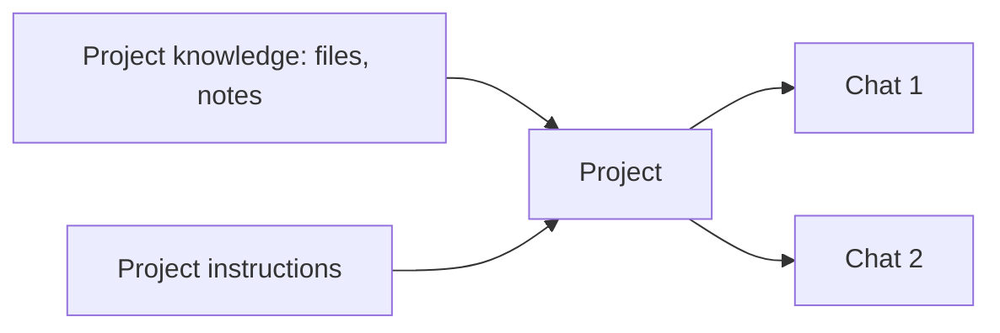

<LevelBadge level="beginner" />

<VerifyNote lastVerified="2026-06-20" source="https://www.anthropic.com">
Project-Funktionen und -Grenzen variieren je nach Tarif und ändern sich – bestätige das aktuelle Verhalten in der App/im Hilfecenter.
</VerifyNote>

Ein **Project** ist ein dedizierter Arbeitsbereich in Claude.ai, der **seine eigenen Dateien, sein Wissen und seine Anweisungen** bündelt. Statt dieselben Dokumente in jedem Chat erneut hochzuladen und den Kontext erneut zu erklären, richtest du es einmal ein – und jedes Gespräch im Project startet bereits informiert.

## Warum ein Project nutzen

- **Fundierte Antworten.** Füge deine Dokumente hinzu (ein Handbuch, Spezifikationen, Notizen), und Claude antwortet *aus ihnen* – eine eingebaute, codefreie Variante von [RAG](/docs/foundations/rag).
- **Dauerhafter Kontext.** Project-Anweisungen wirken wie ein bereichsbezogener [System-Prompt](/docs/foundations/roles) für alles darin.
- **Organisiert.** Alle Chats zu einem Thema/Kunden/Vorhaben liegen zusammen.

## Eines einrichten

1. **Erstelle ein Project** und gib ihm einen klaren Zweck.
2. **Füge Wissen hinzu** – die Dateien/Texte, die es immer kennen soll.
3. **Schreibe Project-Anweisungen** – Rolle, Konventionen, was zu tun/vermeiden ist.
4. **Beginne zu chatten** – jedes Gespräch erbt das Wissen + die Anweisungen.

## Großartige Anwendungsfälle

- Ein **Kunden-/Account**-Arbeitsbereich (deren Dokumente + deine Notizen).
- Eine **Codebasis- oder Produkt**-Wissensdatenbank für Q&A.
- Ein **Schreibprojekt** mit deinem Styleguide und früheren Texten (damit Entwürfe deiner Stimme entsprechen).
- **Lernen** für einen Kurs, mit geladenem Lehrplan und Materialien.

## Tipps

- **Kuratiere das Wissen** – relevante, aktuelle Dateien schlagen das Abladen von allem (Rauschen schadet dem Retrieval).
- **Halte Anweisungen knapp und wahr** (dieselbe Regel wie bei [Custom Instructions](/docs/claude-app/custom-instructions)).
- **Füge keine sensiblen Daten hinzu**, deren Speicherung dir unangenehm ist – siehe [Datenschutz](/docs/foundations/privacy).

## Weiter

- [Custom Instructions & Styles](/docs/claude-app/custom-instructions)
- [Erinnerung über Chats hinweg](/docs/claude-app/memory)
- [Retrieval-Augmented Generation (RAG)](/docs/foundations/rag)
