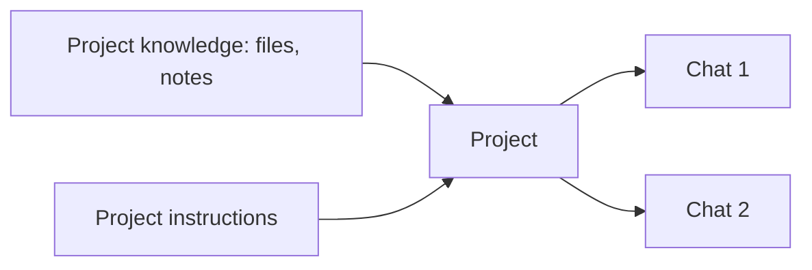

<LevelBadge level="beginner" />

<VerifyNote lastVerified="2026-09-23" source="https://claude.com/blog/projects-redesigned">
Project-Funktionen und -Grenzen variieren je nach Plan und ändern sich — bestätige das aktuelle Verhalten in der App oder im Help Center. Ein **neu gestaltetes Projects** (ein Koordinator, der an parallele Threads delegiert) ist am 17. September 2026 in Claude Code in die Beta gegangen und soll später den Rest von Claude sowie die Team-/Enterprise-Pläne erreichen. Diese Seite beschreibt das Project mit Wissensdatenbank, das die meisten Accounts noch haben.
</VerifyNote>

Ein **Project** ist ein dedizierter Arbeitsbereich in Claude.ai, der **seine eigenen Dateien, sein eigenes Wissen und seine eigenen Anweisungen** bündelt. Statt in jedem Chat dieselben Dokumente erneut hochzuladen und den Kontext erneut zu erklären, richtest du es einmal ein — und jede Konversation im Project startet bereits informiert.

<Callout type="objectives" items={[
  "Was ein Project bündelt, und warum das besser ist, als in jedem Chat den Kontext erneut einzufügen",
  "Die Einrichtung in vier Schritten, und der eine Schritt, den Leute überspringen",
  "Wie du Project-Wissen kuratierst, damit das Retrieval scharf bleibt",
  "Wie sich dieses Project von den Projects mit Koordinator und Threads in Claude Code unterscheidet"
]} />

## Warum ein Project nutzen

- **Fundierte Antworten.** Füge deine Dokumente hinzu (ein Handbuch, Spezifikationen, Notizen), und Claude antwortet *aus ihnen* — eine eingebaute, codefreie Variante von [RAG](/docs/foundations/rag).
- **Dauerhafter Kontext.** Project-Anweisungen wirken wie ein bereichsbezogener [System-Prompt](/docs/foundations/roles) für alles darin.
- **Organisiert.** Alle Chats zu einem Thema, einem Kunden oder einem Vorhaben liegen zusammen.

## Einen einrichten

<Steps items={[
  {title: "Erstelle ein Project mit klarem Zweck", body: "Ein Project pro Thema, Kunde oder Vorhaben. Ein Project, das drei unzusammenhängende Dinge abdeckt, liefert für alle drei schlechtes Retrieval."},
  {title: "Füge Wissen hinzu", body: "Die Dateien und Texte, die es immer kennen soll — das Handbuch, die Spezifikation, den Styleguide. Das ist es, woraus Claude antwortet."},
  {title: "Schreibe Project-Anweisungen", body: "Der Schritt, den Leute überspringen. Rolle, Konventionen, was zu tun und was zu vermeiden ist. Ohne sie hast du einen Suchindex statt einer Kollegin."},
  {title: "Beginne zu chatten", body: "Jede Konversation im Project erbt das Wissen und die Anweisungen automatisch."}
]} />

```mermaid
flowchart LR
  K[Project knowledge: files, notes] --> P[Project]
  I[Project instructions] --> P
  P --> C1[Chat 1]
  P --> C2[Chat 2]
```

## Großartige Anwendungsfälle

- Ein Arbeitsbereich für **Kunde/Account** (deren Dokumente + deine Notizen).
- Eine Wissensdatenbank für eine **Codebasis oder ein Produkt** für Q&A.
- Ein **Schreibprojekt** mit deinem Styleguide und früheren Texten (damit Entwürfe deiner Stimme entsprechen).
- **Lernen** für einen Kurs, mit geladenem Lehrplan und Materialien.

## Ein Startpunkt für Project-Anweisungen

<PromptCard title="Gerüst für Project-Anweisungen">{`You are helping with [project/client name].

Context: [what this project is, who it serves, current stage]

Always:
- Answer from the project knowledge first; say so when you are going beyond it.
- Use [our terminology: list the 3-5 terms that matter].
- Match the tone in [named file in the knowledge base].

Never:
- Invent figures, dates, or quotes. If it is not in the knowledge, say it is not in the knowledge.
- [Project-specific constraint: e.g. reference the deprecated v1 API.]`}</PromptCard>

## Tipps

- **Kuratiere das Wissen** — relevante, aktuelle Dateien schlagen das Abladen von allem (Rauschen schadet dem Retrieval).
- **Halte die Anweisungen knapp und wahr** (dieselbe Regel wie bei [Custom Instructions](/docs/claude-app/custom-instructions)).
- **Räume auf, wenn sich Dinge ändern.** Eine überholte Spezifikation, die in der Wissensdatenbank liegen bleibt, ist schlimmer als keine Spezifikation, denn Claude hat keine Möglichkeit zu wissen, dass sie gegen die neue verloren hat.
- **Füge keine sensiblen Daten hinzu**, deren Speicherung dir unangenehm ist — siehe [Datenschutz](/docs/foundations/privacy).

## Zwei Dinge, die "Projects" heißen

Sie sind wirklich verschiedene Produkte, und die Namen überlappen sich während des Rollouts:

| | Dieses Project (Claude.ai) | [Claude Code Projects](/docs/claude-code/projects-coordinator-threads) |
|---|---|---|
| Was es ist | Ein Arbeitsbereich mit Wissen + Anweisungen | Ein Koordinator, der an parallele Threads delegiert |
| Was es tut | Fundiert *deine* Chats in *deinen* Dateien | Umreißt, zerlegt und erledigt Arbeit für dich |
| Führt Code aus? | Nein | Ja — jeder Thread ist eine Cloud-Session auf einem eigenen Branch |
| Wer hat es | Breit verfügbar | Beta, zum Start ausgewählte Pro-/Max-Nutzer von Claude Code |

Wenn du über Koordinatoren, Threads und Pull Requests liest, ist das das Claude-Code-Produkt.

<Quiz questions={[
  {
    q: "Wie wirken Project-Anweisungen?",
    options: [
      "Wie eine einmalige Nachricht im ersten Chat",
      "Wie ein bereichsbezogener System-Prompt, der auf jeden Chat im Project angewendet wird",
      "Wie ein Filter, der Dateien vor Claude verbirgt",
      "Wie eine Zusammenfassung, die Claude für sich selbst schreibt"
    ],
    answer: 1,
    explain: "Project-Anweisungen verhalten sich wie ein auf das Project begrenzter System-Prompt, sodass jede Konversation darin dieselbe Rolle und dieselben Konventionen erbt, ohne dass du sie erneut nennen musst."
  },
  {
    q: "Warum schadet es, jede verfügbare Datei ins Project-Wissen abzuladen?",
    options: [
      "Claude berechnet pro Datei",
      "Dateien verfallen nach einer festgelegten Anzahl von Chats",
      "Irrelevantes und veraltetes Material erzeugt Rauschen, das das Retrieval verschlechtert",
      "Es wird immer nur die erste Datei gelesen"
    ],
    answer: 2,
    explain: "Aus Project-Wissen wird abgerufen, daher zählt Relevanz mehr als Menge. Überholte Dokumente sind der schlimmste Fall — Claude kann nicht erkennen, dass eine neuere Datei eine ältere außer Kraft setzt, solange du sie nicht entfernst oder kennzeichnest."
  }
]} />

<Callout type="takeaways" items={[
  "Ein Project bündelt Wissen plus Anweisungen, damit jeder Chat darin informiert startet.",
  "Die Anweisungen sind der Schritt, den Leute überspringen — ohne sie hast du Suche, keine Kollegin.",
  "Kuratieren und aufräumen: überholte Dateien führen aktiv in die Irre, sie erzeugen nicht bloß Rauschen.",
  "Die Projects mit Koordinator und Threads in Claude Code sind ein anderes Produkt, das denselben Namen trägt."
]} />

## Weiter

- [Custom Instructions & Styles](/docs/claude-app/custom-instructions)
- [Erinnerung über Chats hinweg](/docs/claude-app/memory)
- [Retrieval-Augmented Generation (RAG)](/docs/foundations/rag)
