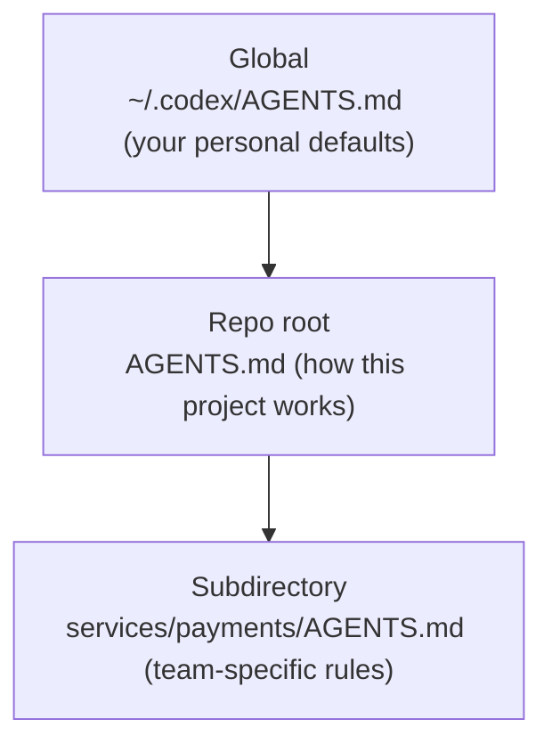

<LevelBadge level="intermediate" />

<VerifyNote lastVerified="2026-06-27" source="https://agents.md/">
Die AGENTS.md-Liste der Adopter und das Import-/Symlink-Verhalten von Claude Code entwickeln sich schnell weiter — überprüfe die Details auf der offiziellen AGENTS.md-Website und in der Claude-Code-Memory-Dokumentation.
</VerifyNote>

Du kennst bereits [CLAUDE.md](/docs/claude-code/claude-md) — das Projekt-Briefing von Claude Code. Aber dein Repo wird wahrscheinlich von *mehr* als einem Agenten angefasst: ein Teamkollege nutzt Codex, die CI verwendet einen Coding-Bot, jemand öffnet das Repo in Cursor. `AGENTS.md` ist der offene Standard, den diese Tools übereinstimmend lesen, sodass du die Anweisungen deines Projekts **einmal** schreibst, statt eine andere Datei pro Tool zu pflegen.

<Callout type="objectives" items={["Was AGENTS.md ist und wer es betreut", "Warum Claude Code CLAUDE.md liest und nicht AGENTS.md", "Drei zuverlässige Wege, eine einzige Quelle der Wahrheit über alle Tools hinweg zu erhalten", "Wie verschachtelte und globale AGENTS.md-Dateien zusammengeführt werden", "Was in die Datei gehört — und was draußen bleiben sollte"]} />

## Was AGENTS.md ist

`AGENTS.md` ist eine einfache Markdown-Datei im Wurzelverzeichnis deines Repos — stell sie dir als ein **README vor, das für Agenten statt für Menschen geschrieben ist**. Sie sagt einem Coding-Agenten, wie das Projekt gebaut, getestet und dazu beigetragen wird. Das Format hat keine erforderlichen Felder: Agenten lesen einfach den Fließtext.

Es ist ein offener Standard, der von der **Agentic AI Foundation (AAIF) unter der Linux Foundation** betreut wird, und Mitte 2026 wird er von über 60.000 Open-Source-Projekten genutzt und von mehr als 30 Tools gelesen — darunter OpenAI Codex, Googles Jules und Gemini CLI, Cursor, Windsurf, Devin, Zed, Warp, Aider, goose, Amp und der Coding-Agent von GitHub Copilot.

<Callout type="info" items={["AGENTS.md ist eine Konvention, keine Laufzeitumgebung: jedes Tool entscheidet selbst, wie es die Datei findet, zusammenführt und einbindet.", "Es wird kein Schema erzwungen — klarer Fließtext schlägt starre Struktur.", "Es ergänzt dein README; es ersetzt es nicht."]} />

## Der Haken bei Claude Code

Hier ist der Teil, über den die Leute stolpern: **Claude Code liest `CLAUDE.md`, nicht `AGENTS.md`.** Wenn dein Repo nur eine `AGENTS.md` hat, ignoriert Claude Code sie standardmäßig. Das ist kein Bug — es ist älter als der Standard — aber es bedeutet, dass ein Multi-Tool-Repo eine bewusste Sync-Strategie braucht, sonst driften deine Anweisungen unbemerkt auseinander.

<Callout type="warning" items={["Geh nicht davon aus, dass Claude Code auf AGENTS.md zurückgreift — es liest sie nicht automatisch.", "Zwei von Hand gepflegte Dateien (CLAUDE.md und AGENTS.md) werden auseinanderdriften. Wähle eine Quelle der Wahrheit.", "Überprüfe das aktuelle Verhalten in der offiziellen Memory-Dokumentation, bevor du dich auf eine Fallback-Behauptung verlässt."]} />

## Eine einzige Quelle der Wahrheit erhalten

Drei Muster halten CLAUDE.md und AGENTS.md synchron, ohne Inhalte zu duplizieren. Wähle nach der Plattform deines Teams.

<Steps items={[{title: "Symlink (am einfachsten)", body: "Mach CLAUDE.md zu einem Symlink auf AGENTS.md. Claude Code folgt Symlinks und liest das Ziel Byte für Byte — eine echte Datei, keine Merge-Logik. Vorbehalt: Unter Windows erfordert das Erstellen eines Symlinks den Entwicklermodus oder Adminrechte, daher bevorzugen plattformübergreifende Teams möglicherweise die Import-Methode."}, {title: "@import (plattformübergreifend)", body: "Halte eine winzige CLAUDE.md, deren einzige Aufgabe es ist, die Standarddatei mit einem @AGENTS.md-Import einzubinden. Claude Code expandiert die importierte Datei beim Start in den Kontext, sodass AGENTS.md die einzige Quelle bleibt und es keinen Symlink gibt, der unter Windows kaputtgehen kann."}, {title: "/init (Migration)", body: "Bringst du Claude Code in einem Repo an den Start, das bereits eine AGENTS.md (oder .cursorrules / .windsurfrules) hat? Führe /init aus — es liest diese Dateien und faltet die relevanten Teile in eine generierte CLAUDE.md."}]} />

<PromptCard title="CLAUDE.md auf den gemeinsamen Standard symlinken (macOS / Linux)">{`ln -s AGENTS.md CLAUDE.md`}</PromptCard>

<PromptCard title="Oder halte eine einzeilige CLAUDE.md, die ihn importiert">{`@AGENTS.md`}</PromptCard>

<Callout type="tip" items={["Symlink, wenn dein gesamtes Team auf macOS/Linux ist — das ist am wenigsten zu pflegen.", "Verwende @import, wenn Windows-Mitwirkende dabei sind.", "Committe, was auch immer du wählst, damit das gesamte Team dasselbe Verhalten erhält."]} />

## Wie verschachtelte und globale Dateien zusammengeführt werden

Die mächtigeren Agenten behandeln AGENTS.md hierarchisch — dasselbe mentale Modell wie die [CLAUDE.md-Memory-Hierarchie](/docs/claude-code/claude-md). Codex zum Beispiel läuft von einer globalen Datei in deinem Home-Verzeichnis hinunter durch die Git-Wurzel bis zu deinem aktuellen Ordner und konkateniert dabei:

Dateien, die näher an der Arbeit sind, gewinnen, weil sie **zuletzt** konkateniert werden und frühere Vorgaben überschreiben. So erbt eine `services/payments/AGENTS.md` die Anweisungen aus der Repo-Wurzel und fügt Regeln hinzu, die nur innerhalb dieses Service gelten — platziere spezialisierte Vorgaben so nah wie möglich am spezialisierten Code.

<Flashcards title="Interoperabilität auf einen Blick" cards={[{front: "Wer liest AGENTS.md?", back: "Über 30 Tools — Codex, Cursor, Windsurf, Devin, Zed, Gemini CLI, Copilots Coding-Agent und mehr. Standardmäßig nicht Claude Code."}, {front: "Wer liest CLAUDE.md?", back: "Claude Code — und nur Claude Code. Es liest AGENTS.md nicht automatisch."}, {front: "Bestes Sync für ein Mac/Linux-Team", back: "CLAUDE.md → AGENTS.md symlinken. Eine echte Datei, kein Drift."}, {front: "Bestes Sync mit Windows-Mitwirkenden", back: "Eine einzeilige CLAUDE.md mit @AGENTS.md — kein Symlink nötig."}, {front: "Merge-Reihenfolge für verschachtelte Dateien", back: "Global → Repo-Wurzel → Unterverzeichnis. Näher an der Arbeit liegende Dateien überschreiben, weil sie zuletzt konkateniert werden."}]} />

## Was hineingehört

Dieselbe Disziplin wie bei einer guten CLAUDE.md — der Standard schlägt lediglich ein paar gängige Abschnitte vor:

- **Projektübersicht** — was das ist, in zwei Sätzen.
- **Build- & Test-Befehle** — wie man ausführt, testet und lintet.
- **Code-Stil** — Konventionen, die ein Agent nicht ableiten kann.
- **Testanweisungen** — was "fertig" bedeutet.
- **Sicherheitsüberlegungen** — was niemals angefasst oder committet werden darf.
- **Commit- / PR-Richtlinien** — Nachrichtenformat, Branch-Regeln.

<Callout type="warning" items={["Agenten folgen der Datei wörtlich — veraltete oder visionäre Anweisungen schaden aktiv, genau wie bei CLAUDE.md.", "Halte es kurz und wahr; beschreibe, wie das Projekt heute funktioniert.", "Committe niemals Secrets; verweise auf große Dokumente, statt sie einzufügen."]} />

## Überprüfe dich selbst

<Quiz title="Überprüfe dich selbst" questions={[{q: "Liest Claude Code AGENTS.md automatisch?", options: ["Ja, es greift auf AGENTS.md zurück", "Nein — es liest nur CLAUDE.md", "Nur unter Windows"], answer: 1, explain: "Claude Code liest CLAUDE.md und ignoriert eine eigenständige AGENTS.md standardmäßig, daher brauchen Multi-Tool-Repos eine bewusste Sync-Strategie."}, {q: "Dein Team ist vollständig auf macOS und Linux. Was ist der wartungsärmste Weg, eine einzige Anweisungsdatei über Claude Code und Codex hinweg zu teilen?", options: ["CLAUDE.md und AGENTS.md von Hand pflegen", "CLAUDE.md auf AGENTS.md symlinken", "AGENTS.md in einen Kommentar einfügen"], answer: 1, explain: "Das Symlinken von CLAUDE.md → AGENTS.md gibt dir eine echte Datei; Claude Code folgt dem Symlink und liest das Ziel Byte für Byte."}, {q: "Wenn Agenten eine globale, eine Repo-Wurzel- und eine Unterverzeichnis-AGENTS.md zusammenführen, welche gewinnt bei Konflikten?", options: ["Die globale Datei", "Die Repo-Wurzel-Datei", "Die Unterverzeichnis-Datei, die der Arbeit am nächsten ist"], answer: 2, explain: "Dateien werden global → Wurzel → Unterverzeichnis konkateniert, sodass die der Arbeit am nächsten liegende Datei zuletzt erscheint und frühere Vorgaben überschreibt."}]} />

<Callout type="takeaways" items={["AGENTS.md ist der offene, von der Linux Foundation betreute Standard, den über 30 Coding-Agenten lesen — ein README für Agenten.", "Claude Code liest CLAUDE.md, nicht AGENTS.md, daher müssen Multi-Tool-Repos sie synchron halten.", "Symlinke CLAUDE.md → AGENTS.md unter Mac/Linux, oder verwende einen einzeiligen @AGENTS.md-Import für plattformübergreifende Teams.", "Verschachtelte Dateien werden global → Wurzel → Unterverzeichnis zusammengeführt, wobei die nächstgelegene Datei gewinnt.", "Fülle sie wie eine großartige CLAUDE.md: Übersicht, Build-/Test-Befehle, Konventionen, Sicherheit und Leitplanken — kurz und wahr."]} />

## Weiter

- [CLAUDE.md & Memory-Dateien](/docs/claude-code/claude-md) — die Claude-Code-Seite derselben Idee
- [CLAUDE.md-Vorlagen](/docs/templates/claude-md) — fertige Starter, die du als AGENTS.md wiederverwenden kannst
- [Slash-Befehle](/docs/claude-code/slash-commands) — einschließlich /init zum Migrieren bestehender Anweisungsdateien

## Quellen & weiterführende Literatur

- [AGENTS.md — offizielle Website & Spezifikation](https://agents.md/)
- [OpenAI Codex — Benutzerdefinierte Anweisungen mit AGENTS.md](https://developers.openai.com/codex/guides/agents-md)
- [Claude-Code-Memory-Dokumentation](https://code.claude.com/docs/en/memory)
