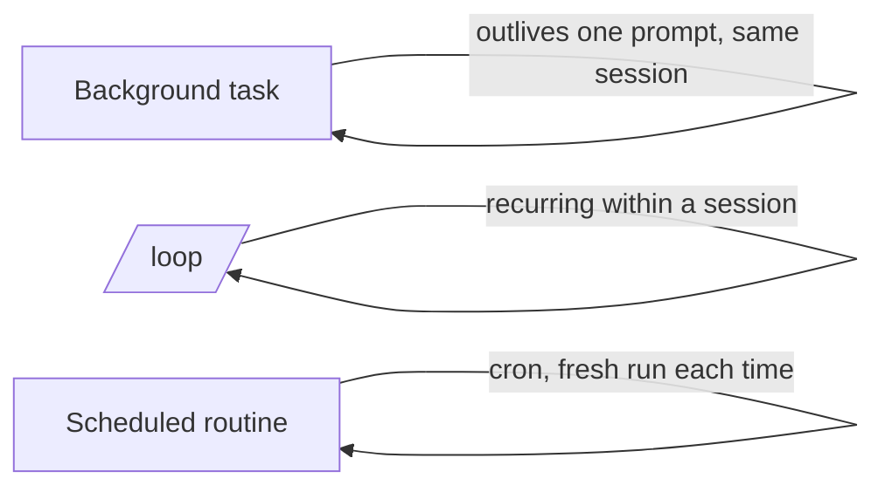

<LevelBadge level="advanced" />

<VerifyNote lastVerified="2026-06-20" source="https://code.claude.com/docs/en">
Die genauen Befehle und die Verfügbarkeit von Hintergrundaufgaben, /loop und Zeitplanung ändern sich zwischen Releases — überprüfe das in der offiziellen Dokumentation.
</VerifyNote>

Nicht alles ist eine schnelle Änderung. Claude Code kann Arbeit ausführen, die **eine einzelne Eingabeaufforderung überdauert**: lange Befehle im Hintergrund, wiederkehrende Schleifen und geplante Läufe.

## Hintergrundaufgaben

Starte einen langlaufenden Befehl (einen Dev-Server, einen Test-Watcher, einen Build), **ohne die Session zu blockieren**. Claude arbeitet weiter und wird benachrichtigt, wenn die Aufgabe Ausgabe erzeugt oder fertig ist. Nutze es für alles, was du normalerweise mit `&` in den Hintergrund schicken würdest — aber verwaltet, sodass Claude die Ausgabe später lesen kann.

:::tip Kein Busy-Waiting
Starte die Aufgabe im Hintergrund und mach weiter; lass die Abschlussbenachrichtigung dich zurückholen, statt in einer engen Schleife zu pollen.
:::

## Wiederkehrende Schleifen (`/loop`)

`/loop` führt eine Eingabeaufforderung oder einen Befehl in einem **wiederkehrenden Intervall** innerhalb einer Session aus — z. B. "prüfe alle 5 Minuten den Deploy-Status". Gib ein Intervall vor oder lass Claude sein eigenes Tempo bestimmen. Großartig, um einen CI-Lauf zu beaufsichtigen oder einen externen Job zu pollen, über den dich das Harness sonst nicht benachrichtigen kann.

## Geplante Cloud-Agenten

Für Arbeit, die **nach der Uhr, fortlaufend** geschehen soll — "fasse jeden Morgen neue Issues zusammen", "prüfe stündlich auf Neuigkeiten und aktualisiere die Dokumentation" — nutze **geplante Aufgaben / Routinen** (cron-artig). Jeder Lauf startet frisch, daher müssen seine Anweisungen **in sich abgeschlossen** sein.

## Die Wahl zwischen ihnen

| Bedarf | Verwenden |
|---|---|
| Einen langen Befehl ausführen, weiterarbeiten | Hintergrundaufgabe |
| In dieser Session etwas alle N Minuten pollen | `/loop` |
| Etwas nach Zeitplan tun, unbegrenzt | Geplante Routine |

:::warning Autonomie braucht Leitplanken
Alles, was unbeaufsichtigt nach Zeitplan handelt, sollte eng abgegrenzt und umkehrbar sein. Kombiniere es mit strikten [Berechtigungen](/docs/claude-code/permissions) und lies [Autonome Läufe absichern](/docs/security/hardening-autonomous-runs).
:::

## Weiter

- [Headless-Modus & das Agent SDK](/docs/claude-code/headless-and-agent-sdk)
- [Berechtigungen & Modi](/docs/claude-code/permissions)
- [Autonome Läufe absichern](/docs/security/hardening-autonomous-runs)
