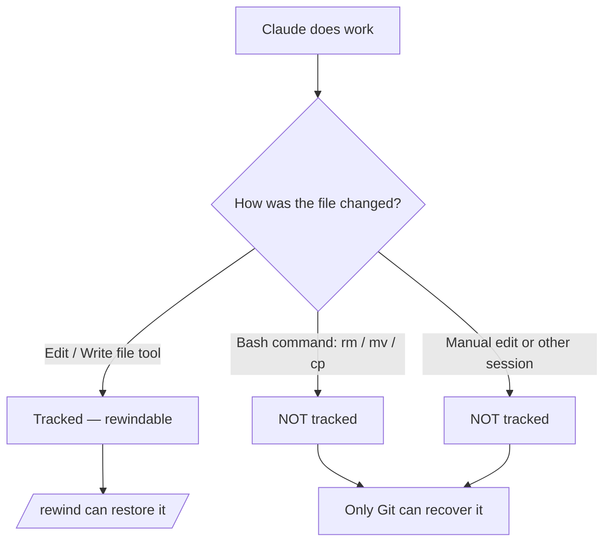

<LevelBadge level="intermediate" />

<Callout type="objectives" items={["Verstehen, was ein Checkpoint erfasst — und was er stillschweigend nicht erfasst", "Das Rewind-Menü auf zwei Wegen öffnen und jedes Mal die richtige Wiederherstellungsaktion wählen", "'Restore' (Zustand rückgängig machen) von 'Summarize' (Kontext komprimieren) unterscheiden", "Genau wissen, warum Checkpoints Git ergänzen, aber niemals ersetzen"]} />

<VerifyNote lastVerified="2026-07-09" source="https://code.claude.com/docs/en/checkpointing">
Das Checkpoint-Verhalten, die Aktionen des Rewind-Menüs, die Aufbewahrung und die Versionsanforderungen (z. B. erfordert das Zurücksetzen über ein `/clear` hinaus Claude Code v2.1.191+) ändern sich zwischen Releases — bestätige dies in der offiziellen Dokumentation.
</VerifyNote>

## Die Grundidee

Wenn du Claude auf eine ambitionierte, großflächige Änderung ansetzt, ist die beängstigendste Frage: „Was, wenn es drei Änderungen tief schiefgeht?" **Checkpointing** ist die Antwort: Claude Code erstellt vor jeder Änderung automatisch eine Momentaufnahme deines Codes, sodass du zu einem beliebigen früheren Zustand zurückkehren kannst, statt ein halb fertiges Refactoring von Hand zu entwirren.

Stell es dir als **lokales Undo für die gesamte Sitzung** vor — ein Sicherheitsnetz, das dir erlaubt zu sagen „Ja, probier den kühnen Ansatz" ohne Angst.

## Wie Checkpoints erstellt werden

Du erstellst Checkpoints nicht — sie entstehen automatisch.

<Steps items={[{title: "Jeder Prompt = ein Checkpoint", body: "Jeder Benutzer-Prompt erfasst den Zustand deines Codes, bevor Claudes Werkzeuge zum Bearbeiten von Dateien laufen. Kein Befehl, keine Konfiguration, kein Aufwand."}, {title: "Sie bleiben über Sitzungen hinweg erhalten", body: "Checkpoints überleben das Beenden und Fortsetzen einer Unterhaltung, sodass du auch in einer fortgesetzten Sitzung zurücksetzen kannst, nicht nur in der laufenden."}, {title: "Sie räumen sich selbst auf", body: "Checkpoints werden zusammen mit ihrer Sitzung nach 30 Tagen entfernt (konfigurierbar). Sie sind eine Wiederherstellung auf Sitzungsebene, kein Archiv."}]} />

## Das Rewind-Menü öffnen

Es gibt zwei Wege hinein:

<Steps items={[{title: "/rewind ausführen", body: "Gib den Slash-Befehl im Prompt ein. Funktioniert immer."}, {title: "Zweimal Esc drücken — aber nur bei leerer Eingabe", body: "Doppeltes Esc öffnet das Rewind-Menü, wenn das Eingabefeld leer ist. Steht Text darin, löscht doppeltes Esc stattdessen diesen Text (der gelöschte Text wird im Eingabeverlauf gespeichert, drücke danach also die Pfeiltaste nach oben, um ihn zurückzuholen)."}]} />

<PromptCard title="Open the rewind menu">{`/rewind`}</PromptCard>

Das Menü listet **jeden Prompt auf, den du in dieser Sitzung gesendet hast**. Wähle den Punkt, auf den du reagieren möchtest, und wähle dann eine Aktion.

## Restore vs. Summarize: die entscheidende Unterscheidung

Hier geraten die Leute durcheinander. Das Menü bietet zwei *Arten* von Aktionen:

- **Restore**-Aktionen ändern den Zustand auf der Festplatte und/oder in der Unterhaltung — sie machen rückgängig.
- **Summarize**-Aktionen berühren deine Dateien nie — sie komprimieren die Unterhaltung, um Platz im Kontextfenster freizugeben.

<Callout type="warning" items={["Restore = rückgängig machen (setzt Code, Unterhaltung oder beides zurück). Summarize = Kontext komprimieren (Dateien auf der Festplatte bleiben unberührt).", "Greif zu Restore, wenn eine Änderung etwas kaputt gemacht hat. Greif zu Summarize, wenn die Sitzung aufgebläht ist, der Code aber in Ordnung ist."]} />

### Die Restore-Aktionen

<Steps items={[{title: "Code und Unterhaltung wiederherstellen", body: "Setze sowohl deine Dateien als auch den Chat-Verlauf auf den ausgewählten Punkt zurück — ein sauberes 'Zeit-Zurückspulen' zu diesem Moment."}, {title: "Unterhaltung wiederherstellen", body: "Spule den Chat zu dieser Nachricht zurück, behalte aber deinen aktuellen Code. Nützlich, um eine Frage neu zu stellen, ohne Änderungen zu verlieren, die du behalten möchtest."}, {title: "Code wiederherstellen", body: "Setze Dateiänderungen zurück, behalte aber die Unterhaltung. Mach die Änderungen rückgängig, behalte die Diskussion darüber."}]} />

Nach dem Wiederherstellen der Unterhaltung (oder der Wahl von „Summarize from here") wird der ursprüngliche Prompt der ausgewählten Nachricht zurück ins Eingabefeld gelegt, sodass du ihn erneut senden oder bearbeiten kannst.

### Die Summarize-Aktionen

Beide komprimieren einen Teil der Unterhaltung zu einer KI-generierten Zusammenfassung — wie ein **gezieltes `/compact`**, bei dem du wählst, welche Seite der ausgewählten Nachricht du zusammendrückst.

<Steps items={[{title: "Summarize from here", body: "Nachrichten VOR der ausgewählten Nachricht bleiben unverändert. Die ausgewählte Nachricht und alles danach werden zu einer Zusammenfassung. Nutze es, um eine Nebendiskussion zu verwerfen und dabei den frühen Kontext in vollem Detail zu behalten."}, {title: "Summarize up to here", body: "Nachrichten VOR der ausgewählten Nachricht werden zu einer Zusammenfassung; die ausgewählte Nachricht und alles danach bleiben unverändert. Du bleibst am Ende der Unterhaltung. Nutze es, um frühes Setup-Geplänkel zu komprimieren und dabei die jüngste Arbeit wortwörtlich zu behalten."}]} />

Die ursprünglichen Nachrichten bleiben in beiden Fällen im Sitzungstranskript, sodass Claude die Details weiterhin heranziehen kann. Du kannst optionale Anweisungen eingeben, um zu steuern, worauf sich die Zusammenfassung konzentriert.

Für den gesamten Ablauf siehe [Kontext-Management](/docs/claude-code/context-management) — die Summarize-Aktionen von `/rewind` sind ein Skalpell, wo `/compact` ein breiter Pinsel ist.

## Über ein `/clear` hinaus zurücksetzen

Wenn du früher im selben Claude-Code-Prozess `/clear` ausgeführt hast, zeigt das Rewind-Menü oben einen zusätzlichen Eintrag: `/resume <session-id> (previous session)`. Wähle ihn, um zu der Unterhaltung zurückzuspringen, die vor `/clear` aktiv war.

<VerifyNote lastVerified="2026-07-09" source="https://code.claude.com/docs/en/checkpointing">
Das Zurücksetzen über ein `/clear` hinaus aus dem Rewind-Menü erfordert Claude Code v2.1.191 oder neuer. In früheren Versionen führe stattdessen `/resume` aus und wähle die vorherige Sitzung aus der Liste.
</VerifyNote>

## Wo Checkpoints aufhören — die Grenzen, die wehtun

Checkpoints fühlen sich magisch an, bis sie es nicht mehr sind. Drei Lücken sind wichtig:

<Steps items={[{title: "Bash-Änderungen sind unsichtbar", body: "Dateien, die von Shell-Befehlen berührt werden, die Claude ausführt — rm, mv, cp, Code-Generatoren, Formatter — werden NICHT verfolgt. Nur direkte Änderungen über Claudes Werkzeuge zum Bearbeiten von Dateien werden per Checkpoint erfasst. Eine mit rm gelöschte Datei ist, was das Rewind angeht, verloren."}, {title: "Externe und gleichzeitige Änderungen sind unsichtbar", body: "Manuelle Änderungen, die du außerhalb von Claude Code vornimmst, und Änderungen aus anderen gleichzeitigen Sitzungen werden normalerweise nicht erfasst — es sei denn, sie berühren zufällig dieselben Dateien, die die aktuelle Sitzung bearbeitet hat."}, {title: "Es ist auf Sitzungsebene, keine Historie", body: "Checkpoints sind eine schnelle, lokale Wiederherstellung. Sie sind keine Commits, keine Branches und nicht mit deinem Team teilbar."}]} />

## Checkpoints vs. Git: nutze beide

Sie lösen unterschiedliche Probleme, also kombiniere sie.

| | Checkpoints (`/rewind`) | Git |
|---|---|---|
| Umfang | Eine Sitzung | Gesamte Projekthistorie |
| Granularität | Pro Prompt, automatisch | Pro Commit, bewusst |
| Erfasst per Bash gemachte Änderungen? | Nein | Ja (sobald staged/committet) |
| Lebensdauer | ~30 Tage, dann weg | Dauerhaft |
| Teilbar / kollaborativ | Nein | Ja |
| Denkmodell | „Lokales Undo" | „Dauerhafte Historie" |

<Callout type="tip" items={["Committe funktionierende Zustände mit Git vor einem riskanten, großflächigen Durchlauf — das ist deine belastbare Basis.", "Nutze /rewind für schnelle Wiederherstellung innerhalb der Sitzung zwischen Commits, ohne deine Git-Historie zu verschmutzen.", "Wenn Claude destruktives Bash (rm/mv) oder Generatoren ausführt, verlass dich auf Git — das Rewind rettet diese Dateien nicht."]} />

## Wann du danach greifen solltest

<Steps items={[{title: "Alternativen erkunden", body: "Probier eine kühne Implementierung, und wenn sie dir nicht gefällt, stelle Code und Unterhaltung auf den Verzweigungspunkt wieder her und probier eine andere."}, {title: "Von einer schlechten Änderung erholen", body: "Eine Änderung hat vor drei Prompts einen Bug eingeführt? Stelle den Code auf den Zustand kurz davor wieder her, statt durch die Trümmer zu debuggen."}, {title: "An einem Feature iterieren", body: "Experimentiere mit Varianten und wisse dabei immer, dass ein bekannter guter Zustand nur ein /rewind entfernt ist."}, {title: "Kontextplatz freigeben", body: "Ein weitschweifiger Debugging-Abstecher hat dein Kontextfenster aufgefressen? Fasse ab dem Mittelpunkt vorwärts zusammen und behalte deine ursprünglichen Anweisungen in vollem Detail."}]} />

<Quiz title="Check yourself" questions={[{q: "Claude hat `rm config.old.json` über einen Bash-Befehl ausgeführt und du willst die Datei zurück. Kann `/rewind` sie wiederherstellen?", options: ["Ja — jede Änderung, die Claude vornimmt, wird per Checkpoint erfasst", "Nein — per Bash gemachte Änderungen werden nicht verfolgt; nur direkte Änderungen per Datei-Werkzeug werden erfasst", "Nur wenn du /rewind innerhalb von 30 Sekunden ausführst"], answer: 1, explain: "Checkpointing erfasst nur Änderungen, die über Claudes Werkzeuge zum Bearbeiten von Dateien vorgenommen wurden. Dateien, die von Bash-Befehlen (rm, mv, cp) geändert wurden, werden nicht verfolgt — genau dafür ist Git da."}, {q: "Dein Code ist in Ordnung, aber ein langer Debugging-Abschweif hat das Kontextfenster gefüllt. Welche Aktion passt?", options: ["Code und Unterhaltung auf den Zustand vor dem Abschweif wiederherstellen", "Code wiederherstellen", "Summarize from here am Anfang des Abschweifs"], answer: 2, explain: "Summarize-Aktionen komprimieren die Unterhaltung, ohne Dateien zu berühren. 'Summarize from here' verwandelt den Abschweif in eine Zusammenfassung, während dein früherer Kontext intakt bleibt — so wird Kontextplatz mit null Code-Änderungen freigegeben."}, {q: "Wie wird ein Checkpoint erstellt?", options: ["Du führst /checkpoint manuell aus", "Automatisch, vor jeder Änderung — jeder Prompt erstellt einen", "Nur wenn du in Git committest"], answer: 1, explain: "Checkpointing ist automatisch: Jeder Benutzer-Prompt erfasst den Zustand deines Codes vor der Änderung. Es gibt keinen manuellen Schritt."}]} />

<Flashcards title="Checkpoints & rewind vocabulary" cards={[{front: "Checkpoint", back: "Eine automatische Momentaufnahme deines Codes, die vor jeder Änderung erstellt wird, einmal pro Prompt. Sitzungsbezogen, ~30 Tage aufbewahrt."}, {front: "/rewind", back: "Öffnet das Rewind-Menü, das jeden Prompt dieser Sitzung auflistet, sodass du von jedem Punkt aus wiederherstellen oder zusammenfassen kannst. Auch erreichbar über doppeltes Esc bei leerer Eingabe."}, {front: "Restore-Aktion", back: "Setzt den Zustand — Code, Unterhaltung oder beides — auf den ausgewählten Punkt zurück. Das ist 'Undo'."}, {front: "Summarize-Aktion", back: "Komprimiert einen Teil der Unterhaltung zu einer KI-Zusammenfassung, um Kontext freizugeben. Dateien auf der Festplatte werden nie berührt."}, {front: "Bash-blinder Fleck", back: "Dateien, die von Shell-Befehlen (rm/mv/cp) geändert wurden, werden NICHT per Checkpoint erfasst — nur direkte Änderungen per Datei-Werkzeug. Nutze dafür Git."}]} />

<Callout type="takeaways" items={["Checkpoints sind automatische Momentaufnahmen deines Codes pro Prompt — ein lokales Undo für die gesamte Sitzung, etwa 30 Tage aufbewahrt.", "Öffne das Rewind-Menü mit /rewind oder doppeltem Esc bei leerer Eingabe; es listet jeden Prompt auf, den du gesendet hast.", "Restore-Aktionen machen den Zustand rückgängig (Code, Unterhaltung oder beides); Summarize-Aktionen komprimieren den Kontext und berühren nie Dateien.", "Per Bash gemachte, externe und gleichzeitige Änderungen werden NICHT verfolgt — nur direkte Änderungen per Datei-Werkzeug.", "Checkpoints ergänzen Git, sie ersetzen es nicht: denk an 'lokales Undo' vs. 'dauerhafte, teilbare Historie'."]} />

## Weiter

- [Kontext-Management](/docs/claude-code/context-management) — `/compact`, `/clear` und wie Summarize ins größere Bild passt
- [Plan-Modus](/docs/claude-code/plan-mode) — einen Plan untersuchen und genehmigen, bevor Änderungen laufen, sodass du seltener zurücksetzen musst
- [Berechtigungen](/docs/claude-code/permissions) — die andere Hälfte, um ambitionierte Aufgaben sicher auszuführen
