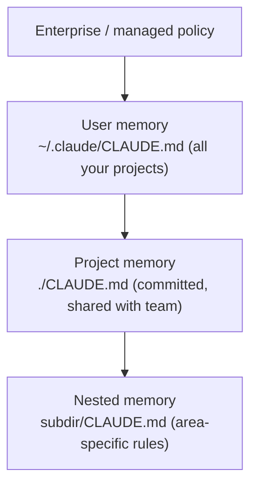

<LevelBadge level="beginner" />

<VerifyNote lastVerified="2026-06-20" source="https://code.claude.com/docs/en/memory">
Speicherorte von Memory-Dateien und die Import-Syntax können sich ändern — überprüfe die Details in der offiziellen Claude-Code-Memory-Dokumentation.
</VerifyNote>

Wenn du **eine** Sache tust, um [Claude Code](/docs/claude-code/what-is-claude-code) besser zu machen, dann diese. `CLAUDE.md` ist eine Klartextdatei, die Claude zu Beginn jeder Session liest — das dauerhafte Briefing deines Projekts.

<Callout type="objectives" items={["Warum CLAUDE.md die Claude-Code-Einstellung mit dem größten Hebel ist", "Wie die Memory-Hierarchie von global bis projektspezifisch zusammengeführt wird", "Wie du mit /init eine Ausgangsdatei generierst und sie zurechtstutzt", "Was in CLAUDE.md gehört — und was draußen bleiben sollte", "Wie @imports dir erlauben, Dokumente zu referenzieren, ohne sie zu duplizieren"]} />

## Warum es die Einstellung mit dem größten Hebel ist

Ohne sie erklärst du dein Projekt in jeder Session erneut ("wir nutzen pnpm, Tests liegen in `__tests__`, fass `/generated` nicht an…"). Mit ihr weiß Claude es bereits. Gute Anweisungen hier verbessern *jede* zukünftige Interaktion auf einmal.

## Die Memory-Hierarchie

Claude Code liest Memory aus mehreren Quellen und führt sie zusammen, grob von am globalsten zu am spezifischsten:

- **User-Memory** — deine persönlichen Vorlieben über alle Projekte hinweg.
- **Projekt-Memory** (`./CLAUDE.md`, committed) — wie *dieses* Repo funktioniert. Mit deinem Team geteilt.
- **Verschachtelt** — lege eine `CLAUDE.md` in einen Unterordner für Regeln, die nur dort gelten.

<Flashcards title="Kenne deine Memory-Ebenen" cards={[{front: "User-Memory", back: "~/.claude/CLAUDE.md — deine persönlichen Vorlieben, die über alle Projekte hinweg gelten."}, {front: "Projekt-Memory", back: "./CLAUDE.md — committed und mit dem Team geteilt; beschreibt, wie dieses Repo funktioniert."}, {front: "Verschachteltes Memory", back: "subdir/CLAUDE.md — bereichsspezifische Regeln, die nur innerhalb dieses Unterordners gelten."}, {front: "Enterprise / managed policy", back: "Die globalste Ebene; Richtlinien auf Organisationsebene, die über deinem User-Memory stehen."}]} />

## Erzeuge einen Startpunkt

<Steps items={[{title: "/init im Projekt ausführen", body: "Claude untersucht den Code und entwirft automatisch eine CLAUDE.md für dich."}, {title: "Kürze sie ein", body: "Der Entwurf ist ein Startpunkt, keine Ziellinie. Stutze ihn auf das zurecht, was wahr und nützlich ist."}, {title: "Übernimm eine Vorlage", body: "Hol dir einen fertigen Starter von der Seite CLAUDE.md-Vorlagen und passe ihn an dein Repo an."}]} />

<PromptCard title="Einen CLAUDE.md-Entwurf generieren">{`/init`}</PromptCard>

Hol dir einen fertigen Starter aus den [CLAUDE.md-Vorlagen](/docs/templates/claude-md).

## Was hineingehört

- Was das Projekt ist, in zwei Sätzen.
- Tech-Stack und wie man **ausführt / testet / lintet**.
- Konventionen, die Claude nicht ableiten kann (Benennung, Struktur, Commit-Stil).
- **Leitplanken**: "führe Tests aus, bevor du etwas für fertig erklärst", "bearbeite niemals `/vendor`", "committe niemals Geheimnisse".

## Was NICHT hineingehört

<Callout type="warning" items={["Claude befolgt CLAUDE.md wörtlich — veraltete, vage oder wunschdenkende Anweisungen schaden aktiv.", "Beschreibe, wie das Projekt heute tatsächlich funktioniert; kurz und wahr schlägt lang und ambitioniert.", "Vermeide riesige eingefügte Dokumente (nutze stattdessen @imports), Geheimnisse und Regeln, die du nicht wirklich befolgst.", "Überprüfe sie regelmäßig, damit sie korrekt bleibt, während sich das Projekt weiterentwickelt."]} />

## Imports

Binde vorhandene Dokumente ein, statt sie zu duplizieren — referenziere z. B. deinen Styleguide mit einem `@path/to/file`-Import, sodass es eine einzige Quelle der Wahrheit gibt. Die genaue Syntax findest du in der [offiziellen Memory-Dokumentation](https://code.claude.com/docs/en/memory).

<Callout type="tip" items={["Eine einzige Quelle der Wahrheit: referenziere eine Datei mit @imports, statt ihren Inhalt in CLAUDE.md einzufügen.", "Wenn ein Dokument bereits existiert, verlinke es — kopiere es nicht. Kopien veralten."]} />

## Überprüfe dich selbst

<Quiz title="Überprüfe dich selbst" questions={[{q: "Welche Datei liest Claude Code zu Beginn jeder Session als dauerhaftes Briefing deines Projekts?", options: ["README.md", "CLAUDE.md", "package.json"], answer: 1, explain: "CLAUDE.md ist die Klartext-Memory-Datei, die Claude zu Beginn jeder Session liest."}, {q: "Was bewirkt das Ausführen von /init in einem Projekt?", options: ["Es committet CLAUDE.md in das Repo deines Teams", "Es entwirft eine CLAUDE.md durch Untersuchung des Codes, die du anschließend einkürzt", "Es löscht veraltete Memory-Dateien"], answer: 1, explain: "/init entwirft eine erste CLAUDE.md aus dem Code — der Entwurf ist ein Startpunkt, also kürzt du ihn danach ein."}, {q: "Was ist der empfohlene Weg, ein großes vorhandenes Dokument wie einen Styleguide einzubinden?", options: ["Das gesamte Dokument in CLAUDE.md einfügen", "Es mit einem @path/to/file-Import referenzieren", "Es als Geheimnis speichern"], answer: 1, explain: "Nutze @imports, um auf die Datei zu zeigen, damit es eine einzige Quelle der Wahrheit gibt statt einer duplizierten, veraltenden Kopie."}]} />

<Callout type="takeaways" items={["CLAUDE.md ist die Einstellung mit dem größten Hebel: sie verbessert jede zukünftige Session auf einmal.", "Memory wird von global zu spezifisch zusammengeführt: Enterprise-Richtlinien, dann User-, Projekt- und verschachtelte CLAUDE.md-Dateien.", "Beginne mit /init, dann kürze den Entwurf auf das ein, was tatsächlich wahr ist.", "Nimm die Projektzusammenfassung, die Befehle zum Ausführen/Testen/Linten, Konventionen und Leitplanken auf.", "Halte sie kurz und wahr — nutze @imports für große Dokumente und committe niemals Geheimnisse."]} />

## Weiter

- [AGENTS.md & Tool-übergreifende Interoperabilität](/docs/claude-code/agents-md) — teile eine einzige Anweisungsdatei über alle Coding-Agenten hinweg
- [Plan-Modus](/docs/claude-code/plan-mode) — sichere erste Änderungen
- [Berechtigungen & Modi](/docs/claude-code/permissions) — was Claude unbeaufsichtigt tun darf
- [Walkthrough: Claude Code für ein echtes Repo anpassen](/docs/walkthroughs/customize-claude-code)
