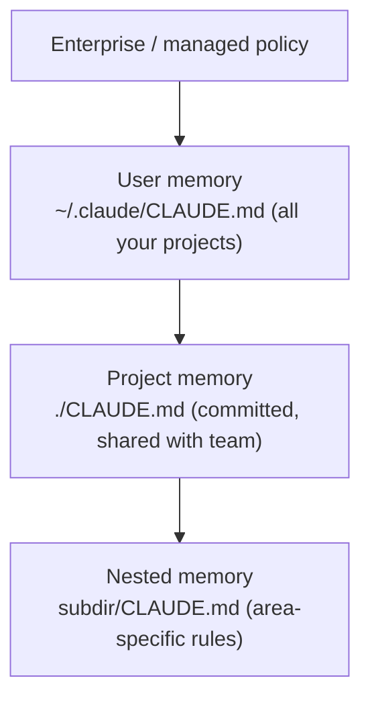

<LevelBadge level="beginner" />

<VerifyNote lastVerified="2026-06-20" source="https://code.claude.com/docs/en/memory">
Speicherorte von Memory-Dateien und die Import-Syntax können sich ändern — überprüfe Details in der offiziellen Claude-Code-Memory-Dokumentation.
</VerifyNote>

Wenn du **eine** Sache tust, um [Claude Code](/docs/claude-code/what-is-claude-code) besser zu machen, dann diese. `CLAUDE.md` ist eine Klartextdatei, die Claude zu Beginn jeder Session liest — das dauerhafte Briefing deines Projekts.

## Warum es die wirkungsvollste Einstellung ist

Ohne sie erklärst du dein Projekt in jeder Session erneut ("wir nutzen pnpm, Tests liegen in `__tests__`, fass `/generated` nicht an…"). Mit ihr weiß Claude es bereits. Gute Anweisungen hier verbessern *jede* zukünftige Interaktion auf einmal.

## Die Memory-Hierarchie

Claude Code liest Memory aus mehreren Quellen und führt sie zusammen, grob von am-globalsten zu am-spezifischsten:

- **User-Memory** — deine persönlichen Vorlieben über alle Projekte hinweg.
- **Projekt-Memory** (`./CLAUDE.md`, committed) — wie *dieses* Repo funktioniert. Mit deinem Team geteilt.
- **Verschachtelt** — lege eine `CLAUDE.md` in einen Unterordner für Regeln, die nur dort gelten.

## Erzeuge einen Startpunkt

Führe `/init` in einem Projekt aus, und Claude entwirft eine `CLAUDE.md`, indem es den Code untersucht. Dann **kürze sie ein** — der Entwurf ist ein Startpunkt, keine Ziellinie.

## Was hineingehört

- Was das Projekt ist, in zwei Sätzen.
- Tech-Stack und wie man **ausführt / testet / lintet**.
- Konventionen, die Claude nicht ableiten kann (Benennung, Struktur, Commit-Stil).
- **Leitplanken**: "führe Tests aus, bevor du etwas für fertig erklärst", "bearbeite niemals `/vendor`", "committe niemals Geheimnisse".

Hol dir einen fertigen Starter aus den [CLAUDE.md-Vorlagen](/docs/templates/claude-md).

## Was NICHT hineingehört

:::warning Kurz und wahr schlägt lang und ambitioniert
Claude befolgt `CLAUDE.md` *wörtlich*. Veraltete, vage oder wunschdenkende Anweisungen schaden aktiv. Beschreibe, wie das Projekt **tatsächlich** heute funktioniert, halte es knapp und überprüfe es regelmäßig.
:::

Vermeide: riesige eingefügte Dokumente (nutze stattdessen `@imports`, um Dateien zu referenzieren), Geheimnisse und Regeln, die du nicht wirklich befolgst.

## Imports

Binde vorhandene Dokumente ein, statt sie zu duplizieren — referenziere z. B. deinen Styleguide mit einem `@path/to/file`-Import, sodass es eine einzige Quelle der Wahrheit gibt. Die genaue Syntax findest du in der [offiziellen Memory-Dokumentation](https://code.claude.com/docs/en/memory).

## Weiter

- [Plan-Modus](/docs/claude-code/plan-mode) — sichere erste Änderungen
- [Berechtigungen & Modi](/docs/claude-code/permissions) — was Claude unbeaufsichtigt tun darf
- [Walkthrough: Claude Code für ein echtes Repo anpassen](/docs/walkthroughs/customize-claude-code)
