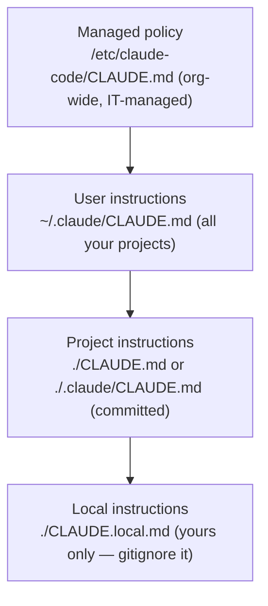

<LevelBadge level="beginner" />

<VerifyNote lastVerified="2026-10-06" source="https://code.claude.com/docs/en/memory">
Speicherorte, Ladereihenfolge und Import-Syntax stammen aus der offiziellen Memory-Dokumentation („How Claude remembers your project"), die inzwischen **zwei** Mechanismen beschreibt: CLAUDE.md-Dateien, die du schreibst, und **Auto-Memory**, das Claude selbst schreibt. Imports werden bis zu einer maximalen Tiefe von vier Sprüngen aufgelöst. Prüfe die Details dort — sie ändern sich.
</VerifyNote>

Wenn du **eine** Sache tust, um [Claude Code](/docs/claude-code/what-is-claude-code) besser zu machen, dann diese. `CLAUDE.md` ist eine Klartextdatei, die Claude zu Beginn jeder Session liest — das dauerhafte Briefing deines Projekts.

<Callout type="objectives" items={["Warum CLAUDE.md die Claude-Code-Einstellung mit dem größten Hebel ist", "Wie die Memory-Hierarchie lädt, von der Managed Policy bis hinunter zu CLAUDE.local.md", "Wie sich Auto-Memory von der CLAUDE.md unterscheidet, die du selbst schreibst", "Wie du mit /init eine Ausgangsdatei generierst und sie zurechtstutzt", "Was in CLAUDE.md gehört — und was draußen bleiben sollte", "Wie @imports dir erlauben, Dokumente zu referenzieren, ohne sie zu duplizieren"]} />

## Warum es die Einstellung mit dem größten Hebel ist

Ohne sie erklärst du dein Projekt in jeder Session erneut ("wir nutzen pnpm, Tests liegen in `__tests__`, fass `/generated` nicht an…"). Mit ihr weiß Claude es bereits. Gute Anweisungen hier verbessern *jede* zukünftige Interaktion auf einmal.

## Die Memory-Hierarchie

Claude Code lädt Memory aus mehreren Quellen und führt sie in Ladereihenfolge zusammen, vom breitesten Geltungsbereich zuerst — eine Projektanweisung landet also *nach* einer User-Anweisung im Kontext:

```mermaid
flowchart TD
  A["Managed policy<br/>/etc/claude-code/CLAUDE.md (org-wide, IT-managed)"] --> B["User instructions<br/>~/.claude/CLAUDE.md (all your projects)"]
  B --> C["Project instructions<br/>./CLAUDE.md or ./.claude/CLAUDE.md (committed)"]
  C --> D["Local instructions<br/>./CLAUDE.local.md (yours only — gitignore it)"]
```

- **Managed Policy** — organisationsweite Anweisungen, die dein IT-/DevOps-Team ausliefert. Der Pfad ist betriebssystemabhängig: `/Library/Application Support/ClaudeCode/CLAUDE.md` unter macOS, `/etc/claude-code/CLAUDE.md` unter Linux und WSL, `C:\Program Files\ClaudeCode\CLAUDE.md` unter Windows.
- **User-Anweisungen** (`~/.claude/CLAUDE.md`) — deine persönlichen Vorlieben über alle Projekte hinweg.
- **Projekt-Anweisungen** (`./CLAUDE.md` *oder* `./.claude/CLAUDE.md`, committed) — wie *dieses* Repo funktioniert. Mit deinem Team geteilt. Wenn dein Repo [`AGENTS.md`](/docs/claude-code/agents-md) nutzt, kann das statt dieser Dateien oder zusätzlich zu ihnen geladen werden.
- **Lokale Anweisungen** (`./CLAUDE.local.md`) — projektspezifische Notizen nur für dich, etwa eine Sandbox-URL. Füge sie zu `.gitignore` hinzu.

Dateien in der Verzeichnishierarchie *oberhalb* deines Arbeitsverzeichnisses werden beim Start geladen; Dateien in **Unterordnern werden bei Bedarf geladen**, wenn Claude etwas in diesem Bereich anfasst.

<Callout type="tip" items={["Eine Datei reicht nicht mehr aus? Teile die Anweisungen in .claude/rules/*.md auf — ein Thema pro Datei, rekursiv erkannt. Regeln ohne paths-Frontmatter werden beim Start geladen, mit derselben Priorität wie .claude/CLAUDE.md; füge paths-Frontmatter hinzu, damit eine Regel nur dann lädt, wenn Claude an passenden Dateien arbeitet — das spart Kontext."]} />

<Flashcards title="Kenne deine Memory-Ebenen" cards={[{front: "Managed Policy", back: "Organisationsweite, von der IT verwaltete CLAUDE.md — die breiteste Ebene, geladen vor den User- und Projekt-Anweisungen."}, {front: "User-Anweisungen", back: "~/.claude/CLAUDE.md — deine persönlichen Vorlieben, die über alle Projekte hinweg gelten."}, {front: "Projekt-Anweisungen", back: "./CLAUDE.md oder ./.claude/CLAUDE.md — committed und mit dem Team geteilt; beschreibt, wie dieses Repo funktioniert."}, {front: "Lokale Anweisungen", back: "./CLAUDE.local.md — persönliche, projektspezifische Vorlieben. Per gitignore ausschließen."}, {front: ".claude/rules/*.md", back: "Anweisungen mit einem Thema pro Datei für größere Projekte. Mit paths-Frontmatter laden sie nur für passende Dateien."}, {front: "CLAUDE.md im Unterordner", back: "Lädt bei Bedarf — wenn Claude in diesem Teil des Baums arbeitet — nicht beim Start."}]} />

## Die andere Hälfte: Auto-Memory

CLAUDE.md ist die Hälfte des Gedächtnisses, die *du* schreibst. Claude Code führt außerdem ein **Auto-Memory** — Notizen, die Claude selbst aus deinen Korrekturen und Vorlieben schreibt, pro Repository gespeichert und in jeder Session neben deinen CLAUDE.md-Dateien geladen.

| | CLAUDE.md-Dateien | Auto-Memory |
| --- | --- | --- |
| **Wer schreibt es** | Du | Claude |
| **Was es enthält** | Anweisungen und Regeln | Erkenntnisse und Muster |
| **Geltungsbereich** | Projekt, User oder Organisation | Pro Repository, über Worktrees hinweg geteilt |

Beides ist *Kontext*, keine Durchsetzung: Claude behandelt sie als Orientierung, die es abwägen kann, nicht als Konfiguration, der es gehorchen muss. Um eine Aktion unabhängig von Claudes Entscheidung hart zu blockieren, nutze stattdessen einen [PreToolUse-Hook](/docs/claude-code/hooks).

<Callout type="warning" items={["Auto-Memory lädt nur die ersten 200 Zeilen oder 25 KB — eine überfüllte MEMORY.md wird stillschweigend abgeschnitten. Die vollständige Aufschlüsselung der Startkosten findest du im Kontextbudget-Audit."]} />

## Erzeuge einen Startpunkt

<Steps items={[{title: "/init im Projekt ausführen", body: "Claude untersucht den Code und entwirft automatisch eine CLAUDE.md für dich."}, {title: "Kürze sie ein", body: "Der Entwurf ist ein Startpunkt, keine Ziellinie. Stutze ihn auf das zurecht, was wahr und nützlich ist."}, {title: "Übernimm eine Vorlage", body: "Hol dir einen fertigen Starter von der Seite CLAUDE.md-Vorlagen und passe ihn an dein Repo an."}]} />

<PromptCard title="Einen CLAUDE.md-Entwurf generieren">{`/init`}</PromptCard>

Hol dir einen fertigen Starter aus den [CLAUDE.md-Vorlagen](/docs/templates/claude-md).

## Was hineingehört

- Was das Projekt ist, in zwei Sätzen.
- Tech-Stack und wie man **ausführt / testet / lintet**.
- Konventionen, die Claude nicht ableiten kann (Benennung, Struktur, Commit-Stil).
- **Leitplanken**: "führe Tests aus, bevor du etwas für fertig erklärst", "bearbeite niemals `/vendor`", "committe niemals Geheimnisse".

## Was NICHT hineingehört

<Callout type="warning" items={["Claude befolgt CLAUDE.md wörtlich — veraltete, vage oder wunschdenkende Anweisungen schaden aktiv.", "Beschreibe, wie das Projekt heute tatsächlich funktioniert; kurz und wahr schlägt lang und ambitioniert.", "Vermeide riesige eingefügte Dokumente (nutze stattdessen @imports), Geheimnisse und Regeln, die du nicht wirklich befolgst.", "Überprüfe sie regelmäßig, damit sie korrekt bleibt, während sich das Projekt weiterentwickelt."]} />

## Imports

Binde vorhandene Dokumente ein, statt sie zu duplizieren — referenziere z. B. deinen Styleguide mit einem `@path/to/file`-Import, sodass es eine einzige Quelle der Wahrheit gibt. Relative und absolute Pfade funktionieren beide; relative Pfade werden gegen die Datei aufgelöst, die den Import enthält, **nicht** gegen dein Arbeitsverzeichnis. Importierte Dateien können weitere importieren, bis zu einer maximalen Tiefe von **vier Sprüngen**.

Zwei Syntaxfallen, die man kennen sollte, bevor sie zuschlagen:

- **Leerzeichen brauchen Backslashes.** `@Design\ Docs/api-conventions.md` funktioniert; ohne den Backslash endet der Pfad beim ersten Leerzeichen. In Anführungszeichen gesetzt wird die Datei überhaupt nicht importiert.
- **Backticks melden sich ab.** Das Import-Parsing überspringt Code-Spans und Code-Blöcke, deshalb bleibt `` `@README` `` wörtlicher Text, während `@README` allein die Datei importiert. So *erwähnst* du einen Pfad, ohne ihn zu laden.

Die vollständige Referenz findest du in der [offiziellen Memory-Dokumentation](https://code.claude.com/docs/en/memory).

<Callout type="tip" items={["Eine einzige Quelle der Wahrheit: referenziere eine Datei mit @imports, statt ihren Inhalt in CLAUDE.md einzufügen.", "Wenn ein Dokument bereits existiert, verlinke es — kopiere es nicht. Kopien veralten."]} />

## Überprüfe dich selbst

<Quiz title="Überprüfe dich selbst" questions={[{q: "Welche Datei liest Claude Code zu Beginn jeder Session als dauerhaftes Briefing deines Projekts?", options: ["README.md", "CLAUDE.md", "package.json"], answer: 1, explain: "CLAUDE.md ist die Klartext-Memory-Datei, die Claude zu Beginn jeder Session liest."}, {q: "Was bewirkt das Ausführen von /init in einem Projekt?", options: ["Es committet CLAUDE.md in das Repo deines Teams", "Es entwirft eine CLAUDE.md durch Untersuchung des Codes, die du anschließend einkürzt", "Es löscht veraltete Memory-Dateien"], answer: 1, explain: "/init entwirft eine erste CLAUDE.md aus dem Code — der Entwurf ist ein Startpunkt, also kürzt du ihn danach ein."}, {q: "Was ist der empfohlene Weg, ein großes vorhandenes Dokument wie einen Styleguide einzubinden?", options: ["Das gesamte Dokument in CLAUDE.md einfügen", "Es mit einem @path/to/file-Import referenzieren", "Es als Geheimnis speichern"], answer: 1, explain: "Nutze @imports, um auf die Datei zu zeigen, damit es eine einzige Quelle der Wahrheit gibt statt einer duplizierten, veraltenden Kopie."}, {q: "Wohin gehören persönliche, projektspezifische Notizen — die, die du nicht committen willst?", options: ["~/.claude/CLAUDE.md", "./CLAUDE.local.md", "./.claude/CLAUDE.md"], answer: 1, explain: "./CLAUDE.local.md ist die lokale Ebene: projektspezifisch, aber nur für dich. Per gitignore ausschließen. ~/.claude/CLAUDE.md gilt für alle deine Projekte, und ./.claude/CLAUDE.md sind committete Team-Anweisungen."}, {q: "Wer schreibt Auto-Memory?", options: ["Du, von Hand", "Claude, aus deinen Korrekturen und Vorlieben", "Dein IT-Administrator"], answer: 1, explain: "Auto-Memory ist die Hälfte, die Claude selbst schreibt — Erkenntnisse und Muster, pro Repository gespeichert. CLAUDE.md ist die Hälfte, die du schreibst."}, {q: "Eine CLAUDE.md in einem Unterordner wird wann geladen?", options: ["Beim Start, zusammen mit allen anderen Memory-Dateien", "Bei Bedarf, wenn Claude in diesem Teil des Baums arbeitet", "Nur wenn du sie per @import einbindest"], answer: 1, explain: "Dateien oberhalb deines Arbeitsverzeichnisses werden beim Start geladen; Dateien in Unterordnern laden bei Bedarf, wenn Claude etwas in diesem Bereich anfasst."}]} />

<Callout type="takeaways" items={["CLAUDE.md ist die Einstellung mit dem größten Hebel: sie verbessert jede zukünftige Session auf einmal.", "Memory lädt vom Breitesten zuerst: Managed Policy, dann User (~/.claude/CLAUDE.md), Projekt (./CLAUDE.md oder ./.claude/CLAUDE.md), dann lokal (./CLAUDE.local.md). Dateien in Unterordnern laden bei Bedarf.", "Auto-Memory ist die andere Hälfte — Claudes eigene Notizen, pro Repository, in jeder Session geladen. Beides ist Kontext, keine Durchsetzung: nutze einen Hook, um etwas hart zu blockieren.", "Eine Datei reicht nicht mehr aus? Teile sie in .claude/rules/*.md auf und begrenze Regeln mit paths-Frontmatter.", "Beginne mit /init, dann kürze den Entwurf auf das ein, was tatsächlich wahr ist.", "Halte sie kurz und wahr — nutze @imports (max. vier Sprünge) für große Dokumente und committe niemals Geheimnisse."]} />

## Weiter

- [AGENTS.md & Tool-übergreifende Interoperabilität](/docs/claude-code/agents-md) — teile eine einzige Anweisungsdatei über alle Coding-Agenten hinweg
- [Plan-Modus](/docs/claude-code/plan-mode) — sichere erste Änderungen
- [Berechtigungen & Modi](/docs/claude-code/permissions) — was Claude unbeaufsichtigt tun darf
- [Walkthrough: Claude Code für ein echtes Repo anpassen](/docs/walkthroughs/customize-claude-code)
