<LevelBadge level="intermediate" />

Ein Claude-Code-Projekt sammelt Kontextschulden an wie ein Laptop Browser-Tabs. Jeder installierte Skill fügt eine Zeile zu einer Liste hinzu, die Claude bei jedem Turn neu liest. Jeder Subagent fügt eine Beschreibung hinzu. Jeder `CLAUDE.md`-Absatz, den Sie im März geschrieben haben, wird im September geladen, ob die Aufgabe ihn braucht oder nicht. Und jedes `npm test` kippt bis zu 30.000 Zeichen in die Unterhaltung. Nichts davon ist sichtbar, bis die Sitzung anfängt, Anweisungen zu vergessen, oder die Rechnung nicht mehr zur Arbeit passt.

[Kontextverwaltung](/docs/claude-code/context-management) behandelt die zwei Befehle, die Sie im Moment nutzen: `/clear` und `/compact`. Diese Seite ist das Audit, das Sie einmal pro Projekt durchführen: sechs Stellen, an denen Claude Code Kontext ausgibt, bevor Sie etwas tippen oder zwischen Ihren Turns, die Einstellung, die jede davon steuert, und der Standardwert, auf den sie gesetzt ist. Alles hier steht in den offiziellen Docs mit Stand September 2026, und die meisten dieser Stellschrauben sind neuer als die Folklore über sie.

<Callout type="objectives" items={[
  "Messen, bevor Sie kürzen: /context, die /usage-Zuordnung und die Listenschätzung von /doctor lesen, damit Sie den größten Posten zuerst beheben",
  "Die Skill-Liste mit /skill-doctor (v2.1.252+) und den vier skillOverrides-Zuständen ausdünnen und das 1%-des-Fensters-Budget kennen, auf das die Liste begrenzt ist",
  "Begrenzen, was ein Shell-Befehl oder ein Hintergrund-Task inline zurückgibt (standardmäßig 30.000 und 32.000 Zeichen), mit bashOutputMaxChars und taskOutputMaxChars",
  "Nicht mehr in jedem Subagenten für CLAUDE.md bezahlen dank omitClaudeMd (v2.1.271+) und Subagent-Beschreibungen unter der 15.000-Token-Warnlinie halten",
  "Das Auto-Compact-Fenster bewusst setzen (/autocompact, autoCompactWindow) und das 25.000-Token-Budget verstehen, das entscheidet, welche aufgerufenen Skills die Kompaktierung überleben",
  "Den Aufwand flottenweit mit maxEffortLevel begrenzen, wenn Thinking-Tokens und nicht der Kontext die eigentliche Rechnung sind"
]} />

<VerifyNote lastVerified="2026-09-15" source="https://code.claude.com/docs/en/settings-reference">
Namen, Standardwerte, Wertebereiche und Mindestversionen der Einstellungen aus der Claude-Code-Settings-Referenz (`autoCompactWindow`, `bashOutputMaxChars`, `taskOutputMaxChars`, `maxEffortLevel`, `skillListingBudgetFraction`, `skillOverrides`, `disableBundledSkills`). Verhalten von `/skill-doctor`, das 1%-Listenbudget, die 1.536-Zeichen-Beschreibungsgrenze und das 25.000-Token-Re-Attach-Budget aus den [Skills-Docs](https://code.claude.com/docs/en/skills). Bash-Inline-Limits aus der [Tools-Referenz](https://code.claude.com/docs/en/tools-reference#output-limits). `omitClaudeMd`, die 15.000-Token-Beschreibungswarnung und was ein Subagent lädt aus den [Subagenten-Docs](https://code.claude.com/docs/en/sub-agents). CLAUDE.md- und Kostenhinweise aus [Kosten verwalten](https://code.claude.com/docs/en/costs). Modell-Kontextgrößen werden hier nicht wiederholt; siehe [Modelle und Preise](/docs/whats-new/models-and-pricing).
</VerifyNote>

## Was im Fenster liegt, bevor Sie tippen

```mermaid
flowchart LR
  subgraph startup["Loaded at session start (every turn thereafter)"]
    SP[System prompt]
    CM[CLAUDE.md hierarchy]
    AM["Auto memory (first 200 lines / 25 KB)"]
    SL["Skill listing (capped at 1% of window)"]
    AD["Subagent descriptions (warning at 15k tokens)"]
    MT["MCP tool names (schemas deferred)"]
  end
  subgraph turns["Added as you work"]
    TR["Tool results (Bash ≤30k chars inline)"]
    TO["Background task output (≤32k chars inline)"]
    SK["Invoked skill bodies"]
    FR[File reads]
  end
  startup --> turns --> C{Auto-compact window}
  C -->|summary| R["Re-attached skills: 5k each, 25k total"]
```

Zwei Fakten machen dieses Diagramm handlungsrelevant. Alles im linken Kasten wird **bei jeder Anfrage** bezahlt, weil Claude Code bei jedem Turn die vollständige Unterhaltung sendet und nur der Cache-Read-Rabatt das abfedert. Und der rechte Kasten ist der Ort, an dem ein einziger gesprächiger Befehl in einem Schritt mehr hinzufügen kann als der gesamte linke Kasten. Das Audit unten arbeitet von links nach rechts.

## Das Audit

<Steps items={[
  { title: "Messen: /context, /usage, /doctor", body: "Führen Sie /context aus, um eine Live-Aufschlüsselung nach Kategorie mit Optimierungsvorschlägen zu erhalten, einschließlich der geladenen CLAUDE.md- und Auto-Memory-Dateien. Auf einem Pro-, Max-, Team- oder Enterprise-Plan ordnet /usage die jüngste Nutzung Skills, Subagenten, Plugins und einzelnen MCP-Servern prozentual zu und markiert Verhaltensweisen (langer Kontext, Cache-Misses), die 10 % oder mehr ausmachen. /doctor schätzt die Kontextkosten der Skill-Liste und ihre größten Verursacher. Notieren Sie die drei größten Posten, bevor Sie etwas ändern." },
  { title: "Die Skill-Liste mit /skill-doctor ausdünnen", body: "Jeder Skill in der Liste kostet bei jedem Turn Kontext, ob Claude ihn nutzt oder nicht. /skill-doctor (v2.1.252+) zeigt die Kontextkosten und die Aufrufhäufigkeit jedes Skills, markiert nie aufgerufene Skills und sagt Ihnen, wo Sie sie abschalten; außerdem listet es Plugins, die Sie in letzter Zeit nicht genutzt haben. Beginnen Sie mit den teuersten ungenutzten. Interaktive Sitzungen öffnen den Bericht im Stats-Tab des /plugin-Managers; mit -p wird er als Text ausgegeben. Es deckt keine gebündelten oder Enterprise-Skills ab, benötigt das Abrufen von Feature-Flags und verweigert die Ausführung über Remote Control." },
  { title: "Einklappen statt löschen mit skillOverrides", body: "Vier Zustände pro Skill: on (Name und Beschreibung gelistet), name-only (ohne Beschreibung gelistet, weiterhin aufrufbar), user-invocable-only (vor Claude verborgen, weiterhin im /-Menü), off. Das /skills-Menü schreibt das für Sie: Skill markieren, Leertaste zum Durchschalten, Esc zum Speichern in .claude/settings.local.json. Plugin-Skills werden stattdessen über /plugin verwaltet. disableBundledSkills: true entfernt Claude Codes eigene gebündelte Skills und Workflows in einer Zeile." },
  { title: "Das Listenbudget und die Beschreibungsgrenze kennen", body: "Die Liste ist auf 1 % des Kontextfensters des Modells begrenzt (skillListingBudgetFraction, Standard 0.01). Läuft sie über, behält Claude Code jeden Namen, lässt aber Beschreibungen weg, beginnend bei den am wenigsten genutzten Skills, was Claude die Schlüsselwörter nimmt, die es zur automatischen Auswahl braucht. Die Beschreibung plus when_to_use jedes Skills wird außerdem bei 1.536 Zeichen abgeschnitten (skillListingMaxDescChars). Stellen Sie den zentralen Anwendungsfall in den ersten Satz." },
  { title: "Verkleinern, was beim Start geladen wird", body: "Halten Sie CLAUDE.md unter 200 Zeilen und verschieben Sie workflow-spezifische Anweisungen (PR-Review, Migrationen) in Skills, die nur beim Aufruf geladen werden. Auto Memory lädt nur seine ersten 200 Zeilen oder 25 KB, eine aufgeblähte MEMORY.md wird also stillschweigend abgeschnitten. Subagent-Beschreibungen werden bei jedem Turn gelesen: Wenn die kombinierten Beschreibungen Ihrer eigenen Subagenten 15.000 Tokens überschreiten, warnt Claude Code beim Start. Verschieben Sie Details in den System-Prompt jedes Subagenten, der nur geladen wird, wenn er läuft." },
  { title: "Tool-Ausgaben inline begrenzen", body: "Ein erfolgreicher Bash- oder PowerShell-Befehl gibt standardmäßig bis zu etwa 30.000 Zeichen inline zurück; darüber hinaus erhält Claude eine kurze Vorschau plus einen Dateipfad und liest die Datei bei Bedarf. Ein fehlschlagender Befehl gibt bis zu 10.000 Zeichen als Anfang-und-Ende-Auszug zurück. bashOutputMaxChars (v2.1.261+, begrenzt auf 4.000–128.000) setzt die Inline-Obergrenze und das Rücklesefenster gemeinsam und lässt Claude Code BASH_MAX_OUTPUT_LENGTH ignorieren. taskOutputMaxChars tut dasselbe für Hintergrund-Tasks, die mit TaskOutput gelesen werden (Standard 32.000, gleicher Bereich). Senken Sie sie in Projekten mit gesprächigen Build-Tools; erhöhen Sie sie nur, wenn Claude die gespeicherte Datei ohnehin ständig öffnet." },
  { title: "Nicht mehr in jedem Subagenten für CLAUDE.md bezahlen", body: "Ein Nicht-Fork-Subagent lädt jede Ebene Ihrer CLAUDE.md-Hierarchie plus einen git-status-Schnappschuss, zusätzlich zu seinem eigenen Prompt. Die eingebauten Agenten Explore und Plan überspringen beides. Für eigene Subagenten, die alles aus dem Delegations-Prompt erhalten, setzen Sie omitClaudeMd: true im Frontmatter (v2.1.271+): CLAUDE.md-Dateien auf Benutzer-, Projekt- und lokaler Ebene werden übersprungen; verwaltete Richtliniendateien werden weiterhin geladen. Wird ignoriert, wenn der Agent als Hauptagent der Sitzung läuft. Für große gemeinsame Anweisungen in Headless-Läufen übergeben Sie --append-subagent-system-prompt-file (v2.1.261+), statt sie in jede Beschreibung zu stopfen." },
  { title: "Das Auto-Compact-Fenster bewusst setzen", body: "autoCompactWindow ist eine Token-Anzahl von 100.000 bis 1.000.000, begrenzt auf das Fenster Ihres Modells; nicht gesetzt bedeutet, dass Claude Code ein auf das Modell abgestimmtes Fenster wählt. /autocompact 500k schreibt es in die Benutzereinstellungen; --autocompact überschreibt es für eine Sitzung; CLAUDE_CODE_AUTO_COMPACT_WINDOW überschreibt beides. CLAUDE_AUTOCOMPACT_PCT_OVERRIDE (1–100) kann den Auslösepunkt nur senken. Nach der Kompaktierung werden aufgerufene Skills mit bis zu 5.000 Tokens pro Skill innerhalb eines Gesamtbudgets von 25.000 Tokens wieder angehängt, die neuesten zuerst, sodass ältere Skills vollständig wegfallen können. Muss ein Skill überleben, rufen Sie ihn nach /compact erneut auf." },
  { title: "Den Aufwand begrenzen, wenn das Thinking die Rechnung ist, nicht der Kontext", body: "Thinking-Tokens werden als Output abgerechnet. maxEffortLevel (v2.1.267+) begrenzt den Aufwand, den jede Sitzung nutzen kann: einer von low, medium, high, xhigh oder max (max = keine Grenze). Er gilt vor jeder Anfrage bei jedem Provider, die niedrigste Grenze über alle Geltungsbereiche gewinnt, und eine Grenze unter xhigh deaktiviert ultracode. Modellspezifische Grenzen gehören in modelSettings. Über verwaltete Einstellungen ausrollen, um sie für eine Organisation durchzusetzen." }
]} />

## Ein Einstellungsblock zum Einfügen

<PromptCard title="Projektlokale Kontext-Obergrenzen (.claude/settings.local.json)">
{`{
  "bashOutputMaxChars": 12000,
  "taskOutputMaxChars": 12000,
  "skillOverrides": {
    "legacy-migration-notes": "name-only",
    "deploy-prod": "user-invocable-only",
    "old-design-system": "off"
  },
  "autoCompactWindow": 500000,
  "maxEffortLevel": "high"
}`}
</PromptCard>

Lesen Sie ihn von oben nach unten als Entscheidungen, nicht als Standardwerte. Die zwei Output-Obergrenzen gehen von einem gesprächigen Test-Runner aus; setzen Sie sie zurück Richtung 30.000 / 32.000, wenn Claude bei jedem Lauf die gespeicherte Ausgabedatei öffnet. Die drei Overrides halten die Skills erreichbar, ohne für ihre Beschreibungen zu bezahlen. Das Kompaktierungsfenster ist eine bewusste Wahl für ein 1M-Kontext-Modell, bei dem Sie lieber bei der Hälfte kompaktieren als am modellabgestimmten Punkt. Die Aufwandsgrenze ist die eine Zeile hier, die die Ausgabequalität verändert, also setzen Sie sie zuletzt und nur, nachdem `/usage` zeigt, dass Thinking-Tokens dominieren.

<PromptCard title="Subagent, der CLAUDE.md nicht lädt (.claude/agents/repo-auditor.md)">
{`---
name: repo-auditor
description: Audits a repository for dead code and unused exports. Use for read-only sweeps.
tools: Read, Grep, Glob, Bash
model: sonnet
omitClaudeMd: true
---
You are a read-only auditor. Everything you need is in the delegation prompt.
Report findings as a table of path, symbol, and evidence. Do not edit files.`}
</PromptCard>

<PromptCard title="Den Skill-Bericht in einer Headless-Sitzung ausführen">
{`claude -p "/skill-doctor"`}
</PromptCard>

## Häufige Fehler

<Callout type="warning" items={[
  "Skills löschen statt einklappen. name-only hält einen Skill bei nahezu null Listenkosten aufrufbar; off entfernt ihn auch aus dem /-Menü. Die meisten 'ungenutzten' Skills sollten name-only werden, nicht verschwinden.",
  "bashOutputMaxChars auf die 128.000-Obergrenze anheben, weil ein Build-Log übergelaufen ist. Das macht jeden künftigen Befehl inline bis zu 4× teurer. Filtern Sie das Log stattdessen mit einem PreToolUse-Hook (grep nach FAIL, head -100); die Kosten-Docs zeigen den genauen Hook.",
  "autoCompactWindow über den Kontext des Modells setzen. Claude Code begrenzt es stillschweigend auf das Fenster, die Einstellung sieht also angewendet aus und bewirkt nichts.",
  "Annehmen, ein Subagent sei billig, weil sein Kontext getrennt ist. Sein Start umfasst weiterhin jede CLAUDE.md-Ebene und einen git-Schnappschuss, es sei denn, es handelt sich um Explore, Plan oder er setzt omitClaudeMd.",
  "/skill-doctor über Remote Control vom Handy lesen. Es gibt 'Skill usage reports are not available on this connection.' zurück. Führen Sie es im Terminal aus, in dem die Sitzung lebt.",
  "Erwarten, dass ein aufgerufener Skill /compact überlebt. Nur die jüngsten Aufrufe passen in das 25.000-Token-Re-Attach-Budget, mit je 5.000 Tokens. Rufen Sie erneut auf, was Sie noch brauchen."
]} />

## Kurzer Check

<Quiz questions={[
  {
    q: "Was meldet /skill-doctor, und was lässt es bewusst aus?",
    options: [
      "Den vollständigen Inhalt jedes Skills; nichts wird ausgeschlossen",
      "Kontextkosten und Aufrufanzahl jedes Sitzungs-Skills, mit Markierung nie aufgerufener Skills — gebündelte und Enterprise-Skills sind ausgeschlossen",
      "Nur Plugin-Skills",
      "Nur Skills, die Fehler geworfen haben"
    ],
    answer: 1,
    explain: "Der Bericht deckt die Skills in Ihrer Sitzung außer gebündelten und Enterprise-Skills ab, zeigt Kosten und Häufigkeit, markiert nie aufgerufene Skills mit dem Ort zum Abschalten und listet Plugins, die Sie in letzter Zeit nicht genutzt haben. Erfordert v2.1.252+ und das Abrufen von Feature-Flags."
  },
  {
    q: "Ihre Skill-Liste hat ihr Budget überschritten. Was passiert?",
    options: [
      "Claude Code verweigert den Start",
      "Skills werden zufällig entfernt",
      "Jeder Name bleibt; Beschreibungen fallen weg, beginnend bei den am wenigsten genutzten Skills, sodass Claude sie seltener automatisch auswählt",
      "Das Budget wächst automatisch"
    ],
    answer: 2,
    explain: "Die Liste ist auf 1 % des Kontextfensters begrenzt (skillListingBudgetFraction 0.01). Bei Überlauf bleiben die Namen erhalten und die Beschreibungen der am wenigsten genutzten Skills fallen zuerst weg. Erhöhen Sie den Anteil oder setzen Sie Skills niedriger Priorität auf name-only."
  },
  {
    q: "Ein erfolgreiches npm test gibt 80.000 Zeichen aus. Was erhält Claude mit den Standardeinstellungen?",
    options: [
      "Alle 80.000 Zeichen inline",
      "Etwa die ersten 30.000 Zeichen plus einen Pfad zu einer gespeicherten Datei mit dem Rest, die Claude lesen oder durchsuchen kann",
      "Nichts — der Befehl wird abgebrochen",
      "Nur die letzten 10.000 Zeichen"
    ],
    answer: 1,
    explain: "Gültige Ergebnisse werden standardmäßig bis etwa 30.000 Zeichen inline geliefert; darüber hinaus erhält Claude eine kurze Vorschau und den Pfad der gespeicherten Datei. Fehlschläge erhalten einen 10.000-Zeichen-Auszug aus Anfang und Ende ohne Datei. bashOutputMaxChars (4.000–128.000) ändert die Obergrenze für gültige Ergebnisse."
  },
  {
    q: "Welche Subagenten überspringen Ihre CLAUDE.md-Dateien ohne jede Konfiguration?",
    options: [
      "Keine — jeder Subagent lädt sie",
      "Die eingebauten Agenten Explore und Plan",
      "Alle eigenen Subagenten",
      "Geforkte Subagenten"
    ],
    answer: 1,
    explain: "Explore und Plan überspringen CLAUDE.md und den git-status-Schnappschuss. Jeder andere eingebaute und eigene Subagent lädt beides, es sei denn, seine Definition setzt omitClaudeMd: true (v2.1.271+). Ein Fork erbt stattdessen die übergeordnete Unterhaltung."
  },
  {
    q: "Sie haben in einer langen Sitzung sechs Skills aufgerufen und /compact ist gerade gelaufen. Welche überleben?",
    options: [
      "Alle sechs, vollständig",
      "Die zuletzt aufgerufenen, mit bis zu 5.000 Tokens pro Skill innerhalb eines Gesamtbudgets von 25.000 Tokens; ältere können vollständig wegfallen",
      "Keiner — die Kompaktierung löscht Skills",
      "Nur der zuerst aufgerufene"
    ],
    answer: 1,
    explain: "Claude Code hängt den jüngsten Aufruf jedes Skills nach der Zusammenfassung wieder an, behält die ersten 5.000 Tokens von jedem, innerhalb eines kombinierten 25.000-Token-Budgets, das ab dem zuletzt aufgerufenen Skill gefüllt wird. Rufen Sie erneut auf, was Sie noch brauchen."
  },
  {
    q: "maxEffortLevel steht in den verwalteten Einstellungen auf 'medium' und in Ihren Benutzereinstellungen auf 'high'. Was läuft?",
    options: [
      "high — Benutzereinstellungen gewinnen",
      "medium — die niedrigste Grenze über alle Geltungsbereiche gilt",
      "max — widersprüchliche Grenzen heben sich auf",
      "Was /effort zuletzt gesetzt hat"
    ],
    answer: 1,
    explain: "Wenn mehrere Geltungsbereiche eine Grenze setzen, gilt die niedrigste, sodass eine in einem Bereich gesetzte Grenze von einem anderen aus nicht erhöht werden kann. Sie überschreibt auch /effort, --effort, CLAUDE_CODE_EFFORT_LEVEL und effort-Frontmatter. Erfordert v2.1.267+."
  }
]} />

<Flashcards cards={[
  { front: "/skill-doctor", back: "v2.1.252+. Kontextkosten + Aufrufhäufigkeit pro Skill; markiert nie aufgerufene Skills und wo man sie abschaltet; listet ungenutzte Plugins. Schließt gebündelte/Enterprise-Skills aus. Nicht über Remote Control. Gibt mit -p Text aus." },
  { front: "Skill-Listenbudget", back: "1 % des Kontextfensters des Modells (skillListingBudgetFraction 0.01). Bei Überlauf bleiben Namen, Beschreibungen der am wenigsten genutzten Skills fallen zuerst weg. Jede Beschreibung + when_to_use auf 1.536 Zeichen begrenzt (skillListingMaxDescChars)." },
  { front: "skillOverrides-Zustände", back: "on (Name + Beschreibung) · name-only (Name, weiterhin aufrufbar) · user-invocable-only (vor Claude verborgen, im /-Menü) · off (überall verborgen). /skills-Menü: Leertaste schaltet durch, Esc speichert in .claude/settings.local.json. Plugin-Skills: /plugin verwenden." },
  { front: "Bash-Output-Limits", back: "Gültig: ~30.000 Zeichen inline, dann Vorschau + Pfad der gespeicherten Datei. Fehlschlag: 10.000 Zeichen Anfang und Ende, keine Datei. bashOutputMaxChars (v2.1.261+) begrenzt auf 4.000–128.000 und überschreibt BASH_MAX_OUTPUT_LENGTH." },
  { front: "taskOutputMaxChars", back: "Inline-Limit für Hintergrund-Task-Ausgaben, die mit TaskOutput gelesen werden. Standard 32.000 Zeichen (die neuesten Zeichen bleiben erhalten). Bereich 4.000–128.000. Überschreibt TASK_MAX_OUTPUT_LENGTH. v2.1.261+." },
  { front: "omitClaudeMd", back: "Subagent-Frontmatter, v2.1.271+. Überspringt CLAUDE.md auf Benutzer-, Projekt- und lokaler Ebene; verwaltete Richtliniendateien werden weiterhin geladen. Wird für den Hauptagenten der Sitzung ignoriert. Explore und Plan überspringen CLAUDE.md ohnehin." },
  { front: "autoCompactWindow", back: "Tokens, 100.000–1.000.000, begrenzt auf das Modellfenster. Nicht gesetzt = modellabgestimmter Standard. /autocompact 500k schreibt es; --autocompact überschreibt pro Sitzung; CLAUDE_CODE_AUTO_COMPACT_WINDOW überschreibt beides. CLAUDE_AUTOCOMPACT_PCT_OVERRIDE senkt nur." },
  { front: "Skills nach der Kompaktierung", back: "Jüngster Aufruf jedes Skills wird wieder angehängt, die ersten 5.000 Tokens pro Skill, 25.000 Tokens insgesamt, die neuesten zuerst. Ältere Skills können vollständig wegfallen. Die Skill-Liste selbst wird nicht neu geladen." },
  { front: "Subagent-Beschreibungslimit", back: "Kombinierte Beschreibungen eigener Subagenten über 15.000 Tokens lösen eine Startwarnung aus. Beschreibungen kürzen; Details in den System-Prompt verschieben, der nur geladen wird, wenn der Subagent läuft." },
  { front: "maxEffortLevel", back: "v2.1.267+. low / medium / high / xhigh / max (keine Grenze). Gilt vor jeder Anfrage bei jedem Provider. Niedrigste Grenze über alle Geltungsbereiche gewinnt. Unter xhigh deaktiviert ultracode. Modellspezifische Grenzen in modelSettings." }
]} />

<Callout type="takeaways" items={[
  "Zuerst messen: /context für die Live-Aufschlüsselung, /usage für die Zuordnung nach Skill, Subagent, Plugin und MCP-Server, /doctor für die Listenschätzung.",
  "Die Skill-Liste ist eine Steuer pro Turn, begrenzt auf 1 % des Fensters. /skill-doctor sagt Ihnen, was Sie einklappen sollten; name-only hält einen Skill bei nahezu null Kosten nutzbar.",
  "Tool-Ausgaben sind der schnellste Weg, ein Fenster zu sprengen: ~30.000 Zeichen inline pro erfolgreichem Befehl, 32.000 pro Hintergrund-Task. Begrenzen mit bashOutputMaxChars / taskOutputMaxChars oder mit einem Hook filtern.",
  "Subagenten sind beim Start nicht kostenlos: jede CLAUDE.md-Ebene plus git status, außer bei Explore, Plan oder omitClaudeMd. Halten Sie eigene Beschreibungen zusammen unter 15.000 Tokens.",
  "Die Kompaktierung behält nur die zuletzt aufgerufenen Skills (je 5.000, 25.000 insgesamt). Setzen Sie autoCompactWindow bewusst und rufen Sie erneut auf, was überleben muss.",
  "Wenn Thinking-Tokens die Rechnung dominieren, begrenzt maxEffortLevel den Aufwand flottenweit; der niedrigste Geltungsbereich gewinnt und die Grenze gilt bei jedem Provider."
]} />

## Quellen und weiterführende Lektüre

- [Claude-Code-Docs — Settings-Referenz](https://code.claude.com/docs/en/settings-reference) — `autoCompactWindow`, `bashOutputMaxChars`, `taskOutputMaxChars`, `maxEffortLevel`, `skillListingBudgetFraction`, `skillOverrides`, `disableBundledSkills`
- [Claude-Code-Docs — Claude mit Skills erweitern](https://code.claude.com/docs/en/skills) — `/skill-doctor`, das Listenbudget, die Beschreibungsgrenze, das Re-Attach-Budget bei der Kompaktierung
- [Claude-Code-Docs — Tools-Referenz: Output-Limits](https://code.claude.com/docs/en/tools-reference#output-limits) — Inline-Obergrenzen für gültige und fehlschlagende Befehle
- [Claude-Code-Docs — Subagenten](https://code.claude.com/docs/en/sub-agents) — was beim Start geladen wird, `omitClaudeMd`, die 15.000-Token-Beschreibungswarnung
- [Claude-Code-Docs — Kosten verwalten](https://code.claude.com/docs/en/costs) — `/usage`-Zuordnung, die 200-Zeilen-Empfehlung für CLAUDE.md, der Hook zum Filtern von Test-Ausgaben
- [Claude-Code-Docs — Das Kontextfenster erkunden](https://code.claude.com/docs/en/context-window) — die interaktive Simulation, die das Diagramm dieser Seite zusammenfasst
- Verwandt auf AILmanac: [MCP-Token-Kosten](/docs/claude-code/mcp-token-cost) — die MCP-spezifische Hälfte desselben Audits
- Verwandt auf AILmanac: [Subagent-Flottenlimits](/docs/claude-code/subagent-fleet-limits) — die Nebenläufigkeits- und Budgetseite von Subagenten

## Weiter

- [Kontextverwaltung](/docs/claude-code/context-management) — `/clear` vs. `/compact` im Moment, sobald das Audit erledigt ist
- [Skills](/docs/claude-code/skills) — Skills schreiben, die ihre Listenzeile verdienen
- [Subagenten](/docs/claude-code/subagents) — den Delegations-Prompt so gestalten, dass `omitClaudeMd` sicher ist
