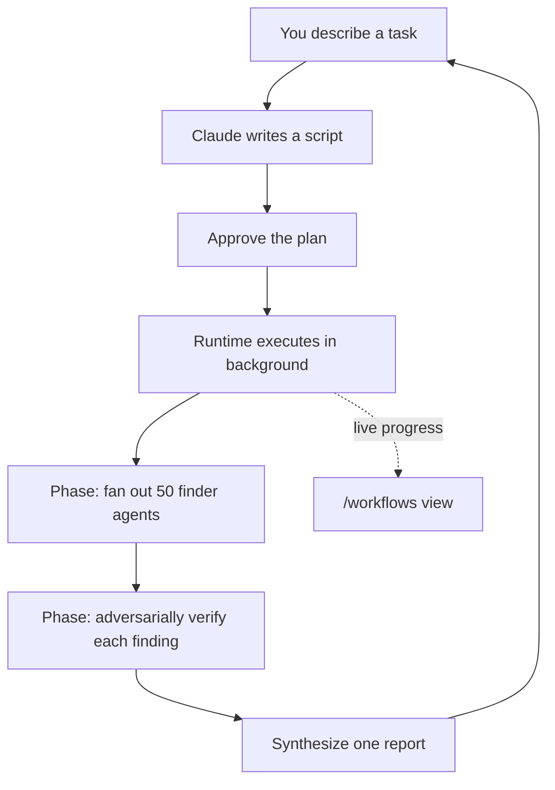

<LevelBadge level="advanced" />

<VerifyNote lastVerified="2026-06-28" source="https://code.claude.com/docs/en/workflows">
Dynamische Workflows sind ein sich schnell entwickelndes Feature: das Auslöser-Schlüsselwort, die Freigabeoptionen, die Agenten-Limits und die Verfügbarkeit ändern sich zwischen Claude-Code-Releases — bestätige die Details in der offiziellen Dokumentation. Sie erfordern Claude Code v2.1.154+ und einen kostenpflichtigen Plan.
</VerifyNote>

<Callout type="objectives" items={["Einen Workflow von Subagenten, Skills und Agenten-Teams unterscheiden — danach, wer den Plan hält", "Einen in 30 Sekunden mit dem mitgelieferten /deep-research-Befehl sehen", "Deinen eigenen auf drei Wegen starten: das Schlüsselwort ultracode, /effort ultracode oder ein gespeicherter Befehl", "Wissen, wovor dich die Freigabeaufforderung schützt, bevor du Ja drückst", "Kosten und unbeaufsichtigte Läufe mit Slicing und der Allowlist im Griff behalten"]} />

Ein **dynamischer Workflow** ist ein JavaScript-Skript, das [Subagenten](/docs/claude-code/subagents) im großen Maßstab orchestriert. Du beschreibst eine Aufgabe; Claude *schreibt das Skript*; eine Laufzeitumgebung führt es im Hintergrund aus, während deine Sitzung reaktionsfähig bleibt. Während eine normale mehrstufige Aufgabe Schritt für Schritt im Kontextfenster von Claude lebt, verschiebt ein Workflow den **Plan in Code** — die Schleife, die Verzweigungen und jedes Zwischenergebnis liegen in Skriptvariablen, sodass dein Kontext nur die endgültige Antwort enthält.

Genau diese eine Verschiebung lässt Workflows auf *Dutzende oder Hunderte* von Agenten in einem Lauf skalieren, während gewöhnliches Delegieren bei einer Handvoll an seine Grenzen stößt.

## Wann du zu einem Workflow greifst

Claude Code bietet dir vier Wege, mehrstufige Arbeit auszuführen. Die eigentliche Frage ist **wer den Plan hält**:

| | [Subagenten](/docs/claude-code/subagents) | [Skills](/docs/claude-code/skills) | Agenten-Teams | **Workflows** |
| :-- | :-- | :-- | :-- | :-- |
| Was es ist | Ein Worker, den Claude erzeugt | Anweisungen, denen Claude folgt | Ein Lead, der gleichrangige Sitzungen überwacht | Ein Skript, das die Laufzeit ausführt |
| Wer entscheidet, was als Nächstes läuft | Claude, Zug um Zug | Claude, gemäß dem Prompt | Der Lead, Zug um Zug | **Das Skript** |
| Wo Ergebnisse liegen | Kontextfenster | Kontextfenster | Eine gemeinsame Aufgabenliste | **Skriptvariablen** |
| Maßstab | Ein paar pro Zug | Wie Subagenten | Eine Handvoll Peers | **Dutzende bis Hunderte** |
| Bei Unterbrechung | Startet den Zug neu | Startet den Zug neu | Teammitglieder laufen weiter | **In der Sitzung fortsetzbar** |

Verwende einen Workflow, wenn eine Aufgabe **mehr Agenten braucht, als ein Gespräch koordinieren kann**, oder wenn du die Orchestrierung **als Skript kodifiziert haben willst, das du lesen und erneut ausführen kannst**. Kanonische Fälle:

- Ein **codebase-weiter Bug-Sweep** — fächere einen Finder über jedes Modul auf, dann lass unabhängige Agenten jeden Fund adversarisch verifizieren, bevor er gemeldet wird.
- Eine **500-Dateien-Migration** — ein Agent pro Datei, jeder in seinem eigenen Worktree, mit einer Verifizierungsstufe.
- Eine **Recherchefrage**, bei der Quellen **gegeneinander gegengeprüft** werden müssen, nicht nur zusammengefasst.
- Ein **schwieriger Plan**, der es wert ist, aus mehreren unabhängigen Blickwinkeln entworfen und dann gegeneinander abgewogen zu werden, bevor du dich festlegst.

Dieser letzte Punkt ist der unterschätzte: ein Workflow kann ein *wiederholbares Qualitätsmuster* anwenden (adversarisches Review, Entwurf aus mehreren Blickwinkeln, Verifizierung per Mehrheitsentscheid), sodass du ein vertrauenswürdigeres Ergebnis erhältst als bei einem einzelnen Durchlauf — nicht einfach nur mehr Agenten.



## Der schnellste Weg, einen zu sehen: /deep-research

Claude Code liefert einen eingebauten Workflow mit, damit du nicht erst einen schreiben musst, um das Modell auszuprobieren. Führe ihn zu jeder beliebigen Frage aus:

<PromptCard title="Probiere einen Workflow mit einem einzigen Befehl">{`/deep-research What changed in the Node.js permission model between v20 and v22?`}</PromptCard>

Er fächert Websuchen über mehrere Blickwinkel auf, ruft die Quellen ab und **gleicht sie gegeneinander ab**, stimmt über jede Behauptung ab und liefert einen **belegten Bericht, bei dem Behauptungen, die die Gegenprüfung nicht überstanden haben, herausgefiltert sind**. Gib bei der Aufforderung frei, dann beobachte mit `/workflows`, wie er arbeitet. (Er benötigt das verfügbare WebSearch-Tool.)

## Drei Wege, deinen eigenen zu starten

**1. Frage in einem einzigen Prompt.** Nimm das Schlüsselwort `ultracode` auf, oder frage einfach in normalen Worten ("nutze einen Workflow", "führe einen Workflow aus"). Claude schreibt für diese eine Aufgabe ein Skript, ohne das Effort-Level deiner Sitzung zu ändern:

<PromptCard title="Eine Aufgabe als Workflow ausführen">{`ultracode: audit every API endpoint under src/routes/ for missing auth checks`}</PromptCard>

Das Schlüsselwort wird in deiner Eingabe hervorgehoben. Nicht so gemeint? Drücke `Option+W` (macOS) oder `Alt+W` (Windows/Linux), um die Hervorhebung für diesen Prompt zu entfernen.

:::note Verlauf des Schlüsselworts
Vor v2.1.160 war das wörtliche Auslöserwort `workflow`; es wurde in `ultracode` umbenannt, damit das gängige Wort "workflow" keinen Lauf auslöst. Anfragen in natürlicher Sprache ("führe einen Workflow aus") funktionieren in **beiden** Versionen.
:::

**2. Lass Claude entscheiden — ultracode-Effort.** Stelle die Sitzung auf ultracode, und Claude plant für *jede* substanzielle Aufgabe einen Workflow und entscheidet selbst, wann einer gerechtfertigt ist:

<PromptCard title="Automatische Orchestrierung für die Sitzung einschalten">{`/effort ultracode`}</PromptCard>

Ultracode kombiniert `xhigh`-[Reasoning-Effort](/docs/api/thinking-and-effort) mit automatischer Orchestrierung. Eine einzelne Anfrage kann zu mehreren aufeinanderfolgenden Workflows werden — einer, um den Code zu verstehen, einer, um die Änderung vorzunehmen, einer, um sie zu verifizieren. Jede Aufgabe verbraucht dann mehr Tokens und dauert länger, also wechsle für Routinearbeit mit `/effort high` zurück. Es gilt nur für die aktuelle Sitzung.

**3. Führe einen gespeicherten oder mitgelieferten Befehl aus.** `/deep-research` oder jeder von dir gespeicherte Workflow (siehe unten) erscheint in der `/`-Autovervollständigung wie jeder Slash-Befehl.

## Freigeben, bevor er läuft

Workflows können viele Agenten erzeugen, daher zeigt dir die CLI die geplanten Phasen und fragt zuerst nach:

- **Ja, ausführen** — den Lauf starten
- **Ja, und nicht erneut für `[name]` in `[path]` fragen** — starten und die Aufforderung für diesen Workflow in diesem Projekt überspringen
- **Rohskript ansehen** (`Ctrl+G` öffnet es in deinem Editor) — vor der Entscheidung lesen
- **Nein** — abbrechen (`Tab` erlaubt dir, den Prompt zuerst anzupassen)

Ob du gefragt wirst, hängt von deinem [Berechtigungsmodus](/docs/claude-code/permissions) ab: **Default / accept-edits** fragt bei jedem Lauf (es sei denn, du hast dich für diesen Workflow abgemeldet); **Auto** fragt nur beim ersten Start; **bypass / `claude -p` / Agent SDK** fragen nie — der Lauf startet sofort.

:::warning Die Subagenten erben nicht den Modus deiner Sitzung
Egal welchen Berechtigungsmodus deine Sitzung hat, die Agenten, die ein Workflow erzeugt, laufen immer im Modus **`acceptEdits`** und erben deine [Tool-Allowlist](/docs/claude-code/permissions) — Dateibearbeitungen werden automatisch freigegeben. Shell-Befehle, Web-Fetches und MCP-Tools, die *nicht* auf deiner Allowlist stehen, können den Lauf dennoch pausieren, um dich zu fragen. Bei einem langen unbeaufsichtigten Lauf **füge die Befehle, die die Agenten brauchen, vor dem Start zu deiner Allowlist hinzu**, damit er nicht hängenbleibt und auf dich wartet. Siehe [Autonome Läufe absichern](/docs/security/hardening-autonomous-runs).
:::

## Wie ein Lauf abläuft

Die Laufzeitumgebung führt das Skript in einer **isolierten Umgebung** aus, getrennt von deinem Gespräch — Zwischenergebnisse bleiben in Skriptvariablen und berühren nie den Kontext von Claude. Das Skript selbst hat **keinen direkten Dateisystem- oder Shell-Zugriff**: die *Agenten* lesen, schreiben und führen Befehle aus; das Skript koordiniert sie nur.

Jeder Lauf schreibt sein Skript in eine Datei unter deinem Sitzungsverzeichnis in `~/.claude/projects/`, und Claude erhält den Pfad. So kannst du Claude nach dem Skript fragen, die geschriebene Orchestrierung lesen, sie gegen einen vorherigen Lauf diffen oder sie bearbeiten und Claude bitten, von deiner bearbeiteten Version aus neu zu starten.

Die Laufzeitumgebung erzwingt ein paar Limits, damit ein fehlerhaftes Skript nicht außer Kontrolle gerät:

| Beschränkung | Warum |
| :-- | :-- |
| Keine Benutzereingabe mitten im Lauf (nur Agenten-Berechtigungsaufforderungen pausieren ihn) | Für Freigaben zwischen den Stufen führe jede Stufe als eigenen Workflow aus |
| Skript hat keinen direkten Dateisystem-/Shell-Zugriff | Die Agenten erledigen die Arbeit; das Skript koordiniert |
| Bis zu **16 gleichzeitige** Agenten (weniger auf Maschinen mit wenigen Kernen) | Begrenzt die lokale Ressourcennutzung |
| **1.000 Agenten insgesamt** pro Lauf | Verhindert außer Kontrolle geratene Schleifen |

## Läufe beobachten und verwalten

Führe `/workflows` aus, um laufende und abgeschlossene Läufe aufzulisten, und wähle dann einen aus, um seine Fortschrittsansicht zu öffnen — jede Phase mit ihrer Agentenzahl, ihrer Token-Gesamtsumme und der verstrichenen Zeit. Gehe in eine Phase hinein, dann in einen Agenten, um seinen Prompt, die letzten Tool-Aufrufe und das Ergebnis zu lesen. Wichtige Steuerungen:

| Taste | Aktion |
| :-- | :-- |
| `↑` / `↓` | Eine Phase oder einen Agenten auswählen |
| `Enter` / `→` | Hineingehen; `Esc` geht zurück |
| `f` | Agenten nach Status filtern (v2.1.186+) |
| `p` | Den Lauf pausieren oder fortsetzen |
| `x` | Den ausgewählten Agenten stoppen — oder den ganzen Lauf, wenn der Fokus darauf liegt |
| `r` | Den ausgewählten laufenden Agenten neu starten |
| `s` | Das Skript dieses Laufs als Befehl **speichern** |

Eine einzeilige Fortschrittszusammenfassung erscheint außerdem im Aufgabenbereich unter deinem Eingabefeld; drücke Pfeil-runter, um ihn zu fokussieren, Enter, um ihn aufzuklappen.

**Fortsetzen:** stoppe einen Lauf und setze ihn später fort (`p`) — Agenten, die bereits fertig sind, liefern zwischengespeicherte Ergebnisse, der Rest läuft live. Das Fortsetzen funktioniert **innerhalb derselben Sitzung**; verlasse Claude Code mitten im Lauf, und die nächste Sitzung startet ihn von vorn.

## Einen Workflow zur Wiederverwendung speichern

Wenn Claude eine gute Orchestrierung für etwas schreibt, das du wiederholen wirst — ein Review, das du auf jedem Branch ausführst — drücke `s` in `/workflows`, um das Skript dieses Laufs zu speichern. `Tab` schaltet um, wohin:

- `.claude/workflows/` in deinem Projekt — geteilt mit allen, die das Repo klonen
- `~/.claude/workflows/` in deinem Home — überall verfügbar, nur du siehst es

Es läuft dann in zukünftigen Sitzungen als `/[name]`. Ein gespeicherter Workflow kann über ein `args`-Global Eingaben entgegennehmen, sodass du ihn beim Aufruf parametrisierst, statt das Skript zu bearbeiten:

```text
> Run /triage-issues on issues 1024, 1025, and 1030
```

Claude übergibt die Liste als strukturierte Daten, sodass das Skript Array-/Objekt-Methoden direkt auf `args` aufruft.

## Achte auf die Kosten

Ein Workflow erzeugt viele Agenten, sodass ein Lauf **deutlich mehr Tokens** verbrauchen kann als dieselbe Aufgabe im Gespräch, und er zählt zur Nutzung und zu den Rate-Limits deines Plans. Zwei Gewohnheiten halten das im Rahmen:

- **Erst slicen.** Führe ihn zuerst auf einem Verzeichnis (nicht dem ganzen Repo) oder einer eng gefassten Frage aus, um die Ausgaben abzuschätzen; `/workflows` zeigt die Token-Nutzung pro Agent live an, und du kannst jederzeit stoppen, ohne abgeschlossene Arbeit zu verlieren.
- **Das Modell passend dimensionieren.** Jeder Agent nutzt das Modell deiner Sitzung, sofern das Skript eine Stufe nicht woanders hinleitet. Prüfe `/model` vor einem großen Lauf, und wenn du die Aufgabe beschreibst, bitte Claude, für **Stufen, die nicht das stärkste Modell brauchen, ein kleineres Modell** zu verwenden. Siehe [Kosten & Latenz](/docs/foundations/cost-and-latency) und [Ein Modell wählen](/docs/api/choosing-a-model).

## Häufige Fehler

- **Einen Human-in-the-Loop mitten im Lauf erwarten.** Es gibt keine Eingabe mitten im Lauf. Wenn eine Aufgabe deine Freigabe zwischen den Stufen braucht, teile sie in separate Workflows auf.
- **Die Allowlist bei unbeaufsichtigten Läufen vergessen.** Ein langer Workflow bleibt in dem Moment hängen, in dem ein Agent auf einen nicht erlaubten Shell-Befehl trifft. Autorisiere vorab, was die Agenten brauchen.
- **Zu einem Workflow greifen, wo ein Subagent reichen würde.** Ein paar delegierte Aufgaben pro Zug sind das, wofür [Subagenten](/docs/claude-code/subagents) da sind. Workflows rechtfertigen ihren Overhead im *Flotten*-Maßstab oder wenn du die Orchestrierung als wiederausführbares Skript gespeichert haben willst.
- **Die ganze Sitzung über ultracode-Effort für Routine-Edits laufen lassen.** Es plant für alles einen Workflow — großartig für harte Arbeit, verschwenderisch für eine Einzeiler-Korrektur. Wechsle zu `/effort high`.

<Quiz title="Selbsttest" questions={[{q: "Was ist der entscheidende Unterschied zwischen einem Workflow und Subagenten, Skills oder Agenten-Teams?", options: ["Ein Workflow kann Agenten erzeugen; die anderen nicht", "Der Plan liegt in einem Skript, das die Laufzeit ausführt, nicht Zug um Zug im Kontext von Claude", "Workflows sind die einzigen, die im Hintergrund laufen"], answer: 1, explain: "Alle vier können mehrstufige Arbeit ausführen. In einem Workflow liegen die Schleife, die Verzweigungen und die Zwischenergebnisse in Skriptvariablen — der Kontext von Claude enthält nur die endgültige Antwort — und genau das lässt ihn auf Dutzende oder Hunderte von Agenten skalieren."}, {q: "Du führst einen langen unbeaufsichtigten Workflow aus, und die Agenten brauchen einen Shell-Befehl, der nicht auf deiner Allowlist steht. Was passiert?", options: ["Die Agenten geben ihn automatisch frei, weil sie im acceptEdits-Modus laufen", "Der Lauf bleibt hängen und wartet auf deine Freigabe", "Der Lauf überspringt diesen Befehl und fährt fort"], answer: 1, explain: "Workflow-Agenten laufen im acceptEdits-Modus, sodass Dateibearbeitungen automatisch freigegeben werden, aber Shell-Befehle, Web-Fetches und MCP-Tools, die nicht auf deiner Allowlist stehen, pausieren den Lauf dennoch, um dich zu fragen. Autorisiere vor einem unbeaufsichtigten Lauf vorab, was die Agenten brauchen."}, {q: "Was ist der günstigste Weg, um abzuschätzen, was ein großer Workflow kosten wird, bevor du dich festlegst?", options: ["Zuerst das gespeicherte Skript lesen", "Ihn auf einem engen Ausschnitt ausführen — ein Verzeichnis oder eine Frage — und die Tokens pro Agent in /workflows beobachten", "Die ganze Sitzung auf ein kleineres Modell umstellen"], answer: 1, explain: "Erst slicen: führe ihn auf einem Verzeichnis oder einer eng gefassten Frage aus, beobachte die Live-Token-Nutzung pro Agent in /workflows und stoppe jederzeit, ohne abgeschlossene Arbeit zu verlieren."}]} />

<Callout type="takeaways" items={["Ein Workflow verschiebt den Plan in Code — das Skript hält die Schleife und die Zwischenergebnisse, sodass Läufe auf Dutzende oder Hunderte von Agenten skalieren.", "Probiere einen sofort mit /deep-research; starte deinen eigenen mit dem Schlüsselwort ultracode, /effort ultracode oder einem gespeicherten /command.", "Die Freigabeaufforderung existiert, weil ein Lauf viele Agenten erzeugen kann — Default und accept-edits fragen bei jedem Lauf; Auto fragt einmal; bypass und Headless fragen nie.", "Erzeugte Agenten laufen im acceptEdits-Modus mit deiner Allowlist, also autorisiere vor einem unbeaufsichtigten Lauf vorab die Befehle, die sie brauchen.", "Workflows kosten deutlich mehr Tokens — erst slicen, das Modell pro Stufe passend dimensionieren und ultracode-Effort für Routine-Edits auf /effort high zurücksetzen."]} />

## Workflows ausschalten

Schalte **Dynamische Workflows** in `/config` aus, setze `"disableWorkflows": true` in `~/.claude/settings.json`, oder setze die Umgebungsvariable `CLAUDE_CODE_DISABLE_WORKFLOWS=1`. Organisationen können sie in den [verwalteten Einstellungen](/docs/claude-code/settings) deaktivieren. Wenn ausgeschaltet, verschwinden die mitgelieferten Workflow-Befehle, und `ultracode` löst keinen Lauf mehr aus und erscheint nicht mehr im `/effort`-Menü.

## Weiter

- [Subagenten & parallele Agenten](/docs/claude-code/subagents) — das Worker-Primitiv, das Workflows orchestrieren
- [Einen Multi-Subagenten-Workflow entwerfen (Walkthrough)](/docs/walkthroughs/multi-subagent-workflow)
- [Langlaufende Agenten-Harnesses](/docs/frontiers/long-running-agent-harnesses) — die Designprinzipien hinter dauerhaften Multi-Agenten-Läufen
- [Autonome Läufe absichern](/docs/security/hardening-autonomous-runs)
