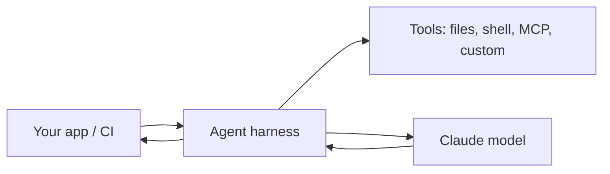

<LevelBadge level="advanced" />

<VerifyNote lastVerified="2026-06-20" source="https://docs.anthropic.com/en/docs/claude-code/sdk">
SDK-Namen, Paketnamen und Headless-Flags entwickeln sich weiter — überprüfe sie in der offiziellen Dokumentation zum Claude Agent SDK / zu Claude Code.
</VerifyNote>

Claude Code ist nicht nur interaktiv. Du kannst es **headless** (nicht-interaktiv, skriptbar) ausführen, und du kannst deine **eigenen Agenten** auf demselben zugrunde liegenden Harness mit dem **Agent SDK** bauen.

## Headless-Modus

Führe eine einzelne Eingabeaufforderung nicht-interaktiv aus und erfasse die Ausgabe — perfekt für Skripte, Pre-Commit-Hooks und CI:

```bash
claude -p "Review the staged diff and list any bugs as a Markdown checklist"
```

Leite Eingabe hinein, hol ein Ergebnis heraus. Kombiniere es mit auf eine sichere, nicht-interaktive Haltung gesetzten [Berechtigungen](/docs/claude-code/permissions), damit es nie auf eine Freigabe wartend hängen bleibt — und **sperre es ab**, damit ein automatisierter Lauf keine Geheimnisse anfassen kann (siehe [Autonome Läufe absichern](/docs/security/hardening-autonomous-runs)).

Ein klassischer Anwendungsfall: ein CI-Job, der Claude jeden Pull Request prüfen lässt — siehe den [PR-Review-Walkthrough](/docs/walkthroughs/pr-review-action).

## Das Agent SDK

Das **Claude Agent SDK** (Python und TypeScript) lässt dich produktive Agenten auf derselben Schleife bauen, die Claude Code antreibt — Tool-Nutzung, Datei-/Shell-Zugriff, Berechtigungen, Kontextverwaltung — aber verdrahtet in *deine* Anwendung.



Greife danach, wenn du einem einzelnen API-Aufruf oder einer selbstgebauten Schleife entwachsen bist und eine vollausgestattete Agenten-Laufzeit willst. Für das Spektrum der Optionen — einzelner Aufruf → Workflow → eigener Agent → managed — siehe [Agenten auf der API bauen](/docs/api/building-agents).

## Headless/SDK vs. interaktiv

| Modus | Wofür |
|---|---|
| Interaktives Claude Code | Tägliche Entwicklung mit einem Menschen in der Schleife |
| Headless (`claude -p`) | Skripte, Pre-Commit, CI-Einzelläufe |
| Agent SDK | Produktive Agenten, eingebettet in deine Software |

## Weiter

- [GitHub-Action, die jeden PR prüft (Walkthrough)](/docs/walkthroughs/pr-review-action)
- [Agenten auf der API bauen](/docs/api/building-agents)
- [Autonome Läufe absichern](/docs/security/hardening-autonomous-runs)
