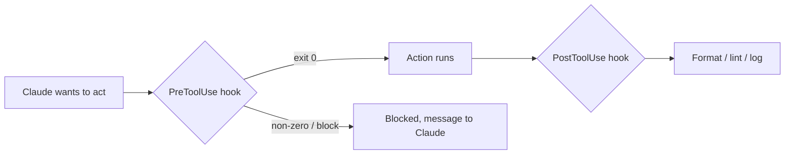

<LevelBadge level="advanced" />

<VerifyNote lastVerified="2026-06-20" source="https://docs.anthropic.com/en/docs/claude-code/hooks">
Die genauen Namen der Hook-Ereignisse und das Konfigurationsschema entwickeln sich weiter — überprüfe sie anhand der offiziellen Hooks-Dokumentation, bevor du dich auf ein bestimmtes Ereignis verlässt.
</VerifyNote>

Hooks sind **Shell-Befehle, die Claude Code automatisch ausführt** an definierten Punkten seines Lebenszyklus. Wo [Berechtigungen](/docs/claude-code/permissions) entscheiden, *ob* eine Aktion erlaubt ist, lassen Hooks *dich* deterministische Logik darum herum ausführen — Formatierung, Validierung, Logging, Gates. So machst du Verhalten garantiert statt "bitte denk daran".

## Wann du zu einem Hook greifst

- **Auto-Formatierung / Linting** nach jeder Dateibearbeitung (`PostToolUse`).
- Eine Aktion, die eine Regel verletzt, **blockieren**, bevor sie läuft (`PreToolUse`).
- **Benachrichtigen oder loggen**, wenn eine Session endet oder eine Aufgabe abgeschlossen wird (`Stop`).
- **Kontext einschleusen** beim Session-Start.

## Wie sie funktionieren

Du registrierst Hooks in [`settings.json`](/docs/claude-code/settings) und ordnest ein **Ereignis** (und oft einen Tool-Matcher) zu. Wenn das Ereignis ausgelöst wird, führt Claude deinen Befehl aus und liest sein Ergebnis — ein Exit-Code ungleich null oder eine bestimmte Ausgabe kann die Aktion **blockieren** und eine Nachricht an Claude zurückspielen.

```json
{
  "hooks": {
    "PostToolUse": [
      {
        "matcher": "Edit|Write",
        "hooks": [
          { "type": "command", "command": "npx prettier --write \"$CLAUDE_FILE_PATH\"" }
        ]
      }
    ]
  }
}
```

Der Hook erhält Kontext (z. B. den Dateipfad, den Tool-Namen) über Umgebung/stdin — die genaue Nutzlast, die je nach Ereignis variiert, findest du in der Dokumentation.

## Das mentale Modell



## Gute Praktiken

- **Halte Hooks schnell und idempotent** — sie laufen oft.
- **Schlage bei echten Problemen laut Alarm**, aber blockiere nicht bei kosmetischen Mängeln.
- **Behandle die Hook-Ausgabe als Feedback an Claude** — eine klare Nachricht hilft ihm, sich selbst zu korrigieren.
- Hooks laufen mit den Rechten deiner Shell — prüfe jeden Hook, den du nicht selbst geschrieben hast ([Code von Dritten prüfen](/docs/security/reviewing-third-party-code)).

Zum Kopieren-und-Einfügen bereite Starter findest du in den [Hooks- & settings.json-Rezepten](/docs/templates/hooks-settings).

## Weiter

- [settings.json](/docs/claude-code/settings) · [Berechtigungen](/docs/claude-code/permissions)
- [Skills](/docs/claude-code/skills) — Expertise vs. Automatisierung
- [Autonome Läufe absichern](/docs/security/hardening-autonomous-runs)
