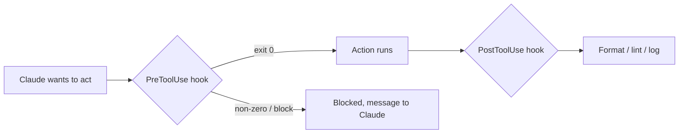

<LevelBadge level="advanced" />

<VerifyNote lastVerified="2026-06-23" source="https://code.claude.com/docs/en/hooks">
Die genauen Namen der Hook-Ereignisse, die stdin-Payload und das Blockier-Protokoll entwickeln sich weiter — prüfe sie gegen die offizielle Hooks-Dokumentation, bevor du dich auf ein bestimmtes Ereignis oder Feld verlässt.
</VerifyNote>

Hooks sind **Shell-Befehle, die Claude Code automatisch ausführt** an definierten Punkten seines Lebenszyklus. Während [Berechtigungen](/docs/claude-code/permissions) entscheiden, *ob* eine Aktion erlaubt ist, lassen Hooks *dich* deterministische Logik darum herum ausführen — Formatierung, Validierung, Protokollierung, Gates. So machst du Verhalten garantiert statt „bitte daran denken".

<Callout type="objectives" items={["Wann du zu einem Hook greifst statt zu einer Anweisung oder einer Berechtigung", "Wie ein Hook verdrahtet wird: Ereignis, Matcher und die JSON-Payload auf stdin", "Die zwei Arten, wie ein Hook eine Aktion blockiert — Exit-Code 2 vs. JSON auf stdout", "Die guten Praktiken und häufigen Fehler, die schnelle, sichere Hooks von trägen, stummen unterscheiden"]} />

## Wann du zu einem Hook greifst

Greif zu einem Hook, wenn du willst, dass ein Verhalten *garantiert* ist, nicht nur erbeten. Jede gängige Aufgabe entspricht einem Lebenszyklus-Ereignis:

- **Auto-Format / Lint** nach jeder Dateibearbeitung (`PostToolUse`).
- **Blockieren** einer Aktion, die eine Regel verletzt, bevor sie ausgeführt wird (`PreToolUse`).
- **Benachrichtigen oder protokollieren**, wenn eine Sitzung endet oder eine Aufgabe abgeschlossen wird (`Stop`).
- **Kontext einfügen** beim Sitzungsstart.

<Flashcards title="Hook-Ereignisse auf einen Blick" cards={[{front: "PreToolUse", back: "Wird ausgelöst, bevor eine Aktion läuft. Nutze es zum Blockieren oder Gaten — z. B. einen destruktiven Befehl ablehnen, bevor er ausgeführt wird."}, {front: "PostToolUse", back: "Wird nach einer passenden Aktion ausgelöst. Nutze es, um zu formatieren, zu linten oder das gerade Geänderte zu protokollieren."}, {front: "Stop", back: "Wird ausgelöst, wenn eine Sitzung endet oder eine Aufgabe abgeschlossen wird. Nutze es zum Benachrichtigen oder Protokollieren."}, {front: "Session start", back: "Wird zu Beginn einer Sitzung ausgelöst. Nutze es, um Kontext einzufügen."}]} />

## Wie sie funktionieren

Du registrierst Hooks in [`settings.json`](/docs/claude-code/settings), wobei du ein **Ereignis** (und oft einen Tool-Matcher) zuordnest. Wenn das Ereignis ausgelöst wird, führt Claude deinen Befehl aus und übergibt eine **JSON-Payload auf stdin** (den Tool-Namen, seine Eingaben, die Sitzung). Der Exit-Code und die Ausgabe deines Befehls entscheiden, was als Nächstes passiert.

<Steps items={[{title: "Ein Ereignis zuordnen", body: "Registriere den Hook in settings.json unter dem Lebenszyklus-Ereignis, das dich interessiert — zum Beispiel PostToolUse."}, {title: "Mit einem Matcher eingrenzen", body: "Füge einen Tool-Matcher hinzu, damit der Hook nur bei relevanten Tools auslöst, z. B. matcher \"Edit|Write\" für Dateibearbeitungen."}, {title: "Die Payload von stdin lesen", body: "Wenn das Ereignis auslöst, führt Claude deinen Befehl aus und leitet eine JSON-Payload auf stdin durch — den Tool-Namen, seine Eingaben, die Sitzung."}, {title: "Entscheiden, was als Nächstes passiert", body: "Der Exit-Code und die Ausgabe deines Befehls bestimmen das Ergebnis: die Aktion zulassen, deine Logik ausführen oder sie blockieren."}]} />

```json
{
  "hooks": {
    "PostToolUse": [
      {
        "matcher": "Edit|Write",
        "hooks": [
          { "type": "command", "command": "jq -r '.tool_input.file_path' | xargs npx prettier --write" }
        ]
      }
    ]
  }
}
```

Der Hook oben liest den Pfad der bearbeiteten Datei aus dem stdin-JSON (`.tool_input.file_path`) und formatiert sie. Geh nicht davon aus, dass eine Umgebungsvariable den Pfad enthält — **lies ihn von stdin.** Nützliche Pfad-Platzhalter wie `${CLAUDE_PROJECT_DIR}` *sind* verfügbar, um Skripte zu finden.

## Wie ein Hook blockiert

Zwei Arten, je nach Ereignis:

- **Exit-Code 2** — der Hook lässt die Aktion scheitern, und was er auf **stderr** geschrieben hat, wird zur Nachricht, die Claude sieht. Einfach und funktioniert für Befehls-Hooks.
- **JSON auf stdout (Exit 0)** — gib eine strukturierte Entscheidung zurück. Für `PreToolUse` ist das ein `permissionDecision` von `deny`; für `PostToolUse`/`Stop`/usw. ist es `{"decision": "block", "reason": "…"}`.

Das Skript unten ist ein `PreToolUse`-Hook auf dem Bash-Tool. Lies es von oben nach unten: Es zieht den Befehl aus stdin, und wenn er destruktiv aussieht, schreibt es einen Grund auf stderr und beendet sich mit 2, um zu blockieren.

```bash
#!/usr/bin/env bash
# PreToolUse hook on the Bash tool: refuse to delete things.
command=$(jq -r '.tool_input.command' < /dev/stdin)
if [[ "$command" == rm\ * || "$command" == *"rm -rf"* ]]; then
  echo "Blocked: destructive 'rm' is not allowed by policy." >&2
  exit 2
fi
exit 0
```

## Das mentale Modell

Ein `PreToolUse`-Hook läuft *vor* der Aktion und kann sie blockieren; ein `PostToolUse`-Hook läuft *nachdem* sie erfolgreich war und reagiert auf das Ergebnis.



## Gute Praktiken

- **Halte Hooks schnell und idempotent** — sie laufen oft.
- **Schlag bei echten Problemen laut Alarm**, aber blockiere nicht bei kosmetischen Mängeln.
- **Behandle die Hook-Ausgabe als Feedback an Claude** — eine klare Nachricht hilft ihm, sich selbst zu korrigieren.
- Hooks laufen mit den Rechten deiner Shell — prüfe jeden Hook, den du nicht selbst geschrieben hast ([Code von Dritten prüfen](/docs/security/reviewing-third-party-code)).

## Häufige Fehler

- **Den Dateipfad aus einer Umgebungsvariablen lesen.** Der Pfad lebt im stdin-JSON (`.tool_input.file_path`), nicht in `$CLAUDE_FILE_PATH`. Leite stdin durch `jq`.
- **Stumme Blockaden.** Wenn ein `PreToolUse`-Hook mit 2 endet, aber nichts auf stderr steht, ist Claude blockiert, weiß aber nicht *warum* und kann sich nicht anpassen. Schreib immer einen klaren Grund.
- **Langsame Hooks.** Ein `PostToolUse`-Hook läuft nach *jeder* passenden Bearbeitung. Ein 3-Sekunden-Linter lässt die ganze Sitzung träge wirken — halte Hooks schnell und reagiere idealerweise nur auf das, was sich geändert hat.
- **Zu breite Matcher.** `matcher: ".*"` löst bei jedem Tool aus. Grenz mit einem exakten Namen ein, einer `Edit|Write`-Liste oder dem Pro-Handler-`if`-Feld (z. B. `"if": "Bash(git push *)"`).
- **Hooks vertrauen, die du nicht geschrieben hast.** Ein Hook führt beliebige Shell-Befehle mit deinen Rechten aus. Prüfe jeden Hook aus einem Plugin oder Template zuerst — siehe [Code von Dritten prüfen](/docs/security/reviewing-third-party-code).

<Callout type="warning" items={["Ein Hook führt beliebige Shell-Befehle mit deinen Rechten aus — verdrahte niemals einen Hook aus einem Plugin oder Template, ohne ihn zuerst zu lesen."]} />

Copy-Paste-Starter findest du in [Hooks & settings.json Rezepte](/docs/templates/hooks-settings).

<PromptCard title="Bearbeitete Dateien automatisch formatieren (PostToolUse auf Edit|Write)">{`{
  "hooks": {
    "PostToolUse": [
      {
        "matcher": "Edit|Write",
        "hooks": [
          { "type": "command", "command": "jq -r '.tool_input.file_path' | xargs npx prettier --write" }
        ]
      }
    ]
  }
}`}</PromptCard>

<Quiz title="Teste dich selbst" questions={[{q: "Wo findet ein Hook den Pfad der gerade bearbeiteten Datei?", options: ["In der Umgebungsvariablen $CLAUDE_FILE_PATH", "In der JSON-Payload auf stdin, bei .tool_input.file_path", "In einem von Claude übergebenen Kommandozeilen-Argument"], answer: 1, explain: "Der Pfad lebt im stdin-JSON (.tool_input.file_path), nicht in einer Umgebungsvariablen. Leite stdin durch jq, um ihn zu lesen."}, {q: "Ein PreToolUse-Hook endet mit Code 2. Was passiert?", options: ["Die Aktion wird zugelassen und stdout wird protokolliert", "Die Aktion wird blockiert, und was der Hook auf stderr geschrieben hat, wird zur Nachricht, die Claude sieht", "Claude ignoriert das Ergebnis, weil Exit 2 reserviert ist"], answer: 1, explain: "Exit-Code 2 lässt die Aktion scheitern; stderr wird zur Nachricht, die Claude sieht. Schreib immer einen klaren Grund, damit Claude sich anpassen kann."}, {q: "Warum gilt matcher \".*\" als häufiger Fehler?", options: ["Es ist ungültiges JSON und zerstört settings.json", "Es löst bei jedem Tool aus, sodass der Hook weit häufiger läuft als beabsichtigt — grenz ihn mit einem exakten Namen, einer Edit|Write-Liste oder dem if-Feld ein", "Es passt nur zum Bash-Tool"], answer: 1, explain: "Ein zu breiter Matcher löst bei jedem Tool aus. Grenz ihn ein, damit Hooks schnell und gezielt bleiben."}]} />

<Callout type="takeaways" items={["Hooks machen Verhalten garantiert, nicht erbeten — sie führen deterministische Logik um Aktionen herum aus, die Berechtigungen nur erlauben oder verweigern.", "Registriere einen Hook in settings.json gegen ein Ereignis plus einen Matcher; Claude leitet eine JSON-Payload auf stdin durch und liest deinen Exit-Code und deine Ausgabe.", "Lies den Dateipfad von stdin (.tool_input.file_path) — nicht aus einer Umgebungsvariablen.", "Blockiere mit Exit-Code 2 (stderr wird zur Nachricht) oder mit strukturiertem JSON auf stdout (Exit 0); füge immer einen klaren Grund hinzu.", "Halte Hooks schnell, idempotent und eng zugeordnet — und prüfe jeden Hook, den du nicht geschrieben hast, da er mit den Rechten deiner Shell läuft."]} />

## Weiter

- [settings.json](/docs/claude-code/settings) · [Berechtigungen](/docs/claude-code/permissions)
- [Skills](/docs/claude-code/skills) — Expertise vs. Automatisierung
- [Autonome Läufe absichern](/docs/security/hardening-autonomous-runs)
