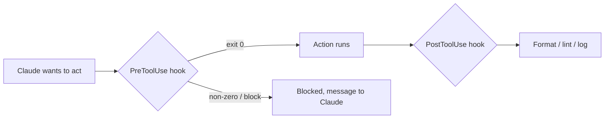

<LevelBadge level="advanced" />

<VerifyNote lastVerified="2026-06-23" source="https://code.claude.com/docs/en/hooks">
Die genauen Namen der Hook-Ereignisse, die stdin-Payload und das Blockier-Protokoll entwickeln sich weiter — überprüfe sie anhand der offiziellen Hooks-Dokumentation, bevor du dich auf ein bestimmtes Ereignis oder Feld verlässt.
</VerifyNote>

Hooks sind **Shell-Befehle, die Claude Code automatisch ausführt** an definierten Punkten in seinem Lebenszyklus. Während [Berechtigungen](/docs/claude-code/permissions) entscheiden, *ob* eine Aktion erlaubt ist, lassen Hooks *dich* deterministische Logik um sie herum ausführen — Formatierung, Validierung, Logging, Gates. So machst du Verhalten garantiert statt "bitte daran denken".

## Wann du zu einem Hook greifst

- **Auto-Formatierung / Linting** nach jeder Dateibearbeitung (`PostToolUse`).
- Eine Aktion, die eine Regel verletzt, **blockieren**, bevor sie läuft (`PreToolUse`).
- **Benachrichtigen oder loggen**, wenn eine Session endet oder eine Aufgabe abgeschlossen wird (`Stop`).
- **Kontext einschleusen** beim Session-Start.

## Wie sie funktionieren

Du registrierst Hooks in [`settings.json`](/docs/claude-code/settings) und ordnest sie einem **Ereignis** zu (und oft einem Tool-Matcher). Wenn das Ereignis ausgelöst wird, führt Claude deinen Befehl aus und übergibt eine **JSON-Payload über stdin** (den Tool-Namen, dessen Eingaben, die Session). Der Exit-Code und die Ausgabe deines Befehls entscheiden, was als Nächstes passiert.

```json
{
  "hooks": {
    "PostToolUse": [
      {
        "matcher": "Edit|Write",
        "hooks": [
          { "type": "command", "command": "jq -r '.tool_input.file_path' | xargs npx prettier --write" }
        ]
      }
    ]
  }
}
```

Der obige Hook liest den Pfad der bearbeiteten Datei aus dem stdin-JSON (`.tool_input.file_path`) und formatiert sie. Gehe nicht davon aus, dass eine Umgebungsvariable den Pfad enthält — **lies ihn aus stdin.** Nützliche Pfad-Platzhalter wie `${CLAUDE_PROJECT_DIR}` *sind* verfügbar, um Skripte zu lokalisieren.

## Wie ein Hook blockiert

Auf zwei Arten, abhängig vom Ereignis:

- **Exit-Code 2** — der Hook lässt die Aktion fehlschlagen, und was auch immer er nach **stderr** geschrieben hat, wird zur Nachricht, die Claude sieht. Einfach und funktioniert für Command-Hooks.
- **JSON auf stdout (Exit 0)** — gib eine strukturierte Entscheidung zurück. Für `PreToolUse` ist das eine `permissionDecision` von `deny`; für `PostToolUse`/`Stop`/etc. ist es `{"decision": "block", "reason": "…"}`.

```bash
#!/usr/bin/env bash
# PreToolUse hook on the Bash tool: refuse to delete things.
command=$(jq -r '.tool_input.command' < /dev/stdin)
if [[ "$command" == rm\ * || "$command" == *"rm -rf"* ]]; then
  echo "Blocked: destructive 'rm' is not allowed by policy." >&2
  exit 2
fi
exit 0
```

## Das mentale Modell



## Gute Praktiken

- **Halte Hooks schnell und idempotent** — sie laufen oft.
- **Schlage bei echten Problemen laut Alarm**, aber blockiere nicht bei kosmetischen Mängeln.
- **Behandle die Hook-Ausgabe als Feedback an Claude** — eine klare Nachricht hilft ihm, sich selbst zu korrigieren.
- Hooks laufen mit den Rechten deiner Shell — prüfe jeden Hook, den du nicht selbst geschrieben hast ([Code von Dritten prüfen](/docs/security/reviewing-third-party-code)).

## Häufige Fehler

- **Den Dateipfad aus einer Umgebungsvariablen lesen.** Der Pfad steht im stdin-JSON (`.tool_input.file_path`), nicht in `$CLAUDE_FILE_PATH`. Leite stdin durch `jq`.
- **Stilles Blockieren.** Wenn ein `PreToolUse`-Hook mit Exit 2 endet und nichts auf stderr schreibt, ist Claude blockiert, weiß aber nicht *warum* und kann sich nicht anpassen. Schreibe immer einen klaren Grund.
- **Langsame Hooks.** Ein `PostToolUse`-Hook läuft nach *jeder* passenden Bearbeitung. Ein 3-Sekunden-Linter lässt die gesamte Session träge wirken — halte Hooks schnell und reagiere idealerweise nur auf das, was sich geändert hat.
- **Zu weit gefasste Matcher.** `matcher: ".*"` löst bei jedem Tool aus. Grenze mit einem exakten Namen, einer `Edit|Write`-Liste oder dem `if`-Feld pro Handler ein (z. B. `"if": "Bash(git push *)"`).
- **Hooks vertrauen, die du nicht geschrieben hast.** Ein Hook führt beliebige Shell-Befehle mit deinen Rechten aus. Prüfe zuerst jeden Hook aus einem Plugin oder Template — siehe [Code von Dritten prüfen](/docs/security/reviewing-third-party-code).

Zum Kopieren-und-Einfügen bereite Starter findest du in den [Hooks- & settings.json-Rezepten](/docs/templates/hooks-settings).

## Weiter

- [settings.json](/docs/claude-code/settings) · [Berechtigungen](/docs/claude-code/permissions)
- [Skills](/docs/claude-code/skills) — Expertise vs. Automatisierung
- [Autonome Läufe absichern](/docs/security/hardening-autonomous-runs)
