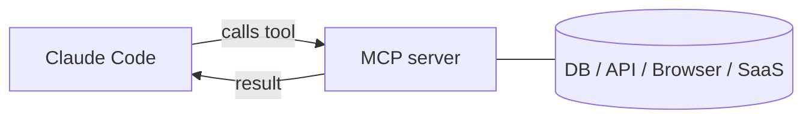

<LevelBadge level="advanced" />

<VerifyNote lastVerified="2026-06-20" source="https://code.claude.com/docs/en/mcp">
Die MCP-Konfigurationssyntax, Scopes und Transports entwickeln sich weiter — überprüfe das in der offiziellen Claude-Code-MCP-Dokumentation und auf modelcontextprotocol.io.
</VerifyNote>

Das **Model Context Protocol (MCP)** ist ein offener Standard, um KI mit externen Werkzeugen und Daten zu verbinden. Ein **MCP-Server** stellt Fähigkeiten bereit (eine Datenbank abfragen, einen GitHub-PR öffnen, einen Browser steuern); Claude Code verbindet sich mit ihm und kann **diese Werkzeuge** während einer Session **aufrufen**. So erweiterst du Claude über dein Dateisystem und deine Shell hinaus.

## Die Grobstruktur



Du deklarierst Server, die Claude nutzen darf; jeder Server veröffentlicht einen Satz von Werkzeugen mit Schemata; Claude wählt sie aus und ruft sie auf wie jedes andere Werkzeug.

## Transports

- **stdio** — ein lokaler Prozess, den Claude startet (großartig für lokale Werkzeuge/CLIs).
- **Remote (HTTP/SSE)** — ein gehosteter Server, oft mit OAuth.

## Server konfigurieren

Server werden konfiguriert (üblicherweise in einer `.mcp.json` und/oder über Einstellungen) mit einem Befehl/einer URL und etwaiger Authentifizierung. Scopes steuern, wo ein Server verfügbar ist (nur du oder mit dem Projekt geteilt). Sofort kopierbare Starter findest du in [MCP-Konfiguration & Server-Gerüste](/docs/templates/mcp-config).

```json
{
  "mcpServers": {
    "github": { "command": "npx", "args": ["-y", "@modelcontextprotocol/server-github"] }
  }
}
```

## Vertrauen & Sicherheit

:::warning Behandle MCP-Server wie das Installieren von Software
Ein MCP-Server führt Code aus und kann Daten lesen und Aktionen ausführen. Verbinde nur Server, denen du vertraust, gib ihnen die **geringsten** benötigten **Rechte** und denke daran, dass jeder externe Inhalt, den sie zurückgeben, [Prompt-Injection](/docs/security/prompt-injection) tragen kann. Prüfe Server von Dritten zuerst — siehe [Code von Dritten prüfen](/docs/security/reviewing-third-party-code).
:::

## MCP auch in den Apps

MCP treibt auch **Connectors** in den Claude-Apps an — derselbe Standard, andere Oberfläche. Siehe [Connectors (MCP) in den Apps](/docs/claude-app/connectors) und, für die API, [MCP & Verbindung zu Werkzeugen](/docs/api/mcp).

## Weiter

- [Baue & verdrahte deinen ersten MCP-Server (Walkthrough)](/docs/walkthroughs/first-mcp-server)
- [MCP-Konfiguration & Server-Gerüste](/docs/templates/mcp-config)
- [Agenten & Werkzeuge absichern](/docs/security/securing-agents)
