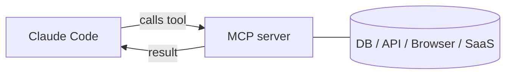

<LevelBadge level="advanced" />

<VerifyNote lastVerified="2026-06-23" source="https://code.claude.com/docs/en/mcp">
Die `claude mcp`-Befehle, die Konfigurations-Scopes und die Transports entwickeln sich weiter — prüfe sie in der offiziellen Claude Code MCP-Dokumentation und auf modelcontextprotocol.io.
</VerifyNote>

Das **Model Context Protocol (MCP)** ist ein offener Standard, um KI mit externen Tools und Daten zu verbinden. Ein **MCP-Server** stellt Fähigkeiten bereit (eine Datenbank abfragen, einen GitHub-PR öffnen, einen Browser steuern); Claude Code verbindet sich damit und kann **diese Tools aufrufen** während einer Sitzung. So erweiterst du Claude über dein Dateisystem und deine Shell hinaus.

<Callout type="objectives" items={["Erklären, was ein MCP-Server ist und wie Claude Code seine Tools aufruft", "Die zwei Transports unterscheiden: lokales stdio vs. remote HTTP/SSE", "Einen Server mit claude mcp add hinzufügen und das geschriebene JSON lesen", "Den richtigen Scope wählen (local, project, user) — wer einen Server sieht", "Eine echte Datenbank durchgängig mit Claude verbinden", "Die Sicherheits- und Konfigurationsfallen vermeiden, die die meisten treffen"]} />

## Die Grundform



Du deklarierst Server, die Claude nutzen darf; jeder Server veröffentlicht eine Reihe von Tools mit Schemata; Claude wählt sie aus und ruft sie auf wie jedes andere Tool.

<Flashcards title="MCP-Vokabular" cards={[{front: "Model Context Protocol (MCP)", back: "Ein offener Standard, um KI mit externen Tools und Daten zu verbinden."}, {front: "MCP-Server", back: "Ein Programm, das Fähigkeiten als aufrufbare Tools bereitstellt — eine Datenbank abfragen, einen GitHub-PR öffnen, einen Browser steuern."}, {front: "Tool", back: "Eine Fähigkeit, die ein MCP-Server mit einem Schema veröffentlicht; Claude wählt sie aus und ruft sie auf wie jedes andere Tool."}, {front: "Transport", back: "Wie Claude einen Server erreicht: stdio (lokaler Prozess) oder remote HTTP/SSE (gehostet, oft mit OAuth)."}, {front: "Scope", back: "Wer einen Server sieht: local (du, dieses Projekt), project (das committete Team) oder user (du, überall)."}]} />

## Transports

Es gibt zwei Arten, wie Claude einen Server erreicht. Wähl nach dem Ort, an dem der Server läuft.

- **stdio** — ein lokaler Prozess, den Claude startet (ideal für lokale Tools/CLIs).
- **Remote (HTTP/SSE)** — ein gehosteter Server, oft mit OAuth.

## Server konfigurieren

Der schnellste Weg ist der Befehl `claude mcp add` — er schreibt die Konfiguration für dich. Folge dieser Abfolge, um von null zu einem verbundenen Server zu gelangen.

<Steps items={[{title: "Einen lokalen stdio-Server hinzufügen", body: "Führe claude mcp add aus — alles nach dem -- ist der Startbefehl, den Claude für dich ausführt."}, {title: "Oder einen remote HTTP-Server hinzufügen", body: "Übergib --transport http und einen Scope, dann die Server-URL. Remote-Server sind oft gehostet und nutzen OAuth."}, {title: "Sehen, was verbunden ist", body: "Führe claude mcp list aus, um konfigurierte Server und ihren Verbindungsstatus zu sehen."}, {title: "Inspizieren und authentifizieren", body: "Nutze /mcp innerhalb einer Sitzung, um die Tools eines Servers zu inspizieren und Remote-Server zu authentifizieren."}]} />

<PromptCard title="Einen lokalen stdio-Server hinzufügen">{`# A local stdio server (everything after -- is the launch command)
claude mcp add github -- npx -y @modelcontextprotocol/server-github`}</PromptCard>

<PromptCard title="Einen remote HTTP-Server hinzufügen (mit dem Projekt geteilt)">{`# A remote HTTP server, shared with everyone on the project
claude mcp add --transport http --scope project linear https://mcp.linear.app/mcp`}</PromptCard>

Unter der Haube ist das einfach JSON. Ein **project**-scoped Server landet in einer `.mcp.json` im Repo-Stammverzeichnis — check sie ein, und dein ganzes Team bekommt dieselben Tools:

```json
{
  "mcpServers": {
    "github": { "command": "npx", "args": ["-y", "@modelcontextprotocol/server-github"] }
  }
}
```

### Der Scope entscheidet, wer den Server sieht

| Scope | Lebt in | Verwende ihn für |
|---|---|---|
| `local` (Standard) | deinen Benutzereinstellungen, nur dieses Projekt | persönliche Experimente, Geheimnisse |
| `project` | `.mcp.json` im Repo (committet) | Tools, die das ganze Team teilen soll |
| `user` | deinen Benutzereinstellungen, alle Projekte | Server, die du überall haben willst |

Führe `claude mcp list` aus, um zu sehen, was verbunden ist, und `/mcp` innerhalb einer Sitzung, um Tools zu inspizieren und Remote-Server zu authentifizieren. Siehe [MCP-Konfiguration & Server-Gerüste](/docs/templates/mcp-config) für Copy-Paste-Starter.

## Praxisbeispiel: gib Claude deine Datenbank

Angenommen, du willst, dass Claude Fragen gegen ein lokales Postgres beantwortet, statt dass du Abfrageergebnisse einfügst. Füge den Server hinzu (project-Scope, damit Teammitglieder ihn erben):

<PromptCard title="Einen Postgres-Server im project-Scope hinzufügen">{`claude mcp add --scope project db -- npx -y @modelcontextprotocol/server-postgres "postgresql://localhost/app"`}</PromptCard>

Jetzt kannst du in einer Sitzung die Frage in einfacher Sprache stellen und Claude die Abfrageschleife für dich erledigen lassen:

<PromptCard title="Eine Frage gegen die Datenbank stellen">{`How many users signed up last week? Check the DB.`}</PromptCard>

Claude ruft das `query`-Tool des Servers auf, bekommt Zeilen zurück und antwortet — kein Copy-Paste-Kreislauf. Weil es project-scoped ist, bekommt ein Teammitglied, das das Repo pullt, dieselbe Fähigkeit in dem Moment, in dem es Claude Code öffnet. Halte die Verbindungszeichenfolge schreibgeschützt, wenn du nur Lesezugriff willst.

## Vertrauen & Sicherheit

<Callout type="warning" items={["Ein MCP-Server führt Code aus und kann Daten lesen und Aktionen ausführen — verbinde nur Server, denen du vertraust.", "Gib jedem Server die geringsten nötigen Rechte.", "Jeder externe Inhalt, den ein Server zurückgibt, kann Prompt-Injection enthalten.", "Prüfe Server von Dritten, bevor du sie verbindest."]} />

:::warning Behandle MCP-Server wie das Installieren von Software
Ein MCP-Server führt Code aus und kann Daten lesen und Aktionen ausführen. Verbinde nur Server, denen du vertraust, gib ihnen die **geringsten** nötigen Rechte, und denk daran, dass jeder externe Inhalt, den sie zurückgeben, [Prompt-Injection](/docs/security/prompt-injection) enthalten kann. Prüfe Server von Dritten zuerst — siehe [Code von Dritten prüfen](/docs/security/reviewing-third-party-code).
:::

## MCP auch in den Apps

MCP treibt auch **Connectors** in den Claude-Apps an — selber Standard, andere Oberfläche. Siehe [Connectors (MCP) in den Apps](/docs/claude-app/connectors) und, für die API, [MCP & Verbindung zu Tools](/docs/api/mcp).

## Häufige Fehler

- **Falscher Scope.** Ein Server, der im `local`-Scope hinzugefügt wurde, erscheint nicht für Teammitglieder; einen, den du nur für dich wolltest, solltest du nicht im `project`-Scope committen. Wähl bewusst.
- **Zu viele Server, zu viele Tools.** Jeder verbundene Server fügt seine Tool-Schemata zum Kontext hinzu. Verbinde, was die Aufgabe braucht, nicht deinen ganzen Katalog.
- **Überprivilegierte Verbindungen.** Gib einem Datenbankserver eine schreibgeschützte Rolle, es sei denn, Claude muss wirklich schreiben. MCP macht Fähigkeiten real — grenz sie ein.
- **Das Injection-Risiko vergessen.** Alles, was ein Server zurückgibt (eine Webseite, ein Issue-Text, eine Zeile), ist nicht vertrauenswürdiger Text, der [Prompt-Injection](/docs/security/prompt-injection) enthalten kann. Verdrahte keinen mächtigen schreibfähigen Server neben einem nicht vertrauenswürdigen lesefähigen, ohne es durchzudenken.

<Quiz title="Teste dich selbst" questions={[{q: "Welcher Transport ist ein lokaler Prozess, den Claude selbst startet?", options: ["Remote HTTP/SSE", "stdio", "OAuth"], answer: 1, explain: "stdio ist ein lokaler Prozess, den Claude startet — ideal für lokale Tools und CLIs. Remote HTTP/SSE ist ein gehosteter Server, oft mit OAuth."}, {q: "Wohin wird ein project-scoped Server geschrieben, und was ist der Vorteil?", options: ["In deine Benutzereinstellungen; nur du siehst ihn", "Eine .mcp.json im Repo-Stammverzeichnis; check sie ein und das ganze Team bekommt dieselben Tools", "Ein versteckter globaler Cache; niemand kann ihn bearbeiten"], answer: 1, explain: "Der project-Scope landet in einer committeten .mcp.json im Repo-Stammverzeichnis, sodass Teammitglieder, die das Repo pullen, dieselben Tools erben."}, {q: "Warum eine Datenbankverbindung schreibgeschützt halten, wenn Claude nur lesen muss?", options: ["Es macht Abfragen schneller", "Geringste Rechte — MCP macht Fähigkeiten real, also gib keinen Schreibzugriff, es sei denn, er wird wirklich gebraucht", "Schreibgeschützt ist vom Protokoll vorgeschrieben"], answer: 1, explain: "Gib Servern die geringsten nötigen Rechte. MCP macht Fähigkeiten real, also vermeidet eine schreibgeschützte Rolle ungewollte Schreibvorgänge."}]} />

<Callout type="takeaways" items={["MCP ist ein offener Standard; ein MCP-Server stellt Tools bereit, die Claude Code aufruft wie jedes andere Tool.", "Zwei Transports: lokales stdio (ein Prozess, den Claude startet) und remote HTTP/SSE (gehostet, oft OAuth).", "claude mcp add schreibt die Konfiguration für dich; unter der Haube ist es JSON, und der project-Scope lebt in einer committeten .mcp.json.", "Der Scope steuert die Sichtbarkeit: local (du, dieses Projekt), project (committet fürs Team), user (du, überall).", "Behandle Server wie das Installieren von Software: Vertrauen, geringste Rechte und achte auf Prompt-Injection in allem, was sie zurückgeben."]} />

## Weiter

- [Bau & verdrahte deinen ersten MCP-Server (Walkthrough)](/docs/walkthroughs/first-mcp-server)
- [MCP-Konfiguration & Server-Gerüste](/docs/templates/mcp-config)
- [Agenten & Tools absichern](/docs/security/securing-agents)
